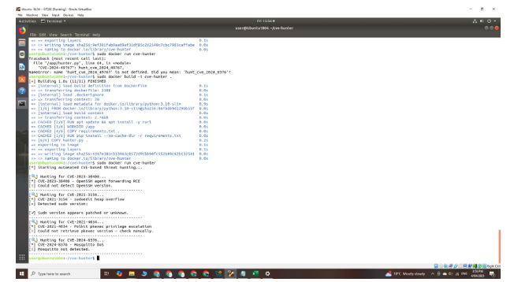
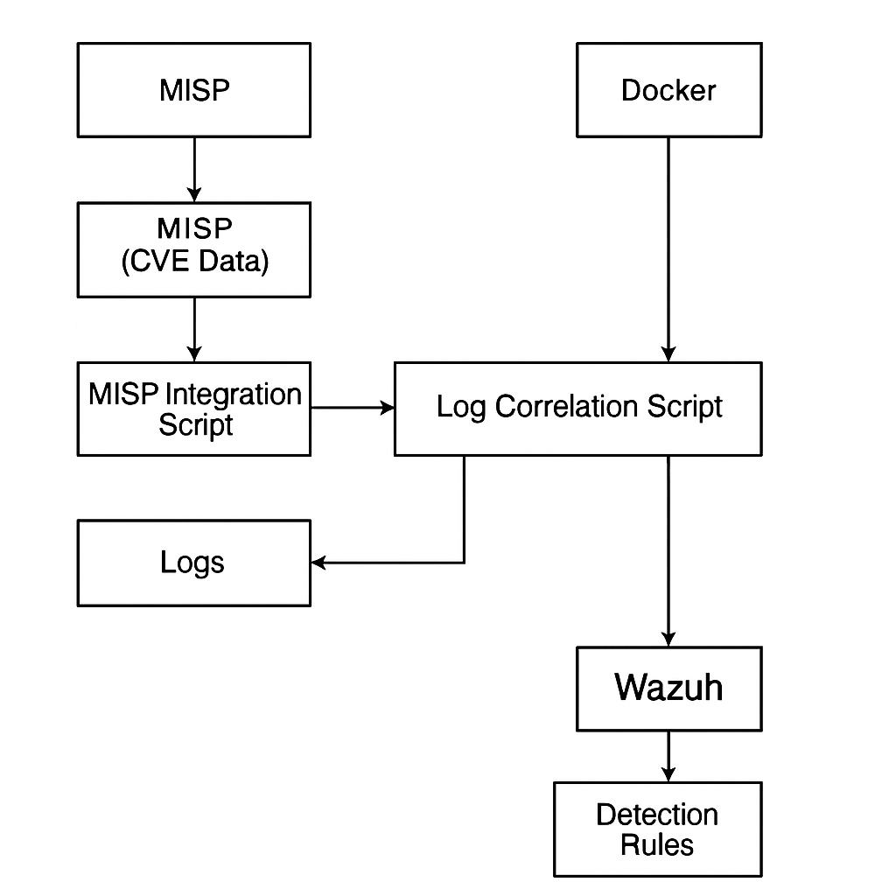
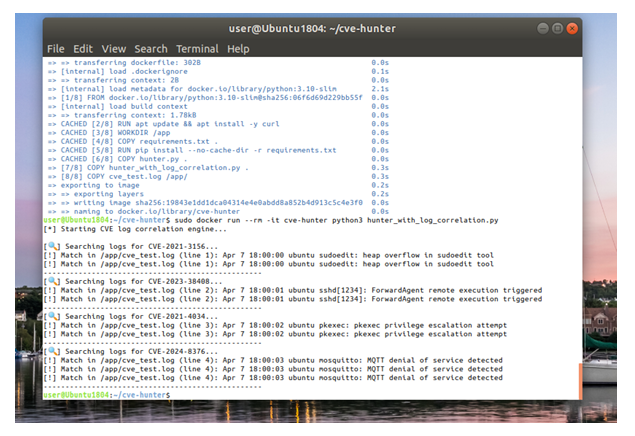
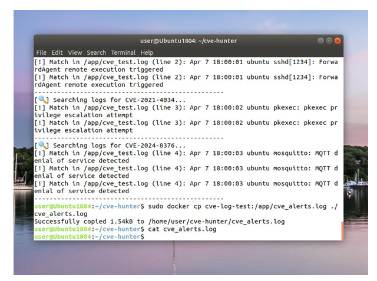
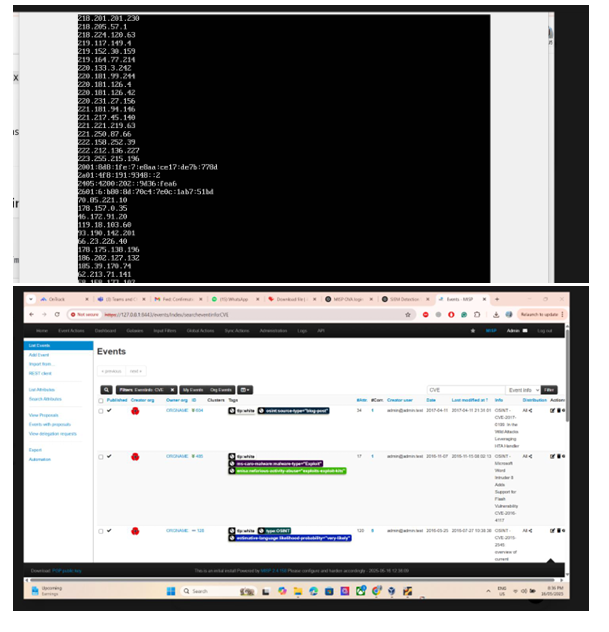
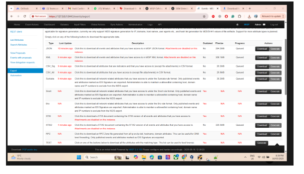
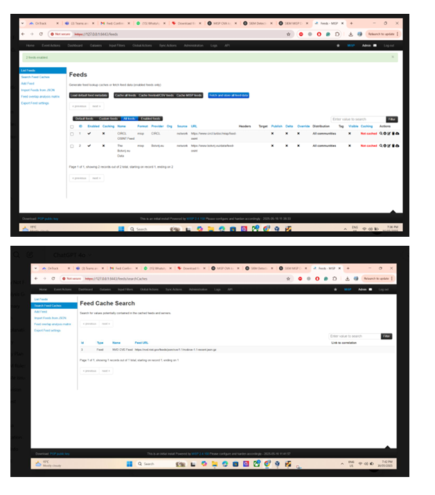
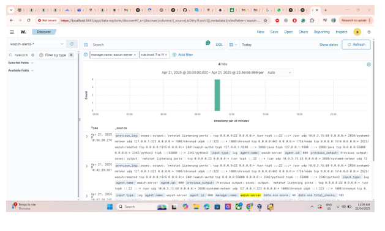

### CVE Threat Automation - Full Documentation

:::info
**Document Creation:** 23 May 2025. **Last Edited:** 23 May 2025. **Authors:** Muhammad Arsalan Khan 

**Effective Date:** 23 May 2025. **Expiry Date:** 23 May 2026.
:::

This document presents each phase of the CVE Threat Automation project in a structured and easy-to-understand format. It is designed to guide cybersecurity teams through the full process from planning to continuous improvement. Cybersecurity teams today face an ever-growing challenge of monitoring and responding to Common Vulnerabilities and Exposures (CVEs). Manually correlating logs, updating threat feeds, and writing detection rules is time-consuming and error-prone.

##  Introduction

Cybersecurity teams today face an ever-growing challenge of monitoring and responding to Common Vulnerabilities and Exposures (CVEs). Manually correlating logs, updating threat feeds, and writing detection rules is time-consuming and error-prone.

**CVE Threat Automation** aims to automate threat detection using real-time CVE data integrated with SIEM systems. This initiative focuses on:
- Extracting CVEs from threat intelligence platforms like MISP
- Correlating them with system logs
- Automatically generating detection rules
- Enhancing threat visibility and response time

This documentation outlines each phase of the CVE Threat Automation process from planning to continuous enhancement.

##  Phase 1: Planning

The planning phase defines the overall scope and goals of CVE Threat Automation.

### Objectives:
- Identify key CVE sources (NVD, MISP)
- Select target environment (e.g., Wazuh SIEM)
- Determine automation tools (Python, Docker, APIs)
- Design data flow (CVE → Threat Feed → Log Matching → SIEM Rules)

### Outcome:
A clear roadmap that outlines data sources, target logs, platforms involved (MISP, Wazuh), and integration strategy.

##  Phase 2: Design

## Introduction

Phase 2 involves setting up the core components of the threat automation system. Writing and organizing the Python script, specifying dependencies, and building the Docker image ensures the application runs consistently across different systems. Docker acts as a lightweight, consistent execution platform, while the script interacts with online CVE databases to gather threat intelligence. This modular approach also makes future maintenance easier.

# Phase 2: Script Setup and Docker Execution

**Objective:**  
Write the core CVE Hunter script and configure it for containerized execution using Docker.

**What We Are Doing:**  
This phase involves writing Python scripts (`hunter.py`), specifying dependencies in `requirements.txt`, and creating a Dockerfile to run the script in an isolated environment.

**Steps:**
- Create project directory (`~/cve-hunter`)
- Add `hunter.py`, `requirements.txt`, and `Dockerfile`
- Build Docker image with:
  ```bash
  sudo docker build -t cve-hunter .
  ```
- Run the script using:
  ```bash
  sudo docker run cve-hunter
  ```

This phase validates our environment by ensuring the script runs inside Docker and interacts with the CVE API.

# Design




This phase translates planning into technical design and architecture.

### Components Designed:
- MISP integration script to extract CVEs
- Log correlation engine (Python script with `hunter_with_log_correlation.py`)
- Detection rule generator for Wazuh
- Docker container for portability

### Tools Used:
- Python 3.10
- Docker
- REST APIs (NVD, MISP)
- VS Code for script editing

### Architecture Diagram:



##  Phase 3: Implementation

In this stage, the designed components are developed and tested in a local environment.

### Key Activities:
- MISP instance setup using Docker
- Python script development for:
  - Fetching CVE data
  - Correlating with syslogs
  - Rule generation

- Log simulation using test files (`cve_test.log`)
- Integration with Wazuh



### Output:
A working prototype that runs inside a Docker container and maps logs to CVEs.

##  Phase 4: Integration


This phase integrates individual components to work as a cohesive automated system.

### Integrated Components:
- MISP for threat feeds
- Python script to handle CVE-log correlation
- Wazuh for alerting via custom rules
- GitHub for version control



### Example Output:
- Log entries matched to CVEs
- Automatically deployed detection rules
- Alert generation in Wazuh dashboard

##  Phase 5: Testing


Testing is essential to verify the correctness and reliability of CVE-based detections.

### Testing Strategy:
- Simulate malicious activity in log files
- Insert known vulnerable signatures (e.g., CVE-2021-3156)
- Validate:
  - Rule generation
  - Wazuh detection
  - MISP event matches









### Tools:
- Metasploit for CVE emulation
- Custom test logs
- Wazuh alerts dashboard

##  Phase 6: Monitoring

Monitoring focuses on ensuring the system remains operational and accurate over time.

### Metrics Tracked:
- Detection accuracy
- Alert rates and false positives
- Feed freshness from MISP
- Rule application success

### Improvements:
- Logging errors and mismatches
- MISP feed sync validation
- Cron jobs for auto-refreshing rules

## Phase 7: Enhancement

Enhancement involves continuous improvement and scalability.

### Future Additions:
- Enrich CVEs with MITRE ATT&CK mappings
- Add STIX/TAXII compatibility
- Use ML for anomaly scoring
- Broader log sources (syslog, Windows event logs)

### Community Contributions:
Encourage open-source contributions to extend capabilities and threat coverage.

##  Conclusion

CVE Threat Automation transforms manual threat detection into a scalable, reliable, and real-time process.

By integrating MISP, Python automation, and Wazuh, we:
- Reduced time to detect CVEs
- Improved accuracy of alerts
- Streamlined rule generation

The framework serves as a blueprint for scalable cybersecurity operations and continues to evolve with advanced threat intelligence integrations.

---
