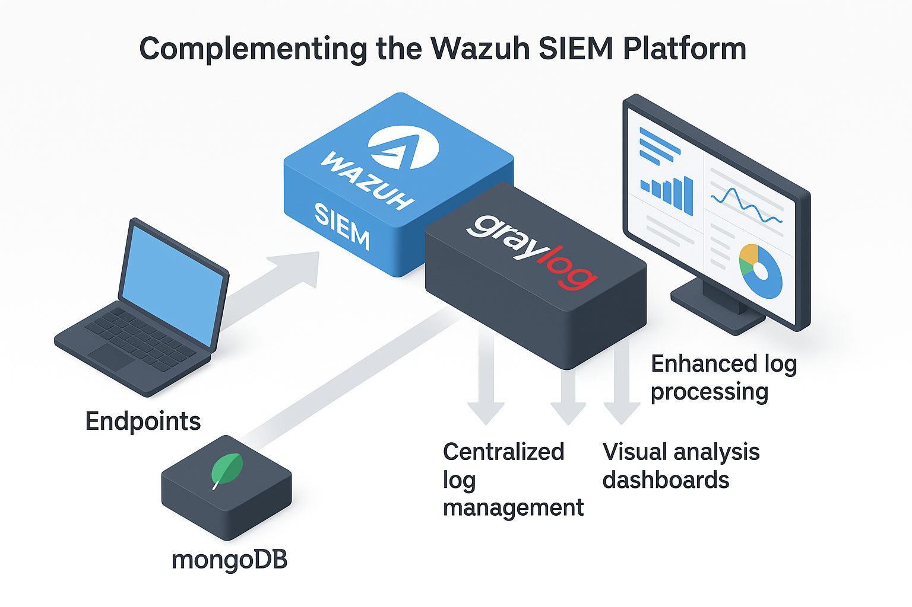
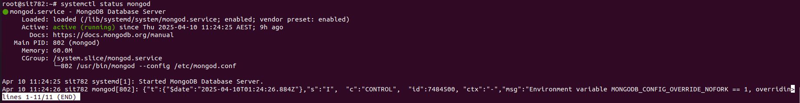
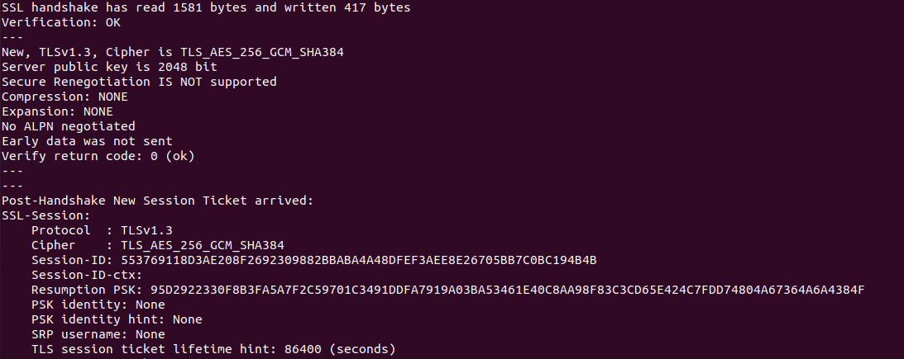
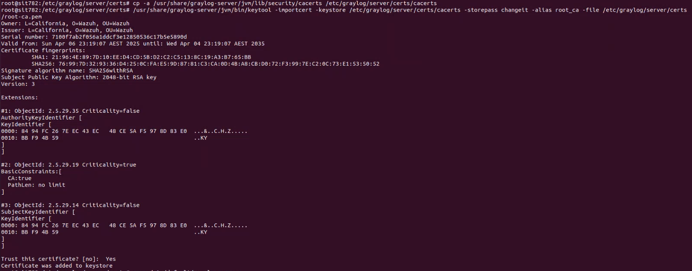
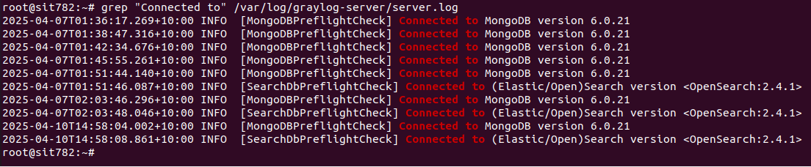

# Graylog Setup and TLS Integration Report
:::info
Document Creation: 2025-04-9. Last Edited: 2025-05-08. Authors: Elvis Nwosu

Document Code: Graylog_Setup_V1. Effective Date: 2025-05-08. Expiry Date: 2026-05-08
:::

## Background
Graylog is a centralized log management and analysis platform designed to help IT and security teams collect, normalize, and analyze large volumes of log data from distributed systems. With the increasing complexity of IT infrastructures and growing cybersecurity threats, centralized logging is essential for detecting anomalies, auditing system activity, and investigating security incidents in real-time.



As part of our security operations, implementing Graylog complements the Wazuh SIEM platform. While Wazuh provides endpoint monitoring and alerting, Graylog enhances visibility through intuitive dashboards, advanced search capabilities, and structured log correlation. This integration also provides a foundation for correlating log activity with threat intelligence from MISP (Malware Information Sharing Platform).

---

### Purpose of This Report
This report provides a comprehensive walkthrough of the setup and TLS configuration process for Graylog. It focuses on establishing secure communications between Graylog and the Wazuh Indexer using trusted certificates. The goal is to ensure encrypted data exchange and validate that Graylog can securely ingest and query data from OpenSearch (used by Wazuh).

---

### 1. Graylog Installation Summary

### 1.1 OS and Dependencies
- **Operating System:** Ubuntu Server 22.04
- **Java Runtime:** OpenJDK 17 is required for Graylog's backend engine.
- Node name: capstone.node-1
  
```bash
sudo apt install openjdk-17-jre-headless
```

### 1.2 MongoDB Setup
- **Purpose:** Stores Graylog metadata such as users, roles, and configuration settings.
- **Version Installed:** MongoDB 6.0
- After resolving held packages and source priority issues, MongoDB was successfully installed and confirmed to be running.

**Screenshot showing mongoDB active and running**



### 1.3 Graylog Server Installation
- Added the Graylog 5.1 repository and installed the package:
```bash
wget https://packages.graylog2.org/repo/packages/graylog-5.1-repository_latest.deb
sudo dpkg -i graylog-5.1-repository_latest.deb
sudo apt update && sudo apt install graylog-server
sudo systemctl start mongod
```

### 1.4 Graylog Web Interface Setup
- Default web interface available at `http://<server-ip>:9000`
- Configured initial admin user and accessed the dashboard for operational verification.


### 2. TLS Truststore Integration (Graylog ↔ Wazuh Indexer)

### 2.1 Problem Statement
When attempting to connect Graylog with Wazuh’s OpenSearch-based indexer using HTTPS, the following error was encountered:
```text
PKIX path validation failed: Path does not chain with any of the trust anchors.
```
This indicated that Graylog’s JVM did not trust the certificate served by the Wazuh Indexer.

### 2.2 Solution Overview
- Created a custom truststore specifically for Graylog.
- Imported Wazuh's internal root CA into the truststore using `keytool`.
- Updated Graylog’s JVM options to reference the custom truststore.

### 2.3 Certificate Preparation
**Files used:**
```bash
/etc/wazuh-indexer/certs/indexer.pem
/etc/wazuh-indexer/certs/root-ca.pem
```
**Command to generate full certificate chain:**
```bash
cat indexer.pem root-ca.pem > fullchain.pem
```
**Screenshot of certificate chain validation using OpenSSL**


To validate the certificate chain using OpenSSL, the following command was used:
```bash
openssl s_client -connect capstone.node-1:9200 -CAfile /etc/wazuh-indexer/certs/root-ca.pem
```

### 2.4 Truststore Import
```bash
cp -a /usr/lib/jvm/java-17-openjdk-amd64/lib/security/cacerts /etc/graylog/server/certs/cacerts
keytool -importcert -keystore /etc/graylog/server/certs/cacerts   -storepass <password> -alias root_ca   -file /etc/wazuh-indexer/certs/root-ca.pem
```

### 2.5 Graylog Configuration/JVM Truststore Activation

Edited the configuration file located at /etc/graylog/server/server.conf by generating and adding the password secret and root password using the following commands:

Password secret generation:
```bash
pwgen -N 1 -s 96
```
Root password generation:
```bash
echo -n "Enter Password: " && head -1 </dev/stdin | tr -d '\n' | sha256sum | cut -d" " -f1
```

Created the internal User on Wazuh, assigning it a chosen backend role using the following command:
```bash
curl -k -u '<username:<password>' \
  -XPUT "https://192.168.56.109:9200/_plugins/_security/api/internalusers/$GRAYLOG_USER" \
  -H "Content-Type: application/json" \
  -d '{
    "password": "<password>",
    "backend_roles": ["admin"],
    "attributes": {}
  }'
```

Added the following options in `/etc/default/graylog-server`:
```bash
-Djavax.net.ssl.trustStore=/etc/graylog/server/certs/cacerts
-Djavax.net.ssl.trustStorePassword=<password>
```

**Screenshot of JVM Truststore Import Success**


### 2.6 Trust Validation
Used `curl` to validate the chain and confirm a successful TLS handshake:
```bash
curl -vk https://capstone.node-1:9200
```
**Output:** The verify return code was `0 (ok)`.


### 3.0 Graylog Configuration Review


Updated `/etc/graylog/server/server.conf`:
```ini
elasticsearch_hosts = https://<userame>:<password>@capstone.node-1:9200
elasticsearch_tls_verify = true
transport_tls_trust_store_path = /etc/graylog/server/certs/cacerts
transport_tls_trust_store_password = <password>
```

### 3.1 Secure Alternative Format
Instead of embedding credentials in the URL, use the secure format:
```ini
elasticsearch_hosts = https://capstone.node-1:9200
elasticsearch_username = <username>
elasticsearch_password = <password>
```

---

### 4. Final Verification
- Graylog successfully connected to Wazuh Indexer over HTTPS.
- TLS certificate chain was validated.
- Logs showed successful authentication and data ingestion.
- No further errors were present in `/var/log/graylog-server/server.log`.

**Screenshot of Graylog Indexer Connection Success**



#### Appendix
- **Tools Used:** OpenSSL, keytool, curl, systemctl
- **Log and Config Files Modified:**
  - `/etc/graylog/server/server.conf`
  - `/etc/default/graylog-server`
  - `/etc/graylog/server/certs/cacerts`

## Video Tutorial

<iframe width="560" height="315" 
  src="https://www.youtube.com/embed/NfL24OvJXdg" 
  title="YouTube video player" frameborder="0" 
  allow="accelerometer; autoplay; clipboard-write; encrypted-media; gyroscope; picture-in-picture; web-share" 
  allowfullscreen>
</iframe>

