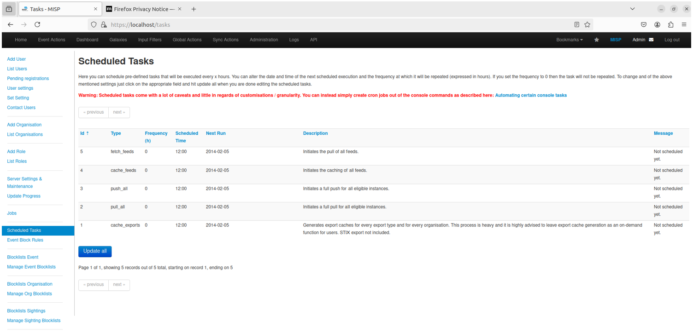
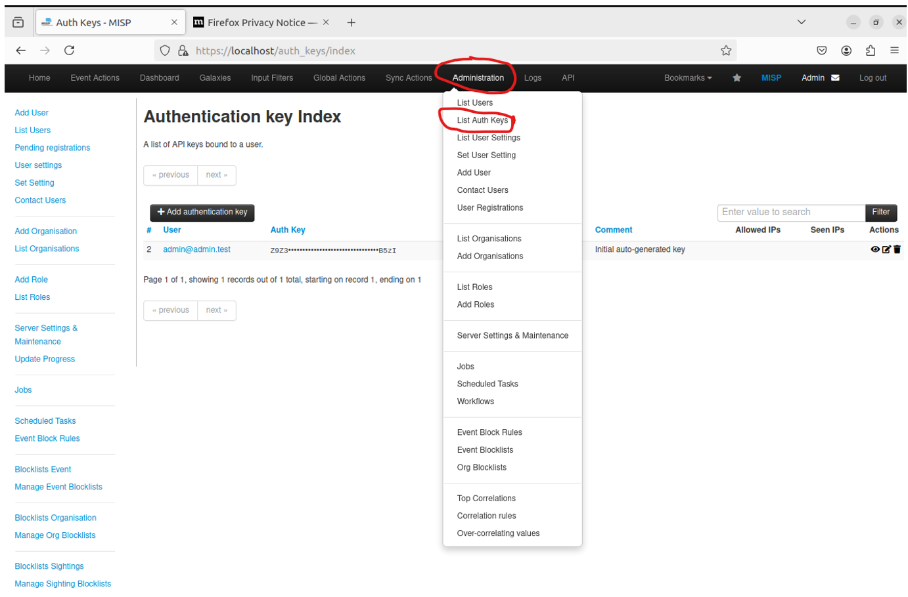
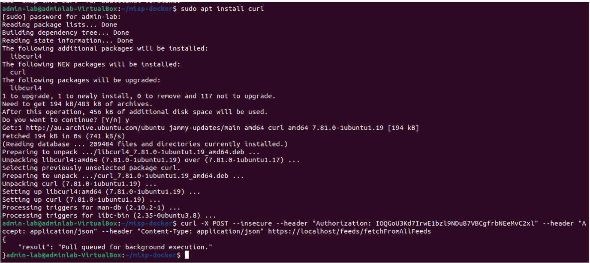
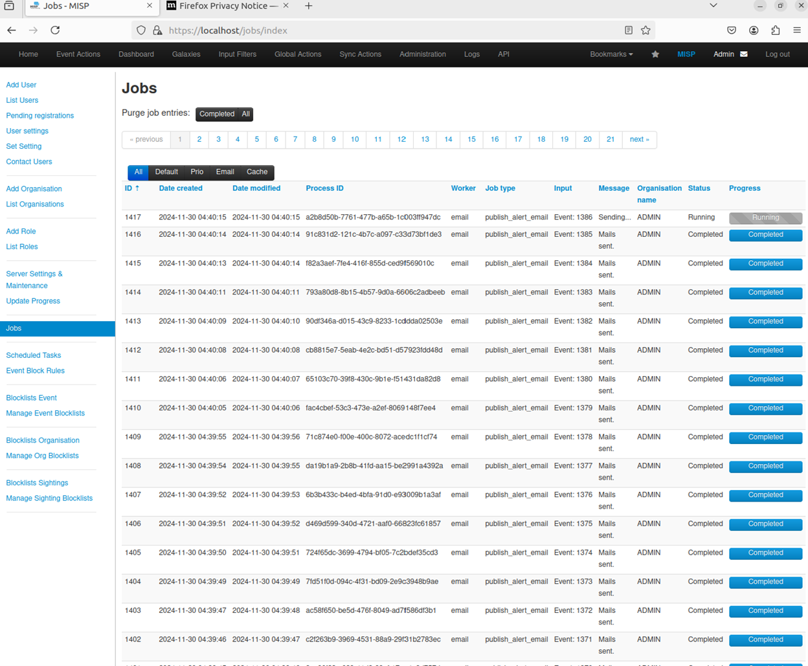
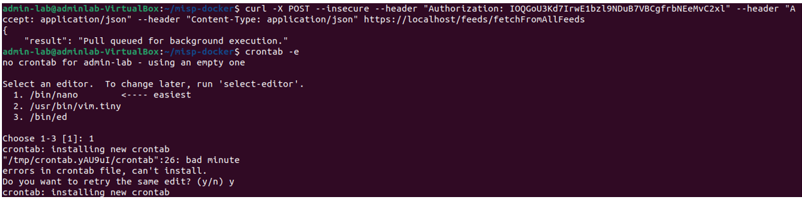
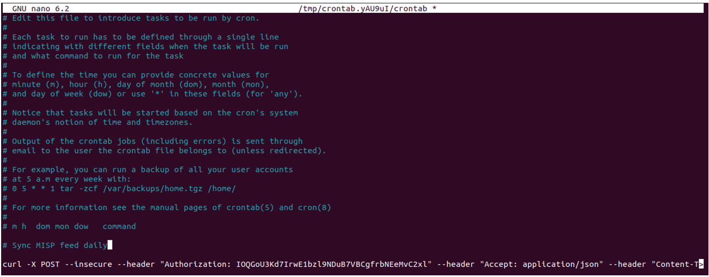

**Last updated by:** cyber-Elvis, **Last updated on:** 10/12/2024


**Last updated by:** cyber-Elvis, **Last updated on:** 10/12/2024


**Last updated by:** cyber-Elvis, **Last updated on:** 10/12/2024


**Last updated by:** cyber-Elvis, **Last updated on:** 10/12/2024


:::info
Document Creation: 2024-12-10. Last Edited: 2024-12-10. Authors: Elvis Nwosu.

Document Code: MISP-AUTO-FEEDS-V1. Effective Date: 2024-12-10. Expiry Date: 2025-12-10.
:::


# Automating Feed Updates in MISP

## 1.0 Introduction
By default, Feeds in MISP do not automatically update. We’d have to manually go into **List Feeds** and then **Fetch and Store All Feed Data** again.  
MISP has an internal schedule task feature which can come in handy when automating feed updates, but there are lots of caveats that come with using this feature. It’s recommended to simply create cron jobs.




To avoid this, we’ll set up automation using an API call and a cron job.

## 1.1 Generating an API Key
1. Navigate to **Administration > List Auth Keys** in the MISP interface.  
   


2. Click **Add Authentication Key** and provide a name (e.g., “Automation”).
3. Set **Allowed IP**: For this demo, we’re just going to go ahead and set it to `0.0.0.0/0`, which will allow any IP address.
4. **Important**: Copy and save the API key securely. Once you select ‘I’ve noted down my API key,’ you won’t be able to retrieve the API key again. 


## 1.2 Setting Up a Cron Job


1.  Create a script to call the API using the API key provided with the command below:

```bash curl -X POST --insecure --header "Authorization: <API_KEY>" --header "Accept: application/json" --header "Content-Type: application/json" https://<YOUR_MISP_ADDRESS>/feeds/fetchFromAllFeeds```


2.  Replace \<API_KEY\> with your actual API key.
3.  Make the script executable:

   


Going back to MISP web interface and refresh the jobs page, you’ll notice new feeds are being fetched.



Now we proceed to assign a cronjob with the following line of code.

_crontab -e._






Copy and place the same command into the cron job file;

```bash curl -X POST --insecure --header "Authorization: \<API_KEY\>" --header "Accept: application/json" --header "Content-Type: application/json" https://\<YOUR_MISP_ADDRESS\>/feeds/fetchFromAllFeeds```

This cron job will make the API call out to MISP every day in the morning to fetch the latest feeds.

## 1.3 Possible troubleshooting Tips

- **Self-Signed Certificate Issues**: Use the `--insecure` flag in curl commands to bypass warnings.


_curl -k ..._

Adding our insecure flag will tell curl to disregard that alert.

-   **Permission Errors with Docker: Ensure your user is in the docker group:**

_sudo usermod -aG docker $USER_

-   Feed Update Issues: Ensure the API key has sufficient permissions and the cron job is correctly configured.
## 1.4 Conclusion

MISP is a powerful platform for managing and sharing threat intelligence. By automating feed updates and leveraging its API, you can integrate it into your security operations for enriched threat detection and response.
