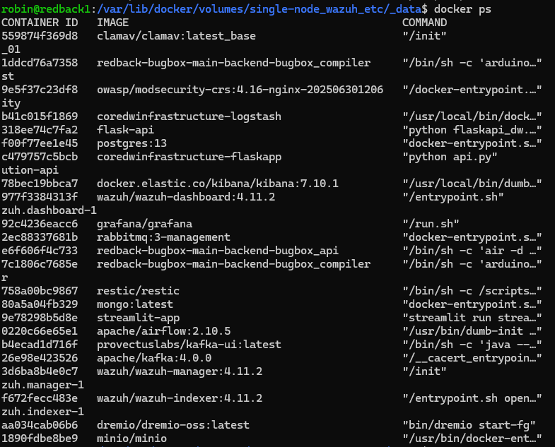
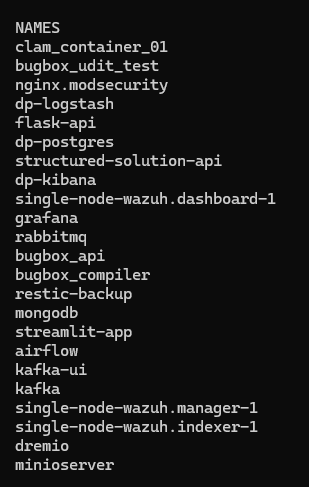
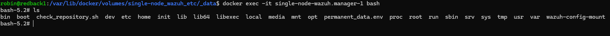
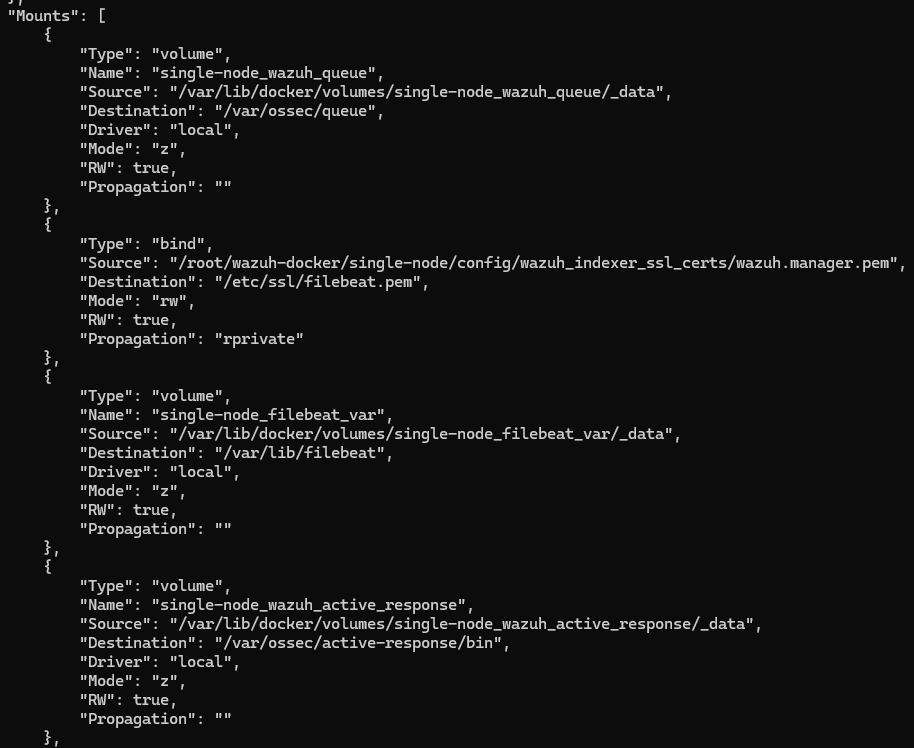
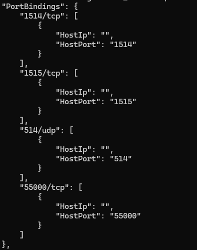
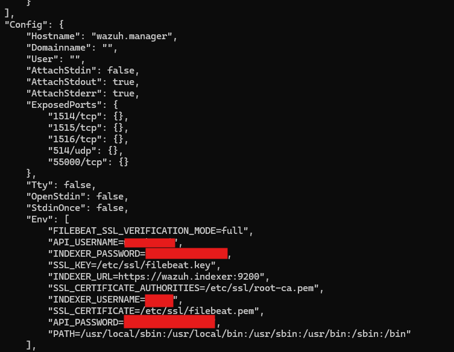
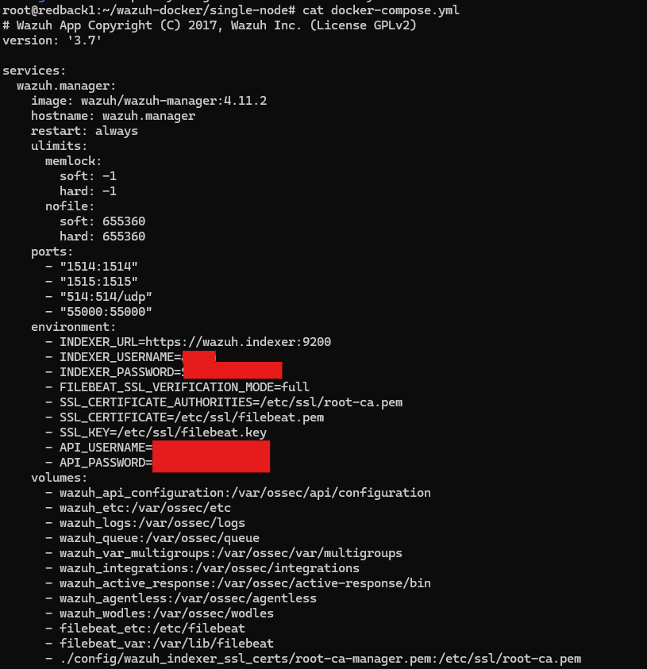

# Docker Containers

:::info
**Document Creation:** 10 Sept., 2025. **Last Edited:** 10 Sept., 2025. **Authors:** Robin Spoerl.
:::

## 1. Introduction 

This guide provides an overview of containers and Docker, with their use in the company VM, and a quick recap on some essential concepts. Moreover, it will describe how you can access the Blue Team's Wazuh containers. Note that these skills can be applied to all other containers too. 

### 1.1. What Is a Container?

A container is a virtualised environment where you can run applications. In contrast to virtual machines, which run their own operating systems, a container is a lightweight, self-contained item that only contains the files and dependencies that an application needs to run. So, a container is like a box. 

In the VM, we use Docker as a way of creating and deploying containers. 

### 1.2. Why Do We Use Containers?

There's three examples: simplicity, dependencies, and security. It's generally a lot easier to build a container using a pre-generated image than setting it up manually on the host. Moreover, containers solve the issue of having conflicting software dependencies on a host, which can happen as the VM contains over a dozen running applications. Finally, containers are isolated environments, which provide an additional level of security. The next section will show a practical example of a container. 

## 2. Interacting with a Container - Blue Team Example

### 2.1. Finding, Accessing and Inspecting a Container

To see all the running Docker containers on the VM, use `docker ps`. 
 

Let's assume you wanted to change some files on the Wazuh Manager container, which is used to modify the server settings for Wazuh. There's two ways you can do this: directly enter the container, or modify the mapped files/volumes. Let's try the first.

First you need to find the name of the manager container. This is different to the image, which is like a public blueprint for each container. Have a look to the right of your terminal, and you will see a column with all of the Docker container names. The Wazuh container's name is **single-node-wazuh.manager-1**. 

 

Using this name, to directly enter the container, you would use `docker exec -it single-node-wazuh.manager-1 bash`. This spawns a bash shell inside the container, so that you can interact with it. As you can see, it looks like a normal file system. 

 

For the second option, some context is needed. When you remove a container, by default, the data inside that container is lost. This is a big issue for complex applications that have a lot of internal files. Therefore, we want to have a way of mapping these files to our host machine, so that they are saved. The way we do this is via bind mounts and volume mounts. 

A bind mount is a way of mounting a source file on the host VM to a destination file inside the container. This way, you need to explicitly specify where the destination file inside the container should be mapped to. On the other hand, a volume mount abstracts that away to Docker, so you just need to create a volume and Docker will organise the exact file paths for you. The key point is that both ways mount files inside the container to the host.

To see which files are mounted outside of the **single-node-wazuh.manager-1** container, you can use `docker inspect single-node-wazuh.manager-1`. As an example, all the files inside the container's **/var/ossec/queue** directory are available at **/var/lib/docker/volumes/single-node_wazuh_queue/_data** on the host. Sometimes you will also see bind mounts with read only permissions, which are for critical container files that should not be overwritten. You would interact with these files on your host. 

 

After you've made any changes to the Manager container, you need to restart it. You can do this via `docker restart single-node-wazuh.manager-1`. 

### 2.2. Managing Container Settings ###

From the previous docker inspect command, if you have a look, you'll see a lot more interesting information. 

For example, the Docker container has external ports mapped to internal ports. This is a way of allowing the internal Wazuh Manager process to interact with processes outside of the container. 

 

Moreover, there are environment variables used for authentication. These were defined externally.

 

At this stage, you might be wondering: how can I modify the mapped folders, environment variables and ports? There's two ways: re-running the container, or using the **docker-compose.yml** file. 

If you went the first route, you would have to use `docker run` alongside parameters for all the different ports, environment variables, folders, etc. This means your command would span several lines, and it would be hard to repeat for future team members. At the same time, it's difficult to back up any changes you make. 

The second approach involves creating a file to specify all these parameters in. This file is called **docker-compose.yml**. On the VM, we use this file to manage any changes to the containers. 

The file is currently available at **/root/wazuh-docker/single-node** on the VM. 

 

When you make any changes to this compose file, the process for restarting the container is slightly different. If you just used `docker restart`, the container would restart, but the changes inside the .yml file wouldn't apply. Instead, you need to use `docker compose up -d` **inside the directory of the .yml file**. This command checks the compose file for any changes, and if so, recreates the containers. Meanwhile the -d flag ensures that the Docker command runs in the background (so you can still use your existing terminal). This command ensures that the mounted files/volumes are preserved, so you don't have to worry about your files getting deleted. 

## 3. Further Reading

- [Docker](https://docs.docker.com/)
- [Data Warehouse Docker Guide](https://redback-operations.github.io/redback-documentation/docs/data-warehousing/Instructional%20Documents/VM%20Guide/#the-vm-and-docker)