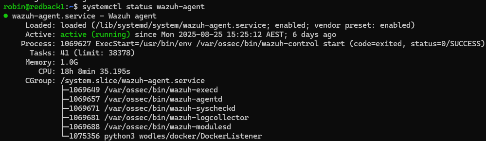

# Wazuh Architecture

:::info
**Document Creation:** 10 Sept., 2025. **Last Edited:** 10 Sept., 2025. **Authors:** Robin Spoerl.
:::

## 1. Introduction 

This guide provides an overview of Wazuh's current setup, including its key components, broader architecture and log capturing mechanisms. 

## 2. Architectural Overview

Currently, Wazuh is installed on the company VM. It is in fact a combination of different services: an agent, and a server. The agent is what captures all the activity on the VM, and it sends this information to the server. The server includes the dashboard you can view. 

### 2.1. The Agent

The agent, called wazuh-agent, is a service running on the VM. This is what captures all the activity on the VM.

The agent's directory on the VM is available at **/var/ossec/etc/**. This is where you can configure the behaviour of the agent. For example, **ossec.conf** is where you tell the agent which log sources it should analyse. Note that you need root permissions to access this directory. 

The agent is already configured to send basic information to the server. After making any changes to the agent, you need to restart the agent service with systemctl restart wazuh-agent. 

### 2.2. The Server

The Wazuh server is what receives the logs from the agent, parses them, and then generates alerts. The Wazuh server is also installed on the company VM, as we only have a single VM to work with (and not a separate VM for the server to run on). Its architecture, however, is a bit different to the agent. Also, when we say server, we are abstracting a bit.

On the VM, the server is made up of three distinct Docker containers: 
- **single-node-wazuh.manager-1**
- **single-node-wazuh.indexer-1**
- **single-node-wazuh.dashboard-**

 

> **Note:** For more information on Docker containers, please read the next guide. 

The Wazuh Manager receives logs and alerts from the Wazuh agent. It is the core component of Wazuh.
The Indexer stores and indexes the logs and alerts from the manager. It is like a database for logs.
The Dashboard is the web-based interface used to visualise the alerts from the manager. 

When you read any guides on Wazuh, especially on how to implement things, they say you need to modify the server. Since we are using the Docker architecture, this would usually refer to the Wazuh Manager. Thus, this is the main container you'd work with. 

There's quite a lot of different folders used by the Manager, so they won't be listed here. 

### 2.3. Understanding Decoders and Rules

As described earlier, the agent collects and sends logs to the Manager, which tries to generate alerts out of them. There's two main steps involved in generating alerts: decoders and rules.

When the Manager receives logs, the first thing it does is refer to the list of decoders on how to handle those logs. These are used to extract information from the logs and then pass them to specific rules. Let's show an example. Note that this decoder file is available at **/var/ossec/etc/decoders/local_decoder.xml** on the VM, **inside the container**. It is also a user-definable decoder list (the default decoders are elsewhere).

The first decoder "modsecurity" is fired when Wazuh receives any log that has "modsecurity" as the program name, in a syslog-like format. This is like a pre requisite decoder.

The second decoder "modsecurity_alerts" fires when the "modsecurity" decoder is matched. It extracts some information like data, URI and a unique ID from the log itself. This capturing is done via regular expression capture groups. 

 

However, the previous decoders are just used to extract data; they don't generate alerts themselves. This is where rules come in. As before, after decoders have been fired, the Manager checks whether any specific rules apply to those decoded logs. Let's show an example, available at **/var/ossec/etc/rules/local_rules.xml**. Again, this is a user-definable list, and the comprehensive list of rules are available elsewhere.

In this example, if the "modsecurity_alerts" decoder has been fired (which was the child decoder in the previous example), this rule creates a description of the event and then displays it on the dashboard. So, the decoder extracts the information, while the rule is used to create an alert out of that information. The rule can also use the variables extracted from the decoder and display them. In this case, it displays the **data** and **uri** variables. 

 

This is an example of how an alert would look like on the dashboard.

 

## 3. References

- [More information on Wazuh](https://documentation.wazuh.com/)

