# Phase 2 – Initial Email Setup and DNS Configuration
#  (As-Built Documentation)

:::info
**Document Creation:** 14 Dec, 2024. **Last Edited:** 14 Dec, 2024. **Authors:** Bikendra Gurung.
  **Effective Date:** 14 Dec 2024. **Expiry Date:** 14 Dec 2025.
:::

## Objective
The objective of this phase is to configure and validate the required fundamental DNS records to ensure email functionality and security. This phase ensures that the domain is correctly set up to handle email traffic. In addition, this phase lays the foundation for advanced security configurations. Furthermore, the initial batch of new email identities/users is created in this phase. Overall, this phase focuses on:
1.	Initial Email Infrastructure Setup.
2.	DNS Configuration and Validation.
3.	Email Identities/Users Creation.

## Deliverables
1. Email infrastructure configured with the registered domain.  
2. Configured DNS records for the domain.  
3. Validated DNS propagation of the configured DNS records.  
4. New email accounts.  

---

## 3. Email Infrastructure Setup
### 3.1 Set up Email Infrastructure by configuring the selected ESP with the registered domain.
3.1.1. Follow the steps in the screenshots below to complete this section.  
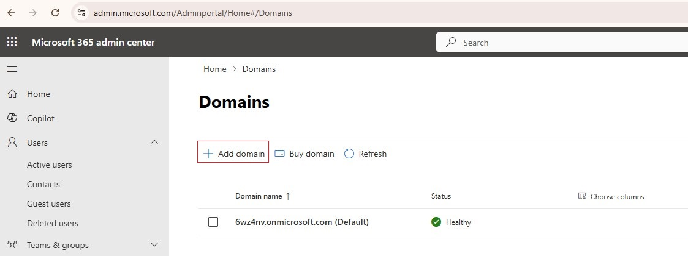
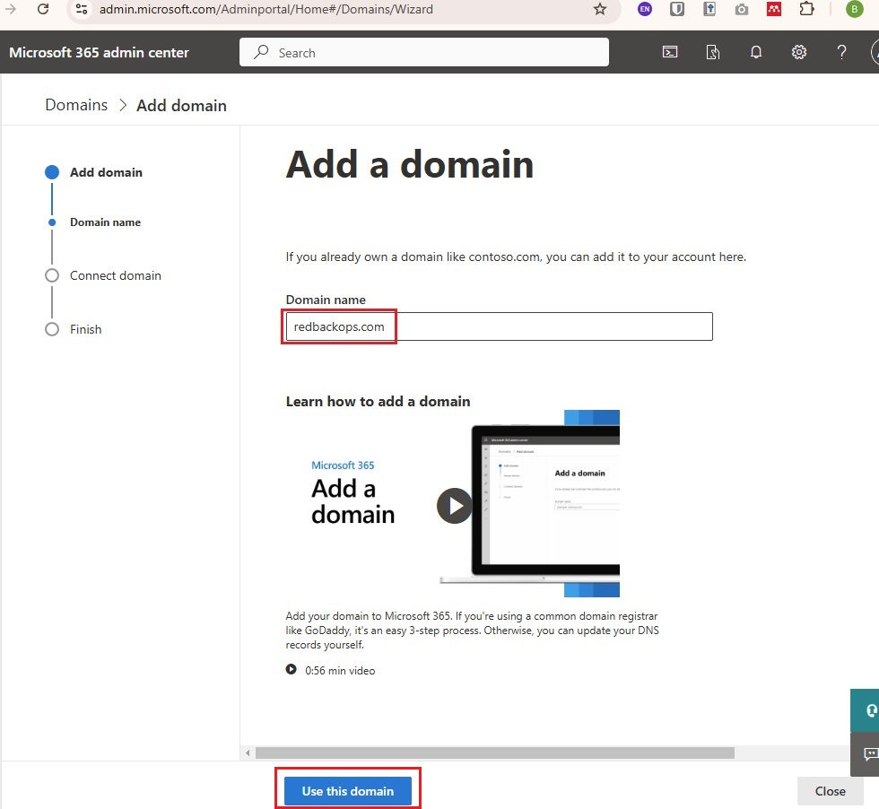
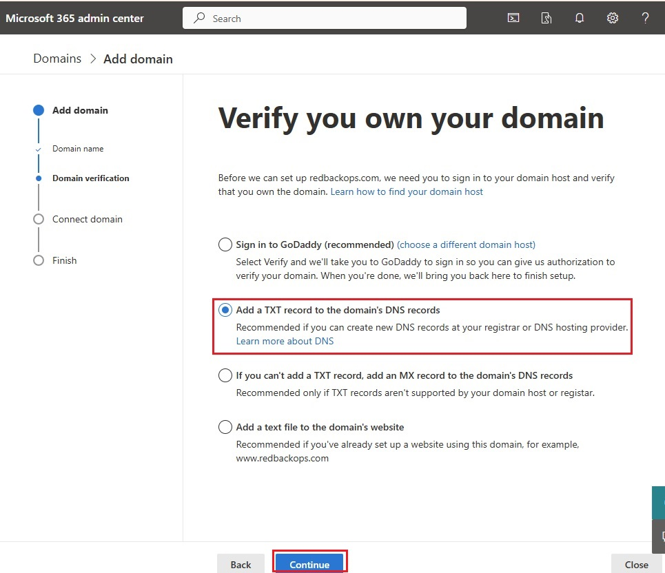

3.1.2. Publish the DNS record shown in the screenshot below in the DNS Management section of the registrar (GoDaddy):  
[GoDaddy DNS Management](https://dcc.godaddy.com/control/dnsmanagement?domainName)  
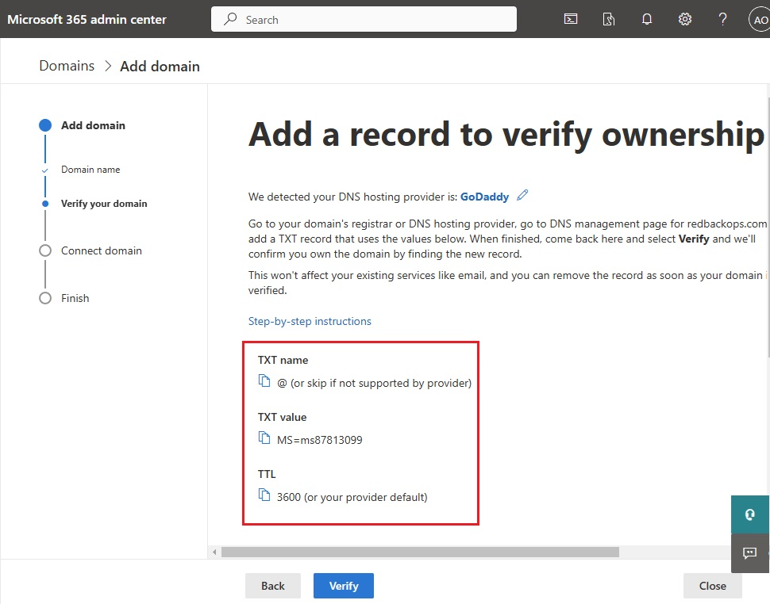
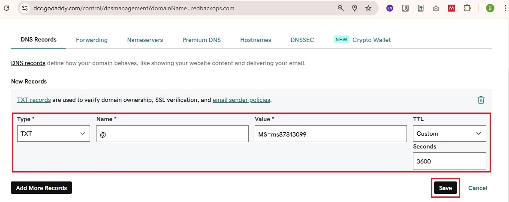  

3.1.3. Publish the DNS record shown in the screenshot below in the DNS Management section of the registrar (GoDaddy):  
[GoDaddy DNS Management](https://dcc.godaddy.com/control/dnsmanagement?domainName) same as in step 3.1.2. above. 
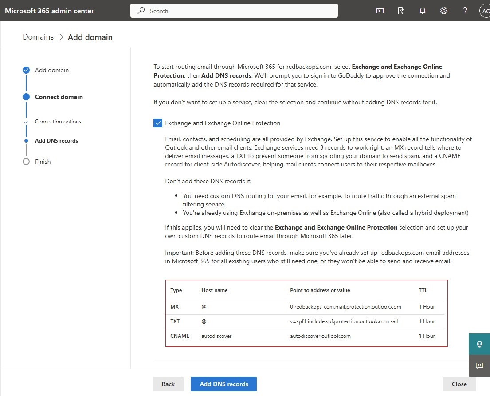  

---

## 4. DNS Configuration
### 4.1 Configure DNS Records
Ensure the following DNS records are published in the DNS of the domain:

| **Record Type** | **Name/Host** | **Value**                                   | **TTL**  | **Priority** |
|-----------------|---------------|---------------------------------------------|----------|--------------|
| TXT            | @             | MS=ms87813099                              | 1 Hour   | N/A          |
| MX             | @             | redbackops-com.mail.protection.outlook.com | 1 Hour   | 0            |
| CNAME          | autodiscover  | autodiscover.outlook.com                   | 1 Hour   | N/A          |
| TXT (SPF)      | @             | v=spf1 include:spf.protection.outlook.com -all | 1 Hour | N/A          |  

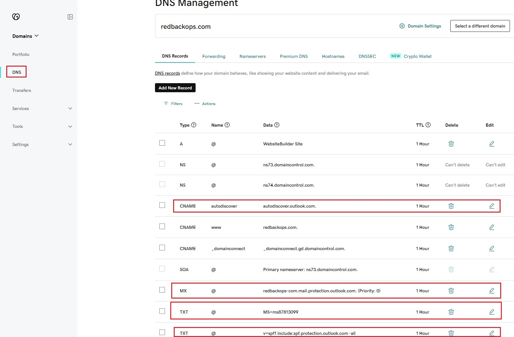  

---

## 5. DNS Propagation Validation
### 5.1 Using Online Tools (e.g., MXToolbox)

5.1.1. Validate TXT record **MS=ms87813099** provided by the email service provider to verify domain ownership.  
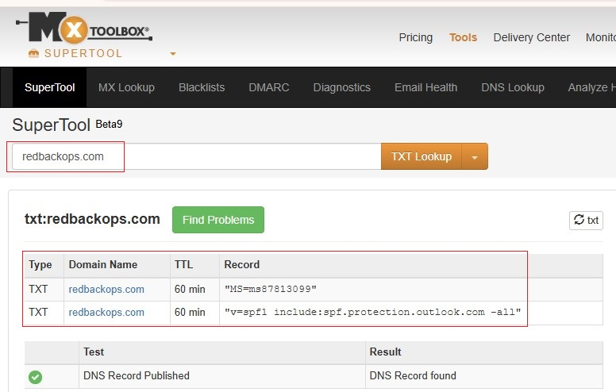  

5.1.2. Validate MX record **redbackops-com.mail.protection.outlook.com** to route emails to the domain.  
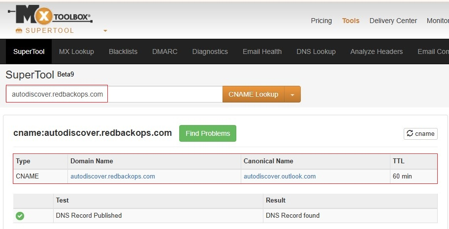  

5.1.3. Validate CNAME record **autodiscover.outlook.com** to configure email settings for users automatically.  
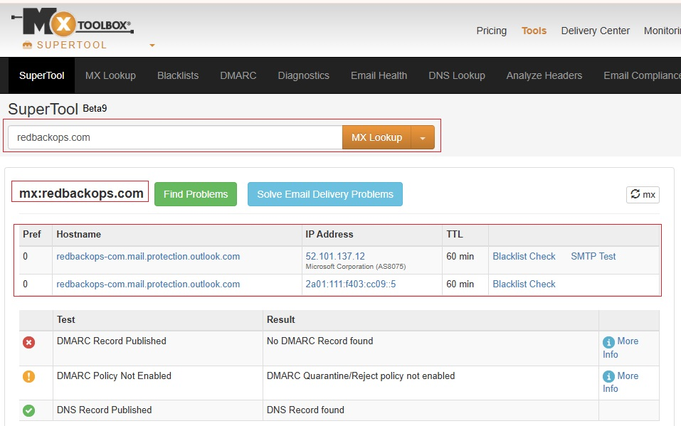  

5.1.4. Validate SPF record **v=spf1 include:spf.protection.outlook.com -all**.  
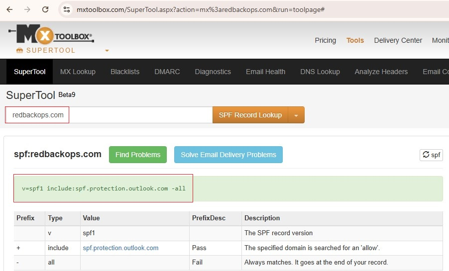  

### 5.2 Using Command Line Tools (e.g., nslookup)

5.2.1. Validate TXT record:  
`nslookup -type=TXT redbackops.com`  
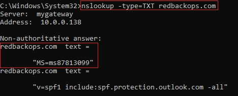  

5.2.2. Validate MX record:  
`nslookup -type=MX redbackops.com`  
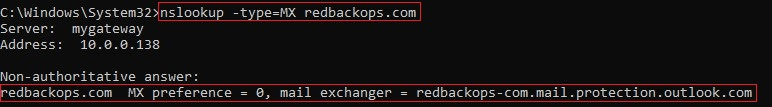  

5.2.3. Validate CNAME record:  
`nslookup -type=CNAME autodiscover.redbackops.com`  
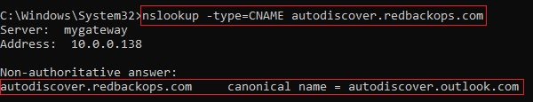  

5.2.4. Validate SPF record:  
`nslookup -type=TXT redbackops.com`  
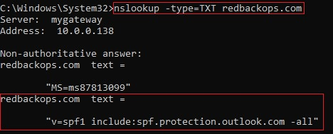  

---

## 6.6.	New E-mail Identities/Users Creation
### 6.1 Create the Initial Batch of New Email Identities/Users
6.1.1. Use PowerShell script to create the initial batch of new email identities/users.  
**PowerShell Script**: [Create Users](https://github.com/Redback-Operations/redback-cyber/blob/main/T3_2024/Email%20Infrastructure%20%26%20Security/Create%20Users.ps1)  
6.1.2. Validate that the users have been created in Microsoft Admin Center:  [Microsoft Admin Center](https://admin.microsoft.com/).  
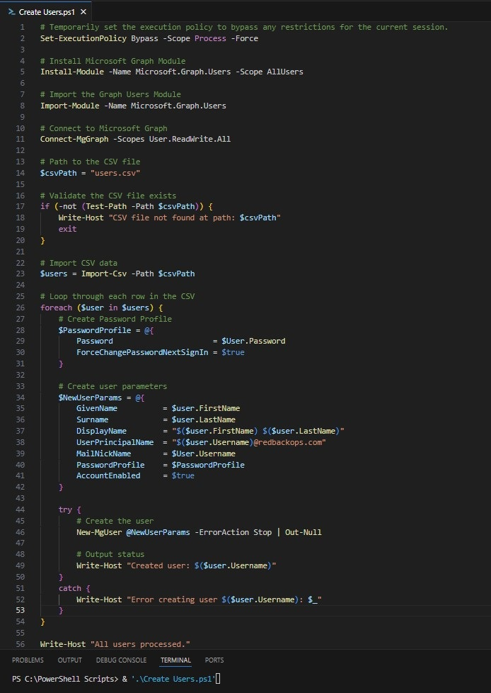  

6.1.3. Ensure that the users have been assigned licenses.  
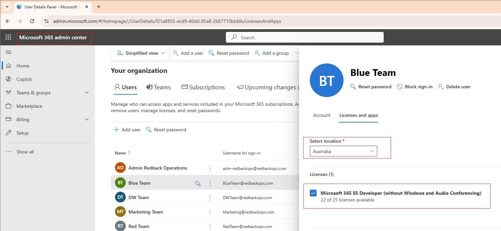  

---

## References
- [MXToolbox](https://mxtoolbox.com/)  
- [Microsoft Admin Center](https://admin.microsoft.com/)  
- [GoDaddy DNS Management](https://dcc.godaddy.com/)