# Phase 3 – SPF, DKIM and DMARC Implementation
#  (As-Built Documentation)

:::info
**Document Creation:** 14 Dec, 2024. **Last Edited:** 14 Dec, 2024. **Authors:** Bikendra Gurung.
  **Effective Date:** 14 Dec 2024. **Expiry Date:** 14 Dec 2025.
:::

## Objective
The objective of this phase is to implement and validate the e-mail authentication security protocols to prevent spoofing, phishing, and unauthorized use of the domain. This phase focuses on:
1. Configuration, validation and functional testing of SPF, DKIM, and DMARC protocols.
2. Email domain authentication and compliance with ISM controls.

## Deliverables
- Configured SPF, DKIM, and DMARC.
- Validated SPF, DKIM, and DMARC to ensure proper implementation.

---

## SPF, DKIM, and DMARC: Overview of Email Authentication Protocols

### 1. SPF (Sender Policy Framework)
- An email authentication protocol that verifies whether the sender is authorized to send emails on behalf of a domain.
- Detects spoofed emails by specifying a list of hosts or IP addresses allowed to send emails on behalf of a specific domain or subdomain.
- Any senders (hosts or IP addresses) not listed in the SPF records fail verification, ensuring that only trusted senders can send emails using the domain.
- Implementation of SPF addresses the following ISM Controls:
  - ISM-0574: Specifies authorized email servers (or lack thereof) for an organisation’s domains (including subdomains).
  - ISM-1183: Enforces a hard fail SPF record for domains (including subdomains).
  - ISM-1151: Verifies the authenticity of incoming emails.

### 2. DKIM (DomainKeys Identified Mail)
- An email authentication protocol that adds a digital signature to emails, verifying the sender’s identity and preventing email tampering.
- Detects spoofed email content.
- A public key is published in the domain’s DNS and is used to validate the digital signature in an email. If the signed digest does not match the email content, DKIM verification fails.
- Implementation of DKIM addresses the following ISM Controls:
  - ISM-0861: Enables DKIM signing for outgoing emails.
  - ISM-1026: Verifies DKIM signatures on incoming emails.
  - ISM-1027: Configures email distribution list software to preserve DKIM signatures.

### 3. DMARC (Domain-based Message Authentication, Reporting, and Conformance)
- An email authentication protocol that provides a policy framework for enforcing SPF and DKIM checks and generating reports on email authentication results.
- Works with SPF and DKIM to authenticate emails and specify actions for suspicious emails:
  - The domain owner publishes a DMARC DNS record.
  - The recipient mail server performs SPF and DKIM authentication and alignment tests, then applies the sender’s DMARC policy:
    - `none` – No action.
    - `quarantine` – Emails are marked as spam.
    - `reject` – Emails are rejected.
  - Generates DMARC Aggregate Reports detailing the authentication checks.
- Implementation of DMARC addresses the following ISM Controls:
  - ISM-1540: Configures DMARC records for domains to reject emails failing DMARC checks.
  - ISM-1799: Rejects incoming emails failing DMARC checks.

---

## 7. Email Authentication Protocols Implementation (SPF, DKIM, DMARC)
Ensure the following DNS records are published:  
| Protocol | Record Type | Name/Host          | Value                                             |
|----------|-------------|--------------------|---------------------------------------------------|
| SPF      | TXT         | @                 | v=spf1 include:spf.protection.outlook.com -all   |
| DKIM     | CNAME       | selector1._domainkey | selector1-redbackops-com._domainkey.6wz4nv.onmicrosoft.com |
| DKIM     | CNAME       | selector2._domainkey | selector2-redbackops-com._domainkey.6wz4nv.onmicrosoft.com |
| DMARC    | TXT         | _dmarc            | v=DMARC1; p=reject; pct=100; fo=1; rua=mailto:blueteam@redbackops.com,mailto:dmarc_agg@vali.email; ruf=mailto:blueteam@redbackops.com,mailto:dmarc_agg@vali.email; |

### 7.1. Configure SPF
- From the table above, add the corresponding TXT record to the domain’s DNS (if not already added in Phase 2).

### 7.2. Enable DKIM Signing
- From the table above, add the corresponding CNAME records to the domain’s DNS.
- Run the PowerShell scripts sequentially to enable DKIM signing and generate the selector CNAME records.
  **PowerShell Script**: [Configure DKIM for Mail Signing](https://github.com/Redback-Operations/redback-cyber/blob/main/T3_2024/Email%20Infrastructure%20%26%20Security/Configure%20DKIM%20for%20mail%20signing.ps1)

### 7.3. Implement DMARC
**7.3.1. Configure DMARC Policy**
    - From the table above, add the corresponding TXT record to the domain’s DNS.
    - Information on DMARC tags: [DMARC Tags](https://mxtoolbox.com/dmarc/details/dmarc-tags).  

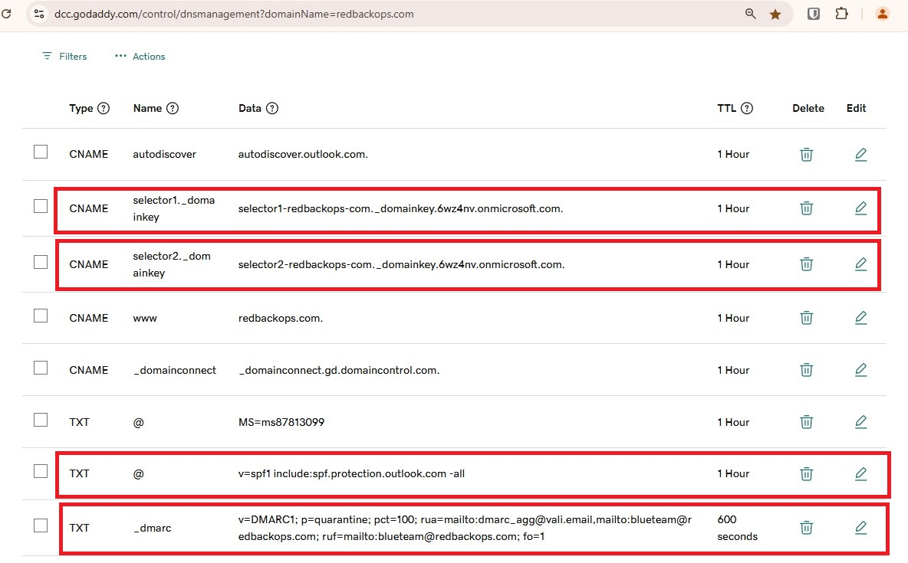  
  
**7.3.2. Configure DMARC Monitoring and Reporting**  
Use Valimail for DMARC monitoring and reporting:
  - `rua=mailto:dmarc_agg@vali.email`
  - `ruf=mailto:dmarc_agg@vali.email`  

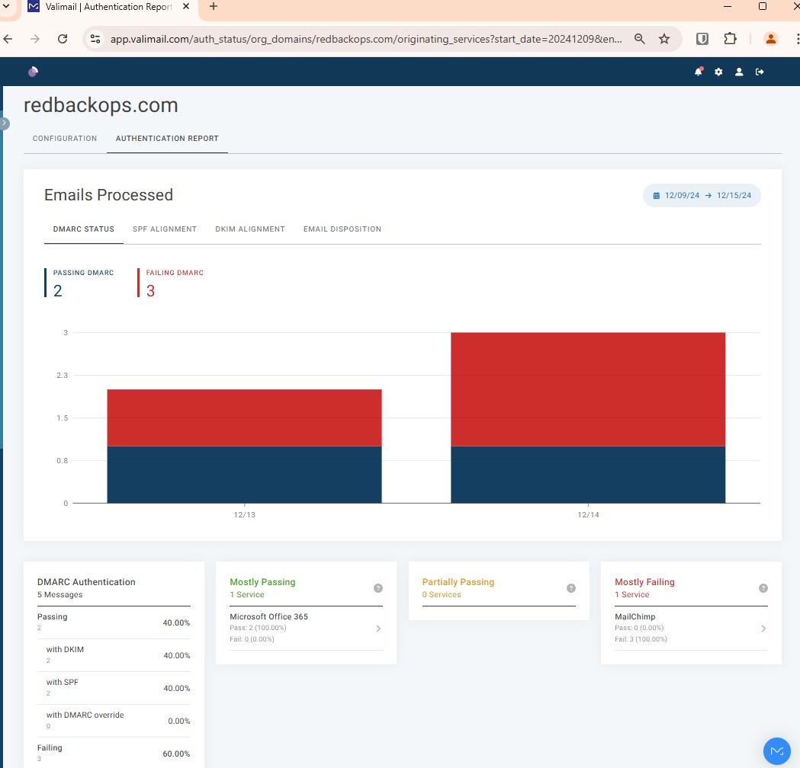  

## 8. Email Authentication Protocols Validation (SPF, DKIM, DMARC)
### 8.1. Using Online Tools (e.g., MXToolbox)
8.1.1. Validate SPF record.  
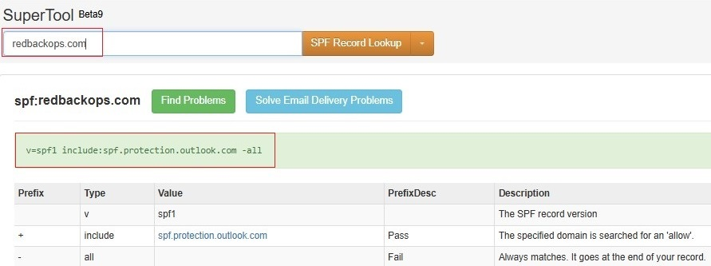  

8.1.2. Validate DKIM signing.  
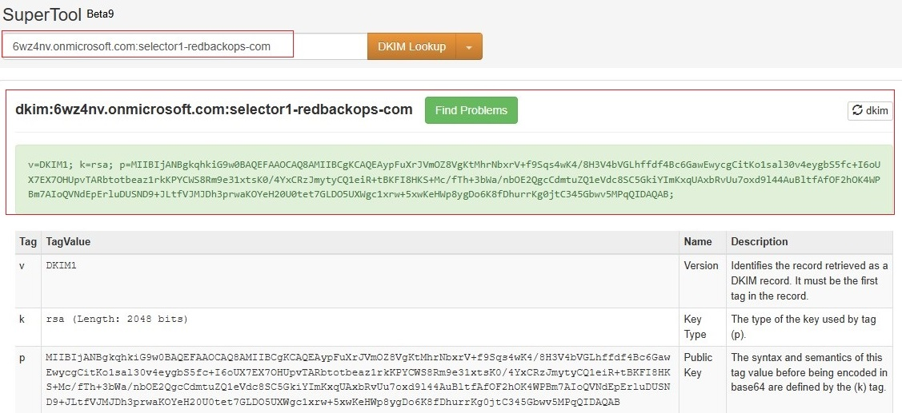  
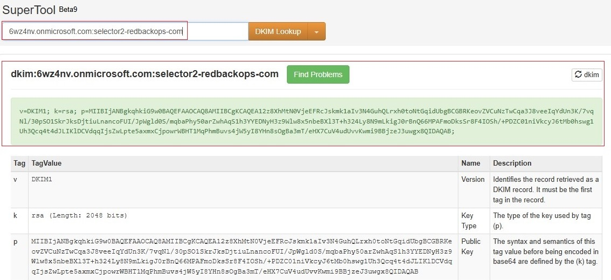  

8.1.3. Validate DMARC record.
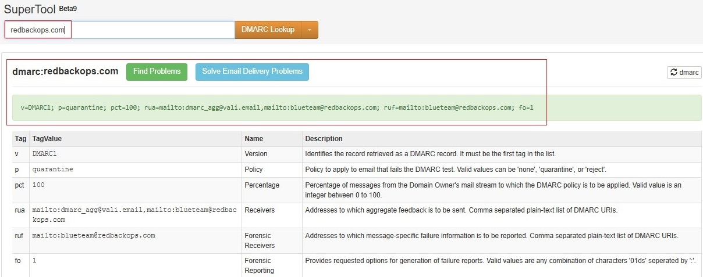  

### 8.2. Using `nslookup`
8.2.1. Validate SPF record:  
`nslookup -type=TXT redbackops.com`  

8.2.2. Validate DKIM signing:  
`nslookup -type=CNAME selector1._domainkey.redbackops.com`  
`nslookup -type=CNAME selector2._domainkey.redbackops.com`  

8.2.3. Validate DMARC record:  
`nslookup -type=txt _dmarc.redbackops.com`  

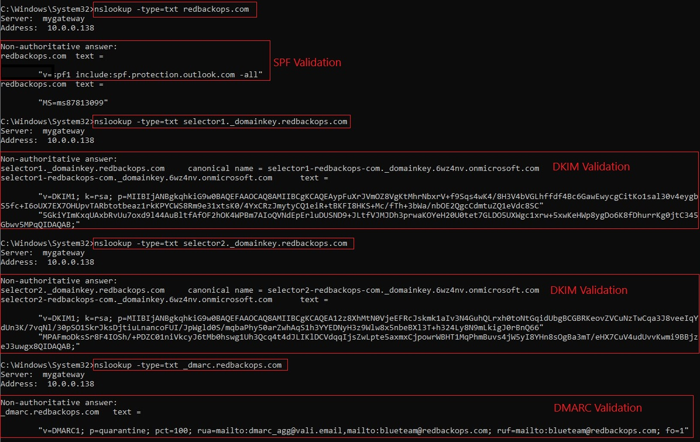  

## 8.3. Email Authentication Protocols Functional Test (SPF, DKIM, DMARC)
### 3.3.1.	Send test e-mail.  
Send a test e-mail using a redbackops.com email account (e.g., adm-redbackops@redbackops.com) through Outlook and checking e-mail headers.
- Validate SPF record.
- Validate DKIM signing.
- Validate DMARC record.  

**RESULT:**   
1.	**SPF**: Pass. The authenticated domain **(redbackops.com)** aligns with the From domain **(redbackops.com)**.  
2.	**DKIM**: Pass. The signing domain **(redbackops.com)** aligns with the From domain **(redbackops.com)**.  
3.	**DMARC**: Pass. Since both SPF and DKIM align, DMARC validation passes, and the email gets delivered without any issues.  

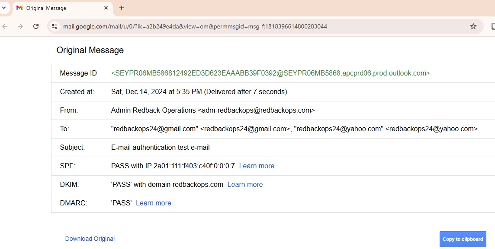  
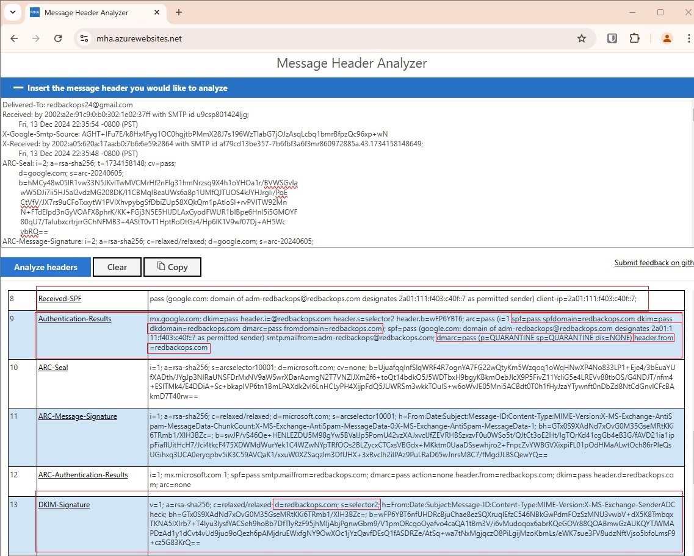  

### 3.3.2. Send a test-email using a third-party email service provider.  
Set up a MailChimp account and send an email using a redbackops.com email account (e.g., marketing@redbackops.com).  

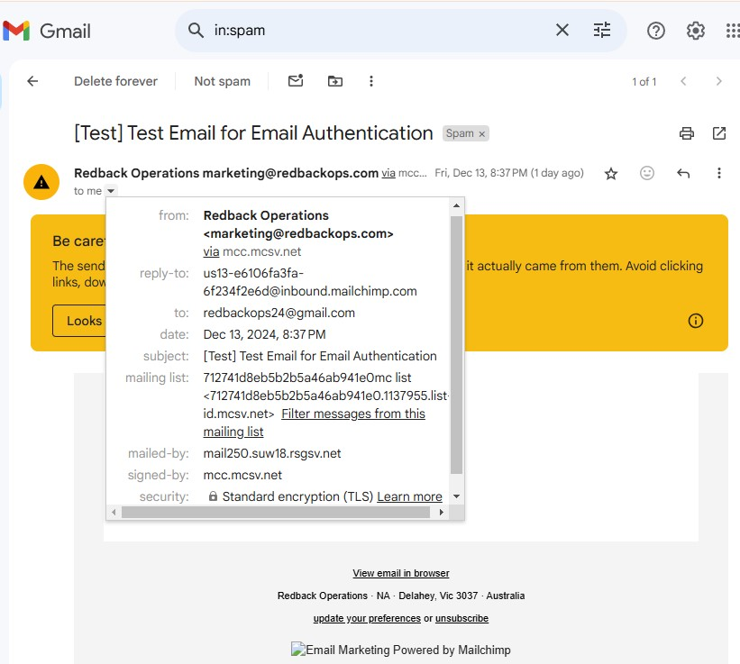  
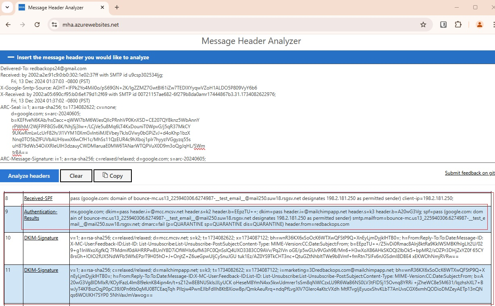  

**RESULT:**   
1.	**SPF**: Pass, but the domain **(mail250.suw18.rsgsv.net)** does not align with the From domain **(redbackops.com)** as MailChimp’s mail server.   
2.	**DKIM**: PassPass, but the signing domains **(mcc.mcsv.net and mailchimpapp.net)** do not align with the From domain **(redbackops.com)**.    
3.	**DMARC**: Pass. Since both SPF and DKIM align, DMARC validation passes, and the email gets delivered without any issues.  

### 3.3.3.	Perform a spoofing test.  
Perform a spoofing test using online tools such as [DMARCTester](https://www.dmarctester.com/) .  

**RESULT:**    
1.	**SPF**: Pass, but the domain **(evil.example.net)** does not align with the From domain **(redbackops.com)** as MailChimp’s mail server.   
2.	**DKIM**: PassPass, but the signing domain **(evil.example.net)** does not align with the From domain **(redbackops.com)**.    
3.	**DMARC**: Pass. Since both SPF and DKIM align, DMARC validation passes, and the email gets delivered without any issues.  

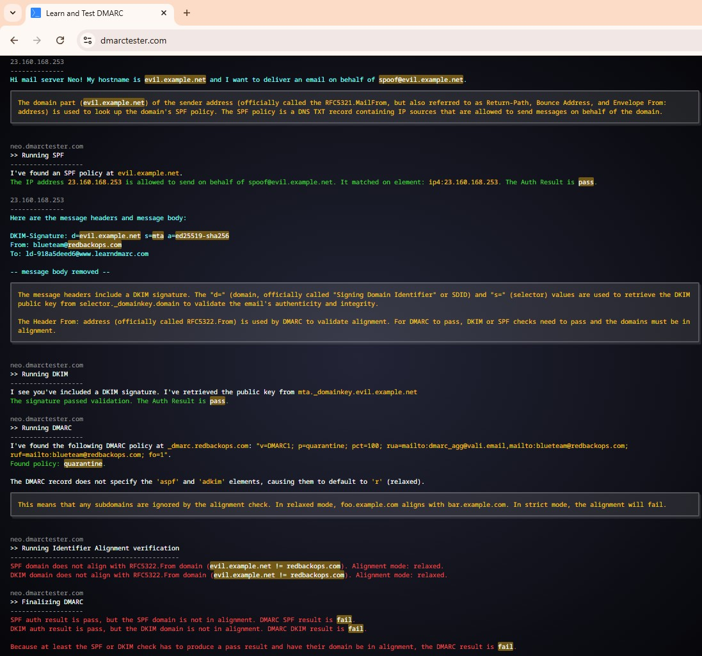  
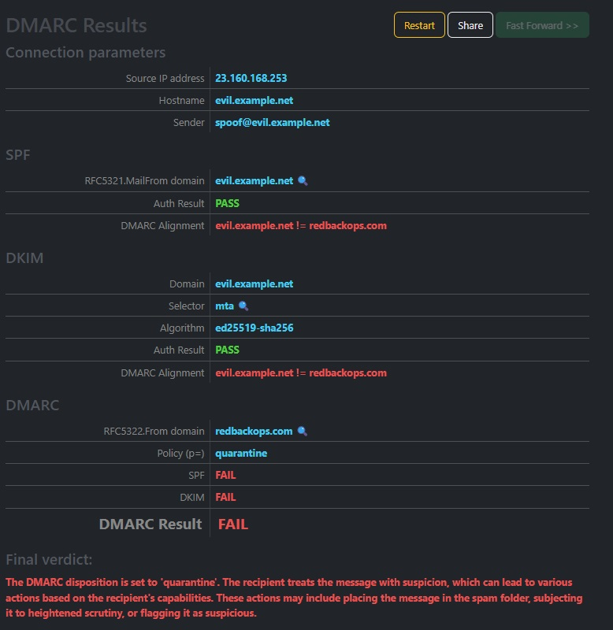  

---

## References
- [Australian Cyber Security Centre - Email Security Guidelines](https://www.cyber.gov.au/resources-business-and-government/essential-cyber-security/ism/cyber-security-guidelines/guidelines-email)
- [MXToolbox - What is DMARC?](https://mxtoolbox.com/dmarc/details/what-is-dmarc)
- [PowerDMARC - All About SPF, DKIM, and DMARC](https://powerdmarc.com/all-about-spf-dkim-dmarc/)
- [Microsoft Hosted Apps (MHA)](https://mha.azurewebsites.net/)
- [DMARC Tester](https://www.dmarctester.com/)
