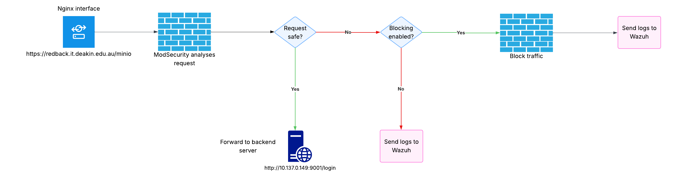

# About Nginx and ModSecurity

:::info
**Document Creation:** 10 Sept., 2025. **Last Edited:** 10 Sept., 2025. **Authors:** Robin Spoerl.
:::

## 1. Introduction

This document will explain the background of the VM and the justification behind installing a reverse proxy architecture. It will also describe limitations and future work. It builds on a previous collaboration between the Blue Team and Infra Team in T1 2025. 

## 2. Background

Currently, the company VM hosts a multitude of containerised web applications, used for machine learning preprocessing (e.g. Streamlit), data storage (MinIO), and so on. These web apps are accessible either by the VM's DNS entry (redback.it.deakin.edu.au) or the respective IP address (10.137.0.149). There's a few issues with this design, however:

- **Unprofessional hosting**: All of the web apps are hosted on arbitrary port number combinations. For example, MinIO is available on http://10.137.0.149:9001/ (or http://redback.it.deakin.edu.au:9001). This is unprofessional and makes it hard to memorise which services belong to which host. At the same time, if the container ports change, these web apps can essentially become lost until someone checks the port mappings. 
- **Lack of HTTPS and future scalaility**: A huge majority of the web apps have no HTTPS implemented. If each web app were configured to run with HTTPS, there is another issue: port collisions. HTTPS is on port 443, and this is what browsers expect. With the current architecture, only one web app could run on port 443. The rest would need to run on an arbitrary port, e.g. 9443. This is once again unprofessional.
- **Lack of monitoring**: Wazuh's in-built rules for container monitoring are limited. They only detect GET-based web attacks, not POST. Therefore, there is a huge gap in detecting web-based attacks. 

## 3. The Proposal

The solution to the previously mentioned issues is implementing a reverse proxy architecture in tandem with a web application firewall (WAF). For more context, a reverse proxy captures requests going **to** web applications; it essentially acts like a middleman that handles the traffic. Meanwhile, a WAF is a security tool specifically designed to analyse web traffic for threats. 

Through research, two suitable open-source options were identified: Nginx and ModSecurity. Nginx is a popular software tool used to create reverse proxies, while ModSecurity is a WAF with a highly detailed ruleset developed by OWASP. Nginx can capture traffic going to the company's web apps, via a HTTPS-hosted interface, while ModSecurity can analyse that traffic. If any threats are detected, ModSecurity can send those logs to Wazuh. The next section covers this in more detail. 

## 4. Architectural Overview 

Instead of the current solution, where web apps are accessible via port numbers, Nginx will listen on a domain subpath for that specific interface, while handling the TLS handshake and termination process. For example, MinIO is currently hosted on http://redback.it.deakin.edu.au:9001. Instead, we set up Nginx to listen on port 443 with a subpath for MinIO. So, MinIO will be accessible via https://redback.it.deakin.edu.au/minio. For each project's web app, we can add a subpath under that specific 443 port. This works as the Redback VM has a DNS entry. Therefore, we are essentially "piggybacking" off this DNS entry to create well-defined interfaces. 

When a request reaches the Nginx interface, it will be routed to an internal container port used by that respective web app. Therefore, in the eyes of the user, they will only be interacting with Nginx (the /minio subpath mentioned earlier instead of the port number example). Moreover, through the TLS termination process, Nginx will ensure that all traffic going to its interface will be encrypted; to ensure compatibility with the backend web apps, the traffic going to them will be decrypted as usual. This won't be an issue for security, however, as only Nginx can communicate via the internal container ports. 

To analyse the traffic, ModSecurity will be added as an Nginx module. This works as it analyses traffic after it's been decrypted. In terms of actions, ModSecurity can do two things: passively assess the traffic and generate alerts, or block traffic. During the initial roll out, ModSecurity will run in detection only mode to prevent false positives from blocking traffic. These detection logs will be synced with Wazuh.

For an overview of how the system works, view the below diagram. 

There are several key benefits to this proposal: 
- **Clean URLs**: Use a clean subpath to access the web apps, instead of arbitrary ports.
- **Scalability**: Only Nginx will be hosted on port 443, and it will communicate with other web apps via internal ports. This means that Nginx will offload the HTTPS off all web apps, ensuring that there are no port collisions.
- **Security**: Nginx enforces HTTPS, while ModSecurity ensures that all web attacks are properly detected.  

## 5. Logistical Considerations

To implement this reverse proxy, there are a few things to keep in mind. 

Firstly, the reason we use a subpath is because it can easily use the existing DNS record for the VM. Having a sub-domain for each project was explored, but this requires organising new DNS records with Deakin IT. While possible, there's another limitation: the current Redback DNS record can't go any lower. That is, we can't have an additional subdomain on top of redback.it.deakin.edu.au. For example, cyber.redback.it.deakin.edu.au wouldn't work. So, to create a new subdomain, the "redback" portion of the domain would have to be replaced with something else. This would make it hard to correlate domains with Redback. Therefore, the easiest and most practical solution was sticking with the subpath idea. 

Secondly, Nginx by default just modifies the HTTP header, not the body. So, if a web app doesn't know it's being served from a subpath, its resources will usually still point to the non-subpath location. Therefore, most web apps need to be
need to be configured to ensure compatibility with Nginx. If this proxy is to be fully implemented in the virtual machine, all projects' teams will need to roll out changes to their own web app deployments without breaking them.

Finally, once the reverse proxy has been deployed and tested, ideally people shouldn't be able to bypass it. For example, instead of accessing https://redback.it.deakin.edu.au/minio for MinIO, they go through the web app's native interface http://redback.it.deakin.edu.au:9001, thereby bypassing the monitoring set up on Nginx. To stop this, firewall rules were explored, but they are unnecessary; instead, since Nginx will communicate with the web apps via internal ports, their external ports can be disabled. As long as access to the containers themselves is limited, this will make it impossible for someone to bypass Nginx. That said, however, some web apps still communicate with each other via external ports. So, full audits need to be done before disabling external access. 

## 6. Next Steps

In T2 2025, given the scope of this project, efforts were directed towards installing Nginx and ModSecurity, enabling logging, and testing web apps used across the Cyber Security and Data Warehouse teams. Please refer to the next document for more information. 

