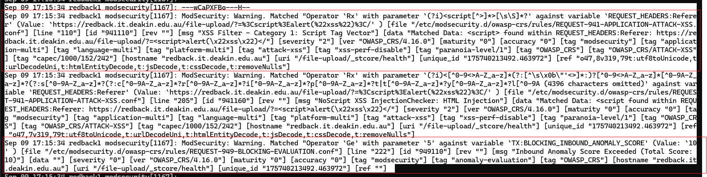

# The Nginx + ModSecurity Setup

:::info
**Document Creation:** 14 Apr., 2025. **Last Edited:** 14 Apr., 2025. **Authors:** Robin Spoerl.
:::

## Introduction

This document will explain the current Nginx + ModSecurity setup on the production VM. It will also explain some of the testing that has been done so far on the various web apps. 

## The Setup

Currently, Nginx and ModSecurity run in a single container, based off the official OWASP CRS Docker image, available at https://hub.docker.com/r/owasp/modsecurity-crs. The exact image used is owasp/modsecurity-crs:4.16-nginx-202506301206, but this will probably change in the future. This container combines the features of Nginx while also allowing us to modify configuration settings for ModSecurity easily via environment variables.

On the VM, the key files for the container are located under /home/codey/infra-team/proxy. The Docker container itself is called "nginx.modsecurity". 

### The Docker Compose File ###

Of these files, the docker-compose.yaml file holds the key environment variable and network configurations for the container. As you can see, the container is mapped both externally and internally to port 443. This is because the Nginx container is designed to offload the TLS encryption from the web apps; it sits on port 443 and interacts with the other web apps via the internal ports.

The container is a part of multiple networks, like coredwinfrastructure_dw_network and mongo_default. This is a key part of that internal communication. When containers are a part of the same network, they can communicate via internal ports and domain names. So, this container is linked to the same networks that most web app containers are using across the VM. You can verify which network a container is a part of by either checking its docker-compose file or using docker inspect on the container. 

The remaining environment variables are related to ModSecurity logging, while the mapped volumes ensuure that the Nginx configurations are saved. This will be explained in more depth later. 

If you want to change any port mappings or volumes, you'd do it through this file. Use docker compose up -d to implement your changes. 

### The nginx.conf File ##

This is the main file for Nginx. It is where the routing happens for the reverse proxy. Inside the file you'll see a http block. This is where the SSL certificate locations are specified for the HTTPS connections; at this stage, they're just self-signed certificates. If you have these lines in, Nginx will handle the TLS creation and termination, so you can use ModSecurity to analyse the decrypted traffic.

Then, there is a server block. This essentially listens on a port and server name for requests. In this case, it listens on port 443 internally and by default handles any requests going to HTTPS. It also handles requests with the Redback domain name. Additionally, ModSecurity is configured on with this specific server block. So, this lays the groundwork to actually perform the forwarding, which is done in the location blocks.

The location block specifies what to do if a request hits a certain subpath. For example, if someone types in https://redback.it.deakin.edu.au/file-upload/, this location block will forward that request to the http://streamlit-app:8501/ location via the proxy_pass line. The proxy-pass line is extremely important, as this dictates where matched requests go to. This block also handles responses coming back from the internal web app. Do note that the location block, in this case, is forwarding requests to the internal domain name of the Streamlit container, via its internal port. Make sure to use the internal mapped ports, NOT the external ones! 

One key thing to note here is the forward slash appended both to the location and proxy_pass lines. 

By default, some of the web apps will not work if the location does not have a forward slash. Or, more specifically, if requests through the subpath don't have a forward slash included in them. So, we want to handle situations where someone forgets to include a forward slash (e.g. https://redback.it.deakin.edu.au/file-upload vs https://redback.it.deakin.edu.au/file-upload/). 

If the location line has the corresponding forward slash,  Nginx will automatically append the forward slash to the request, and it will go through. If the location line does not have the forward slash, no redirects will be done, and this will cause issues with the web apps responding to requests. So, always ensure that the location has a forward slash in it. 

Meanwhile, the forward slash in proxy_pass ensures that the location subpath is **NOT** carried over to the request. That is, if you did https://redback.it.deakin.edu.au/file-upload/img.png, the Streamlit web app would only see https://redback.it.deakin.edu.au/img.png. This is because when you have the forward slash, Nginx removes that specific location portion. Unless the web app is specifically configured to accept requests from a subpath, keep this setting. This ensures that users see traffic coming from the subpath, while the web app sees normal traffic. 

Finally, for some web apps like Streamlit, we need to forward additional header information for the web app to work. This is because Streamlit upgrades its connections to WebSockets. This is sometimes not needed, however. 

**Special Notes**

From the Docker compose file, you might've noticed that the container is mapped to port 443 both externally and internally. That is, if you access the reverse proxy on port 443, it will forward the requests to the internal port 443. 

First of all, we use port 443 as that is the standard used for HTTPS. You don't need to explicitly give a port number in the URL as it's implied that it's port 443. 

Secondly, however, in the current setup both internal and external ports NEED to be the same. This is because of the URL redirects. Currently, when someone enters a URL that's missing a forward slash, Nginx will automatically perform a 301 request. The thing is, Nginx will also carry along the external port number in the request.

As an example, let's say the external port number is 555, and the internal one is 443. When you enter https://redback.it.deakin.edu.au:555/file-upload, Nginx will automatically forward that to https://redback.it.deakin.edu.au:555/file-upload/ internally. However, internally, port 555 doesn't exist! So, the request never reaches the location block. 

The way to fix this, intuitively, is to ensure that both internal and external ports match. Since we're using HTTPS, that means both ports need to be 443. It might be possible to explicitly handle the redirects so that they work without the same ports, but this isn't something that has been looked into so far. 

### ModSecurity Setup ###

So far, we covered the Nginx setup. Now, let's focus on the ModSecurity integration. The key things to focus on are in both the Docker compose and nginx.conf files. In particular, the environment variables, the logging variables, and the access log config. 

For reference, here's the relevant Docker compose file.

And here's the nginx.conf file.

Currently, ModSecurity is set to DetectionOnly. This means that it doesn't block requests and only alerts. While unlikely, it can suffer from false positives. Therefore, for now we don't want to accidentally block any traffic. This is what the "MODSEC_RULE_ENGINE" variable stands for. 

In any guides you'll read online, normally ModSecurity is set to block traffic. When it does this, it creates an error message. This can be found inside the Nginx access log. Meanwhile, all the matched rules can be found inside the audit log. 

The issue with the DetectionOnly setup, however, is that ModSecurity doesn't create neat error messages that summarise what happened; in fact, the access log doesn't get populated unless you dramatically increase the log verbosity. Instead, the audit log contains all the matched rules. So, the audit log is the only "useful" log in this case. 

By default, both audit and access logs get written to stdout, which is viewable via the docker logs command. This makes it a convenient location to grab logs out of the VM. However, to reduce noise, we don't want to also view the detailed access logs. Therefore, you'll see a line called "access_log /tmp/access.log" in the nginx.conf file. This redirects the access logs to /tmp/access.log inside the VM. 

In terms of the audit logs, note in the Docker compose file the MODSEC_AUDIT_LOG: /dev/stdout line. While not strictly necessary (as the audit log is written to stdout by default), it's still good to have in case you'd like to change anything.

**Extracting Logs**

As mentioned, the audit log is what we use to extract the ModSecurity alerts. If you have a look back at the Docker compose screenshot, you'll see these variables:

MODSEC_AUDIT_LOG_FORMAT: "Native"
MODSEC_AUDIT_LOG_PARTS: "ACH"
MODSEC_REQ_BODY_ACCESS: "On"

The first ensures that the logs are in the native ModSecurity format (not JSON) so that they can be parsed properly. 

The second describes which parts of an audit log (or "transaction") should be logged. The "A" is mandatory and ensures the audit log header is present, while "C" ensures that any request bodies (i.e. POST requests) are logged. "H" is the audit log trailer, and this is where you'll see the matched alerts for all requests. 

Finally, MODSEC_REQ_BODY_ACCESS ensures that ModSecurity can access the body of HTTP requests (POST).

Let's see an example for a GET-based malicious request. Assume a request was made for "https://redback.it.deakin.edu.au/file-upload/?=%3Cscript%3Ealert(%22xss%22)%3C/". 
Using docker logs nginx.modsecurity, you'll see the following:

Note that the header includes a timestamp and unique ID, while the H component shows all the matched rules. Only one matched rule is shown for now.

With these logs set up, we can integrate them with other security solutions, such as Wazuh. That means they need to first be sent outside of the container's standard output. For this, we are using the journald logging driver, and tagging all logs from the container with "modsecurity" in a syslog-like format (see the Docker compose file).

Going back to the previous example, you can use journalctl -f to check the journald service. 

### Syncing with Wazuh ###

As mentioned earlier, all the audit logs from the ModSecurity container are sent to the journald service on the host VM. The good thing is that Wazuh by default monitors the journald logging service. 

There are a few issues to note. Out of the box, Wazuh does not have decoders or rules in place to handle these ModSecurity alerts. Also, the audit log shows ALL the rules that were linked with a single request. So, one attack could three or more correlated rules, which would spam the dashboard. Instead, it would be ideal to just have one alert per request.

If you have a closer look at the ModSecurity warnings, you'll see a common pattern: there is a "unique_id" variable for each group of rules. Intuitively, you could, out of each group, pick the first rule which matches this unique ID, and your alert would still indicate what sort of attack is happening. 

Following the logic, a new decoder was created inside the /var/ossec/etc/decoders/local_decoder.xml file **inside the Wazuh Manager container**. The parent decoder checks for any programs that have the "modsecurity" name, matching the journald logs shown earlier.

Then, if that's the case, a child decoder activates and extracts the "msg", "uri" and "unique_id" values from the alert. These are used to identify the alert message, URI and the unique ID. The key thing here is the `<fts>` line. As described earlier, the first alert in a group of alerts will be the first to have the unique id. Therefore, the decoder only fires if the unique ID is the first one it's seen. This ensures that only one alert is extracted from each group. 

Additionally, the prematch and use_own_variable parameters are used to ensure that the child decoder can fire off other rules. If not specified, the rules will appear to come from the parent decoder, which will cause issues with the linked rules.

So far, we have the decoder, which extracts all the information and fires the first time it detects a unique ID in the rule. But to make an alert appear on the dashboard, we need a rule. 

Under /var/ossec/etc/rules/local_rules.xml, we can find the corresponding rule. If the previous child decoder fires, AND it's the first time it has seen the unique ID, it will fire this rule (noted by the corresponding if_fts parameter). Then, the alert message and URI will be shown on the dashboard as a level 5 alert.

With all of that done, let's have a look at an example XSS attack on the Streamlit web app. Using https://redback.it.deakin.edu.au/file-upload/?=%3Cscript%3Ealert(%22xss%22)%3C/, we get the following alert on Wazuh:

# Further Reading

To further understand all the Nginx environment variables, read the official ModSecurity Docker guide: https://github.com/coreruleset/modsecurity-crs-docker/blob/main/README.md

Additionally, to get an understanding of what's been tested so far, review the next doc in this series.
