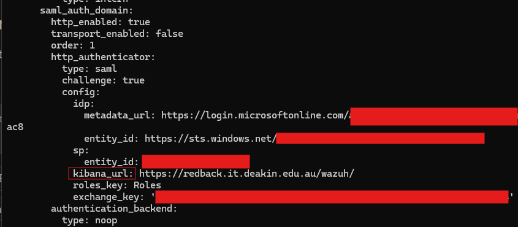
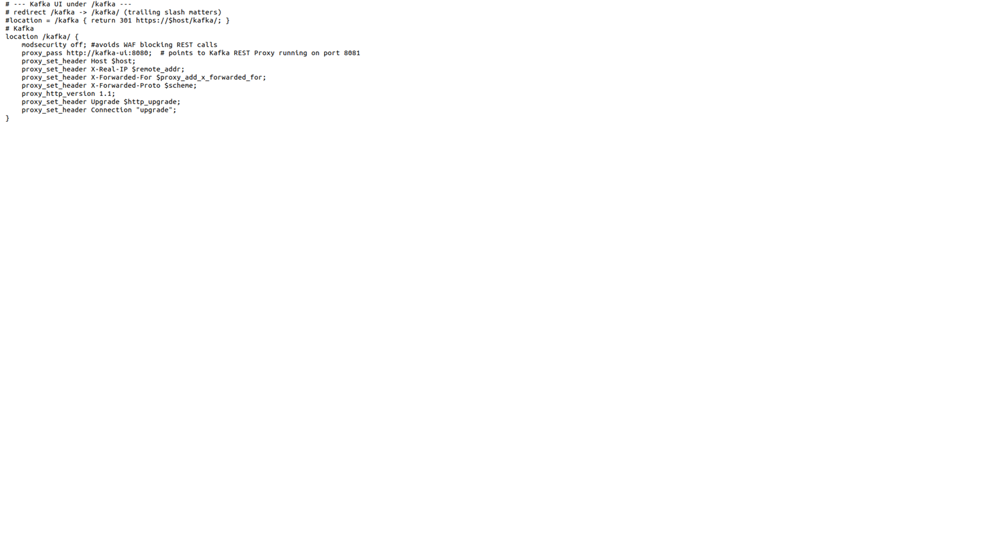

# Nginx Testing - Trimester 2 2025

:::info
**Document Creation:** 10 Sept., 2025. **Last Edited:** 15 Sept., 2025. **Authors:** Robin Spoerl., Susmitha Gogireddy.
:::

## 1. Introduction

This document covers which web apps are proxied in the VM, and which were tested locally. This document is designed as a guide for other teams to refer to in the future. 

As ModSecurity is currently set to passively monitor traffic, it will not impact the testing of any web apps. The main focus of this document is, therefore, on Nginx. 

Kafka has been integrated into the VM by adding a proxy location block within the nginx.conf file. This redirection maps requests from the /kafka/ path to the underlying Kafka service running on its port.

## 2. Scope

Given the large number of web interfaces across the VM, the initial scope of this document was testing web apps used by both the Cyber Security and Data Warehouse teams. These are as follows:

- Streamlit file upload service
- Wazuh dashboard
- MinIO object storage
- Dremio interface
- Kafka endpoint
- Grafana endpoint

## 3. Tested Web Apps

This section will explain which web apps have been tested and any important config settings. Do note that all ports used in the **proxy_pass** directive refer to the internal container ports. 

### 3.1 Streamlit

This is the **nginx.conf** location block for Streamlit. The additional **proxy_set_header** headers are required as Streamlit upgrades its connection to a WebSocket. As long as the container sits on port 443 internally and externally, no changes to the Streamlit app are required to allow the proxy to work.

The file upload service is now accessible via the https://redback.it.deakin.edu.au/file-upload/ interface. Previously, it was accessible at http://redback.it.deakin.edu.au. It is still accessible, but this should be disabled in the future. Secondly, the Streamlit container is using up port 80, which is a bit misleading when first accessing the domain. As Streamlit depends on a few backend scripts, changing or disabling external ports will require an audit of those scripts, to avoid breaking any dependent services still using the old URL and port. 


### 3.2 Wazuh

This is the location block for the Wazuh dashboard. In the past, the Wazuh dashboard container was sitting on port 443, colliding with the Nginx container. To bring it in line with the architecture, it has been implemented behind the reverse proxy on a /wazuh/ subpath. To stop ModSecurity from generating a significant amount of alerts from traffic on the dashboard, it has been disabled for this block. Wazuh is now accessible via https://redback.it.deakin.edu.au/wazuh/.


Now, there's a few more steps that need to be done for Wazuh to be completely accessible. As previously mentioned, Nginx by default just proxies the HTTP header information, not the body. When Wazuh responds to a proxied request, all of its resources (images, links, scripts) won't be rewritten to include the /wazuh/ subpath, since Nginx doesn't handle that automatically. To make this work, we have to modify Wazuh's settings to make it serve resources from a subpath.

Under **/root/wazuh-docker/single-node/config/wazuh_dashboard/opensearch_dashboards.yml**, these two lines were added: 

```
server.basePath: "/wazuh"
server.rewriteBasePath: false
```

The first, **server.basePath: "/wazuh"** makes Wazuh generate all its resources under the /wazuh subpath. Meanwhile, since Nginx removes the base path from the request, **server.rewriteBasePath: false** stops the Wazuh from doing so. Basically, this makes the Wazuh dashboard expect to receive requests WITHOUT the base path while responding WITH the base path. This distinction is incredibly important. It means that if you tried to access the dashboard outside of the proxy, your browser would try to load all the resources in the responses, which would have the /wazuh base path. In turn, the server would not accept these requests. So, you can only access the dashboard via the proxy.


Secondly, the current Wazuh setup uses SSO linked to Microsoft Entra ID. For a brief recap, when you try to access the dashboard, it sends an authentication request to Microsoft, which responds with a SAML assertion to the Wazuh dashboard URL. Since a reverse proxy is in use, Wazuh's configurations need to be changed to point to the right interface (https://redback.it.deakin.edu.au/wazuh/).

There is already a guide that covers the Entra ID setup, available here: https://redback-operations.github.io/redback-documentation/docs/cybersecurity/Blue%20Team/Production/Wazuh/Enhancements/wazuh-sso-rbac. Briefly, we need to modify two things: the Entra ID SAML configuration (available on the web interface) and the **/usr/share/wazuh-indexer/opensearch-security/config.yml** file available inside the Wazuh indexer container. 

With reference to the guide (section 1.5), go to Basic SAML Configuration and change the Reply URL and Sign on URL to the reverse proxy interface (https://redback.it.deakin.edu.au/wazuh/). 


Then, go to the config.yml file and ensure that **kibana_url** is pointing to the correct /wazuh/ URL. 



### 3.3 MinIO

The MinIO interface has a location block to handle the connection. It is currently accessible via https://redback.it.deakin.edu.au/minio/. 


To support the proxy, this environment variable needs to be added to the container: **MINIO_BROWSER_REDIRECT_URL: "https://redback.it.deakin.edu.au/minio"**. This makes the console (on port 9001) expect to be served on this domain. Otherwise, the web app won't use the /wazuh/ subpath in its body responses, so the wrong resources get loaded. This does mean that the console is only accessible via the proxy. The docker-compose file for MinIO with the env variable can be found under **/home/jesse/core-infra/redback-data-warehouse/Core DW Infrastructure/**. 

### 3.4 Dremio

It appears that Dremio, by default, does not have a base URL configuration to allow it to be compatible with Nginx. Like the previous web apps, it will serve resources in its body responses without the /wazuh/ subpath. 

One thing that has been tested is manually replacing the locations of resources with /dremio/ (inside the sub filter block). However, since there's JavaScript, images, etc., it's quite difficult to handle all edge cases. Future team members are welcome to continue experimenting. 


### 3.5 Kafka endpoint

This is the nginx.conf location block for Kafka. The block proxies requests from the /kafka/ subpath to the Kafka REST Proxy (via the kafka-ui container), which runs internally on port 8081. To ensure compatibility, modsecurity has been disabled for this block, as the Kafka UI makes REST calls that would otherwise trigger unnecessary alerts.



Kafka is now accessible via the reverse proxy at https://redback.it.deakin.edu.au/kafka/
instead of connecting directly over its internal port. The configuration also includes headers for forwarding client information and supports WebSocket upgrades, which are required for the UI to function correctly.

### 3.6 Grafana endpoint

Grafana has been placed behind the reverse proxy on a /grafana/ subpath. The relevant nginx.conf location block ensures that both standard HTTP requests and WebSocket upgrades are supported, as Grafana relies heavily on persistent connections for its dashboards. To avoid excessive false positives from frequent API calls, ModSecurity has been disabled for this block.

A common point of confusion is the difference between images and containers:

Running docker images shows images (blueprints).

Running docker ps shows containers (actual running instances).

docker exec only works on containers, not images. That’s why using an image ID such as 5c42a1c2e40b fails — you must use the container ID or container name from docker ps.

Inside the running Grafana container, the grafana.ini file was updated to work correctly behind the reverse proxy:

[Grafana ini](img-proxy/grafanaini.png)

root_url ensures that Grafana generates all resource links with the /grafana/ base path.

serve_from_sub_path tells Grafana to expect incoming requests under this path, aligning with the Nginx reverse proxy setup.

[Grafana](img-proxy/grafana.png)

Grafana is now accessible via:
https://redback.it.deakin.edu.au/monitor/

This configuration means Grafana is only usable via the reverse proxy. Direct access to the container’s internal port will result in broken links and missing resources, since all requests must include the /grafana/ subpath.