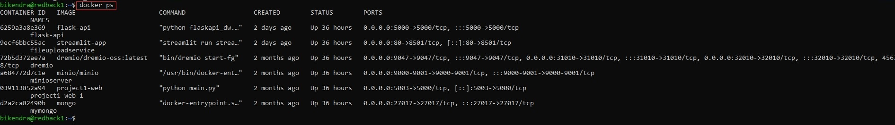

# Wazuh 4.5.0 - Backup and Redeploy 

:::info
**Document Creation:** 14 Dec, 2024. **Last Edited:** 14 Dec, 2024. **Authors:** Bikendra Gurung.
<br></br>**Effective Date:** 14 Dec 2024. **Expiry Date:** 14 Dec 2025.
:::

## Step 1: Check Running Wazuh Instances/Services
1. Check Running Wazuh Instances:
   ```bash
   docker ps
   ```
     

## Step 2: Backup Wazuh Data

### 1. Backup Wazuh Manager Data

1.1. Enter the Wazuh Manager container:
   ```bash
   docker exec -it --user root single-node-wazuh.manager-1 bash
   ```

1.2. Create a compressed backup:
   ```bash
   tar -czvf /var/ossec_backup.tar.gz /var/ossec
   ```
     

1.3. Exit the container:
   ```bash
   exit
   ```

1.4. Copy the backup to the host machine:
   > **Note**: This step copies the backup to the current working directory (e.g., `/home/usr/`). To copy the backup to a centralized location, skip this step and follow the instructions in Section 4.
   ```bash
   docker cp single-node-wazuh.manager-1:/var/ossec_backup.tar.gz ./ossec_backup.tar.gz
   ```
     

### 2. Backup Wazuh Indexer Data

2.1. Enter the Wazuh Indexer container:
   ```bash
   docker exec -it --user root single-node-wazuh.indexer-1 bash
   ```

2.2. Navigate to the `/usr/share` directory:
   ```bash
   cd ../
   ```

2.3. Verify that the `wazuh-indexer` directory exists:
   ```bash
   ls
   ```

2.4. Create a compressed backup:
   ```bash
   tar -czvf /usr/share/wazuh.indexer_backup.tar.gz /usr/share/wazuh-indexer/
   ```
     

2.5. Exit the container:
   ```bash
   exit
   ```

2.6. Copy the backup to the host machine:
   > **Note**: This step copies the backup to the current working directory (e.g., `/home/usr/`). To copy the backup to a centralized location, skip this step and follow the instructions in Section 4.
   ```bash
   docker cp single-node-wazuh.indexer-1:/usr/share/wazuh.indexer_backup.tar.gz ./wazuh.indexer_backup.tar.gz
   ```
     

### 3. Backup Wazuh Dashboard Data

3.1. Enter the Wazuh Dashboard container:
   ```bash
   docker exec -it --user root single-node-wazuh.dashboard-1 bash
   ```

3.2. Navigate to the `/usr/share` directory:
   ```bash
   cd ../
   ```

3.3. Verify that the `wazuh-dashboard` directory exists:
   ```bash
   ls
   ```

3.4. Create a compressed backup:
   ```bash
   tar -czvf /usr/share/wazuh-dashboard_backup.tar.gz /usr/share/wazuh-dashboard
   ```
     

3.5. Exit the container:
   ```bash
   exit
   ```

3.6. Copy the backup to the host machine:
   > **Note**: This step copies the backup to the current working directory (e.g., `/home/usr/`). To copy the backup to a centralized location, skip this step and follow the instructions in Section 4.
   ```bash
   docker cp single-node-wazuh.dashboard-1:/usr/share/wazuh-dashboard_backup.tar.gz ./wazuh-dashboard_backup.tar.gz
   ```
     

### 4. Create a Centralized Backup Location

4.1. Create a centralized directory if it does not already exist:
   ```bash
   [ -d /var/backups/wazuh ] || mkdir -p /var/backups/wazuh
   ```

4.2. Ensure only users with `root` privileges can access the directory:
   ```bash
   chown root:root /var/backups/wazuh
   chmod 700 /var/backups/wazuh
   ```

4.3. Copy backups to the centralized location:

   - Wazuh Manager:
     ```bash
     docker cp single-node-wazuh.manager-1:/var/ossec_backup.tar.gz /var/backups/wazuh/ossec_backup.tar.gz
     ```

   - Wazuh Indexer:
     ```bash
     docker cp single-node-wazuh.indexer-1:/usr/share/wazuh.indexer_backup.tar.gz /var/backups/wazuh/wazuh.indexer_backup.tar.gz
     ```

   - Wazuh Dashboard:
     ```bash
     docker cp single-node-wazuh.dashboard-1:/usr/share/wazuh-dashboard_backup.tar.gz /var/backups/wazuh/wazuh-dashboard_backup.tar.gz
     ```

## Step 3: Remove all Wazuh Services, Images, and Volumes

### 1. Remove Wazuh Services

1.1. Remove all Wazuh services/containers:
   ```bash
   docker compose -f /opt/deploy/wazuh-docker/single-node/docker-compose.yml down
   ```
     

1.2. Alternatively, remove them individually:
   ```bash
   docker compose -f /opt/deploy/wazuh-docker/single-node/docker-compose.yml rm -f wazuh.dashboard wazuh.manager wazuh.indexer
   ```

### 2. Remove Wazuh Images

```bash
   docker rmi wazuh/wazuh-manager:4.5.0 wazuh/wazuh-indexer:4.5.0 wazuh/wazuh-dashboard:4.5.0
```
  

### 3. Remove Wazuh Volumes

3.1. Check Docker volumes associated with Wazuh:
   ```bash
   docker volume ls
   ```
     

3.2. Remove Docker volumes:

   - Individually:
     ```bash
     docker volume rm single-node_wazuh-indexer-data \
                    single-node_wazuh_active_response \
                    single-node_wazuh_agentless \
                    single-node_wazuh_api_configuration \
                    single-node_wazuh_etc \
                    single-node_wazuh_integrations \
                    single-node_wazuh_logs \
                    single-node_wazuh_queue \
                    single-node_wazuh_var_multigroups \
                    single-node_wazuh_wodles
     ```
        
   - Based on naming conventions:
     ```bash
     docker volume ls | grep -E 'single-node_wazuh' | awk '{print $2}' | xargs docker volume rm
     ```

## Step 4: Verify Removal of Wazuh Services

1. Verify all services are removed:
   ```bash
   docker ps
   ```
     

## Step 5: Install Wazuh

### 1. Set Up Environment

1.1. Switch to root:
   ```bash
   sudo su
   ```

1.2. Configure the system's virtual memory:
   ```bash
   echo "vm.max_map_count=262144" | sudo tee -a /etc/sysctl.conf
   ```

### 2. Install Docker and Docker Compose

2.1. Install Docker:
   ```bash
   curl -sSL https://get.docker.com/ | sh
   ```

2.2. Install Docker Compose:
   ```bash
   curl -L "https://github.com/docker/compose/releases/download/v2.20.3/docker-compose-$(uname -s)-$(uname -m)" -o /usr/local/bin/docker-compose
   ```

2.3. Make Docker Compose executable:
   ```bash
   chmod +x /usr/local/bin/docker-compose
   ```
     

### 3. Deploy Wazuh

3.1. Navigate to the deployment directory:
   ```bash
   cd /opt/deploy
   ```

3.2. Remove any old Wazuh Docker repository:
   ```bash
   ls
   ```

3.3. Clone the Wazuh 4.5.0 Docker repository:
   ```bash
   git clone https://github.com/wazuh/wazuh-docker.git -b v4.5.0
   ```
     

3.4. Navigate to the single-node directory:
   ```bash
   cd wazuh-docker/single-node/
   ```

3.5. Generate the indexer certificates:
   ```bash
   docker compose -f generate-indexer-certs.yml run --rm generator
   ```
     

3.6. Start all Wazuh containers:
   ```bash
   docker compose up -d
   ```
     
     

3.7. Start individual services if needed:
   ```bash
   docker compose -f /opt/deploy/wazuh-docker/single-node/docker-compose.yml up -d
   ```

## Step 6: Confirm Installation

1. Check that all required Wazuh instances/services are running:
   ```bash
   docker ps
   ```
     

