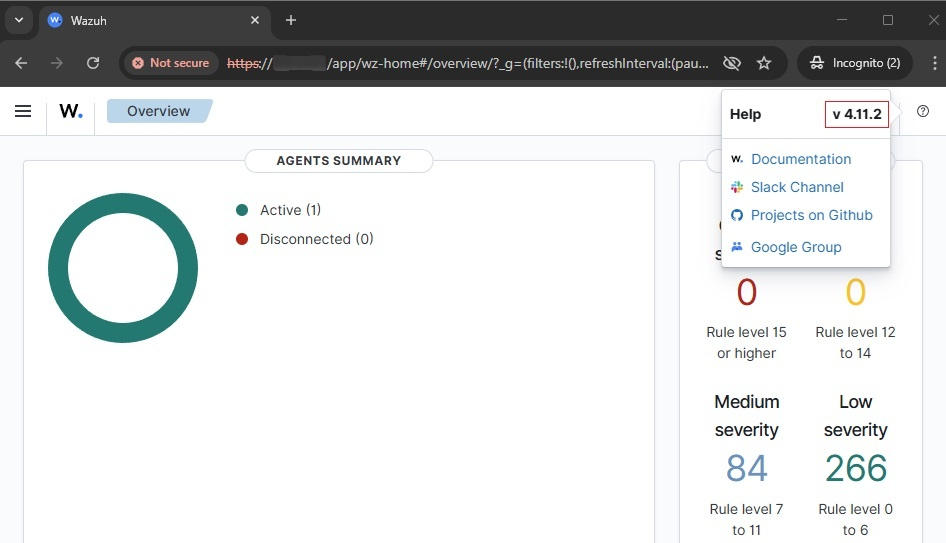

# Wazuh Docker Upgrade Guide (While Preserving Existing Configurations)

:::info
**Document Creation:** 05 May, 2025. **Last Edited:** 05 May, 2025. **Authors:** Bikendra Gurung.  
**Effective Date:** 05 May, 2025. **Expiry Date:** 05 May, 2026.
:::

## Overview
This technical guide provides step-by-step instructions to safely upgrade Wazuh Docker to the latest version while preserving existing configurations and data.

## Prerequisites
1. Existing Wazuh Docker deployment – This guide assumes the Wazuh stack (Manager, Indexer, Dashboard, Agent) is already deployed using Docker.
2. Admin/Root access to the Wazuh Docker host (Linux server).
3. Familiarity with docker, docker-compose, and basic Linux operations.
4. Backup of existing docker-compose.yml and config/ directory.
5. Docker volumes must not be deleted to preserve data.
6. The following needs to be installed:
   - Docker
   - docker-compose
   - git

## Important Note
If the `docker-compose` command does not work on your system, use `docker compose` instead (without a hyphen).

## Upgrade Steps

### Step 1: Backup

1. Check for running Wazuh containers.
   ```bash
   docker ps
   ```

2. Find the active 'docker-compose.yml' path by checking a Wazuh container (e.g., indexer)
   ```bash
   docker inspect 'single-node_wazuh.indexer_1' | grep -i compose
   ```

3. Backup current configuration
   ```bash
   cd /path/to/wazuh-docker/...
   cp docker-compose.yml docker-compose.yml.backup
   cp -r config/ config_backup/
   ```


---

### Step 2: Stop Containers (Preserves Volumes)

```bash
docker-compose down
```


---

### Step 3: Download New Wazuh Docker Files

1. Fetch updates
   ```bash
   git fetch --all
   ```

2. Check the Wazuh website and identify the latest stable Wazuh version (in this case, 4.11.2). Checkout that version.
   ```bash
   git checkout v4.11.2
   ```


---

### Step 4: Compare and Merge Changes

1. Restore the old docker-compose.yml backed up in 'Step 1':
   ```bash
   rm docker-compose.yml
   cp docker-compose.yml.backup docker-compose.yml
   ```
   

2. Ensure the following in the `single-node/docker-compose.yml` file:


   2.1. Ensure the image versions correspond to the current deployment (e.g., v4.11.2).
   ```yaml
   services:
     wazuh.manager:
       image: wazuh/wazuh-manager:4.11.2
     wazuh.indexer:
       image: wazuh/wazuh-indexer:4.11.2
     wazuh.dashboard:
       image: wazuh/wazuh-dashboard:4.11.2
   ```
   <br/>
   <br/>
   

   2.2.	Modify the `OPENSEARCH_JAVA_OPTS` environment variable to allocate more RAM to the Wazuh indexer container (if needed).
   `OPENSEARCH_JAVA_OPTS=-Xms1g -Xmx1g` <br/>
   

3. Update the defaultRoute parameter in the Wazuh dashboard configuration file `single-node/config/wazuh_dashboard/opensearch_dashboards.yml` is set to the value below (if needed).
`uiSettings.overrides.defaultRoute: /app/wz-home`
<br/>


4. Modify the tag of image generator (if needed).
   ```yaml
   single-node/generate-indexer-certs.yml
   services:
      generator:
         image: wazuh/wazuh-certs-generator:0.0.2
   ```
   <br/>
   

5. Recreate the certificates:
   ```bash
   docker-compose -f generate-indexer-certs.yml run --rm generator
   ```
   

6. Restore `wazuh_manager.conf` from backup:
   ```bash
   cd single-node/config/wazuh_cluster/
   rm wazuh_manager.conf
   cp ../../config_backup/wazuh_cluster/wazuh_manager.conf wazuh_manager.conf
   ```
   
---

### Step 5: Start the New Version of Wazuh
```bash
docker compose up -d
```


---

### Step 6: Post-Upgrade Validation

1. Check container health - ensure the containers are up and running:
   ```bash
   docker ps
   ```
   

2. Access the Wazuh Dashboard and ensure the dashboard and indexer are functioning:
   - `https://<your-dashboard-ip>/app/wz-home`
   - Example: `https://redback.it.deakin.edu.au/app/wz-home`
   

3. If issues occur, check logs:
   ```bash
   docker logs single-node_wazuh.dashboard_1
   docker logs single-node_wazuh.indexer_1
   docker logs single-node_wazuh.manager_1
   ```

---

## Troubleshooting

| Problem              | Recommended Steps |
|----------------------|-------------------|
| Dashboard not loading | • Check `wazuh.dashboard` logs – `docker logs single-node_wazuh.dashboard_1` |
| Indexer failing       | • Check Java memory settings and recreated certificates.<br/>• Check `wazuh.indexer` logs – `docker logs single-node_wazuh.indexer_1` |
| Manager not starting  | • Verify `wazuh_manager.conf` syntax and permissions.<br/>• Check `wazuh.manager` logs – `docker logs single-node_wazuh.manager_1` |
| Certificates errors   | • Rerun the certificate generator process (Step 4, point 5 – Recreate the certificates) |

---

## Notes

1. Always backup configuration files before proceeding.
2. `docker-compose down` only stops/removes containers; **data volumes are unaffected and preserved unless explicitly removed**.
3. Some custom setups and integrations might need to be manually reconfigured after the upgrade.
4. Always review [Wazuh Release Notes](https://documentation.wazuh.com/current/release-notes/index.html) for details on changes before upgrading.

---

## References

- https://documentation.wazuh.com/current/deployment-options/docker/upgrading-wazuh-docker.html  
- https://documentation.wazuh.com/current/release-notes/index.html
