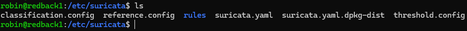

# Suricata and Wazuh Integration

:::info
**Document Creation:** 10 Sept., 2025. **Last Edited:** 10 Sept., 2025. **Authors:** Robin Spoerl.
:::

## 1. Introduction 

Suricata, a network-based intrusion detection system, is currently installed on the production VM. This monitors all traffic going to and from the VM. This guide will explain some essential concepts regarding the current setup. Note that the installation guide can be found at https://docs.suricata.io/en/latest/install.html. 

## 2. The Deployment

Different from the previous setups, Suricata runs as a process directly on the host VM, without any containerised architecture. Suricata by itself doesn't have a web interface; all settings need to be configured directly in the configuration directory, which is at **/etc/suricata**. 

As you can see, this directory has a rules folder, which contains rules that Suricata uses to analyse traffic. 



There is also a **suricata.yaml** file. This is the main configuration file for Suricata. One key thing you should know is that Suricata runs in different capture modes. These are the modes in which Suricata captures network traffic. There are different modes, like af-packet and pcap. If you have a look through the file, you can see the configurations for each of these modes.

Currently, **af-packet** is the default capture mode for Suricata. 


By default, a lot of these settings will work out of the box, including with the default network interface. However, there's one key thing that has been changed: promiscuous mode. By default, Suricata sets up the network interface to run in promiscuous mode. This means it captures all traffic on the network. Since this is clearly out of scope for logging purposes, it has been disabled with disable-promisc: yes. 


Note that you can use `systemctl status suricata` to see which settings Suricata started up with, including which capture mode is being used. 

## 3. Logging

Currently, the logs for Suricata are stored under **/var/log/suricata**. There are different files here. The main log files to consider are eve.json, fast.log, stats.log, and suricata.log. The eve.json log contains a detailed overview of all network traffic and fired alerts, while fast.log just shows one-line summaries of alerts. Meanwhile, stats.log shows network traffic stats, while suricata.log shows Suricata's startup logs (whenever you restart the service).


From the previous screenshot, you might've noticed the large number of compressed files. This is because log rotation is in place. 

In the past, the VM experienced crashes because Suricata was storing logs worth hundreds of gigabytes, thereby using up all the disk space. So, the solution is implementing log rotation. This ensures that after a set amount of time, the logs are replaced. 

### 3.1. logrotate

Logrotate is the service we use to rotate both Suricata and wider system logs. It runs every 24 hours and checks the configuration files to see which logs it should rotate, Its configuration settings are in the **/etc** directory. Specifically, there's two: **/etc/logrotate.conf**, and **/etc/logrotate.d**. 

The first, **logrotate.conf**, specifies the global log rotation settings which haven't been specified inside **/etc/logrotate.d**. For example, we can see the default setting is to rotate logs weekly. 


The **/etc/logrotate.d** directory specifies specific logging settings for services. Suricata has its own entry inside this directory. 


Inside the Suricata file, there are specific lines. For all log types ending with .log or .json, the logs are rotated daily, and the last 7 logs of each type are kept in a compressed format. These lines override the global settings. Before these changes, Suricata was rotating logs on a weekly basis, which led to storage issues. 

Note that in the screenshot from before, there are more than 7 logs per each log type. This is because these settings were only modified recently, and the older logs haven't been deleted yet. 


## 4. Syncing Suricata with Wazuh

In the production environment, the Suricata logs are sent to Wazuh. So, this lets you view alerts from network-based traffic. This section will briefly explain how you can emulate the production environment's setup. 

To sync the logs with Wazuh, you need to add this line to the Wazuh agent's ossec_config configuration block, available at /var/ossec/etc/ossec.conf:

```
  <localfile>
    <log_format>json</log_format>
    <location>/var/log/suricata/eve.json</location>
  </localfile>
```
The above tells the agent to start monitoring logs coming from the eve.json file. This will only work temporarily, however. The Wazuh agent's logcollector module will eventually experience buffer issues as it's handling a huge influx in new network logs. Also, the Wazuh Manager's decoders can have issues with the design of the eve.json logs. So, there's two things you need to do.

First, under the agent's **/var/ossec/etc/local_internal_options.conf** file, add **logcollector.queue_size=10000**. This is the queue size for events in the logcollector module, used by the agent. By default, it's 1024; increasing it will prevent errors down the track. To implement all changes, restart the Wazuh agent with `systemctl restart wazuh-agent`. 


Additionally, the Wazuh Manager needs to have its decoder order size updated to account for the large format of the eve.json logs. Enter the container with `docker exec -it single-node-wazuh.manager-1` and go to **/var/ossec/etc/local_internal_options.conf** (you can also view the mapped directory file on the host if you have root perms).

In this case, you need to modify the **local_internal_options.conf** file on the Manager by adding in **analysisd.decoder_order_size=600**. By default this value is at 256, which isn't enough for Suricata logs. Restart the container to apply your changes. 


Once set up, you should see alerts on the dashboard for network-related activity. Note that if you restarted the agent, it can take up to 15 mins for logs to appear on the dashboard. This is because the logcollector module takes a while to read all the log sources. 

## 4. Further Reading

- [Suricata docs](https://docs.suricata.io/en/latest/)
- [Logrotate guide](https://betterstack.com/community/guides/logging/how-to-manage-log-files-with-logrotate-on-ubuntu-20-04/)

