**Last updated by:** Geetanjali, **Last updated on:** 10/12/2024


**Last updated by:** Geetanjali, **Last updated on:** 10/12/2024


**Last updated by:** Geetanjali, **Last updated on:** 10/12/2024


**Last updated by:** Geetanjali, **Last updated on:** 10/12/2024

# QEMU Raspberry Pi Simulation with Pi-hole

:::important

By **Geetanjali Jangid**, **224026576**, **7/12/2024**

:::

---

## Introduction

This report presents a comprehensive approach to configuring and testing Pi-hole, a DNS-based ad-blocking tool, using a QEMU Raspberry Pi simulation. The outlined steps aim to provide users with a structured and practical guide to successfully replicating the setup. By addressing key challenges encountered during the process, such as disk space limitations, dependency errors, and network misconfigurations, this report ensures that users can achieve a functional simulation environment. Additionally, the documentation focuses on enhancing the understanding of Pi-hole's deployment within a virtualized Raspberry Pi environment, highlighting its benefits for ad-blocking and DNS filtering. This detailed approach makes the setup accessible to users with varying levels of technical expertise, enabling a streamlined experience in deploying and utilizing Pi-hole.

---

## Purpose

This document is designed to serve as a reliable resource for setting up Pi-hole within a QEMU Raspberry Pi simulation. The primary aim is to guide users through the installation, configuration, and troubleshooting process to create a stable and functional environment. By leveraging the flexibility of QEMU, the guide eliminates the need for physical Raspberry Pi hardware, offering a cost-effective and accessible solution for ad-blocking and DNS security testing. It further addresses common issues like disk space errors, dependency conflicts, and network misconfigurations, providing effective resolutions. With an emphasis on practical application, the purpose of this report extends to equipping users with the knowledge and tools required to test Pi-hole’s capabilities and optimize it for network security.

---

## Scope

- Provides comprehensive instructions for setting up a QEMU Raspberry Pi simulation. 
- Addresses critical challenges such as disk space limitations, dependency conflicts, and network misconfigurations. 
- Guides the installation and configuration of Pi-hole for DNS-based ad-blocking. 
- Explores the integration of curated blocklists to enhance filtering capabilities. 
- Demonstrates testing Pi-hole’s effectiveness on various devices, including laptops and smartphones. 
- Includes steps for troubleshooting issues like web interface accessibility and service failures. 
- Offers practical solutions for optimizing Pi-hole’s performance and reliability. 
- Serves as a replicable framework for users aiming to implement virtualized Pi-hole setups. 
- Encourages broader application in cybersecurity projects and network management. 
- Enhances understanding of virtualized environments for deploying network security tools.
---

## Setup Steps
### 1. Initial Setup 

1. **Create a Working Directory** 
   - Create a directory on your system to organize all necessary files and configurations related to the simulation. 
   - This directory acts as a centralized location for storing essential components like the disk image, kernel, and device tree files. 
   - Example: Create a folder named `D:\Rapi-test` for this purpose.

2. **Prepare the `start.bat` File** 
   - **Purpose**: This batch file contains the commands required to initialize the QEMU Raspberry Pi simulation. 
   - **Steps**: 
      - Open a text editor (e.g., Notepad). 
      - Write the following commands and save the file as `start.bat` in the working directory: 
         ```bash
         qemu-system-arm ^
         -kernel kernel-qemu-5.10.63-bullseye ^
         -cpu arm1176 -m 256 -M versatilepb ^
         -dtb versatile-pb-bullseye-5.10.63.dtb ^
         -no-reboot -serial stdio ^
         -append "root=/dev/sda2 panic=1 rootfstype=ext4 rw" ^
         -hda 2024-11-13-raspios-bookworm-armhf-lite.img ^
         -netdev user,id=mynet0,hostfwd=tcp::2222-:22,hostfwd=udp::53-:53,hostfwd=tcp::8090-:80 ^
         -device virtio-net-pci,netdev=mynet0
         ```

3. **Run the `start.bat` File** 
   - **Steps**: 
      - Open a terminal in the directory where the `start.bat` file is saved. 
      - Execute the batch file by typing `start.bat` and pressing Enter. 
   - **Verification**: 
      - Ensure the QEMU virtual machine starts, and the Raspberry Pi terminal interface appears. 
      - Verify that no errors occur during initialization and that the terminal is ready for further configuration.
---

### 2. Resolve Disk Space Issues
   - **Issue**: Login errors and crashes occurred due to limited disk space. 
   - **Solution**: Resize the disk image using the following command:
   ```bash
   qemu-img.exe resize 2024-11-13-raspios-bookworm-armhf-lite.img +4G
   ```
      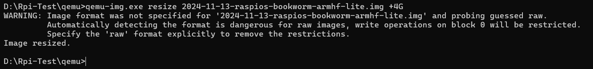

   - Rerun the `start.bat` file to confirm the changes. QEMU was restarted, resolving the space issue.
   ---

### 3. Fix Package Dependency Errors 

      1. **Issue**: 
         - Package dependency issues may occur during system updates or upgrades, causing interruptions in the process. 


      2. **Stop and Disable Conflicting Services**
         - Conflicting services, such as `userconfig.service`, can interfere with the package manager. Stopping and disabling these services prevents further interruptions:
         ```bash
         sudo systemctl stop userconfig.service
         sudo systemctl disable userconfig.service
         ```

      3. **Clear Lock Files**
         - Lock files may block access to the package manager, causing errors during installation or updates. Removing these files resolves the issue:
         ```bash
         sudo rm -f /var/lib/dpkg/lock
         sudo rm -f /var/lib/dpkg/lock-frontend
         sudo rm -f /var/cache/debconf/config.dat*
         ```

      4. **Reconfigure and Fix Broken Dependencies**
         - Reconfiguring pending packages and repairing broken dependencies ensures the package manager can operate correctly:
         ```bash
         sudo dpkg --configure -a
         sudo apt --fix-broken install
         ```
         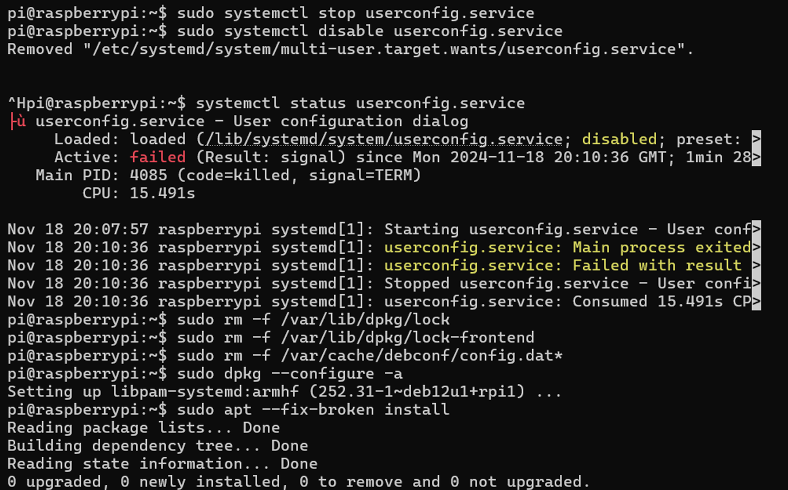

      5. **Retry the Update and Upgrade**
         - After addressing the dependency issues, rerunning the update and upgrade process completes the system updates successfully:
         ```bash
         sudo apt update && sudo apt upgrade -y
         ```

---

### 4. Manual Wi-Fi Configuration

   If configuring Wi-Fi using `sudo raspi-config` fails, follow these manual steps:

   1. **Edit the Wi-Fi Configuration File**:
   ```bash
   sudo nano /etc/wpa_supplicant/wpa_supplicant.conf
   ```
   Add the following:
   ```text
   country=AU
   ctrl_interface=DIR=/var/run/wpa_supplicant GROUP=netdev
   update_config=1
   network={
         ssid="Your-WiFi-Name"
         psk="Your-WiFi-Password"
   }
   ```
      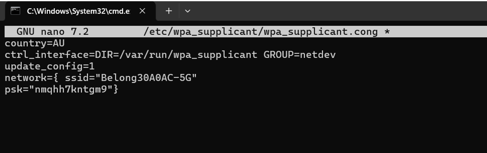


   2. **Fix and Start Networking Services**:
   ```bash
   sudo apt install dhcpcd5 -y
   sudo systemctl enable dhcpcd
   sudo systemctl start dhcpcd
   ```

   3. **Verify Connectivity**:
   ```bash
   ping google.com
   ```
      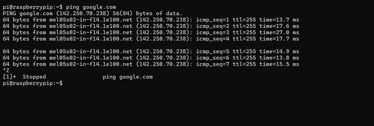

---

### 5. **Installing Pi-hole**

   1. **Install Pi-hole**
   - Use the official Pi-hole installation script to download and set up the software. This script automates the installation process and configures Pi-hole on the system:
   ```bash
   curl -sSL https://install.pi-hole.net | bash
   ```

   2. **Follow Installation Prompts**
   - During the installation, provide the following inputs as prompted:
   - **Network Interface**: Select `eth0` (Ethernet) as the network interface for Pi-hole.
   - **Static IP Address**: Assign a static IP address to the device (e.g., `10.0.2.15`). This ensures the Pi-hole server maintains a consistent IP for DNS operations.
   - **Upstream DNS Provider**: Choose a DNS provider such as Google DNS or Cloudflare for forwarding DNS queries.
   - **Web Interface**: Enable the web interface to manage and monitor Pi-hole through a browser. This interface simplifies configuration and provides real-time query logs.

---

   ### **Troubleshooting Pi-hole Web Interface Issues**

      1. **Verify and Restart Services**
      - Open the **lighttpd** configuration file:
      ```bash
      sudo nano /etc/lighttpd/lighttpd.conf
      ```
      - Check for the following lines in the file. Add them if missing:
      ```plaintext
      server.document-root = "/var/www/html"
      server.error-handler-404    = "/pihole/index.php"
      server.bind = "0.0.0.0"
      ```
      - Check the status of the **lighttpd** web server:
      ```bash
      sudo systemctl status lighttpd
      ```
      - Restart the **lighttpd** service:
      ```bash
      sudo systemctl restart lighttpd
      ```

      2. Fix Permissions
      - Ensure the Pi-hole web directory has the correct permissions:
      ```bash
      sudo chown -R www-data:www-data /var/www/html
      sudo chmod -R 755 /var/www/html
      ```
   
      3. Reconfigure Pi-hole
      - Use the Pi-hole repair tool to fix configuration issues:
      ```bash
      pihole -r
      ```
      - Select either **"Repair"** or **"Reconfigure"** as needed.
         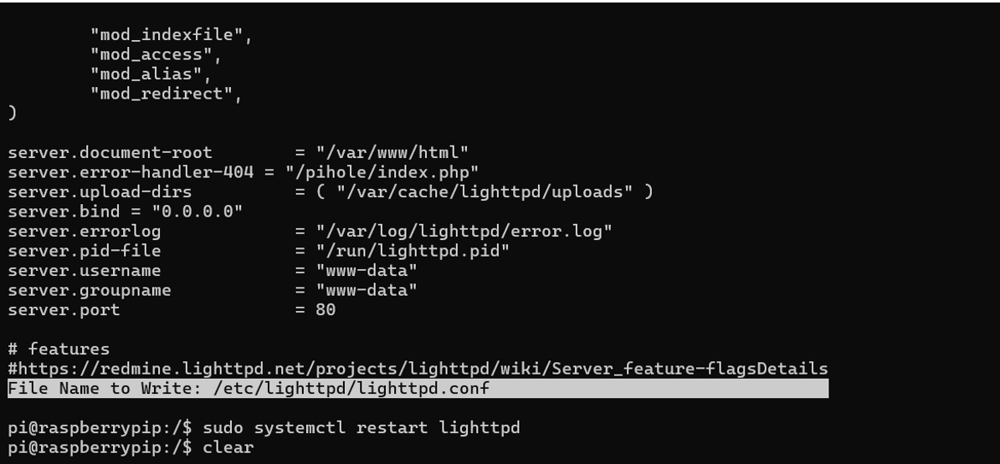

---

### 6. Configuring Devices for Pi-hole 

### 1. **On Your Laptop (Windows)**
   - **Overview**: Configure your laptop to use the Pi-hole server as its DNS resolver.

#### **Find the Pi-hole Server IP Address**:
   - On the Raspberry Pi command prompt (already opened), type the following command:
   ```bash
   ifconfig
   ```
   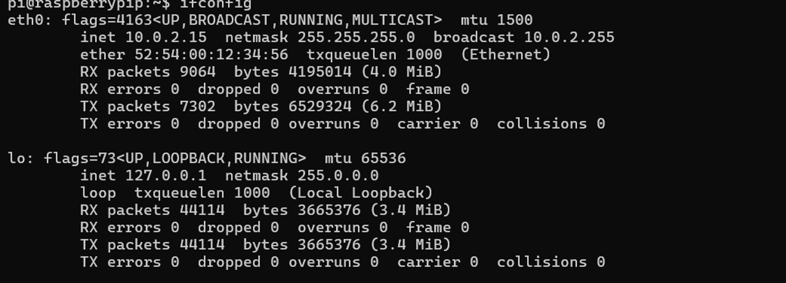

- Look for the IP address associated with your network interface, such as `eth0` or `wlan0`. For example, the IP address might be `10.0.2.15`.

---

#### **Steps to Configure DNS on Windows**:
   1. Open `Settings > Network & Internet > Properties`.
   2. Navigate to `DNS Server Assignment`.
   3. Select "Manual" and input the following DNS addresses:
      - **Primary DNS**: The IP address of the Pi-hole server, e.g., `10.0.2.15`.
      - **Secondary DNS**: A fallback DNS, e.g., `8.8.8.8` (Google DNS).
   4. Save the settings and restart the network adapter to apply the changes.
      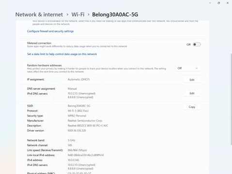

### 2. **On Your Android Phone**
   - **Overview**: Configure your phone's Wi-Fi settings to route DNS queries through the Pi-hole server.

#### **Find the Host System's IP Address**:
   - On your Windows host system (not the Raspberry Pi), open Command Prompt.
   - Type the following command:
   ```bash
   ipconfig
   ```
      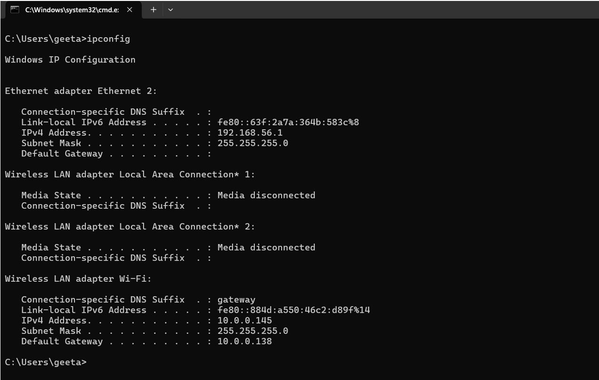
   - Look for the IPv4 Address under the active network connection. For example, the IP address might be `10.0.0.145`.

---

#### **Steps to Configure DNS on Android**:
   1. Go to `Wi-Fi Settings` and select the connected network.
   2. Tap `Modify Network` and set the IP configuration to **Static**.
   3. Enter the DNS addresses:
      - **DNS 1**: The Pi-hole server's IP address, e.g., `10.0.0.145`.
      - **DNS 2**: A fallback DNS, e.g., `8.8.8.8`.
   4. Save the changes.

      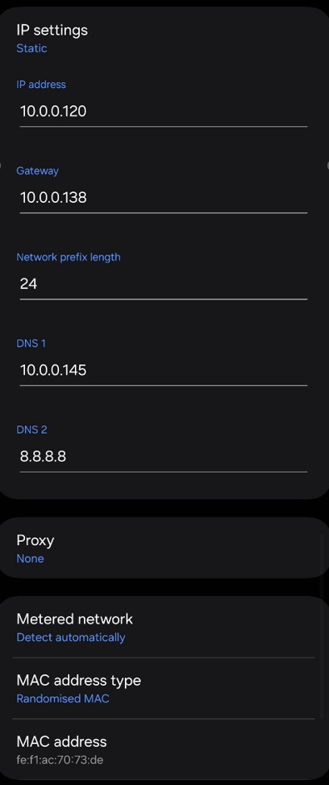
---

### 3. **Access the Pi-hole Admin Interface**: 
  - Use a web browser to access the Pi-hole dashboard for monitoring and configuration: 
    - From your laptop: Navigate to `http://10.0.2.15/admin`. 
    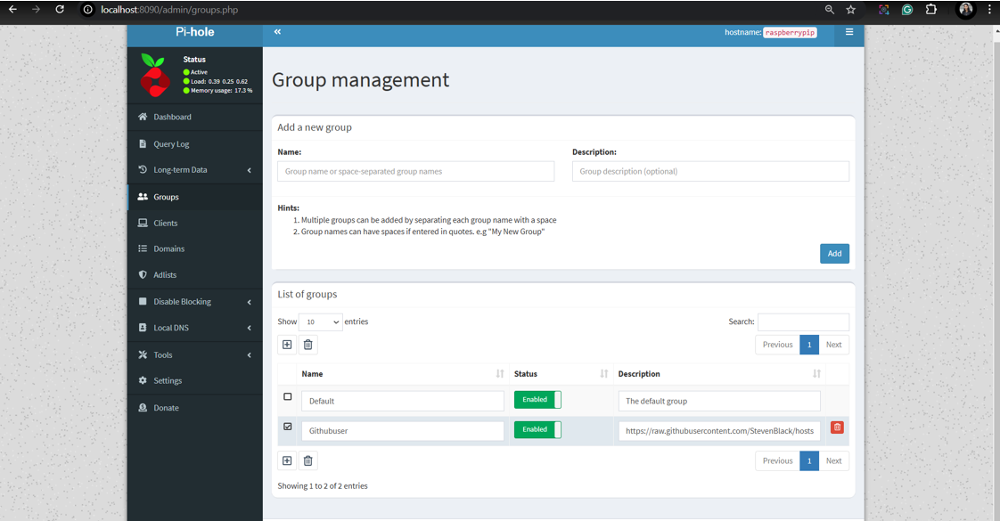
---
    - From your phone: Navigate to `http://10.0.0.145:8090/admin`. 

      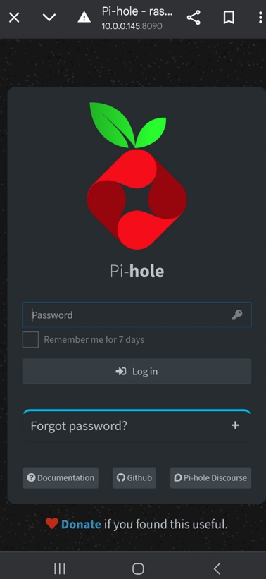

  - The dashboard provides tools to view real-time DNS queries, blocklists, and system status.
---

### 7. **Test Ad-blocking on Websites**
- Open ad-heavy websites such as `cnn.com` or `forbes.com` on any connected device to evaluate Pi-hole’s performance.
- Navigate to the Pi-hole admin interface and check the query logs for blocked domains. This confirms that Pi-hole is successfully filtering ads and processing DNS requests.


### 1. **Verify DNS Resolution**
- Test if Pi-hole is correctly resolving DNS queries by using the following commands:
  ```bash
  dig google.com @127.0.0.1
  ```
  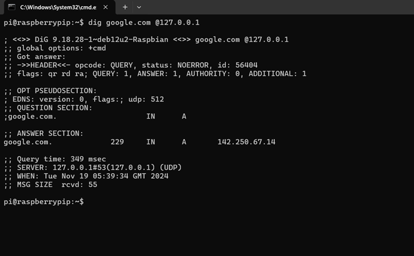

  ```bash
  nslookup google.com 127.0.0.1
  ```
  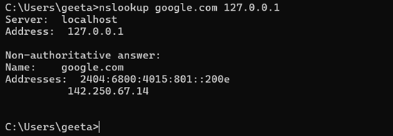

- These commands query the local Pi-hole server (`127.0.0.1`) to ensure DNS requests are being processed.

---

## Additional Resources

- **Video Guidance**: [Click here to watch the video tutorial](https://deakin365-my.sharepoint.com/:v:/g/personal/s224026576_deakin_edu_au/EXLeMkTgWadEsEoI9_HIfrMBf5Ry8cXisQfbp0W4pa_5_g?nav=eyJyZWZlcnJhbEluZm8iOnsicmVmZXJyYWxBcHAiOiJPbmVEcml2ZUZvckJ1c2luZXNzIiwicmVmZXJyYWxBcHBQbGF0Zm9ybSI6IldlYiIsInJlZmVycmFsTW9kZSI6InZpZXciLCJyZWZlcnJhbFZpZXciOiJNeUZpbGVzTGlua0NvcHkifX0&e=epK7Qg).

- **Full Step-by-Step Document**: [Click here to view the detailed document](https://deakin365-my.sharepoint.com/:b:/g/personal/s224026576_deakin_edu_au/EVueHVfUHXxJuRYIWCCuhTkBKFxsIattDq7zI2t4GenuRw?e=Ri2CIe).

---

## Conclusion

By following these steps, a comprehensive and reliable setup for the QEMU Raspberry Pi simulation with Pi-hole can be achieved. This process addresses common challenges such as disk space limitations, dependency errors, and network configuration issues, ensuring a seamless installation and operation. With Pi-hole successfully configured, users can enhance their network security and enjoy robust ad-blocking across multiple devices, creating a more efficient and secure browsing experience.

---

## References

1. Raspberry Pi Foundation (2024). *Pi-hole and DNS Security Setup Documentation*. Available at: [https://www.raspberrypi.org/documentation/](https://www.raspberrypi.org/documentation/) (Accessed: 24 November 2024).
2. QEMU Team (2024). *QEMU Documentation*. Available at: [https://www.qemu.org/docs/](https://www.qemu.org/docs/) (Accessed: 24 November 2024).
3. CyberSec Research Lab (2024). *Enhancing Network Security through DNS*. Available at: [https://cyberseclab.org/dns-security](https://cyberseclab.org/dns-security) (Accessed: 24 November 2024).
4. Tech with Tim (2024). *QEMU Raspberry Pi Setup and Testing*. Available at: [https://youtu.be/cE21YjuaB6o?si=8vUHWSPezyhhIGxN](https://youtu.be/cE21YjuaB6o?si=8vUHWSPezyhhIGxN) (Accessed: 24 November 2024).
5. Firebog (2024). *Blocklists for Pi-hole*. Available at: [https://firebog.net/](https://firebog.net/) (Accessed: 24 November 2024).
