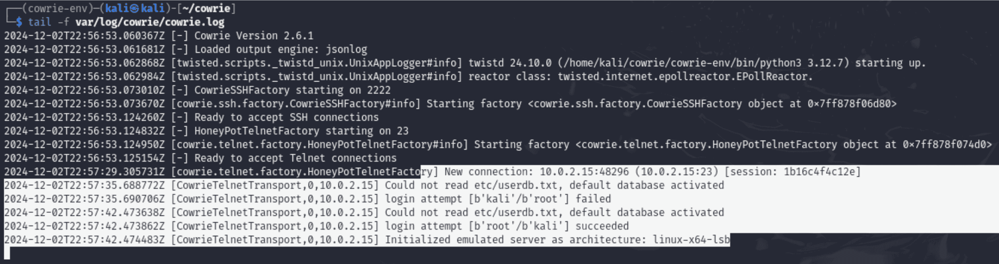

# Cowrie Honeypot Implementation Guide

:::important

By **Sarthak Sharma**, **s223923109**, **Redback Operations**

:::

---

## Introduction

The comprehensive instructions for establishing a Cowrie honeypot are provided in this document The honeypot offers a regulated setting for recording and examining harmful activity directed towards a server. The purpose of this article is to help aspiring workers set up and manage a Cowrie honeypot efficiently.

---

## Prerequisites

1. **Operating System:** Kali Linux (or any compatible Linux distribution)
2. **Software Requirements:**
    - Python 3
    - Git
    - Required Python packages
3. **Tools:** Hydra for brute force testing (optional)

---

## Step-by-Step Implementation

### Step 1: Install Dependencies

In this stage, the basic tools and libraries needed to install and run the Cowrie honeypot are set up. Let's dissect it:

#### Command Overview

```
“sudo apt install git python3 python3-venv python3-pip -y”
```
1. **sudo:** Installs system-wide packages by running the command with superuser (administrator) rights.
2. **apt install:** Installs software packages from the selected repositories using the Advanced Package Tool (APT).
3. **git:** A version control system that enables the cloning of repositories such as Cowrie from GitHub and other platforms.
4. **python3:** Installs Python 3, a popular programming language used in Cowrie.
5. **python3-venv:** Offers a utility for building separate Python environments. This guarantees that installed Cowrie dependencies won't conflict with Python packages that are used by the entire system.
6. **python3-pip:** Installs the Python package manager pip, which is used to install the dependencies and libraries needed by Cowrie.
7. **-y:** The installation process is non-interactive and responds "yes" to requests automatically.

#### Why These Dependencies are Important

**-** **Git:** Used to replicate the source code repository of Cowrie.
**-** **Python3:** The primary language used in Cowrie is required to operate the honeypot.
**-** **Virtual Environments (venv):** Vital for preventing conflicts with system Python libraries and isolating the Cowrie environment.
**-** **pip:** Permits the Python packages specified in the Cowrie requirements.txt file to be installed.

#### Practical Note

Before installing Cowrie, future students should always make sure these packages are current. Run:

```
“sudo apt update && sudo apt upgrade -y”
```
prior to installing the dependencies in order to prevent problems with outdated packages.

#### Outcome

The necessary tools for installing the Cowrie honeypot are available after the command runs successfully. When you see that the system says "Installing: 0" for packages that are already up to date, it means your system is prepared to proceed.

#### Reference Screenshot


---

### Step 2: Clone the Cowrie Repository

To get the most recent version of Cowrie's codebase straight from its official GitHub repository, you must clone the Cowrie repository. Cowrie's source code is hosted on GitHub, guaranteeing that the files obtained are current and genuine.

#### Command Overview

```
“git clone https://github.com/cowrie/cowrie.git"
```
- The repository is cloned (downloaded) from its URL using Git.
- All of the files, configuration templates, and code needed to install and operate the Cowrie honeypot are included in the repository.
- The process of cloning ensures that you have an identical copy of the Cowrie project's source code.

```
“cd cowrie”
```
- This command switches the current directory to the newly formed cowrie directory after the repository has been cloned.
- All further setup and configuration procedures will be carried out here.

#### Why is This Setup Important?

- You can be confident you are starting with a clean and trustworthy copy of the honeypot framework by cloning the repository.
- In addition to the honeypot software, the repository includes updates from the Cowrie development team, documentation, and sample configurations.
- When developers add new features, security patches, or enhancements, using the git tool makes it simple to update the code later on (for example, by using git pull).

#### Best Practice for Future Students

- To prevent modified or out-of-date code, always clone the repository from the official source.
- Before starting the installation, look for any changes or extra documentation in the repository.

#### Reference Screenshot


---

### Step 3: Create and Activate a Python Virtual Environment

The Cowrie honeypot's Python requirements are isolated using a Python virtual environment. This guarantees that there are no conflicts with other programmes on the system and that the Cowrie software operates with the precise library versions it needs. Cowrie won't be impacted by updates or modifications to system-wide Python packages while a virtual environment is used, and vice versa.

#### Command Overview

```
“python3 -m venv cowrie-env”
```

**1. python3:** Identifies the Python version being used, which in this case is Python 3.
**2. -m venv:** Generates a virtual environment by calling the venv module.
**3. Cowrie-env:** Gives the folder containing the virtual environment its name. This is where Cowrie's dependencies will be kept.

```
“source cowrie-env/bin/activate”
```
**-** The virtual environment is activated as a result.
**-** Any Python package installations that are activated will only be installed in this virtual
    environment and not on the entire system.

#### Output

The shell prompt will change to show that the virtual environment is active after executing these commands. For instance:


This indicates that cowrie-env is an active environment at the moment.

#### Importance for Cowrie:

Making use of a virtual environment guarantees:

- The environment in the Cowrie honeypot is stable and regulated.
- Version conflicts are less likely because dependencies are segregated.
- Cowrie is simple to update or remove without affecting the system.

#### Best Practices:

- Before installing packages or executing Cowrie commands, make sure the virtual
    environment is activated.
- For other Python applications, use virtual environments to preserve modularity and
    avoid dependency problems.

#### Reference Screenshot


---

### Step 4: Upgrade “pip” and Install Requirements

This step makes sure that all of Cowrie's required Python dependencies are set up in the
virtual environment, allowing the honeypot to function properly.

**1. Upgrade “pip”:**

    - To prevent incompatibilities and guarantee that the newest features and bug fixes are accessible, pip, the Python package installer, has been updated to the most recent version.
    - Command Used: “pip install --upgrade pip”.
    - It is advised to upgrade pip because newer versions frequently come with security fixes and other improvements.


**2. Install Required Packages:**

- All of the Python dependencies required for Cowrie's operation are listed in the requirements.txt file.
- All of the specified packages are installed after reading the file with the pip install -r requirements.txt command.
- This includes modules like twisted, pyasn1-modules, cryptography, and others that handle network operations, cryptographic operations, logging, and more.

**3. Verification of Installations:**

- All necessary packages have been downloaded and installed in the virtual environment, as seen in the screenshot.
- Checking the error message, upgrading the system, or manually installing the issue package are the best ways to fix any installation errors.


#### Why This Step is Important

- Makes certain that all of Cowrie's dependencies are current and system-compatible.
- Lays the foundation for the Cowrie honeypot to operate as planned without experiencing any malfunctions.
- Addresses dependency problems in advance, lowering the chance of errors occurring during runtime.

The foundation of Cowrie's software environment is this step, which guarantees a safe and dependable honeypot deployment for detecting and evaluating harmful activities.

---

### Step 5: Configure Cowrie

A crucial step in making sure the honeypot operates as planned and efficiently records interactions is configuring Cowrie. The steps, their significance, and other factors are broken down as follows:

**1. Copy the Default Configuration File**

**Command Used**

```
“cp etc/cowrie.cfg.dist etc/cowrie.cfg”
```

**Explanation:**

**- Why:** As a starting point, Cowrie offers a default configuration file (cowrie.cfg.dist). You can change the settings without changing the original by copying it to cowrie.cfg, which also ensures that you can return to the defaults if necessary.
**- What We Could Do Instead:** Make a configuration file by hand from the beginning. But this is prone to mistakes and is not advised for novices.


**2. Open the Configuration File**

**Command Used**

```
“nano etc/cowrie.cfg”
```
**Explanation:**

**- Why:** You can change Cowrie's settings by opening the file in a text editor like Nano. To customise the honeypot to meet particular requirements, like logging, network interfaces, and protocols, this step is required.


**3. Modify the Hostname**

Choosing a convincing fake hostname is essential for drawing in attackers because it gives the impression that your honeypot is a worthwhile and authentic target. The hostname need to resemble actual servers or systems that are frequently seen in cloud platforms, IT settings, or organisations. Here are a few instances:

**1. Generic Linux/Unix Hostnames:** ubuntu-server, debian-node, prod-web01, nginx-webserver, apache-server.
**2. Database Servers:** db-master, mysql-prod, mongo-cluster01, pgsql-backup, oracle-db.
**3. Corporate-Sounding Names:** corp-fileserver, internal-vpn01, crm-system, erp-production, finance-app.
**4. Cloud Service Hostnames:** aws-ec2-node, azure-vm-instance, gcp-storage-node, cloud-database01.
**5. Network Infrastructure:** cisco-router01, juniper-fw, vpn-gateway, dhcp-server.
**6. Miscellaneous High-Value Targets:** backup01, internal-mail, domain, controller, admin-console, devops-node.

**Key Considerations:**

**1. Relevance to Your Setup:** Select a hostname that complements your setup. For example, utilise cloud-related names if you're modelling a cloud architecture.
**2. Steer clear of real hostnames:** Don't use your company's actual hostnames to prevent misunderstandings or unintentional disclosure.
**3. Adapting to the Attacker's Point of View:** Make the name appealing to particular assailants. For instance, attackers searching for private financial information may be drawn to a hostname like finance-app.

**Current Configuration:**

```
“hostname = db-master”
```
**Explanation:**

**-** **Why:** The honeypot's identification is set by the hostname field. By changing it to something believable (like db-master), attackers will perceive the honeypot as a genuine server.
**- What We Could Do Instead:** Choose a hostname like web-server, api-node, or backup- node that accurately describes the intended environment.

**4. Define Logging and State Directories**

**Current Configuration:**

```
“log_path = var/log/cowrie”
“state_path = var/lib/cowrie”
```

**Explanation:**

**-** **Why:**
    **-** **log_path:** Indicates the location of the log storage. Logs are crucial for examining the actions of attackers.
    **- state_path:** Holds persistent information, including emulated filesystem updates and keys.

**- What We Could Do Instead:** In high-interaction scenarios, use alternate pathways (such external storage) to prevent the local disc from becoming full.


**5. Configure SSH endpoint**

**Current Configuration:**

```
“listen_endpoints = tcp:2222:interface=0.0.0.0”
```
**Explanation:**

**- Why:** Establishes the IP address and port for SSH connections. By changing the port (from 22 to 2232 by default), you can prevent problems with legitimate SSH services that are operating on the same computer.
**- What We Could Do Instead:** Attach Cowrie to a particular network interface (such as 192.168.1.100) to increase security and shield it from unauthorised networks.


**6. Enable Telnet Support:**

**Current Configuration:**

```
“enabled = true”
“listen_endpoints = tcp:23:interface=0.0.0.0”
```
**Explanation:**

**- Why:** By turning on Telnet, the honeypot can draw in attackers who are looking to compromise outdated protocols. Since port 23 is the default Telnet port, it is a popular target.
**- What We Could Do Instead:** If Telnet isn't required for your use case, disable it. This is especially important in contemporary settings where Telnet isn't often used.


#### Importance of Configuration

An appropriate setup guarantees:

**1. Realism:** Gives attackers the impression that the honeypot is real.
**2. Logging:** Gathers comprehensive interaction records for examination.
**3. Customisation:** Modifies the honeypot to fit particular attack scenarios or network conditions.

#### Alternative Considerations

**1. More Complex Logging:**
    - For centralised analysis, combine Cowrie with external log management solutions (like Splunk or ELK stack).

**2. Port Selection Is Dynamic:**
- Use non-standard ports (such as 22222 for SSH and 2323 for Telnet) to prevent interfering with legitimate services.

**3. Changes Specific to the Environment:**
- Adapt to the network (e.g., imitate a personal NAS in home settings or a finance database in business settings).

Future students will be able to create a honeypot that suits their unique requirements and keep a transparent audit record of attacker activity by setting up Cowrie as described above.

---

### Step 6: Generate SSH Keys

#### Command Overview

```
“ssh-keygen -t rsa -b 2048 -f cowrie_rsa_key”
“mv cowrie_rsa_key* etc/“
```
#### Explanation

**1. Purpose of the SSH Keys:** SSH keys are necessary to create safe, verified connections between clients and the honeypot. They serve as a way to confirm the legitimacy of the SSH service running in the honeypot.

**2. Command Breakdown:**

**-** **ssh-keygen:** The SSH key pair generation tool.
**-** **-t rsa:** Specifies the kind of key—RSA in this case—that should be generated.
**-** **-b 2048:** For increased security, set the key length to 2048 bits.
**-** **-f cowrie_rsa_key:** Identifies the public key (cowrie_rsa_key.pub) and private key (cowrie_rsa_key) file names.

**3. Why are SSH Important:**

- Cowrie simulates an SSH server using the generated keys. Unaware that the honeypot is a trap, attackers engage with it when they try to connect via SSH.
- By making sure the honeypot is set up correctly to resemble a genuine SSH server, this step improves the likelihood of successfully interacting with attackers.


**4. Moving Keys to “/etc” Directory:**

- The generated keys are moved to the etc/ directory inside the Cowrie installation folder by running mv cowrie_rsa_key* etc/.
**- Reason:** Cowrie's default location for configuration and important files is the etc/ directory. This guarantees Cowrie will have access to the keys while it is in use.

**5. Alternative Actons:**

- For improved performance or security, keys can be created using alternative algorithms, like ecdsa or ed25519, if necessary.
- If a company has a centralised key management system, it can also import old keys rather than creating new ones.


**Importance:**

By ensuring that Cowrie can replicate a working SSH service, this step increases the likelihood that attackers will find it credible. Cowrie's SSH service wouldn't be able to create secure connections without SSH keys, which would lessen its usefulness as a honeypot.

---

### Step 7: Start the Honeypot

In this stage, the Cowrie honeypot is started, which is the last step in making the honeypot come to life. The instructions and their meaning are explained in full below:

#### 1. Activating the Virtual Environment

**Command:**

```
“source cowrie-env/bin/activate”
```
**- Purpose:** The previously configured Python virtual environment (cowrie-env) is activated by this command.

**- Importance:**

    - Guarantees that the isolated environment is used to load all of Cowrie's Python dependencies.
    - Avoids conflicts with the system's globally installed Python packages.
    - Maintains the honeypot's environment tidy and controllable.


#### 2. Starting Cowrie

**Command:**

```
“bin/cowrie start”
```
**- Purpose:** The Cowrie honeypot is started by this command.

**- What Happens:**

    - Cowrie starts scanning the designated ports for SSH and Telnet connections.
    - Activities including connection attempts, login attempts, and commands executed are first recorded in logs.

**- Importance:**

    - At this stage, the honeypot is active and prepared to record the actions of attackers.
    - It fools attackers into interacting with it by imitating a weak system.


#### 3. Monitoring Logs

**Command:**

```
“tail -f var/log/cowrie/cowrie.log”
```
**- Purpose:** The Cowrie log file is continuously shown in real-time by this programme.

**- Importance:**

    - Gives quick updates on the activity in the honeypot.
    - Aids in locating attempted connections or actual intrusions.
    - Helpful for troubleshooting in the event that the honeypot doesn't start up correctly.


#### Key Considerations

**- Warnings of Cryptographic Deprecation:** You may notice warnings like those regarding TripleDES in the logs. These result from the phase-out of earlier encryption techniques. Although it's not necessary for the honeypot to work, you should maintain the stability and security of your Python dependencies.

**- Log management:**

    - Use archival or frequent log rotation because logs can get big over time.
    - Periodically examine logs to get knowledge about the tactics and patterns used by attackers.

#### Alternate Configurations

- To simulate various environments, you can set up Cowrie to listen on alternative ports rather than the default ones (2222 for SSH and 23 for Telnet).
- For more thorough investigation, more experienced users may combine the honeypot with additional logging programmes like Splunk or Elastic Stack.

By taking this step, you can be confident the honeypot is operating properly and gathering data. Always examine the logs right after starting the honeypot to make sure everything is operating as it should.

---

### Step 8: Verify Network Configuration

#### Why This Step is Essential:

**1. Identify IP Address:**

- To view comprehensive details on every network interface on the system, use the “ip addr” show command.
- This enables you to verify the IP address that your honeypot is currently connected to. You must make sure the honeypot connects to the appropriate interface for Cowrie (e.g., eth0 in the screenshot).

**2. Validate Open Ports:**

- To check if Cowrie is actively listening on the designated ports, the "nmap -p 2222, (honeypot-IP)” tool scans them (2222 for SSH and 23 for Telnet).
- Verification that is successful guarantees that the honeypot is set up to accept connections from possible intruders.

#### Detailed Explanation of the Screenshots

**1. Command:**

```
“ip addr show”
```
**- The output shows:**

    - Since it is internal, the loopback interface (lo) is irrelevant to the honeypot.
    - The network interface that is currently in use, eth0, has the IP address 10.0.2.15. This verifies that this IP address will be able to access the honeypot.
    - Docker's internal interface, docker0, is not connected to the honeypot setup and is currently inactive (state DOWN).


**2. Command:**

```
“nmap -p 2222 10.0.2.15”
```
- The honeypot is prepared to receive SSH connections as the scan verifies that port 2222 is open.
- If enabled in cowrie.cfg, same checks can be carried out for Telnet (port 23).


#### Potential Issues with Address

If the ports of choice are closed, make sure:

- Cowrie is operating well, if not do “bin/cowrie stop” and then start it again “bin/cowrie start”
- Ports 2222 and 23 are accessible from the outside thanks to firewall regulations. cowrie.cfg with the proper setup.

#### Alternative Methods

- To list the honeypot's open ports, use programmes like ss or netstat -tuln.
- To manually check connectivity, use telnet (honeypot-IP) port or ssh (honeypot-IP?) -p port.

This step is crucial for collecting malicious behaviour and avoiding erroneous assumptions about the honeypot's deployment status because it verifies that the honeypot is reachable and operating as intended.

---

### Step 9: Testing and Attacks Simulation

#### Purpose of Attack Simulation

The purpose of this part is to test the honeypot's operation and accuracy in capturing attack data. We verify that the honeypot:

- Records attempts at unauthorised access, including brute force attacks, by mimicking real-world attacks.
- Records information about the actions and behaviour of the attacker.
- Aids in the analysis of potential exploits for vulnerabilities by malevolent parties.

Through these testing, future staff members can learn about the honeypot's capabilities and see how well it can detect assault patterns.

#### Detailed Explanation of Hydra Testing for Honeypots:

This stage involves employing Hydra, a potent tool frequently used for credential-cracking, to simulate a brute-force attack in order to assess the Cowrie honeypot's operation. You may verify that the honeypot can record and capture malicious login attempts by running this test. Let's dissect the procedure to gain a better understanding:

**Purpose:**

**1. Verify Honeypot Functionality:** Using Hydra to test makes sure Cowrie is accurately recording login attempts—both successful and unsuccessful.
**2. Emulate Real-World Attacks:** This gives a realistic evaluation of the honeypot's capabilities by simulating a real-world brute-force attack scenario.
**3. Record and Examine Attacker Behaviour:** You can learn about attacker tactics, such as the credentials they attempt, by looking over the logs.

**Command Used:**

```
“hydra -l root -P passwords.txt ssh://honeypot-IP:2222”
```
**Explanation of Command Components:**

**1. hydra:** The brute force tool is being employed.
**2. -l root:** Gives the username to be targeted, which is "root" in this example.
**3. -P passwords.txt:** Offers a password wordlist for testing against the target. Commonly used or weak passwords are included in the wordlist.
**4. ssh://honeypot-IP:2222:** Identifies the honeypot's IP address and port (2222) as well as the target service (ssh).


**Observed Results:**

**1. Successful Attempt:** The passwords that successfully authenticated with the honeypot's SSH service are listed in the command output. The honeypot in this test does not actually provide access to an underlying system, but rather "accepts" passwords as part of the emulation.
**2. Captured Logs:** Every login attempt is recorded by the honeypot, including:
    **-** Passwords and usernames were attempted.
    **-** The connection's origin.
    **-** If the endeavour was successful or not.
**3. Session Details:** Every session is captured, including the duration of the connection and any commands run after logging in.


**Significance for Future Students:**

**1. Learning Attack Patterns:** The test aids cybersecurity teams in researching the frequency of attempts and the password lists used by brute-force attackers.
**2. Improving Defence Mechanisms:** Organisational security policies, including password complexity guidelines and SSH access limitations, can be improved by having a better understanding of popular passwords and attacker tactics.
**3. Creating Reports:** This stage emphasises how crucial it is to keep thorough logs for forensic examination.

**Importance of Reviewing Logs:**

- Logs reveal information about what the fictitious attacker did.
- They make it possible to spot trends that can be utilised to enhance security procedures or the honeypot's setup.
- The logs used in this test are located in Cowrie's log directory (var/log/cowrie, for example).

**Common Pitfalls to Avoid:**

**1. Using Week Passwords List:** Make sure the wordlist includes examples of actual attacks. Steer clear of irrelevant or overly simple passwords.
**2. Incorrect Configuration:** Make sure Cowrie is operating on the IP and port specified in its configuration file.
**3. Not Reviewing Logs:** The honeypot's capacity to offer thorough record keeping is its main advantage. Always examine these logs to glean valuable information.

This stage illustrates the deployment, testing, and analysis phases of a full cycle. To guarantee functionality and use it for incident response training, future staff members can duplicate this procedure when setting up their own honeypot.

#### Detailed Explanation of Telnet Brute Force Attempt for Honeypots:

**Command Used:**

```
“telnet 10.0.2.15 23”
```
**Explanation:**

- Because it isn't encrypted, attackers frequently target the Telnet protocol. In this test, we try to brute force login information on the Telnet service that the honeypot has made available.
- The honeypot's ability to record login attempts and identify unauthorised access attempts is tested by performing many login attempts using different credentials (e.g., login: root, login: kali).

**Objective:**

- Evaluate the Telnet service by simulating actual brute force assaults.
- Make sure that every login attempt—both successful and unsuccessful—is recorded by the honeypot.


**Outcome:**

- All login attempts, both unsuccessful ones and a successful login with the root account, were successfully captured by the honeypot. Important information is provided by the logs, such as the attacker's source IP, timestamp, and access credentials.
- Log evidence and a screenshot:
    **- Screenshot:** Telnet connection attempts and related login attempts.
    **- Logs:** The Cowrie log file contains session records that document authentication problems and eventual success.



#### Detailed Explanation of Unauthorized Command Execution for Honeypots:

**Command Used:**

```
“sudo nmap -p 2222 10.0.2.15”
```
**Explanation:**

- Reconnaissance is a common technique used by attackers to find open ports and services on a target system. Here, we use the nmap programme to scan the SSH port of the honeypot in order to mimic this behaviour.
- Furthermore, actions like executing nmap within the session were carried out after getting access to the honeypot.

**Objective:**

- Examine how the honeypot responds to unauthorised commands and port scanning.
- Keep thorough records of all harmful commands that are run throughout a session.


**Outcome:**

- The honeypot recorded unauthorised command executions (such as nmap) and recorded port scanning attempts.
- By letting the attacker run commands while recording every action in its logs, the honeypot imitated a weak system.


**Importance:**

- Aids in the analysis of how attackers use systems and carry out reconnaissance.
- Confirms that the honeypot successfully records illegal command executions for examination.

#### Summary of Attack Simulations

By means of these simulated assaults, the honeypot:

1. All attack attempts, including brute force and unauthorised command execution, were accurately recorded.
2. Supplied thorough logs for examination, which are essential for comprehending the tactics used by attackers.
3. Confirmed that it works as a trustworthy tool for keeping an eye on and documenting malicious activity.

These tests not only illustrate how effective the honeypot is, but they also inform future workers how to undertake comparable assault simulations to assess honeypot performance, making them a useful learning tool.

---

### Step 10: Log Management

**Why This Step is Important:**

An essential component of honeypot maintenance is log management. By safely backing up and archiving logs:

**1. Security:** Prevents unauthorised access or unintentional destruction of private logs.
**2. Analysis:** Saves assault information for forensic examination in the future.
**3. Compliance:** Assists businesses in following cybersecurity regulations that call for data retention.

**1. Archiving Logs**

**Command Used:**

```
“tar -cvzf cowrie_logs_$(date +%Y%m%d).tar.gz var/log/cowrie”
```
**- Purpose:** Identifies the log directory (var/log/cowrie) with the current date and creates a
    compressed archive of it.
**- Command Breakdown:**
    **- tar:** An application for making and retrieving archives.
    **- -cvzf:** Sets the output file name (f), verbose (v), gzip compression (z), and creation (c) options.
    **- cowrie_logs_$(date +%Y%m%d).tar.gz:88 The archive is dynamically named according to the date using cowrie_logs_$(date +%Y%m%d).tar.gz (e.g., cowrie_logs_20241205.tar.gz).
    **- var/log/cowrie:** The directory to be archived is specified by var/log/cowrie.
- As a result, logs with the required structure were successfully archived.


**2. Verifying the Archive**

**Command Used:**

```
“ls -lh cowrie_logs_20241205.tar.gz”
```
**- Purpose:** Lists the created archive's metadata to verify its size and existence.
**- Command Breakdown:**
    **- ls:** Lists folders and files.
    **- -lh:** Verifies permissions and displays the file size in a readable fashion.
**- Verification:**
- The output attests to the existence of the 21 KB cowrie_logs_20241205.tar.gz archive.
- The permissions (rw-rw-r--) show that the owner and group can read the file.


**3. Inspecting Archive Contents**

**Command Used:**

```
“tar -tvf cowrie_logs_20241205.tar.gz”
```
**- Purpose:** Enumerates the archive's contents to confirm that all of the requested files were present.
**- Command Breakdown:**
    **- tar:** For managing archives.
    **- -tvf:** Options to specify the archive file (f), display the contents of the archive (t), and use verbose mode (v).
**- Verification:**
    - Verifies that the archive includes:
       **- var/log/cowrie/cowrie.log:** Main activity log.
       **- Gitignore:** Version control-related file
       **- cowrie.json:** Structured data log in JSON format.


**4. Quick Content Verification**

**Command Used:**

```
“tar -tf cowrie_logs_20241205.tar.gz”
```
**- Purpose:** A concise list of the contents of the archive for easy verification.
**- Command Breakdown:**
    **- tar -tf:** solely shows the archive's filenames.
**- Verification:**
    - Makes sure that the output is free of unnecessary information and contains all expected files (cowrie.log,.gitignore, and cowrie.json).


**Future Best Practices for Log Management:**

**1. Automate Archiving**

    - To plan routine log backups, use a cron task.
    - For example: 0 0 * * * tar -cvzf cowrie_logs_$(date +\%Y\%m\%d).tar.gz var/log/cowrie.

**2. Offsite Backups**

    - Move the archives to a safe, offsite place for storage (such as a dedicated server or cloud storage).

**3. Retention Policies**

    - Establish a retention period for archived logs in order to efficiently manage storage and adhere to legal requirements.

**4. Log Rotation**

    - To keep logs from growing endlessly and preserve system performance, use log rotation (logrotate).

Future students can handle Cowrie honeypot logs with confidence while maintaining data security and compliance by following this procedure.

## Maintenance and Updates

**Purpose of Maintenance and Updates**

Frequent upkeep guarantees the honeypot's efficient operation, security, and compliance with operating specifications. This entails maintaining logs, making sure resources are available, and updating the honeypot software.

#### 1. Regular Updates

**Importance of Regular Updates**

**1. Security Patches:** Updates the honeypot to the most recent version, protecting it from vu;nerabilities.
    from vulnerabilities.
**2. New Features:** Improves honeypot efficacy by incorporating new features and enhancements.
**3. Dependency management:** ensuring that all necessary modules and libraries are current and work with the most recent version of the honeypot.

**Steps to Update Cowrie:**

**1. Pull Latest Changes**

**- Command:** "git pull."
**- Purpose:** The most recent code is retrieved from the Cowrie repository for this purpose.
**- How It Operates:** brings the most recent modifications from the remote repository to your local repository.
**- Significance:** Guarantees that you have the most recent security patches, bug fixes, and features.

**2. Install Updated Dependencies**

**- Command:** “pip install -r requirements.txt”
**- Purpose:** The goal is to install or update the Python libraries that Cowrie needs.
**- The Significance of This Step:**
    - Dependency compatibility guarantees that Cowrie functions as intended.
    - Avoids runtime faults brought on by out-of-date or absent libraries.

**Extra Advice:**

- To prevent influencing system-wide dependencies, always activate the Python virtual environment (source cowrie-env/bin/activate) before executing these commands.
- After updates, make sure the honeypot is stable before sending it to production by testing it in a staging environment.

#### 1. Key Takeaways

**1. Consistency in Updates:**
    - To guarantee the honeypot is safe and operational, plan frequent updates (such as monthly or quarterly).
    - To keep track of update change logs, use a version control system such as Git.
**2. Automate Maintenance:**
    - To automate processes such as checking for updates, use cron jobs.
    - Rotating and archiving logs.
    - Delivering notifications when disc space is depleted.
**3. Documentation:**
    - Maintain thorough records of archived logs and update schedules.
    - For future reference, note any modifications performed during cleanup or upgrades.
**4. Testing Following Updates:**
    - To ensure functionality following updates, test the honeypot in a non-production setting at all times.
    - To make certain logs are being gathered accurately, simulate attacks.

This methodical technique guarantees that the honeypot is kept up to date, dependable, and offers useful insights while preserving resources.

---

## Conclusion

This manual offers a thorough, step-by-step procedure for setting up and evaluating a Cowrie honeypot. The screenshots and logs that are linked show real-world uses. These procedures can be repeated by future staff members to successfully set up and maintain secure honeypots.