# Setup guide for Elasticsearch, Kibana and Filebeat (in ubuntu for localhost) 

# Installing elastic search:
1.	Start ubuntu vm
2.	Go this this link here: https://www.elastic.co/guide/en/elasticsearch/reference/8.16/deb.html#deb-repo
3.	Then run these commands:
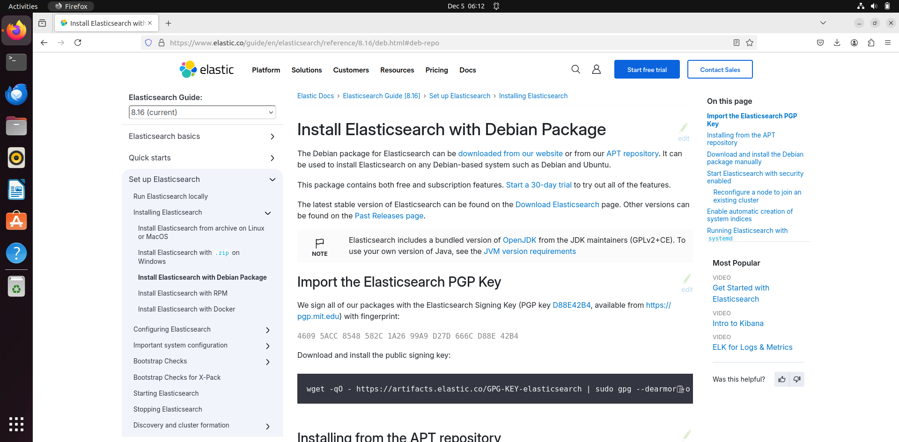
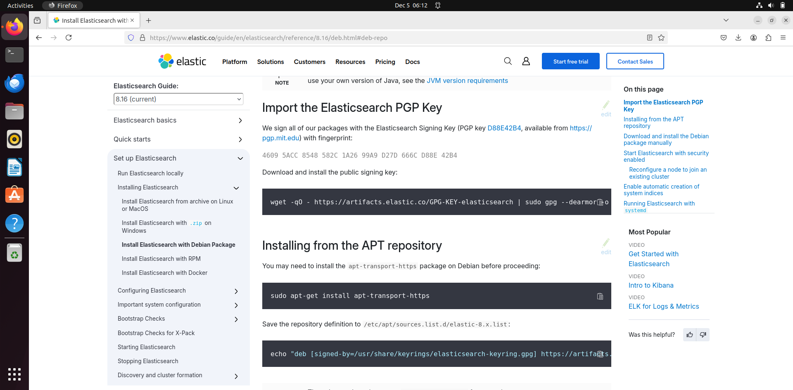
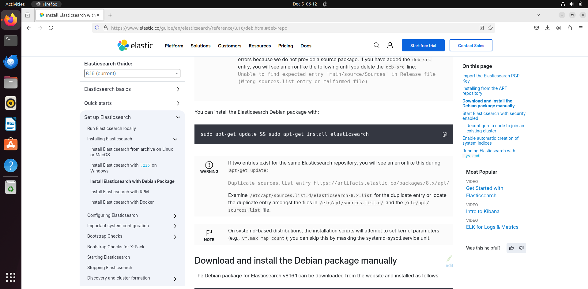
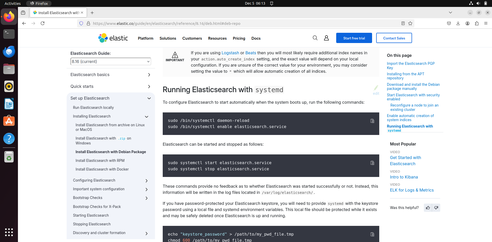
 
The commands to run in terminal:

1.	“wget -qO - https://artifacts.elastic.co/GPG-KEY-elasticsearch | sudo gpg --dearmor -o /usr/share/keyrings/elasticsearch-keyring.gpg “
2.	sudo apt-get install apt-transport-https
3.	echo "deb [signed-by=/usr/share/keyrings/elasticsearch-keyring.gpg] https://artifacts.elastic.co/packages/8.x/apt stable main" | sudo tee /etc/apt/sources.list.d/elastic-8.x.list
4.	sudo apt-get update && sudo apt-get install elasticsearch

these commands will install Elasticsearch in the vm.

To start elasticsearch, use these:
these will enable elasticsearch services:

sudo /bin/systemctl daemon-reload
sudo /bin/systemctl enable elasticsearch.service

these commands is used to start and stop elastic services:

sudo systemctl start elasticsearch.service
sudo systemctl stop elasticsearch.service

now go to your terminal, go elasticsearch directory using this:
              cd /etc/elasticsearch
in this directory, you will find a file called elasticsearch.yml. we need to configure it before running it.

Most of the configuration that exist is fine. But need to change some security features. 
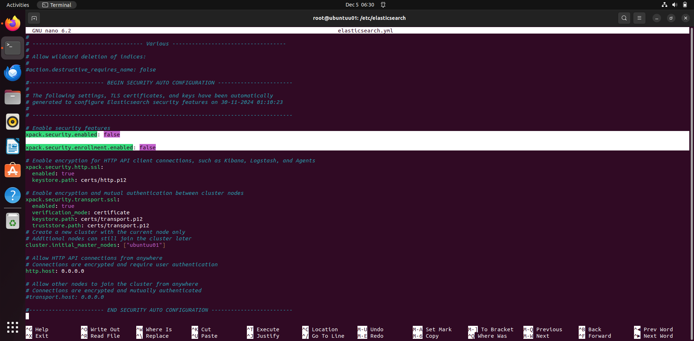
 
xpack.security.enabled: false
xpack.security.enrollment.enabled: false

set these two features to false. After it you can save it and quit.

### Note: disabling security is only when you run in your localhost and not with redback server. When installing in redback server, make sure to enable all security and have password for your accounts. Please include the ssl certificates as well. The link provided above for the installation will guide you with that process. Ill pin a video below as well which walks you through setting it with the required security measures.

Once the configuration is finished, go to browser and enter:
 http://Localhost:9200
 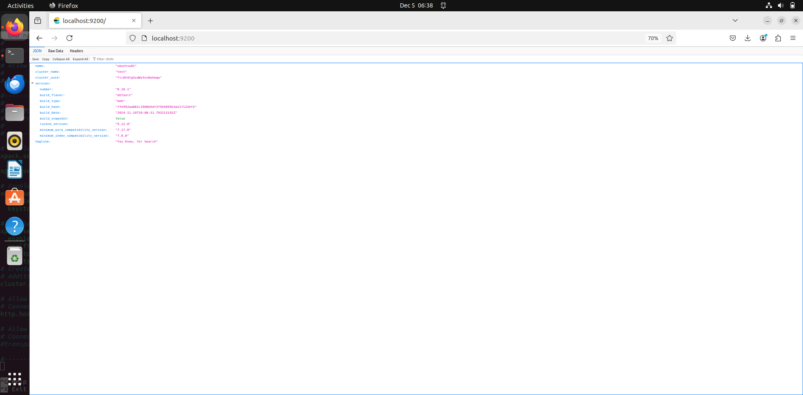
 

This should show you the elastic interface. Elastic itself doesn’t have an interface, that’s where we use Kibana, which is integrated with elastic for visualization.

# Installing Kibana:

1.	go to your browser and use this link: https://www.elastic.co/guide/en/kibana/current/deb.html
2.	now we have already installed the pre – requisites like elastic pgp key, transport https and keys that’s required. So, skip to this part:
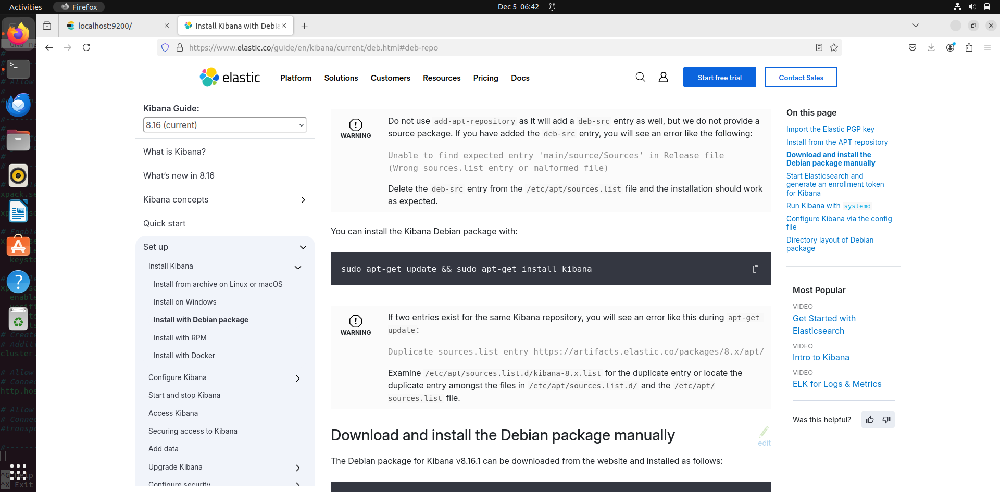
 

Run this command to install kibana:
sudo apt-get update && sudo apt-get install Kibana

after installing kibana, to enable it and start and stop, use these commands:
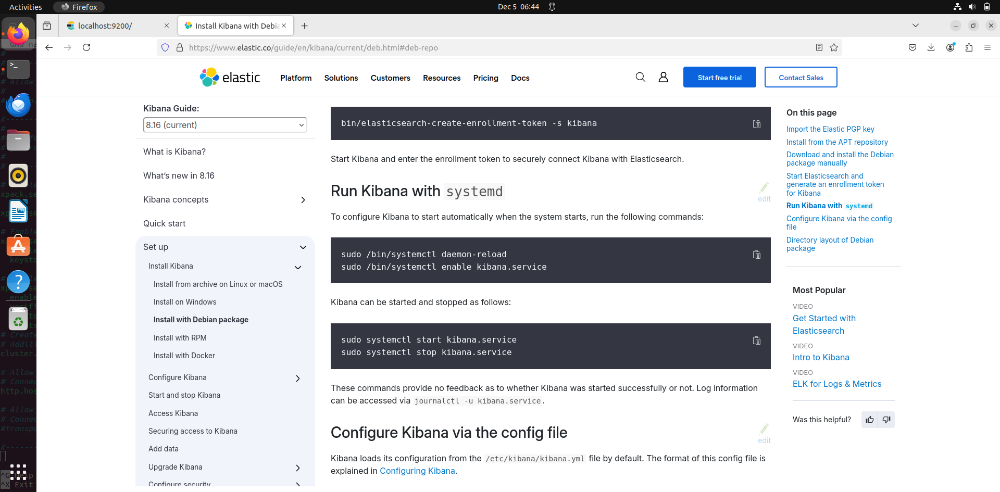
 
sudo /bin/systemctl daemon-reload
sudo /bin/systemctl enable kibana.service

sudo systemctl start kibana.service
sudo systemctl stop kibana.service

kibana’s configuration is fine as is. Incase if you need to access the directory and configure something, use this command:
cd /etc/kibana

3.	now go to your browser and enter the url:
localhost:5601
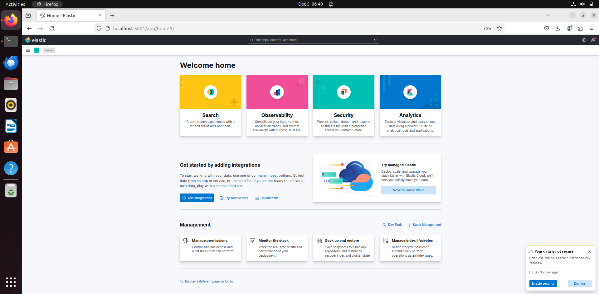
 

The setup should take a while to load in the browser. Wait for it and choose to explore on your option and that should load this interface in your browser.

# Filebeat installation:
1.	use the command:
**apt-get install filebeat**
this should install filebeat in the system.

# Filebeat configuration:
1.	go to filebeat directory using:
**cd /etc/filebeat**
you will find filebeat.yml. to edit it use
 **nano filebeat.yml**
 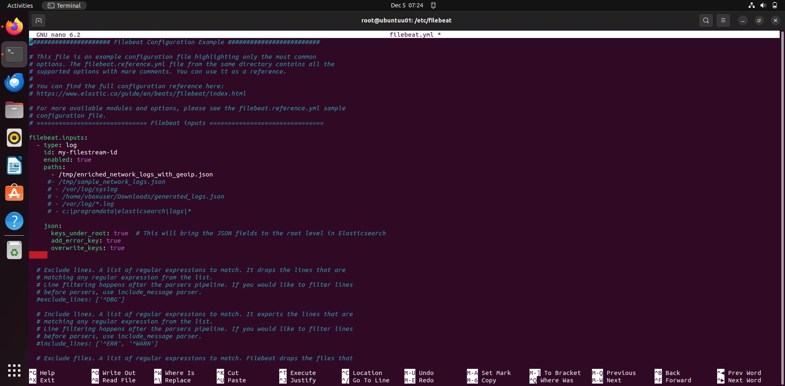

First configure filebeat.input. this is where the you can set paths to read logs. 
Section Explanation

1.	**filebeat.inputs:**
•	Defines the list of inputs that Filebeat will monitor to collect data. In this case, the input type is log.
2.	**type: log**
•	Specifies the input type as log. This means Filebeat will monitor log files for new entries.
3.	**id: my-filestream-id**
•	Assigns a unique ID to the input configuration. This can help manage and debug multiple inputs.
4.	**enabled: true**
•	Indicates that this input configuration is active.
5.	**paths:**
•	Lists the file paths to monitor.
•	**Example: - /tmp/enriched_network_logs_with_geoip.json is an active path, while others are commented out (e.g., - /tmp/sample_network_logs.json).**
•	Filebeat will monitor these files for new log entries and forward them for further processing.
6.	**json:**
•	Specifies settings for processing JSON-formatted log files.

 #JSON Configuration Options
1.	**keys_under_root: true**
- Brings the JSON fields directly into the root of the event in Elasticsearch
- For example, if the JSON log contains `{"field1": "value1", "field2": "value2"}`, these fields will appear at the root level instead of being nested under a JSON object
2.	**add_error_key: true**
•	Adds an error key to the event if there is an issue parsing the JSON.
•	Useful for debugging malformed logs or unexpected structures.
3.	**overwrite_keys: true**
•	Allows fields from the JSON logs to overwrite existing fields in the event.
•	For instance, if a JSON log contains a field timestamp that differs from Filebeat’s default timestamp, the JSON value will overwrite it.
### Note: I recommend using the file paths:
**- /var/log/*.log**                                  
**- c:\programdata\elasticsearch\logs\***
 ### (Reason: these paths read the logs in your system. Just uncomment the path or remove the hash Infront. The file path you see in the screenshot is a log file that I created so it exists only in my system. The 2 paths mentioned above are common in all systems)
 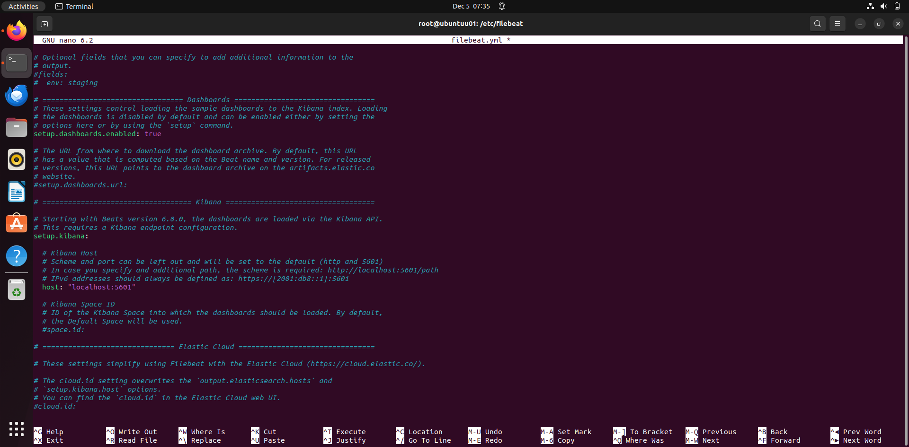

# Edit configuration:
Under dashboards: setup.dashboards.enabled: true
This will help in generating dashboards.
Under kibana : host: "localhost:5601"
This will connect filebeat with kibana.
 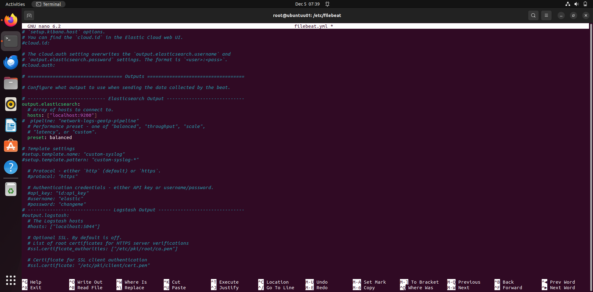
 
Under elasticsearch output:
hosts: ["localhost:9200"]
 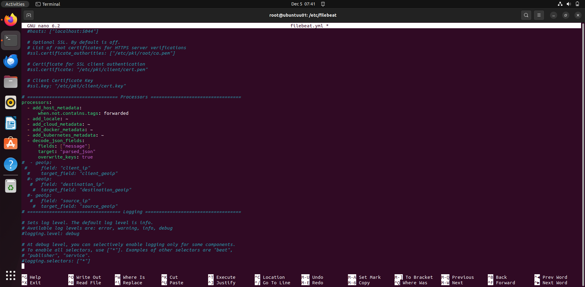

# Explanation of Each Processor
1.	**add_host_metadata:**
•	Adds metadata about the host where Filebeat is running, such as the hostname, IP addresses, and operating system details.
•	Condition:
•	Only applies when the log event does not have the tag forwarded.
•	This prevents redundant host metadata from being added to logs already tagged as forwarded (e.g., logs originating from other systems).
2.	**add_locale:**
•	Adds locale information (e.g., time zone and language settings) of the system running Filebeat.
•	indicates default behavior without any additional configuration.
3.  **add_cloud_metadata:**
•	Adds metadata about the cloud environment where Filebeat is running, such as cloud provider (AWS, Azure, GCP), instance ID, region, and machine type.
•	Useful for analyzing logs from cloud-based systems.
4.	**add_docker_metadata:**
•	Adds metadata for logs coming from Docker containers, such as container ID, image name, and labels.
•	Use Case:
•	Helps identify which container generated a particular log, especially in environments with multiple containers.
5.	**add_kubernetes_metadata:**
•	Adds Kubernetes-specific metadata to logs, including pod name, namespace, and labels.
•	Use Case:
•	Essential for logs in Kubernetes clusters to trace logs back to specific pods or namespaces.
6.	**decode_json_fields:**
•	Decodes JSON-formatted strings within specific fields into structured data.
•	**Parameters:**
•	**fields:** ["message"]: Specifies the field(s) to decode, in this case, the message field.
•	**target:** "parsed_json": The decoded JSON is stored in the parsed_json field.
•	**overwrite_keys:** true: If there are conflicts between decoded JSON keys and existing keys, the decoded values will overwrite the existing ones.
•	Use Case:
•	Useful for logs that embed JSON strings in fields like message. Decoding makes the data searchable and analysable in Elasticsearch.

The yml files configuration for elastic, Kibana and filebeat are done now.

## Kibana setup and configurations in browser:
1.	Go to kibana in browser: localhost:5601
2.	Click on the menu bar on top left and scroll down to management and go to stack management.
  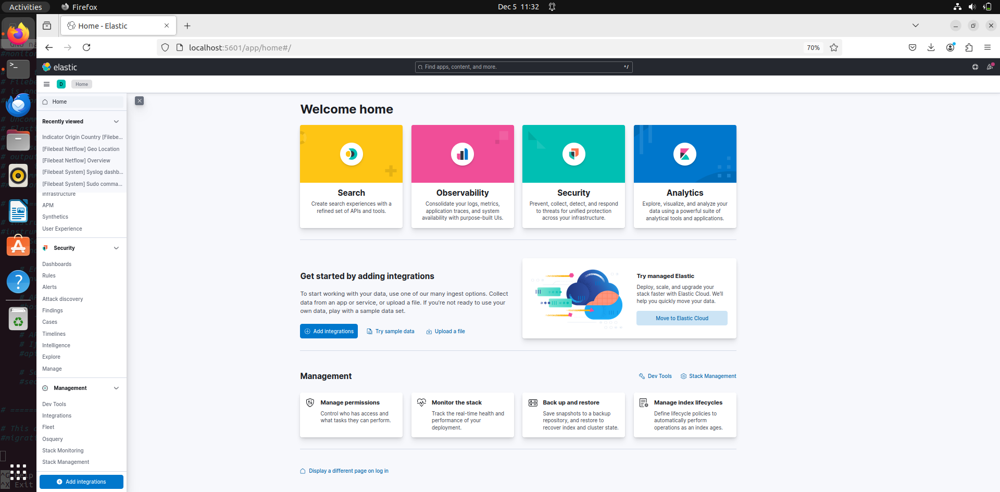

3.	In management go to index management. This is the place where you can mange your indexes
 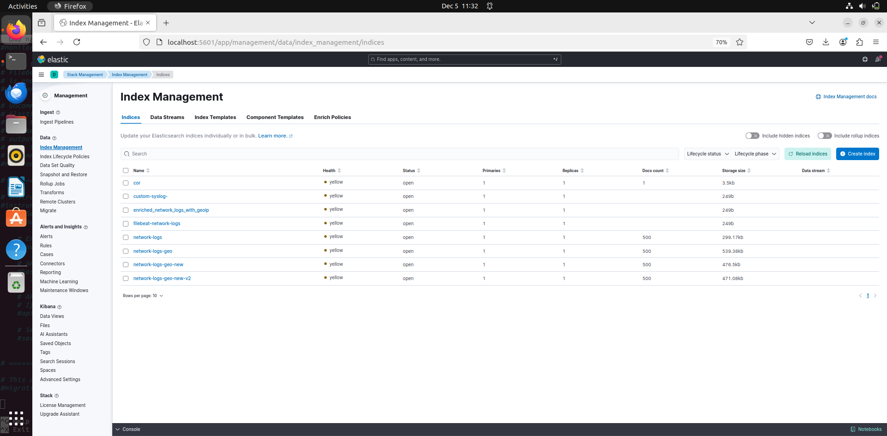

# What are indexes?

An index in Elasticsearch is a collection of documents that share similar characteristics. It acts as a logical namespace for storing and managing data.

# Key Features:
•	Structure: Data in an index is stored in JSON format, where each document has fields and values.

•	Organization: Think of it as a database table, but more flexible and schema-less by default.

•	Search: You can query an index to retrieve specific documents using Elasticsearch Query DSL.

**Use in Kibana:**
•	Kibana connects to Elasticsearch indexes to analyze and visualize the data stored in them.

•	For example, an index named network-logs might store network traffic logs.

**Examples of Indexes:**
•	filebeat-* (logs ingested by Filebeat)
•	logs-* (generic logs)
•	metrics-* (metrics data)

now go back to the main menu and go to analytics and then to discover:
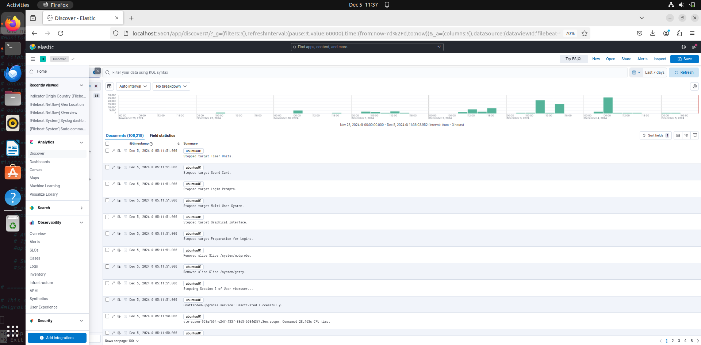

in this go to the top left and you find data view, click on it. By default since we installed filebeat there will be an index patter called filebeat-*. Click on it and you will see all the logs coming through filebeat.
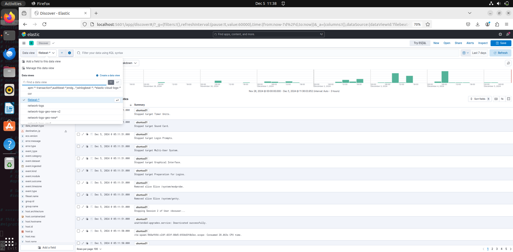
 
You can set option to view specific fields that are available. For example, now Ill choose host ip filed with will show the ip of host in the logs:
 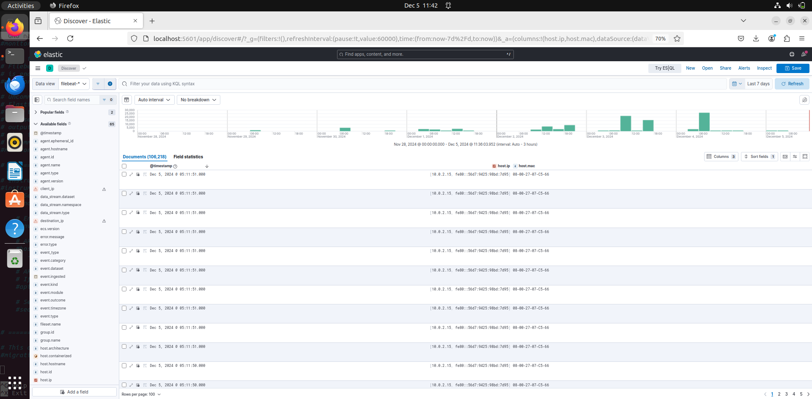

# Setting dashboards:
Go to the main menu and select dashboards. In search bar search for sudo. 
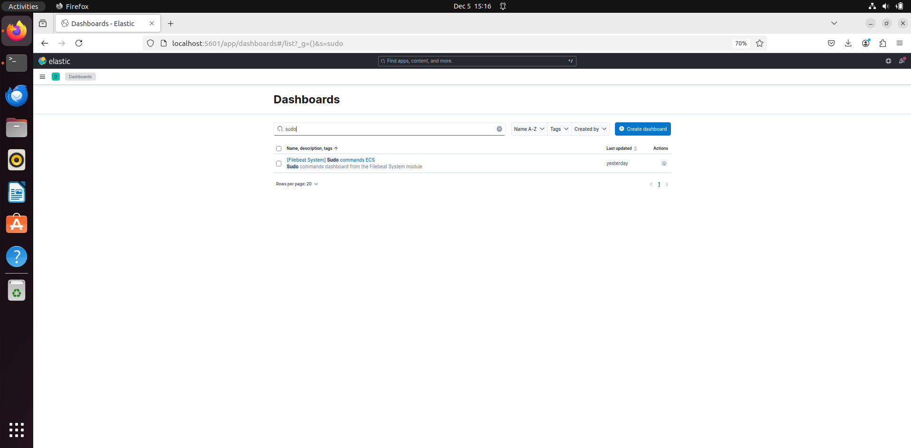

If you add that dashboard, you can see the Sudo commands that were run with the system. On the top right you can also see 3 others different dashboards, ssh login, new users and groups and syslogs. You can click on each dashboard and see the logs of it and the charts.
# Sudo:
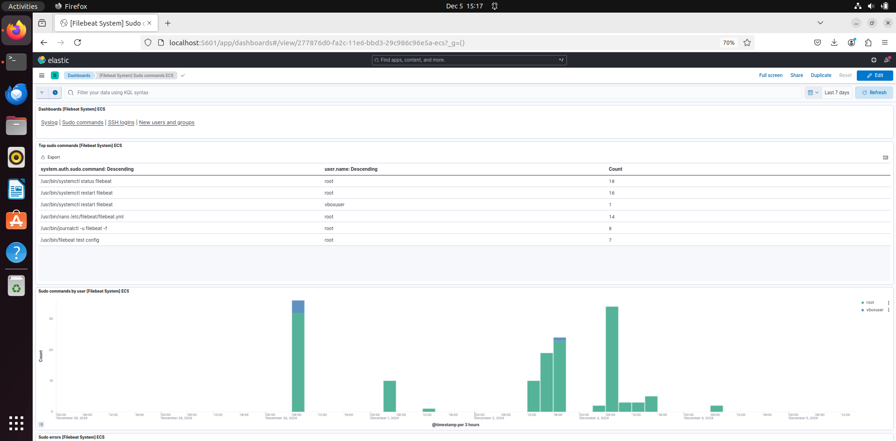
 
# Syslogs:
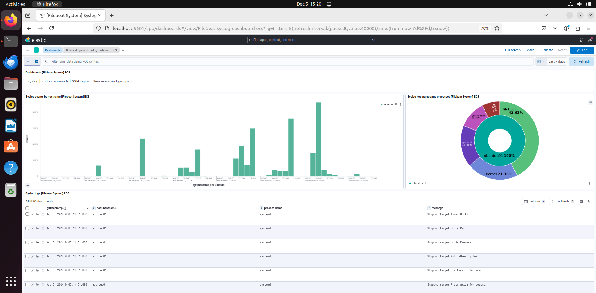
 
# New users and groups:
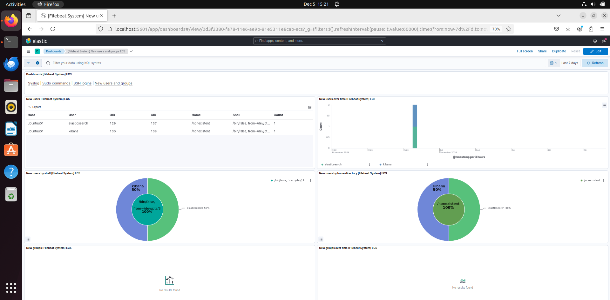
 
# Using geoip to locate the Ip address:
For visualizing the logs in kibana. We need geoip. Geoip is a location database which locates ip address with longitude and latitude. To do that ill put down a example python code. This will use the existing log file and convert it with geoip modules:

# Python Code Example

```python

import json
import geoip2.database

# File paths
log_file = "/tmp/generated_logs.json"  # Input raw logs
geoip_db = "/path/to/GeoLite2-City.mmdb"  # GeoIP database
output_file = "/tmp/processed_logs.json"  # Output enriched logs

# Load GeoIP database
geo_reader = geoip2.database.Reader(geoip_db)

# Function to fetch geographical data
def get_geo_data(ip):
    try:
        response = geo_reader.city(ip)
        return {
            "city": response.city.name,
            "country": response.country.name,
            "latitude": response.location.latitude,
            "longitude": response.location.longitude
        }
    except Exception as e:
        print(f"Error processing IP {ip}: {e}")
        return None

# Process logs
with open(log_file, "r") as infile, open(output_file, "w") as outfile:
    for line in infile:
        log = json.loads(line)  # Parse the log entry
        geo_data = get_geo_data(log["destination_ip"])  # Get GeoIP data for destination IP
        if geo_data:
            log["geo_location"] = geo_data  # Add geographical data to the log
        outfile.write(json.dumps(log) + "\n")  # Save enriched log

print(f"Processed logs saved at {output_file}")

```
### Explanation:

**Import Libraries:**
- `json`: Parse and write JSON logs.
- `geoip2.database`: Fetch GeoIP data for IP addresses.

**File Paths:**
- Define paths for the raw log file, GeoIP database, and output file.

**Open GeoIP Database:**
- Load the GeoLite2-City.mmdb database for IP lookups.

**Initialize File Handling:**
- Open the raw log file for reading and create an output file for processed logs.

**Process Each Log Entry:**
- Read and parse logs from the input file line by line.
- Extract IP addresses (client_ip, destination_ip, source_ip).
- For each IP address, query the GeoIP database to retrieve geolocation details like city, country, latitude, and longitude.

**Append GeoIP Data:**
- Add geolocation details to each log entry under relevant keys.

**Write Processed Logs:**
- Write updated log entries (with geolocation data) to the output file.

**Error Handling:**
- Catch and log any exceptions, such as invalid IP addresses or missing data in the GeoIP database.

**Close Files and Cleanup:**
- Ensure all files are properly closed after processing.

Now after doing this, replace the filepath in `filebeat.inputs` in `filebeat.yml`. Then go to Kibana – Maps – Create Maps:

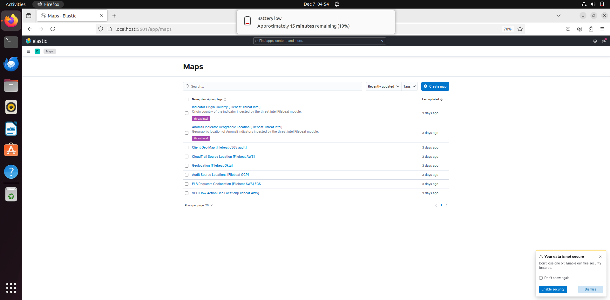

Then go to **Add Layers** and then select **Documents**.
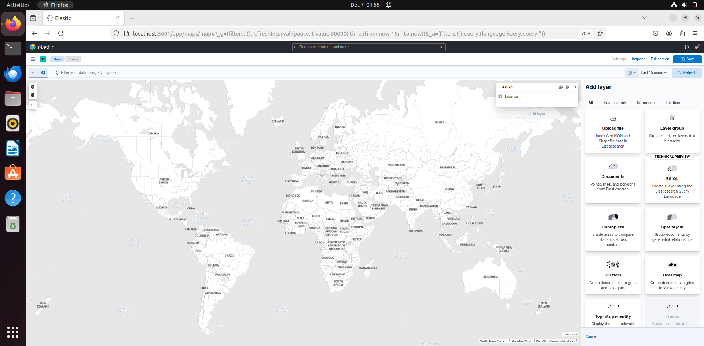

Then select the data views that you want (that have the logs) and that should locate the IP address in the maps.
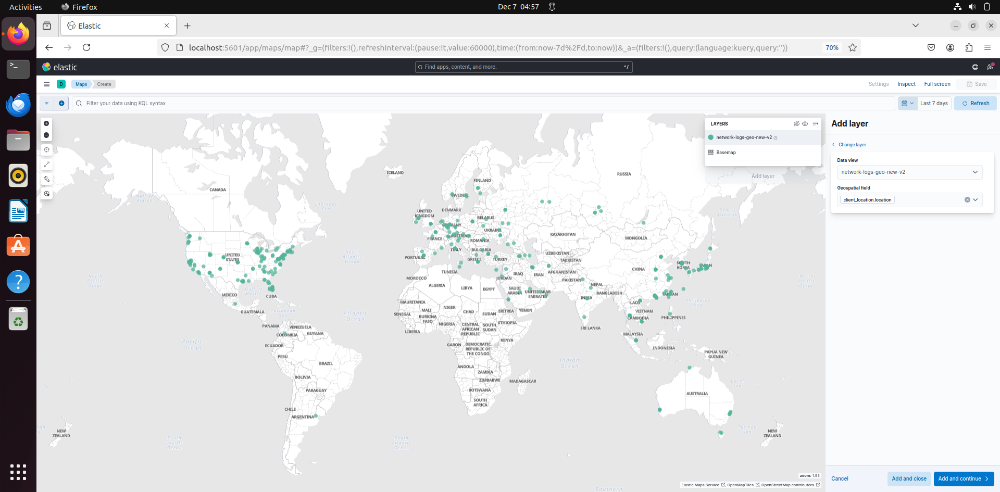
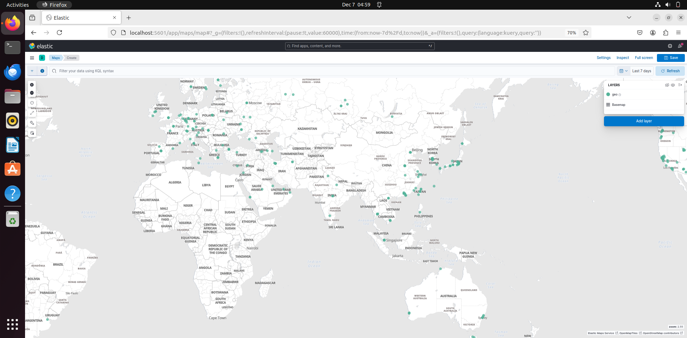

 


