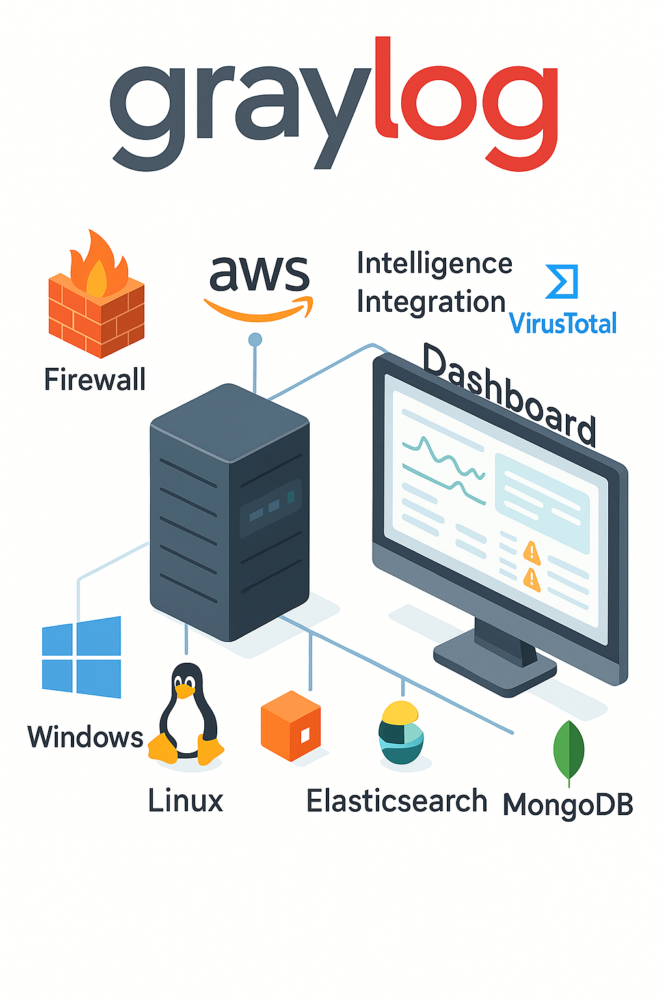
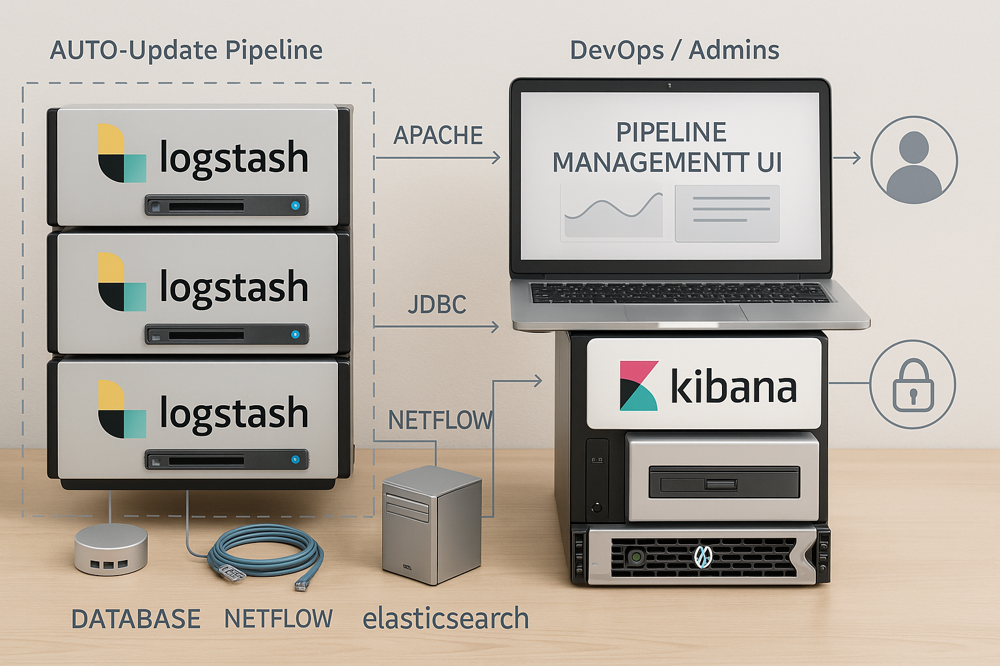

:::info
Document Creation: 2025-04-9. Last Edited: 2025-04-26. Authors: Elvis Nwosu

Document Code: Graylog_vs_Logstach_V1. Effective Date: 2025-04-26. Expiry Date: 2026-04-26
:::

## Graylog vs Logstash: A Comparative Analysis

### 1.0 Introduction 

Centralized log management is critical for both security monitoring and IT operations in modern systems. Graylog and Logstash are two prominent open-source tools used to collect, process, and analyze log data, each with different design philosophies. 
Graylog is a full-fledged log management platform (with a web interface, alerting, and storage integration), while Logstash is a log processing pipeline tool that is part of the Elastic Stack (often paired with Elasticsearch and Kibana). This report provides an academic-style comparison of Graylog and Logstash across common use cases from security log management and general-purpose log aggregation to DevOps pipeline processing and real-time analytics using key criteria: performance, ease of use, integration capabilities, cost considerations, and community support. The analysis draws on official documentation, industry reviews, and case studies to highlight each tool’s strengths and weaknesses.

### 1.1 Typical Use Cases and Applications

Both Graylog and Logstash are versatile and support a range of logging scenarios. Below we outline how each tool is applied in typical use cases:

**I. Security Log Management (SIEM):** Graylog is often deployed as a lightweight Security Information and Event Management (SIEM) solution or as part of a security stack. It can ingest and correlate logs from intrusion detection systems, endpoints, and threat intelligence feeds, providing a central UI for security analysts. For example, Graylog is used alongside Wazuh (an open-source SIEM) to enhance visibility and dashboards for security alerts. Logstash, on the other hand, frequently appears in security logging pipelines as part of the Elastic Stack. Tools like Wazuh historically integrated Logstash to parse and forward security alerts into Elasticsearch. In modern setups, Logstash (or Beats) feed data to Elastic Security or other SIEM platforms for threat detection. Both tools enable real-time alerting on security events, though Graylog provides this out-of-the-box via its stream alerts, whereas Logstash requires additional components (Elasticsearch/Kibana or SIEM solutions) for alerting functionality.

**II. General-Purpose Log Aggregation:** In IT operations and system administration, both Graylog and Logstash are used to centralize logs from servers, applications, and network devices. Graylog offers a turnkey solution for aggregating logs from various sources (e.g. via Syslog, Beats, or Graylog’s GELF format) into a single searchable repository. Its built-in dashboards and search engine (backed by Elasticsearch) allow operators to quickly troubleshoot issues across distributed systems. Logstash serves a similar purpose in aggregation pipelines, acting as an ingest node that collects logs (from files, syslog, message queues, etc.), parses them (e.g. with grok patterns), and then ships them to a datastore like Elasticsearch. For general log aggregation, a key difference is that Graylog includes the viewing interface and user management, whereas Logstash users typically rely on Kibana or another front-end for querying and visualization.

**III. DevOps Pipeline Processing:** In DevOps and cloud-native environments, log and event data flow through pipelines for monitoring CI/CD processes and microservices. Logstash is widely used in these pipelines due to its flexible plugin ecosystem it can ingest CI logs, Docker/container stdout, metrics, and even events from message brokers, then filter or transform them as needed before output. DevOps teams often script Logstash configurations as part of infrastructure-as-code to route logs between systems or to Elasticsearch for analysis. Graylog can also fit into DevOps workflows; it can directly ingest container logs using the GELF driver (e.g. Docker/Swarm logging) and provides real-time dashboards to monitor application performance and deployments. Graylog’s pipeline rules allow on-the-fly parsing or enrichment of CI/CD logs like Logstash filters. However, Logstash may integrate more naturally with existing CI/CD toolchains as a background service, whereas Graylog’s value in DevOps is often in providing a quick web UI for teams to investigate build or runtime issues in real time.

**IV. Real-Time Analytics:** Both tools support real-time log analytics, albeit in different ways. Graylog was designed for real-time log exploration, incoming events are indexed quickly into Elasticsearch and become searchable almost immediately via Graylog’s interface. Users can set up streams (continuous queries) to route events in real time and trigger alerts or feed dashboards that update live. Graylog can even enrich data in transit (for example, tagging IP addresses with threat intelligence from MISP or VirusTotal as logs stream in).

 Logstash similarly processes events in streaming fashion; it can enrich data using lookup plugins and then forward it to analytics engines. Real-time dashboards are achieved by coupling Logstash with a visualization layer like Kibana. The Elastic Stack is known to handle near-real-time analytics well, Logstash feeds events into Elasticsearch, and Kibana dashboards auto-refresh to reflect new data. The main contrast is that Graylog provides an integrated real-time analytics experience (with less than a few seconds delay for most inputs), while Logstash’s real-time analytics capabilities depend on the rest of the Elastic Stack to consume and display the data.

In summary, Graylog tends to appeal as an all-in-one solution for quickly standing up log management in scenarios like security operations or small DevOps teams, whereas Logstash excels as a flexible component in custom log pipelines, especially in large-scale deployments that already use Elasticsearch. Next, we compare the two tools on specific criteria in detail.

### 1.2 Performance

**Graylog:** Graylog is built to handle large volumes of log data in real time, leveraging underlying Elasticsearch (or OpenSearch) for indexing and search. A single Graylog server node can ingest thousands of events per second, and Graylog’s clustered deployment can scale that out horizontally. One of Graylog’s core performance features is its internal message journal (based on Apache Kafka technology) which buffers incoming messages on disk. This journal allows Graylog to smooth out bursts of logs and protect against data loss if the backend Elasticsearch becomes slow or temporarily unreachable, Graylog will spool incoming logs to disk and catch up later. This design helps maintain throughput under stress. Graylog processes logs through pipelines and extractors, which are efficient but add a small overhead before writing to Elasticsearch. The actual indexing performance is largely dependent on the Elasticsearch/OpenSearch cluster performance. In practice, Graylog’s throughput is on par with other log systems using Elasticsearch; for instance, real-world deployments report stable performance indexing security events in near real-time on modest hardware. However, Graylog’s all-in-one nature means the server handles both ingestion and querying, so high query loads (e.g. complex searches or dashboards) can contend for resources with ingestion. Tuning the JVM, Elasticsearch indices, and using multiple Graylog nodes can mitigate this. Graylog Enterprise installations often include archiving and other features that require careful performance tuning on the Elasticsearch side. Overall, Graylog provides strong performance for log ingestion with built-in reliability, suitable for high-volume environments, but it requires sufficient backend resources (CPU, RAM, and fast disk for the journal and ES) to sustain heavy loads.

**Logstash:** Logstash is a robust data pipeline engine and can be optimized to handle very high event rates, but it is also known for its resource intensity. Written in Java (and some Ruby), Logstash historically had higher CPU and memory usage for equivalent tasks that lighter shippers (like Beats or Fluent Bit) could do. This led some organizations to replace or complement Logstash with lighter collectors (for example, Wazuh moved from Logstash to Filebeat for shipping alerts in later versions for efficiency). That said, Logstash excels in complex processing. It can parse and transform logs using regex, apply conditionals, and even do aggregation, which can offload work from the database at the cost of throughput. Performance tuning features in Logstash include pipeline workers (multi-threading) and persistent queues to buffer events to disk like Graylog’s journal. In a well-tuned setup (e.g. multiple pipeline threads, adequate JVM heap, and perhaps multiple Logstash instances behind a message broker), Logstash can also ingest many thousands of events per second continuously. Because Logstash is decoupled from search/query duties, it focuses purely on moving and transforming data, which can be an advantage in performance isolation. The output stage (often Elasticsearch) will still be the rate-limiter in many cases. In summary, Logstash provides high throughput and rich processing at scale, but may require more tuning and hardware (especially for CPU-intensive filters) to achieve the same raw throughput as a more lightweight pipeline. Many modern pipelines use Logstash in combination with message queues (Kafka/RabbitMQ) to distribute load. When comparing directly, Graylog’s integrated pipeline is performant and convenient, but Logstash offers more granular control to optimize for throughput or latency as needed. It’s worth noting that for simple log shipping, Graylog’s built-in inputs or alternatives like Beats/Fluent Bit can outperform a heavy Logstash, whereas for complex event processing, Logstash’s performance is acceptable given its capabilities.

### 1.3 Ease of Use

**Graylog:** One of Graylog’s biggest advantages is its ease of use for end-users and administrators. It provides a web-based interface out-of-the-box for managing the entire log lifecycle from defining inputs to searching logs and creating dashboards. Setting up Graylog involves installing its server (plus dependencies MongoDB for metadata and Elasticsearch for data) and then configuration is largely done via the UI. Users can add log input sources (e.g. syslog listeners, GELF inputs, Beats inputs) through point-and-click in the Graylog web console, rather than writing configuration files. The searching and analysis experience is often described as intuitive, “like being able to Google your logs in real time”. This means that even non-developers (e.g. security analysts, SREs) can quickly start querying logs with Graylog’s Lucene-based search syntax and use its built-in functions (like quick filters or field statistics). Graylog also has built-in user management and role-based access control, making it easier to securely share the platform across teams. Creating dashboards and alerts in Graylog is done through the UI with minimal scripting. Moreover, Graylog’s content packs provide pre-made configurations (inputs, extractors, dashboards) for common log sources, which further simplifies setup for new users. The learning curve for Graylog is generally considered low for basic log viewing and moderate for advanced features (e.g. writing pipeline rules requires some scripting knowledge, but the GUI aids in debugging them). In summary, Graylog is designed to be user-friendly, offering a shorter time-to-value in deploying a log management solution. Its self-contained web UI for configuration and analysis is a key selling point, especially for teams who want to avoid dealing with multiple configuration files and tools.

**Logstash:** Logstash is powerful but often less approachable for beginners when used standalone. As a backend component, Logstash does not include a user interface; deploying it and using it involves writing configuration files (in a domain-specific language) to define pipelines of inputs → filters → outputs. Setting up Logstash typically means editing .conf files to specify, for example, a TCP/UDP listener or file path (input), applying grok patterns or data transformations (filter), and then sending to an output like Elasticsearch. This text-based configuration is very flexible but can be complex for instance, crafting regex patterns for parsing logs can be time-consuming. The ease of use therefore depends on the user’s comfort with configuring systems via code. Many DevOps teams manage Logstash as code (Ansible/Chef scripts, etc.), which is fine for engineers but less accessible to analysts. Additionally, because Logstash is only one part of the Elastic Stack, a full user-facing solution requires setting up Kibana for search and dashboards and Elasticsearch as storage, then ensuring they all connect. This multi-component setup is more involved than Graylog’s unified platform. On the other hand, within an established Elastic Stack environment, adding Logstash can be straightforward, for example, enabling a module or using pre-defined pipeline configs for common sources (Elastic provides modules for ingesting certain logs which automate the Logstash/Elasticsearch index setup). The learning curve for Logstash is moderate to high: it requires understanding pipeline syntax and often some knowledge of Ruby or Grok for advanced parsing. Debugging pipelines can also be tricky (though the Logstash logs and stdout outputs can help). In terms of ongoing use, once logs are indexed into Elasticsearch by Logstash, the ease of searching/analyzing those logs depends on Kibana’s interface. Kibana is a powerful UI, but not as focused on log text search as Graylog’s interface; Kibana may require users to build visualizations or use the Discover tab with Lucene queries. In summary, Logstash demands more initial setup and expertise it is very flexible but not a plug-and-play solution. Teams already invested in Elastic will find it fits naturally, but those seeking a quick, user-friendly log tool might find Graylog’s one-stop interface more convenient.

### 1.4 Integration with Other Tools

**Graylog:** Graylog was designed to integrate into diverse environments and often acts as a central hub for logs from many sources. It natively supports a wide array of input integrations: syslog (UDP/TCP), HTTP(S) inputs, its own GELF format (supported by many applications and libraries), and Beats (e.g. Filebeat, Winlogbeat) inputs. Through these inputs, Graylog can ingest logs from network devices, Linux/Windows servers, containers, and more. Graylog relies on Elasticsearch/OpenSearch as its storage backend, so integration with the Elastic ecosystem is built-in, for example, Graylog 5.x added compatibility with OpenSearch 2.x (the engine behind Wazuh’s indexer). This means organizations can use Graylog as the front-end while using OpenSearch/Elasticsearch as the data store, combining Graylog’s ease of use with the scalability of Elastic. For security use cases, Graylog often complements other tools: it can receive alerts from Wazuh (by consuming Wazuh Manager’s JSON alerts via an input) and provide deeper analysis or long-term retention for those alerts. It can also incorporate threat intelligence feeds for instance, Graylog can be extended to query external APIs or databases. A case in point is using Graylog pipelines or lookup tables to enrich logs with data from MISP (Malware Information Sharing Platform) or VirusTotal. Additionally, Graylog has a plugin/marketplace system: there are community and enterprise plugins for integrating with services like Slack (for alert notifications), AWS (CloudWatch logs input), and more. On the output side, Graylog can forward processed log events to other systems if needed using output plugins (e.g. to send alerts to an HTTP endpoint, or to another message queue). However, Graylog is primarily intended to store and search logs internally rather than act purely as a pass-through. In summary, Graylog offers broad integration capabilities: it works seamlessly with Elasticsearch/OpenSearch, can ingest logs from virtually any source (with or without the help of agents like Beats/Fluent Bit), and can enhance a security stack by integrating with SIEM tools (like feeding data to Splunk or receiving from OSSEC/Wazuh) as well as threat intel platforms.

**Image 1.1 – Graylog Integration Ecosystem**

**Logstash:** Integration is the hallmark of Logstash it is essentially an integration pipeline by design. Logstash has an extensive plugin ecosystem maintained by Elastic and the community, which enables it to connect to numerous data sources and destinations. For inputs, Logstash can listen for syslog, read files, poll message queues (Kafka, RabbitMQ, AWS SQS), connect to databases, receive events over UDP/TCP, and even pull from APIs (e.g. via HTTP polling). This means Logstash can sit at the center of an organization's data flow, aggregating not just logs but also metrics or application events. In security contexts, Logstash has been used to feed data from IDS systems, firewalls, and endpoint agents into Elasticsearch for correlation. For example, in the Elastic Security stack, beats like Filebeat collect data on endpoints and network, but Logstash can be inserted for additional processing or when data comes from custom sources. Wazuh, which is built on Elastic Stack, initially used Logstash to parse its alerts and send them to Elasticsearch, demonstrating Logstash’s role in integrating SIEM components. While Wazuh replaced Logstash with Filebeat for efficiency, Logstash can still integrate Wazuh by parsing alert JSON or Syslog feeds if one chooses a custom setup. Regarding threat intelligence, Logstash doesn’t have out-of-the-box MISP integration, but creative use of its filters (or an http input plugin) can allow it to periodically ingest threat intel (for instance, pulling IoC lists and then using the translate filter to tag events that match). For outputs, Logstash is very flexible: while Elasticsearch is the most common output, it can also output to files, email, HTTP endpoints, Kafka, other databases, or even back to a syslog server. This allows Logstash to act as a router between systems (e.g. receive logs and simultaneously index them in ES and send a copy to a data lake or to Graylog via GELF if one wanted). Integration with visualization tools is indirect: Logstash feeds data to stores that tools like Kibana or Grafana will then visualize. One key integration advantage of Logstash is that it’s part of the Elastic Stack, so it works in concert with Elasticsearch, Kibana, APM, and Beats with official support. In cloud environments, Logstash is often integrated with container orchestration (there are Helm charts, Docker images) and with managed services (e.g. Elastic Cloud or Amazon OpenSearch Service support ingest pipelines). In summary, Logstash provides deep integration hooks into various systems through its plugins, it can be seen as the “glue” that connects log sources to analysis tools. This flexibility, however, comes with the requirement to configure those integrations manually. Graylog covers many integrations out-of-the-box in a simpler way, but Logstash will typically offer a broader range of connectors (especially for less common systems or custom workflows).

Image 1.2 - Logstash Pipeline Architecture.

### 1.5 Cost Considerations (Open-Source vs. Enterprise Features)

**Graylog:** Graylog is open-source (licensed under GPL v3), and the core Graylog server is free to use. The open-source edition provides all the fundamental capabilities needed for log management: data ingestion, processing pipelines, search, dashboards, and basic alerting. Graylog the company offers commercial editions (often termed Graylog Enterprise or in newer branding, Graylog Operations and Graylog Security). These enterprise versions build on the open core and add features geared towards larger deployments and advanced security analytics. Examples of enterprise features include long-term archiving of logs (offloading old indices to cheaper storage), enhanced search workflows (like search templates or extended retention of search results), audit logs of user activity, and certain content packs or integrations (for instance, some threat intelligence lookup integrations might be part of a licensed feature set). Graylog’s enterprise license historically has been free for small environments (e.g. a certain amount of data per day or a limited number of Graylog nodes) and requires a paid subscription for larger scales or official support. For cost, if an organization’s needs are met by the open-source Graylog, then the only costs are infrastructure (servers for Graylog, Elasticsearch, MongoDB) and maintenance. This can make Graylog an attractive low-cost alternative to commercial SIEM products like Splunk. If enterprise features or support are needed, then one must factor in Graylog’s licensing costs, which are typically priced by the amount of data or the number of server nodes. It’s also worth noting that running Graylog at scale might involve employing multiple servers and a robust Elasticsearch cluster, which incurs hardware/cloud costs but this is comparable to running any log solution at scale. In academic and real-world case studies, Graylog often stands out as cost-efficient: it delivers a lot of SIEM-like functionality without hefty license fees (when using the open version). Organizations with limited budgets often choose Graylog for this reason. In summary, Graylog’s open-source version provides substantial value at no licensing cost, while the enterprise tier introduces additional features and official support for a subscription, which one would consider if those features justified the expense in a production environment.

**Logstash:** Logstash is completely open-source (now under Elastic’s dual license policy, but essentially free to use). There is no “enterprise Logstash” all features of Logstash are available in the free distribution. This means the software cost for using Logstash is zero, like Graylog’s OSS offering. However, Logstash is usually used as part of the Elastic Stack, and cost considerations typically revolve around Elastic’s licensing. Elasticsearch and Kibana (which accompany Logstash) have a free basic tier and then paid tiers for features like machine learning, advanced security, and support. Since 2018+, Elastic has made many former commercial features available in the free basic license (e.g. security features like TLS and RBAC in Elasticsearch are now free). So, one can run a full ELK (Elasticsearch-Logstash-Kibana) stack at no cost for the software. The cost factors come in when deciding on support or proprietary features: for example, an enterprise might pay for an Elastic X-Pack subscription or use Elastic Cloud for hosting, which are paid services. Alternatively, using the fully open-source OpenSearch (fork of Elasticsearch) with Logstash is an option to avoid any licensing concerns, as OpenSearch is Apache 2.0 licensed. In terms of resource cost, Logstash might require more compute resources for heavy processing compared to Graylog’s pipeline (which could be considered a cost in terms of infrastructure). But both systems at scale will need comparable investments in storage and computing. Another angle is development/maintenance cost: Logstash could incur higher labor cost to configure and maintain pipelines for complex use cases, whereas Graylog might reduce that with its UI-driven approach. If we compare with Graylog’s enterprise features, to get equivalent functionality with an Elastic Stack, one might integrate additional open tools (for example, use Curator for index archiving, or custom scripts for auditing) which is effort, or purchase an Elastic Stack license that includes those conveniences. Community support for Logstash is free (forums, etc.), and Elastic offers paid support contracts if needed. In summary, using Logstash itself does not require any licensing fees it is a cost-effective component. The main cost considerations are indirect: the need for complementary tools (Elasticsearch, Kibana) and the potential subscription if opting for Elastic’s official support or cloud services. Organizations already paying for an Elastic Stack license effectively get Logstash included. Those on a budget can run the entire Elastic Stack free, making Logstash an equally budget-friendly choice as Graylog OSS, with the trade-off being the additional engineering effort to assemble the pieces.

### 1.6 Community Support and Documentation

**Graylog:** As an open-source project, Graylog has an active but comparatively smaller community than the Elastic Stack. Graylog’s community forums and Slack channels host discussions where users share configurations, problem solutions, and plugins. The official Graylog documentation is well-structured, covering installation, configuration, and usage of features (inputs, streams, pipeline rules, etc.). Many users report that Graylog’s docs are straightforward and focused, which helps in getting the system running and solving common tasks. Graylog, Inc. also provides webinars, and blogs that share use cases (for example, using Graylog for specific compliance scenarios or threat hunting). There is a Graylog Marketplace where community members contribute content packs and plugins to extend Graylog’s functionality or support new data sources, reflecting a dedicated user base. However, in sheer numbers, Graylog’s community is smaller than Elastic’s: fewer third-party tutorials and books exist, and niche issues might have less coverage. On the plus side, Graylog’s community tends to be focused on log management use cases, so one can find guidance specific to things like “centralizing Windows Event logs in Graylog” or “Graylog for AWS cloud logs” relatively easily. The Graylog team is also active in the community, often responding to questions. In academic circles, Graylog is recognized for its role in SIEM implementations, and one can find case studies or conference papers detailing Graylog deployments for security monitoring. Overall, Graylog enjoys a supportive community and clear documentation, but users may occasionally have to rely on their own experimentation or direct community help for very advanced integrations or performance tuning, given the smaller pool of expertise compared to Logstash.

**Logstash:** Logstash benefits from being part of one of the largest open-source communities in the logging and search domain. the Elastic Stack community. This means there is a wealth of knowledge available: extensive official documentation and innumerable blog posts, how-to articles, and forum Q&As. The official Elastic documentation for Logstash is comprehensive, detailing every plugin with configuration examples, which is extremely helpful when setting up complex pipelines. There are also books and online courses that cover ELK stack administration, including Logstash. On forums like Stack Overflow or the Elastic Discuss forum, questions about Logstash configuration, performance tuning, and troubleshooting are frequently asked and answered, so solutions to common issues are easy to find. The community has also created many custom plugins and filters (though since Elastic’s licensing change, third-party development might be more focused on OpenSearch’s pipeline tool or older versions of Logstash). Because Logstash has been widely adopted in industries for years, its user community spans from hobbyists to large enterprise operations, contributing to a rich knowledge base. One challenge with this breadth is that beginners might find a lot of information (sometimes outdated) to sift through e.g. multiple ways to do something or deprecated plugin advice so the learning community can be a bit overwhelming. Elastic’s backing also means there are professional support options and consulting available for Logstash if needed. In academia and industry research, the ELK stack (including Logstash) is frequently referenced as a go-to solution for big data logging and even for cybersecurity data analytics, so knowledge of Logstash is widespread. In summary, Logstash’s community support and documentation are excellent and abundant. The Elastic Stack ecosystem has a maturity and volume of resources that arguably surpasses Graylog’s, simply due to its larger user base. This makes it likely that any given question or requirement for Logstash has been encountered by someone and answered in public forums.

### 1.7 Conclusion and Recommendations
Both Graylog and Logstash are powerful tools for log processing and analytics, but they cater to slightly different needs and user preferences. To summarize the comparative strengths and weaknesses:

**Graylog – Strengths:** User-friendly and quick to deploy for centralized log management (comes with a rich web UI, dashboards, and alerting out-of-the-box), great for security log analysis with built-in correlation and enrichment capabilities (e.g. integrating threat intelligence feeds), and no additional visualization software needed since search and charts are built in. It ensures reliability through features like the disk journal for buffering. The open-source version is feature-rich and can dramatically cut costs compared to commercial SIEM solutions. Graylog’s focused community and documentation make it relatively easy to get started and solve common log management tasks.

**Graylog – Weaknesses:** It relies on Elasticsearch/OpenSearch, so effectively one has to manage those systems as well (upgrading and scaling Elasticsearch can be non-trivial). Its performance is tied to the backend database, and very large-scale deployments might require significant Elasticsearch clusters, similar to ELK in complexity. Truly advanced log pipeline customizations are somewhat less flexible than Logstash’s plugin model, you are constrained by what Graylog’s pipeline rules and plugins can do (though they cover most needs). Some enterprise-level features (like archival, multi-site replication, or advanced correlation rules) require the paid Graylog Enterprise license. Lastly, the ecosystem around Graylog is smaller; for extremely custom requirements, there might be fewer third-party solutions readily available than exist for Logstash.

**Logstash – Strengths:** Highly flexible and extensible pipeline engine, it can integrate with nearly any data source or destination due to its rich plugin library, making it suitable for complex or custom logging requirements in DevOps pipelines and data engineering contexts. It excels in scenarios where heavy log transformation or enrichment is needed before indexing. Part of the Elastic Stack, it naturally integrates with Elasticsearch and Kibana (and benefits from their continued development and large user base). Performance can scale by adding multiple instances/workers and using message queues, fitting into distributed architectures. Completely free with no separate enterprise version, so all features are available without license fees. Backed by extensive community and documentation, which lowers the risk when troubleshooting or extending the tool.

**Logstash – Weaknesses:** Steeper learning curve and more setup effort, requires managing configuration files and additional components (Elasticsearch, Kibana) to have a full logging solution. Can be resource-intensive, which might necessitate using alternative shippers (like Beats or Fluent Bit) for simple tasks to avoid deploying too many Logstash instances. No native GUI or user management; non-technical users must rely on Kibana or other interfaces for interacting with the data. Changes in Elastic’s licensing (moving away from pure Apache 2.0) have led some to adopt OpenSearch or other tools, meaning the future community may split (though at present Logstash remains widely used). In short, Logstash might be “overkill” for smaller projects that don’t need its full power, whereas those projects could thrive with the simplicity of Graylog.

**1.8 Making a Decision:** For organizations that want a quick, all-in-one log management solution with minimal configuration, especially for security monitoring or general IT log centralization. Graylog is often the recommended choice. It provides faster time-to-value and an easier user experience for analysts and engineers to start investigating logs immediately. Graylog shines in environments where integrated dashboards and alerting on logs are needed without assembling a full Elastic Stack. On the other hand, organizations that already use Elasticsearch extensively, or that require highly customized data pipelines and maximum integration flexibility, might favor Logstash. In a large-scale, heterogeneous data environment (for example, aggregating logs, metrics, and events into a data lake), Logstash’s adaptability is a major asset. Also, if a team already has Kibana for other analytics, adding Logstash can leverage existing expertise.

In practice, these tools are not mutually exclusive, some deployments use Logstash (or Beats) to feed data into Graylog, and conversely Graylog can export data to Elastic stacks. Each tool can be the right choice depending on context.

Graylog offers a more opinionated, streamlined experience ideal for many logging use cases, whereas Logstash offers a building-block for those who need a tailored logging pipeline. Evaluators should consider the scale of logs, the available skill set of the team, and specific feature requirements (e.g. built-in UI vs. custom pipeline needs) when selecting between Graylog and Logstash. Both are capable of delivering real-time insights from log data, and both are supported by vibrant communities ensuring that either choice will be backed by continuous improvements and peer support in the foreseeable future. The decision ultimately hinges on whether the preference is for a ready-to-use platform (Graylog) or a flexible framework to integrate logs into an existing ecosystem (Logstash).

### References

- Elastic. (2023). Logstash Documentation. Elastic. Retrieved from https://www.elastic.co/logstash
- Graylog. (2023). Graylog Documentation. Retrieved https://go2docs.graylog.org/
- Faruk Ozelll. (2024). Log Management: Graylog vs ELK — Which One is Right for You? Medium. Retrieved from https://medium.com/@faruk.ozelll/log-management-graylog-vs-elk-which-one-is-right-for-you-a6d42c924218