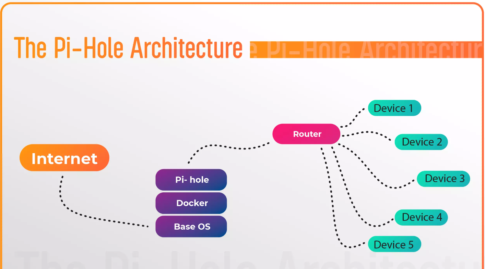

# Introduction

Pi-hole is a network-level ad and tracker blocker that enhances privacy and security by acting as a DNS sinkhole. It intercepts and blocks requests to ad and tracking domains for all devices connected to a private network, ensuring comprehensive protection. Developed in 2014 by Jacob Salmela as an open-source alternative to AdTrap, Pi-hole is optimized for low-power devices like the Raspberry Pi but can also run on almost any Linux-based system.
Unlike traditional browser-based ad blockers, Pi-hole operates at the network level, filtering ads across all connected devices, including websites, smart TVs, and mobile devices. It uses customizable blocklists and powerful tools like FTLDNS to efficiently block ads and trackers. Additionally, Pi-hole supports advanced features such as DNS-over-HTTPS and network monitoring, giving users more control over their network traffic. With its open-source nature and flexibility, Pi-hole provides an effective and scalable solution for improving network privacy and managing unwanted content. [1]

# The Pi-Hole Architecture
 
The Pi-hole architecture is a network setup that utilizes a Raspberry Pi to block advertisements and track unwanted domains. Here's a breakdown:

## Components:
•	Internet: The source of internet traffic.

•	Pi-hole: A software installed on the Raspberry Pi that acts as a DNS server. It intercepts DNS requests and blocks advertisements and tracking domains.

•	Base OS: The operating system running on the Raspberry Pi. This is usually a Linux distribution like Debian.

•	Router: A network device that forwards internet traffic to connected devices. The Pi-hole is typically configured as a secondary DNS server on the router.

•	Devices: Devices on the network that make DNS requests, such as computers, smartphones, and tablets.

## Flow:

1.	When a device on the network wants to access a website, it sends a DNS request to the router.
2.	The router, configured to use the Pi-hole as a secondary DNS server, forwards the request to the Pi-hole.
3.	The Pi-hole checks its blocklist. If the requested domain is on the blocklist, it returns a dummy IP address.
4.	The device can't connect to the website, effectively blocking the advertisement or tracker.

## Key points:

•	DNS: The Pi-hole operates by intercepting DNS requests, which are used to translate domain names into IP addresses.

•	Blocklists: The Pi-hole uses blocklists that contain domains associated with advertisements, trackers, and malware. These blocklists can be customized.

•	Filtering: The Pi-hole can block various types of internet content, including advertisements, trackers, and malware.

•	Network-wide: The Pi-hole can be used to protect all devices on a network.

# Benefits of Using Pi-hole

Pi-hole offers several advantages to enhance your online experience by blocking ads and trackers at the network level. Here are the key benefits:
1.	Ad Blocking for All Devices: Pi-hole provides network-wide ad-blocking, so once it’s set up on your router via a Raspberry Pi, all devices connected to your network are protected. This means no need to install ad-blockers on each device individually, saving you time and effort.
2.	Faster Browsing: By blocking ads and tracking scripts, Pi-hole reduces unnecessary data transfer, which can lead to faster browsing speeds. Websites load more quickly since they don’t need to display ads, improving your overall internet experience.
3.	Enhanced Privacy: Pi-hole helps protect your privacy by blocking tracking domains that collect information about your online behavior. It reduces the amount of data shared with advertisers and third parties, giving you greater control over your personal information.
4.	Cost-Effective Solution: Pi-hole runs on a Raspberry Pi, which is an affordable, low-power device. It’s an inexpensive solution to block ads and trackers, offering a great return on investment without negatively affecting network performance.
5.	Customizable and Open-Source: As open-source software, Pi-hole allows you to customize it to meet your specific needs. You can adjust blocklists and implement features like DNS-over-HTTPS for additional security and privacy.
6.	Simple Setup and Maintenance: Setting up Pi-hole on a Raspberry Pi is easy, and once it’s running, it requires minimal upkeep. The user-friendly web interface makes it simple to manage settings, view logs, and make adjustments as needed.
7.	Protects All Devices Without Extra Software: Since Pi-hole operates at the network level, all devices on your network are automatically protected. There’s no need to install ad-blocking software on each device, whether it’s a phone, computer, or smart device.

# Interface of pi-hole:

here you can see pihole has already started blocking some of the domains that are blacklisted.

In conclusion, Pi-hole is a cost-effective, efficient, and easy-to-manage solution that provides comprehensive ad-blocking, privacy protection, and faster internet browsing for all devices on your network.
