# setup guide for pi hole in Debian 12

**Step 1:**
Download Debian 12 and install it in your vm. Don’t forget to install the guest additions as well.

**Step 2:**
After installing Debian in your vm, log into it. As the second step we need to set a static ip for the pihole. I’ll put down the steps for it down here:

**1.	Identify Network Interface**
•	Use ip addr show to find the network interface name
•	Note current IP address, gateway, and DNS server

**2.	Check NetworkManager Configuration**
•	Open /etc/NetworkManager/NetworkManager.conf
•	Ensure the [ifupdown] section is set to managed=true
•	This allows NetworkManager to manage network interfaces

**3.	Modify Network Connection**
•	Use nmcli connection modify command
•	Set IP method to manual
•	Specify: 
•	Static IP address:  (ex: 192.168.x.x)
•	Subnet mask:  (ex: 255.255.255):
•	Gateway
•	DNS servers: (ex: 192.168.1.1)

**4.	Restart NetworkManager Service:**
sudo systemctl restart NetworkManager
•	Applies the new network configuration
•	Ensures changes take effect

**5.	Verify Network Configuration**
•	Use ip addr show to check IP address
•	Use ip route to confirm gateway
•	Test network connectivity with ping

**Key Considerations:**
•	Ensure you have the correct IP details before configuring
•	Double-check gateway and DNS server addresses
•	Have a backup connection method in case of configuration errors

**Step 3:**
First open the terminal and run the command:
### sudo apt update && sudo apt upgrade -y
 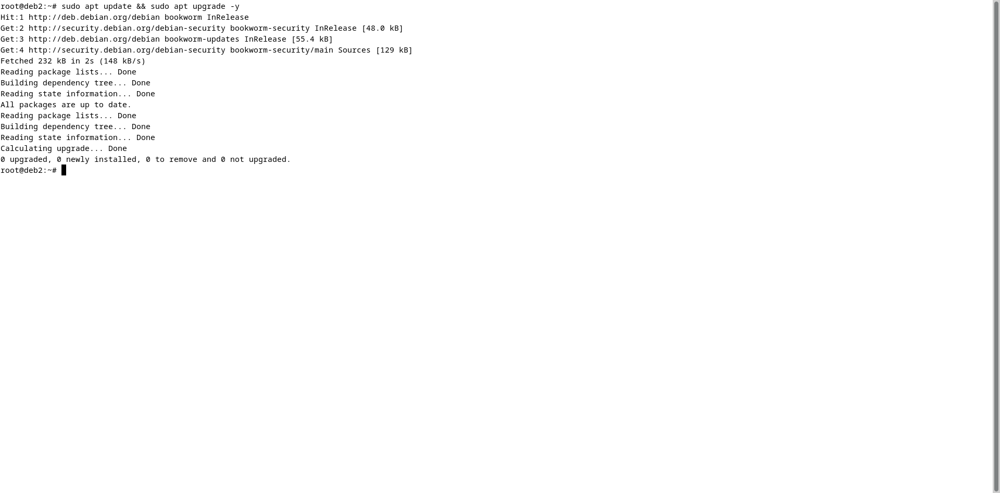
 
this will update and upgrade the system.

**Step 4:**
Install required dependencies. For this run the command:
### sudo apt install curl gnupg -y
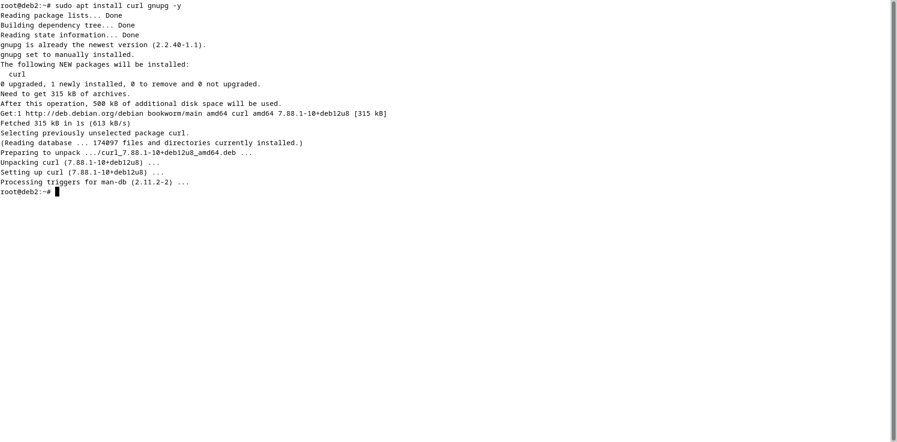
 
This ensures you can fetch the Pi-hole installation script securely

**Step 5:**
Download and run the pi-hole installation script. For this run the command:
### curl -sSL https://install.pi-hole.net | bash
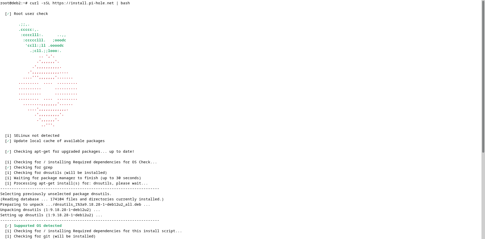
 
 
Wait for the installation to be completed and then you’ll see this:
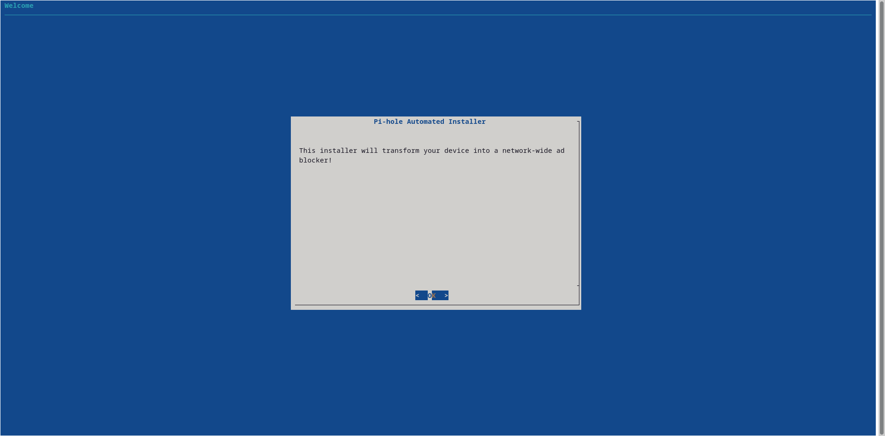
 

**Step 6:**
After pressing ok for the introduction, you’ll see this:
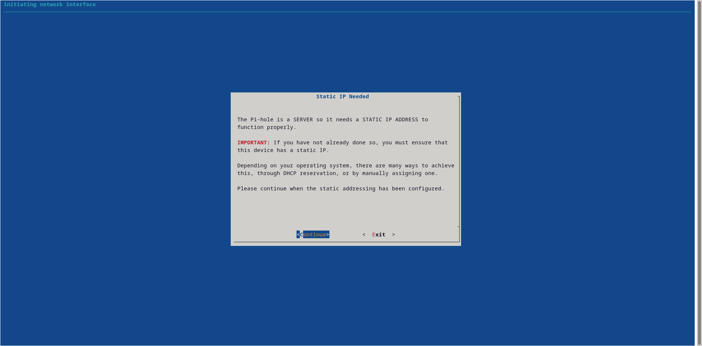
 
Since we’ve already created a static ip, click on continue. 
Next, you'll be asked to select dns server. Please select google dns.
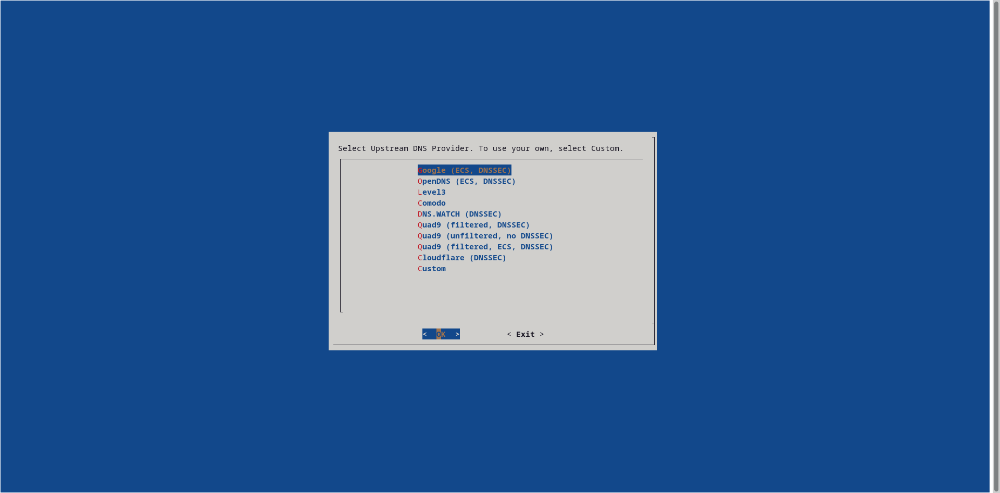
 
After selecting press ok.
After this you’ll be asked if you want to add a blacklist from steven’s blacklist. Click yes to it.
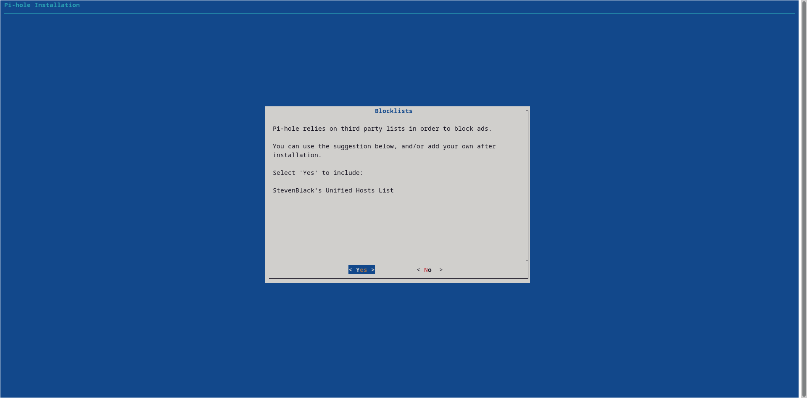
 
Pi hole by itself doesn’t have any blacklist or the whitelist. We need to add from 3rd party providers. Ill provide details about that later.
Next click yes to creating admin web interface:
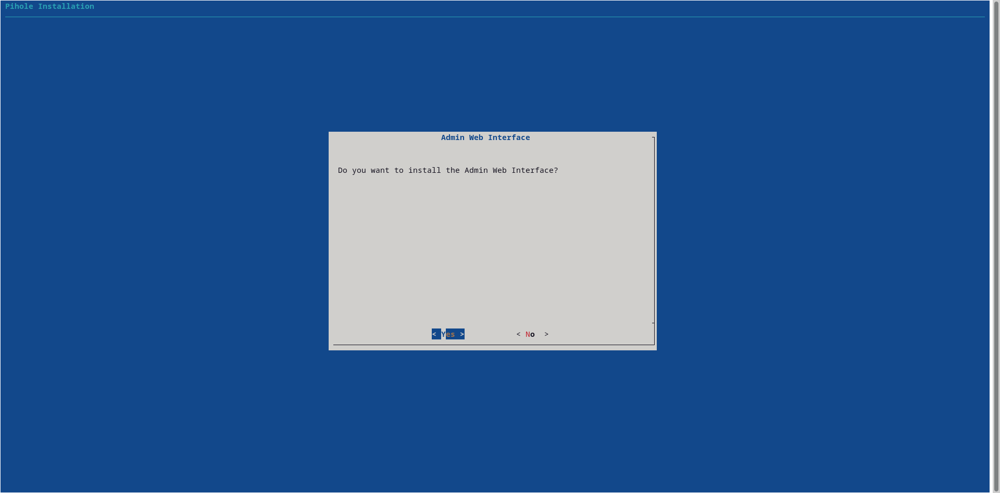
 
 After this, click yes to installing lighttpd webserver and the required modules:
 
 
Next yes to query logging:

 
Next select the anonymous mode:

 
That’s it for this step. After completing all this you’ll be redirected to the terminal. Wait for the installation to be completed. 
After the installation is complete, you’ll see this:
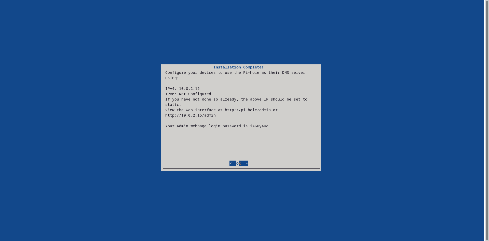
 
Note down your password and use the url to log into the web interface.
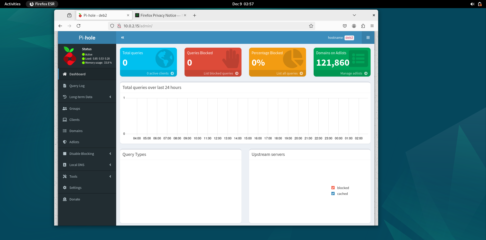
 
 
## Configuration:
now that pi hole is installed. First, I’ll give you the blacklists and whitelists link here below. After that ill explain how to add them.

## Blacklists:
•	https://firebog.net/
this will have a collection of blacklists in it. Don’t add to much, just maybe a few.

## Whitelists:
•	 https://github.com/anudeepND/whitelist/blob/master/domains/whitelist.txt 
 
## how to set these blacklist and whitelists:
**whitelists:**
•	Go to terminal and run this command:

### curl -o whitelist.txt https://raw.githubusercontent.com/anudeepND/whitelist/master/domains/whitelist.txt
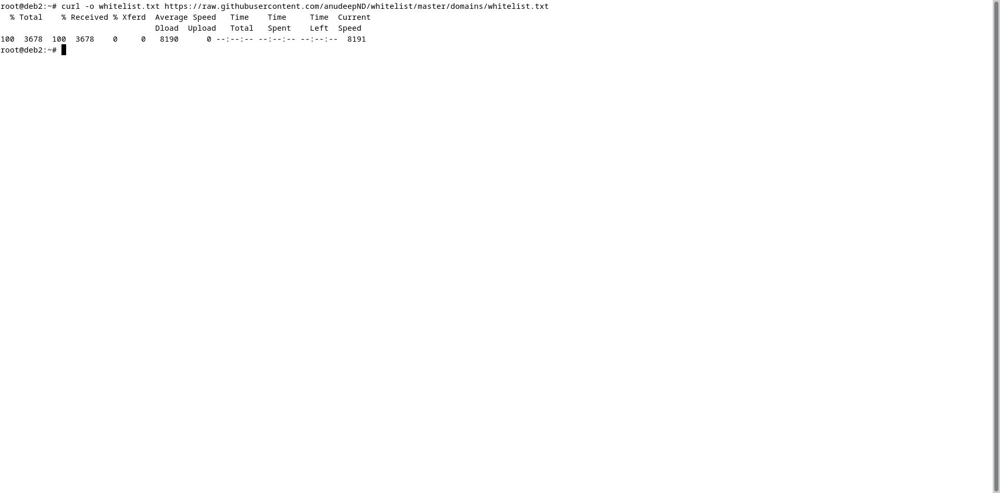
 
 
•	Next run this command. This will help to automatically add all the domains in the list to whitelist:

while read domain; do pihole -w $domain; done < whitelist.txt
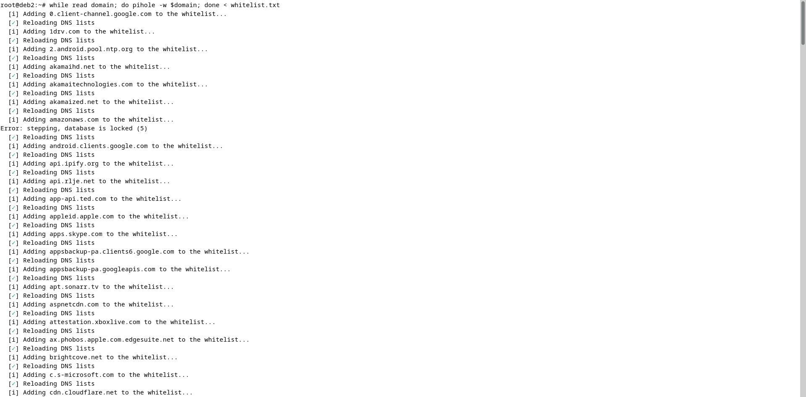

 

 Next go to pi hole, go to the menu – tools – update gravity:
 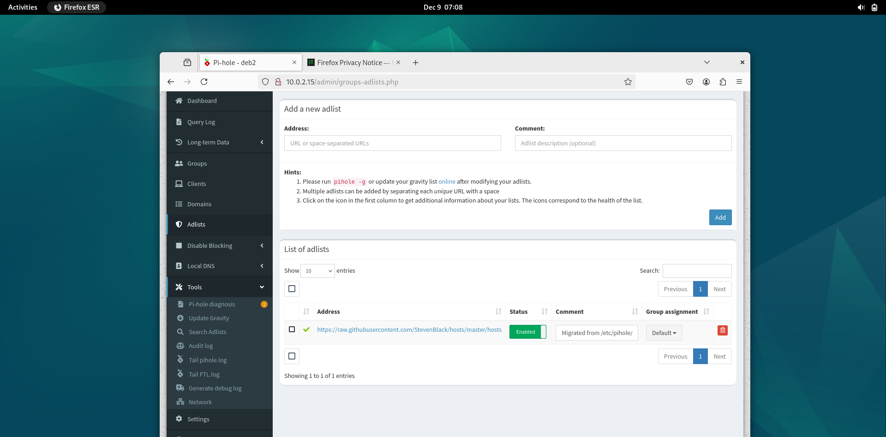
 
 Then click on update, this will put the whitelist inside the pi hole.

Now you can see the whitelists inside pi hole:
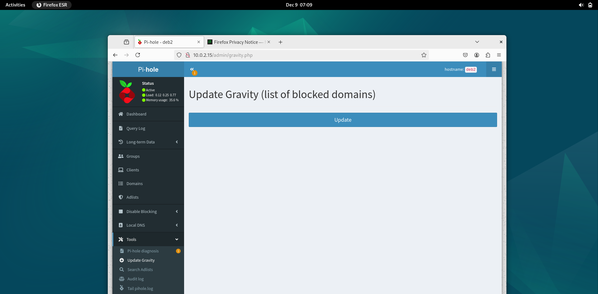
 

### Adding blacklists:
Go to pi hole menu – adlists:
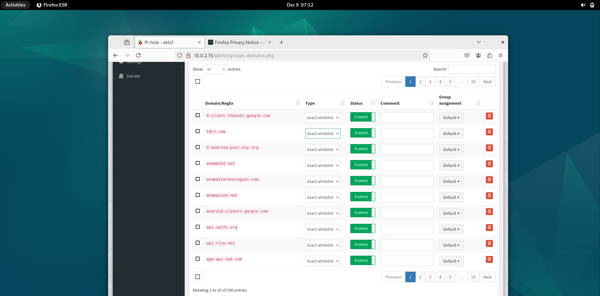
 
 Next go to firebog link I’ve provided above. It will have a bunch of url. Copy one and paste it here:
 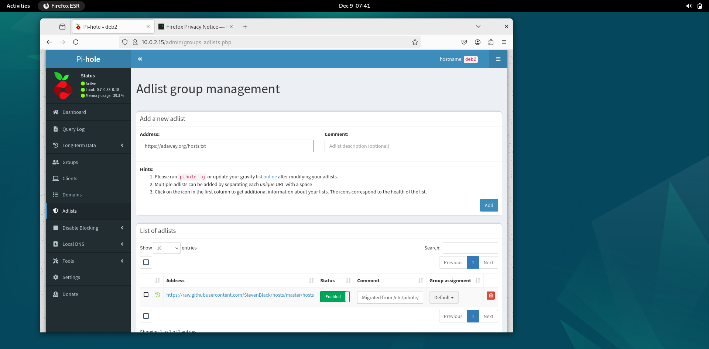
  
 Click add and the list will be added:
 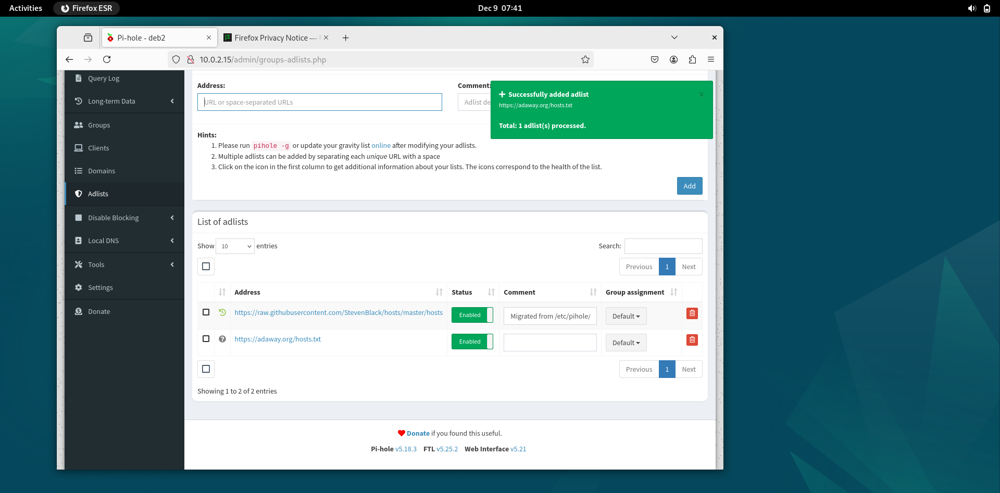
 
After doing this, go to update gravity and click update this will update the additional change we made now.

  

