# Report on Integrating MISP with Wazuh and Graylog


:::info
Document Creation: 2025-04-9. Last Edited: 2025-05-08. Authors: Elvis Ifeanyi Nwosu

Document Code: Wazuh_MISP_Int_V1. Effective Date: 2025-05-08. Expiry Date: 2026-05-08
:::

---

## 1. Executive Summary
This report documents the current status, configuration, and technical progress made in integrating MISP (Malware Information Sharing Platform) with Wazuh and Graylog. The integration aims to enrich Wazuh alerts using threat intelligence from MISP, enabling faster detection of Indicators of Compromise (IoCs). This stack also leverages Graylog to enhance log visualization, normalization, and long-term storage. This integration was demonstrated on Ubuntu 22.04 local VM, and windows 10 PC.

---

## 2. Integration Architecture Overview

The below architecture illustrates how Sysmon event data is collected, enriched with threat intelligence from **MISP**, and forwarded to **Graylog** for visualization:

1. **Sysmon Events** are generated on monitored endpoints (Windows or Linux).

2. These events are captured by the **Wazuh Agent**, which writes them to the `alerts.json` log file.

3. **Fluent Bit** reads `alerts.json` and forwards the logs to both:
   - **Graylog** – for dashboarding and search,
   - **Wazuh Manager** – for rule-based processing.

4. The **Wazuh Manager** applies custom rules to detect specific event types (e.g., DNS queries, network connections).

5. If a rule matches, it triggers the `custom-misp.py` script, which:
   - Extracts relevant indicators (e.g., domains, IPs),
   - Sends an API query to **MISP** to check for known threats.

6. If **MISP** returns a positive hit, the script enriches the alert.

7. The **enriched alert** is then forwarded by Fluent Bit to **Graylog** for final visualization and analysis, these alerts are also seen on Wazuh dashboard.
 
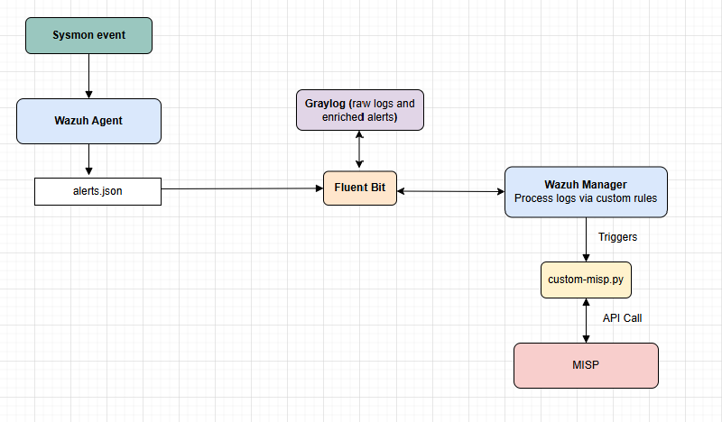
**Diagram 1.0 showing the integration schematics**

---


## 3. Tools and Components
| Component        | Purpose                                                | Current Status              |
|------------------|---------------------------------------------------------|-----------------------------|
| Wazuh Manager    | Analyzes endpoint logs and triggers integration events | Installed and working       |
| Wazuh Agent      | Captures logs (Sysmon on Windows, and Linux)           | Active and reporting        |
| MISP (Docker)    | Centralized threat intel sharing platform              | Successfully deployed       |
| Graylog          | Log normalization, indexing, and visual analysis       | Integrated and operational  |
| custom-misp.py   | Script for querying MISP and enriching alerts          | Operational and enhanced    |

**Why These Tools:**
- Wazuh's flexibility supports fine-grained custom rule logic needed for real-time IoC correlation.
- Dockerized MISP setup simplifies portability and version control for team replication.
- Graylog enables full text search and enrichment pipelines crucial for alert triage and investigation.

---

## 4. Configuration & Implementation Steps

### 4.1 Wazuh Agent & Manager Setup
Wazuh agent plays a central role in the Wazuh security monitoring platform. It is installed on endpoints (servers, desktops, cloud instances, containers, etc.) and acts as the data collection component for host-based intrusion detection and system monitoring.
Wazuh manager acts as the central processing point for Sysmon events and executes MISP enrichment.
**Steps taken:**
- Installed Wazuh agent on both windows and linux endpoints and confirmed operational status
- Confirmed receipt of Sysmon logs from Windows and linux agents using sysmonforlinux at the linux endpoint. 
- Enabled JSON alert format for integration (required for MISP script parsing)
- Enabled password-based agent authentication for secure connectivity
  
---
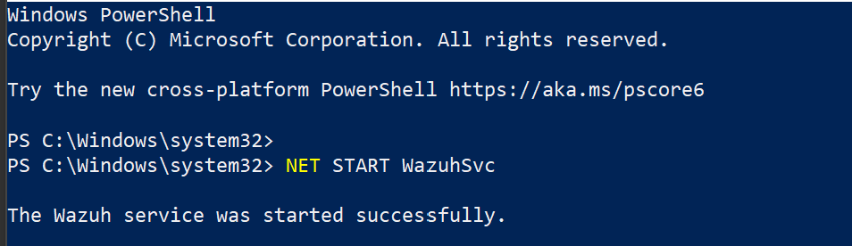
**Snip 1.0 showing Wazuh agent running successfully of Windows endpoint**

---

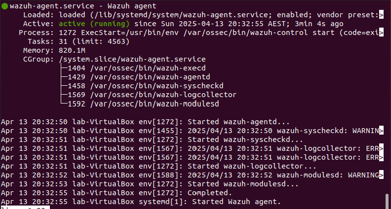
**Snip 1.1 showing Wazuh agent running successfuly on Linux endpoint**

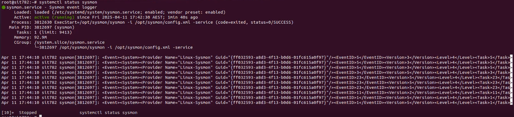
**Snip 1.2 showing sysmon for linux status on the linux endpoint**

---

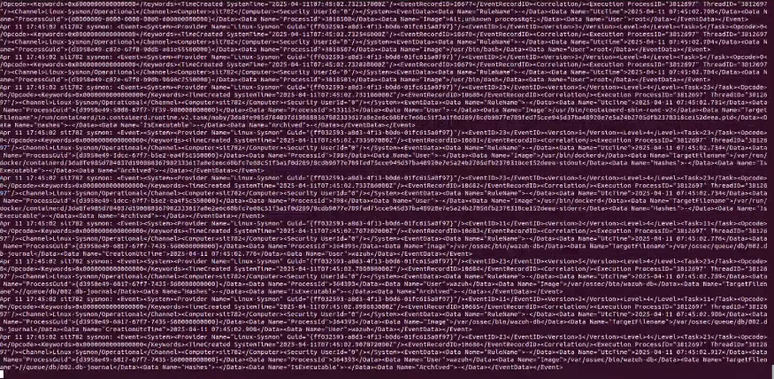
**Snip 1.3 showing logs generated through sysmon for linux, these logs are parsed to the Wazuh manager through the Wazuh-agent**

---

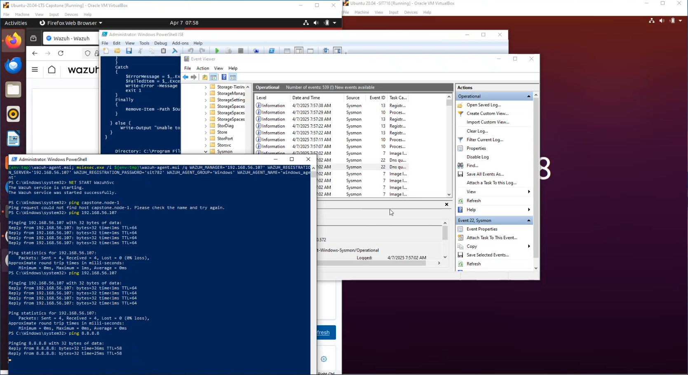
**Snip 1.4 demonstrating the generation of symon logs on linux endpoint**

---

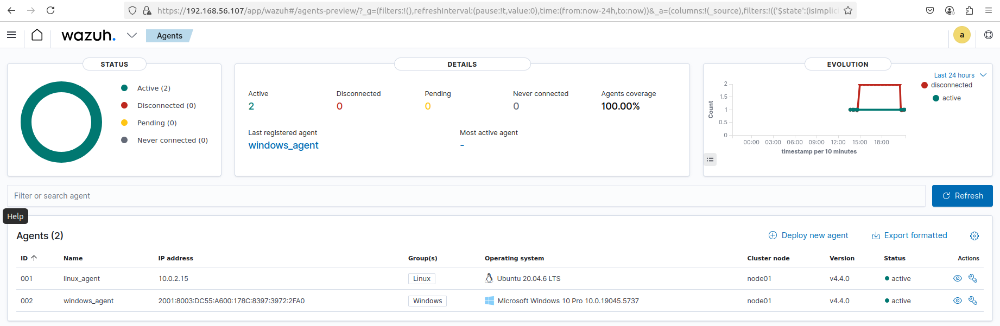
**Snip 1.5 showing status of both endpoint agents on Wazuh dashboard**

---

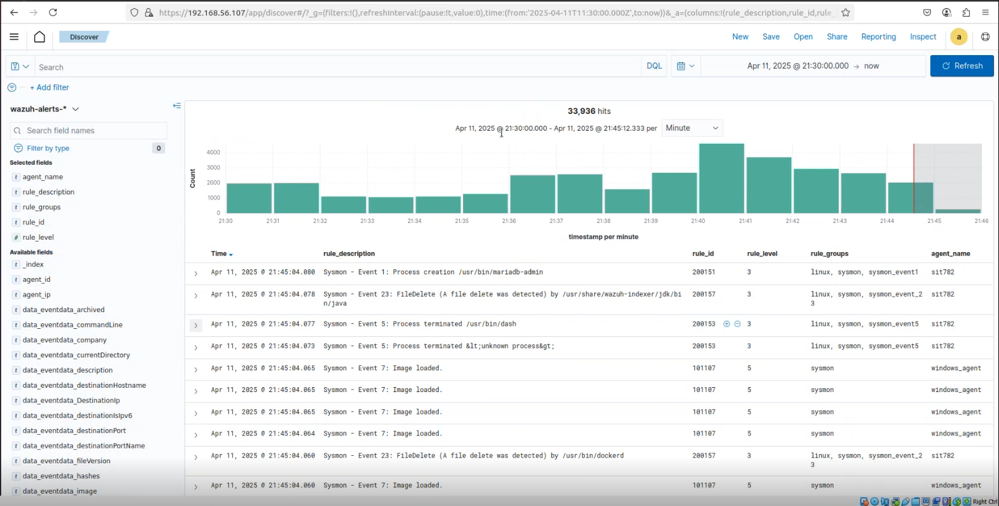
**Snip 1.6 showing Wazuh-alert logs from Linux and windows endpoints captured on Wazuh dashboard**


### 4.2 MISP Operation
Without MISP being operationally ready and accessible by Wazuh, Wazuh would be unable to query or retrieve meaningful intelligence.
**Steps taken:**
- Confirmed MISP server operational status
- Created admin user and verified API key for secure script access
- Tested access to threat feed events and attribute searches

---

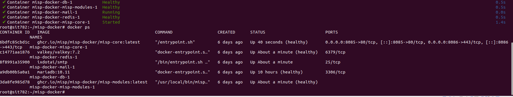
**Snip 1.7 showing Container log of successful MISP-docker startup**

---


**Snip 1.8 showing creation of MISP API key**

---


**Snip 1.9 showing sample threat feeds available on MISP**


### 4.3 Graylog Integration
Graylog was deployed to view the raw and structured form of the alert before enrichment, essential for visibility, troubleshooting, and archival, but to also create alerts on enriched logs that include MISP data.
**Steps taken:**

- Configured Fluent Bit to tail `alerts.json` on Wazuh Manager
- Set up TCP Raw Input on Graylog (port 5555)
- Modified `/etc/fluent-bit/fluent-bit.conf` to match Wazuh alert source
- Configured Graylog extractors to parse enriched fields

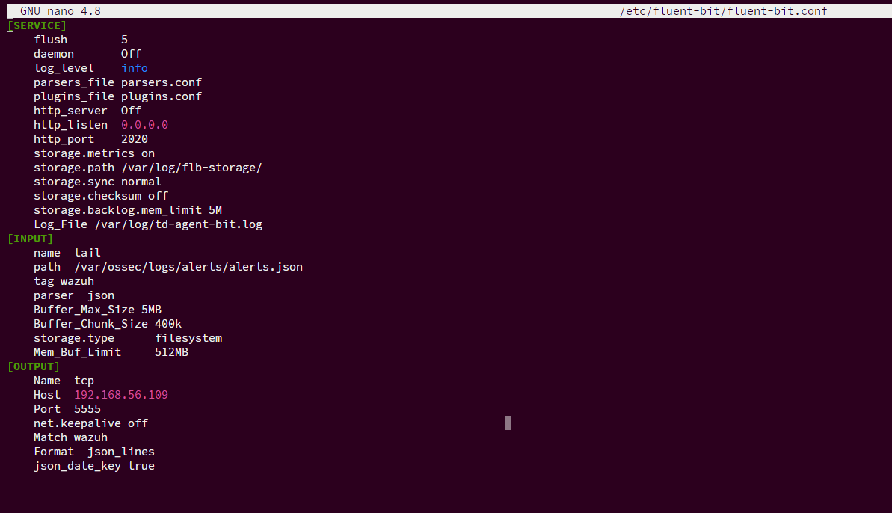
**Snip 2.0 showing fluent-bit configured to tail Wazuh**

Full config file below:
```
[SERVICE]
    Flush                 5
    Daemon                Off
    Log_Level             info
    Parsers_File          parsers.conf
    Plugins_File          plugins.conf
    HTTP_Server           Off
    HTTP_Listen           0.0.0.0
    HTTP_Port             2020
    Storage.metrics       On
    Storage.path          /var/log/fib-storage/
    Storage.sync          normal
    Storage.checksum      off
    Storage.backlog.mem_limit 5M
    Log_File              /var/log/td-agent-bit.log

[INPUT]
    Name                  tail
    Tag                   wazuh
    Path                  /var/ossec/logs/alerts/alerts.json
    Parser                json
    Buffer_Max_Size       5MB
    Buffer_Chunk_Size     400k
    Storage.type          filesystem
    Mem_Buf_Limit         512MB

[OUTPUT]
    Name                  tcp
    Match                 wazuh
    Host                  192.168.56.109
    Port                  5555
    Format                json_lines
    net.keepalive         off
    json_date_key         true
```

---

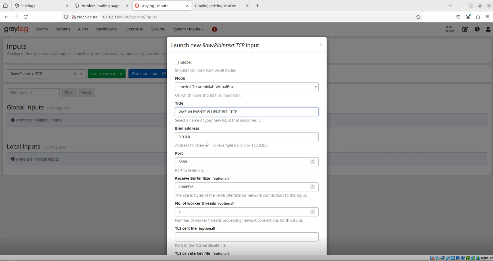
**Snip 2.1 showing graylog input setup**
 

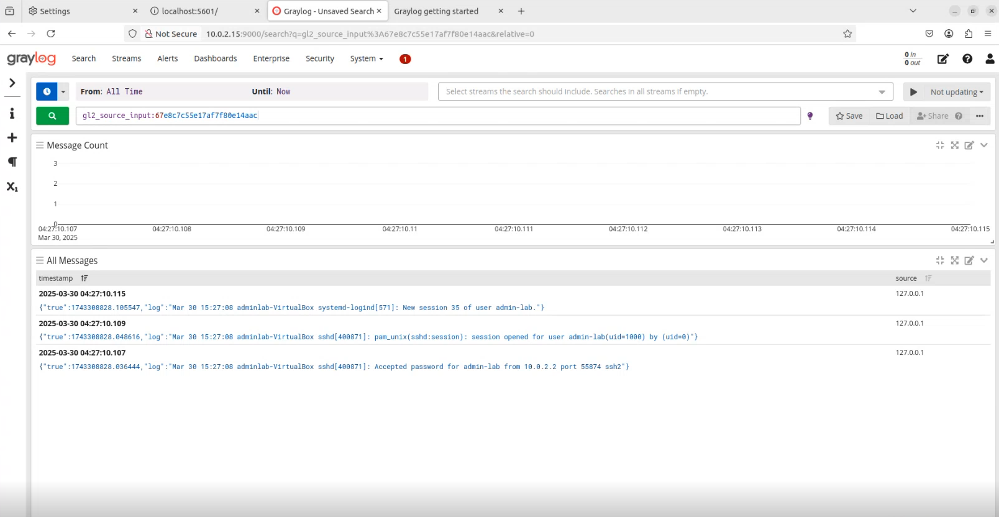
**Snip 2.2 showing input alerts on graylog**


---

### 4.4 MISP Integration Script
MISP automates threat correlation and return MISP intelligence for further action.
- Location: `/var/ossec/integrations/custom-misp.py`
- Enhanced to support NDJSON format for batch processing (performance and compatibility improvement)
- Sends enriched output back via Wazuh socket
- Uses regex and conditionals to match Event ID types (e.g., Sysmon Event 1, 3, 22)

[Click here to view custom-misp.py employed](https://github.com/karelumair/MISP-Wazuh-Integration/blob/main/custom-misp.py)

The below Integration block added to configuration file `/var/ossec/etc/ossec.conf` and the Wazuh manager restarted afterwards. This triggers the custom-misp.py script for the select sysmon groups.
```
<integration>
  <name>custom-misp.py</name>
  <group>sysmon_event1,sysmon_event_22,syscheck</group>
  <alert_format>json</alert_format>
</integration>
```

### 4.5 Rule and Decoder Configuration
**Why:** To classify alerts enriched by MISP and assign appropriate severity levels.
- Loaded `misp.xml` with custom rules (e.g., rule ID `100622`)
- Verified integration group contains correct Sysmon events

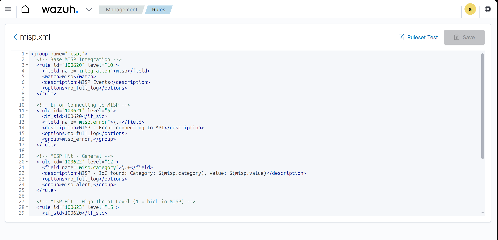
**Snip 2.3 showing MISP.xml custom rule applied on Wazuh**

```
<group name="misp,">
  <!-- Base MISP Integration -->
  <rule id="100620" level="10">
    <field name="integration">misp</field>
    <match>misp</match>
    <description>MISP Events</description>
    <options>no_full_log</options>
  </rule>

  <!-- Error Connecting to MISP -->
  <rule id="100621" level="5">
    <if_sid>100620</if_sid>
    <field name="misp.error">\.+</field>
    <description>MISP - Error connecting to API</description>
    <options>no_full_log</options>
    <group>misp_error,</group>
  </rule>

  <!-- MISP Hit - General -->
  <rule id="100622" level="12">
    <field name="misp.category">\.+</field>
    <description>MISP - IoC found: Category: $(misp.category), Value: $(misp.value)</description>
    <options>no_full_log</options>
    <group>misp_alert,</group>
  </rule>

  <!-- MISP Hit - High Threat Level (1 = high in MISP) -->
  <rule id="100623" level="15">
    <if_sid>100620</if_sid>
    <field name="misp.threat_level_id">1</field>
    <description>MISP - HIGH Threat Level IoC Detected: Value $(misp.value)</description>
    <group>misp_alert,</group>
  </rule>

  <!-- MISP Hit - Trusted Partner (e.g., CERT-AU, adjust name as needed) -->
  <rule id="100624" level="13">
    <if_sid>100620</if_sid>
    <field name="misp.orgc">ESET</field>
    <description>MISP - Trusted Source Alert from ESET: Value $(misp.value)</description>
    <group>misp_alert,</group>
  </rule>

</group>
```
### 4.6 Windows Endpoint Testing - Live IOC Validation

This section documents the successful validation of the MISP-Wazuh integration from a Windows endpoint using **Sysmon-generated DNS requests**.

#### Test Domain Used:
- **Domain**: `www.iabg.de`
- **MISP Source**: Confirmed attribute listed in MISP (added via event import)
- **Trigger Method**: Executed `ping www.iabg.de` from the Windows terminal
- **Sysmon Event Triggered**: Event ID **22** – DNS Request

#### Steps Followed:
1. **Sysmon** was running and actively monitoring DNS events on the Windows endpoint.
2. `ping www.iabg.de` was issued in the Windows command prompt.
3. Sysmon generated an **Event ID 22**, capturing the DNS request.
4. Wazuh agent forwarded the event to Wazuh Manager.
5. **custom-misp.py** processed the event, extracted the domain, and queried MISP.
6. MISP returned a positive match for `www.iabg.de`.
7. An enriched alert with metadata from MISP was generated and displayed in:
   -  **Wazuh Dashboard**
   -  **Graylog**, with full JSON structure parsed.
  
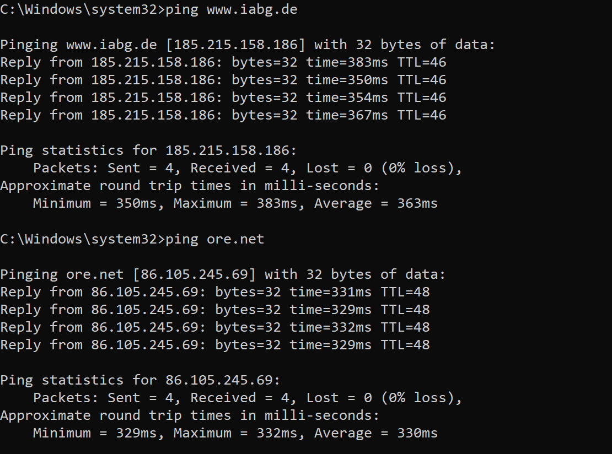
**Snip 2.4 showing sysmon generated event (ping - DNS request) of potential IoC available in MISP**

---

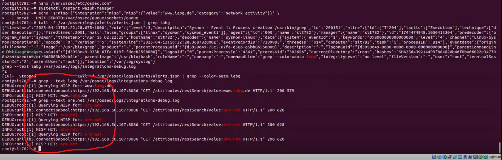
**Snip 2.5 Log of API request and Hit to and fro MISP**

---

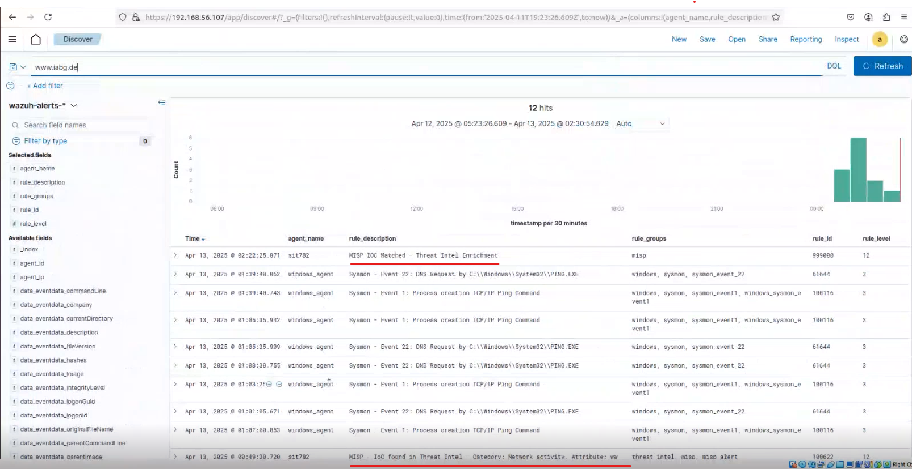
**Snip 2.6 showing JSON enriched alert from MISP**


 ### 4.7 Linux Endpoint Testing - Live IOC Validation

To validate the full integration flow on Linux (Sysmon for Linux → Wazuh Agent → Wazuh Manager → MISP → Enriched Alert), a real IP address from MISP was selected for testing.

#### Test Domain/IP Used:
- **Value**: `178.128.103.24`
- **MISP Source**: Domain/IP from ESET - Network Activity (visible in MISP Attributes UI)
- **Trigger Method**: Executed `curl 178.128.103.24` from the Linux terminal
- **Sysmon Event Triggered**: Event ID **3** – Network Connection Initiated

#### Steps Followed:
1. Verified that `Sysmon for Linux` is running on the endpoint.
2. Issued: `curl 178.128.103.24` to simulate outbound IOC interaction.
3. Confirmed via logs that Sysmon recorded the network connection (Event ID 3).
4. Wazuh agent forwarded logs to Wazuh Manager in JSON format.
5. Wazuh triggered `custom-misp.py`, which queried MISP and received a **positive hit** for the IP.
6. Alert enriched with MISP fields appeared on **Wazuh Dashboard** and **Graylog**.

 
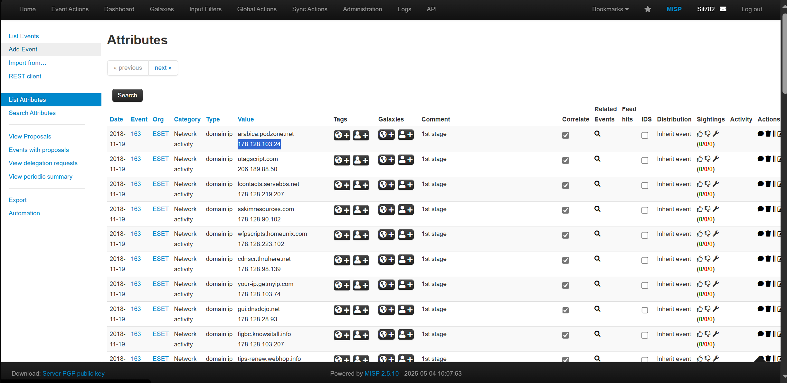 
**Snip 2.7 MISP Attribute page showing '178.128.103.24`**

  

**Snip 2.8 showing Terminal command output from Linux curl test**
  
 
 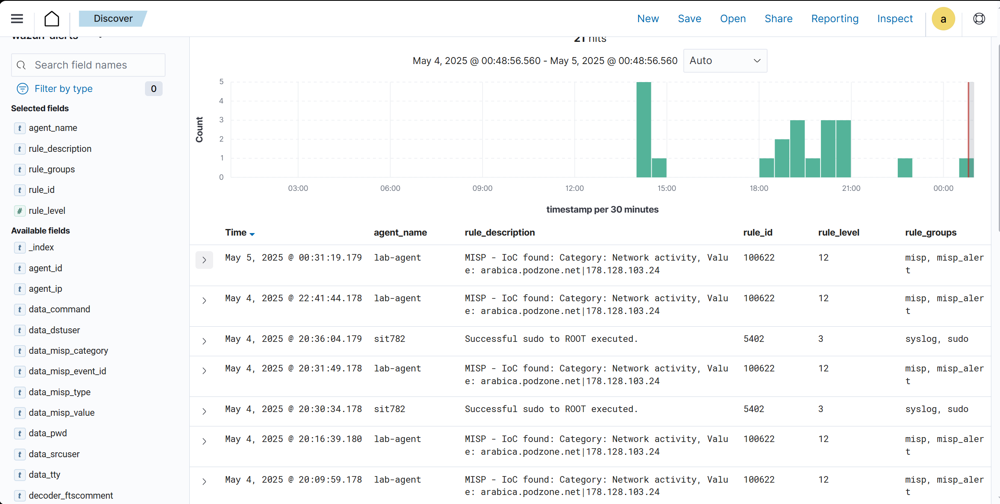
**Snip 2.9 showing Wazuh dashboard alert with enriched alert from MISP**


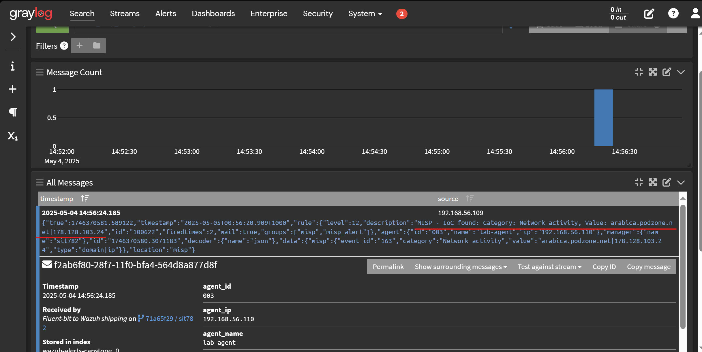
**Snip 3.0 showing Graylog parsed alert with enriched MISP data**

---

## 5. Reflection
### Appendix: Wazuh vs. Graylog for Threat Intelligence Enrichment

When deciding between Wazuh and Graylog for integrating threat intelligence (such as from MISP), it's important to evaluate what each tool provides and whether one can replace the other based on your operational goals.


### What Graylog Can Do on Its Own

- Ingest logs from multiple sources (via Fluent Bit, Filebeat, Syslog, etc.)
- Apply **pipeline rules, extractors, and lookup tables** to enrich logs in real time
- Perform **direct REST API lookups** (e.g., to MISP or AbuseIPDB)
- Store and search logs using OpenSearch
- Visualize enriched logs using dashboards
- Trigger alerts, notifications, and events

**Graylog alone is capable of:**  
- Parsing Wazuh logs  
- Enriching alerts with MISP using Lookup Tables  
- Generating dashboards and correlation alerts

<br>

</br>
### What Wazuh Adds on Top

| Feature | Why It Matters |
|---------|----------------|
| **Endpoint-focused HIDS** | Detects file changes, rootkits, unauthorized processes, and more |
| **Prebuilt rule engine** | Maps Sysmon events, compliance checks, and threat matches to actions |
| **Agent-based collection** | Monitors system integrity and forwards logs in enriched JSON |
| **Built-in compliance** | Includes modules for CIS, PCI-DSS, NIST, etc. |
| **Inline enrichment** | Enriches logs (via MISP) **before** they reach Graylog |
| **Resilience** | Operates independently even if SIEM is down |

<br>

</br>
### When to Use Each

| Scenario                                                   | Use Wazuh            | Use Graylog         |
|------------------------------------------------------------|----------------------|---------------------|
| You only need log ingestion and enrichment                 | **Not Required**     | **Recommended**     |
| You want endpoint-based intrusion detection                | **Recommended**      | **Not Applicable**  |
| You require compliance reports (CIS/PCI)                   | **Recommended**      | **Not Applicable**  |
| You want to enrich alerts before forwarding to SIEM        | **Optional**         | **Supported**       |
| You're building a full-stack detection + observability pipeline | **Recommended** | **Recommended**     |


###  Summary

If you're only concerned with ingesting logs and enriching them with MISP, **Graylog alone is sufficient**.  
However, if you need **detection at the host level**, **inline enrichment**, or **agent-based file/process monitoring**, then **Wazuh adds significant value**.

Together, Wazuh + Graylog + MISP create a powerful, end-to-end detection and response platform.


## 6. Conclusion

The successful integration of MISP with Wazuh and Graylog demonstrates a fully functional, open-source threat detection and enrichment pipeline. The project achieved the following milestones:

- Real-time ingestion of endpoint activity using Wazuh agents on both **Windows** and **Linux**.
- Threat enrichment via **custom Python script** that interacts with the MISP API using live Indicators of Compromise (IoCs).
- End-to-end validation of alerts, including **Sysmon Event ID 22 (DNS request)** from Windows and **Event ID 3 (network connection)** from Linux.
- Alert enrichment visible on **both Wazuh Dashboard and Graylog**, enabling immediate threat triage.
- Comparative analysis of Wazuh vs. Graylog for enrichment workflows.

This implementation provides scalable and reproducible foundations for modern SOC operations. Wazuh strengthens host-level monitoring and compliance, while Graylog extends visualization and alerting. MISP, as the intelligence backbone, completes the proactive detection loop.

---

## 7. References

1. Wazuh Documentation. (2024). *Installation and configuration guides*. https://documentation.wazuh.com  
2. MISP Project. (2024). *MISP threat intelligence platform*. https://www.misp-project.org/  
3. SOCFortress. (2024). *Installing the New Wazuh version 4.4 — The SOCFortress Way*. [Medium Article]  
4. SOCFortress. (2024). *Part 1–3: Wazuh Indexer, Manager, and Graylog Integration Guides*. [Medium Series]  
5. OpenSecure. (2024). *Wazuh and MISP Integration via API*. [Medium]  
6. Sysinternals. (2024). *Sysmon Documentation by Microsoft*. https://learn.microsoft.com/en-us/sysinternals/downloads/sysmon  
7. Karelumair. (2023). *custom-misp.py for Wazuh-MISP Integration*. https://github.com/karelumair/MISP-Wazuh-Integration  
8. Fluent Bit. (2024). *Fluent Bit Log Processor*. https://docs.fluentbit.io/  
9. Graylog. (2024). *Graylog 5.1/5.2 Documentation*. https://docs.graylog.org  


## Video Tutorials

<iframe width="560" height="315"
src="https://www.youtube.com/embed/iPPlSMsiEc0"
title="YouTube video player"
frameborder="0"
allow="accelerometer; autoplay; clipboard-write; encrypted-media; gyroscope; picture-in-picture"
allowfullscreen></iframe>

<br>

</br>

<iframe width="560" height="315"
  src="https://www.youtube.com/embed/4Z4Xbsl5js8"
  title="YouTube video player"
  frameborder="0"
  allow="accelerometer; autoplay; clipboard-write; encrypted-media; gyroscope; picture-in-picture; web-share"
  allowfullscreen>
</iframe>


