# ClamAV and Wazuh Integration

:::info
**Document Creation:** 14 Apr., 2025. **Last Edited:** 14 Apr., 2025. **Authors:** Robin Spoerl.
:::

## 1. Introduction 
This document provides a brief overview of ClamAV and the rationale behind integrating it with Wazuh on Redback Operations' VM. Additionally, this document will provide step-by-step instructions to show how future users can understand, maintain and improve the integration. It will also describe limitations and future work directions. 

## 2. Background

Redback Operations currently lacks a comprehensive malware detection solution for its virtualised environment. Given that numerous web applications store files on the virtual machine, and remote users can access and download files, a lack of malware detection presents some security concerns. 

In previous work, VirusTotal and Wazuh integration was investigated with a focus on monitoring key system directories. However, due to API limitations, this solution is incompatible as a widespread solution for Redback Operations' environment. Consequently, research was done on other alternatives, such as ClamAV.

ClamAV is a popular open-source anti-malware solution for Linux and Windows systems. It uses a large signature database maintained by Cisco to detect threats. ClamAV can also perform system-wide scanning without any API restrictions, making it a suitable alternative to VirusTotal. Finally, ClamAV logs can easily be parsed by Wazuh, meaning that anti-virus alerts can be monitored through the Wazuh dashboard. 

Alternatives to ClamAV were explored. Nevertheless, the range of anti-malware solutions for Linux is small, and most require a paid subscription (e.g. Sophos Protection for Linux). Since ClamAV is the most popular solution, and supports easy integration with Wazuh, ClamAV is the most appropriate solution to investigate. 

## 3. Proposal

For security reasons, it is proposed that ClamAV be deployed via a Docker container. To ensure that no data can be modified, key directories will be mounted with read-only access. Moreover, this avoids dependency issues with applications running on the VM. 

In terms of scanning, active scanning (real-time monitoring) of key directories was investigated. However, this is incompatible with the Docker architecture and would involve giving ClamAV root permissions, which is a security issue. Moreover, the performance of the VM would be negatively impacted. As such, instead, ClamAV will be set up to perform recurring system scanning on key directories every 12 hours. This functionality can be implemented easily using Cronjobs. 

The remainder of this document will describe exactly how ClamAV can be set up. 

## 4. Configuration Steps

### 4.1. Installing ClamAV Docker Container

Pull the official latest container using `docker pull clamav/clamav:latest_base`. This version does not come pre-installed with a virus database. Instead, it is expected that the virus database is persisted on the host machine via a volume. That way, every time you run the container, you do not have to download the database. When the container runs, it will automatically install the virus database. 

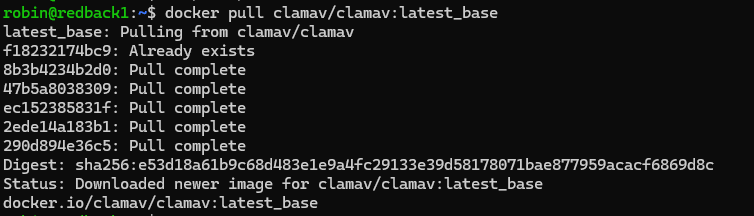

### 4.2. Creating Persistent Volumes

Create a volume for the virus database, using `docker volume create clam_db`. Create a volume for the ClamAV configuration files too. 

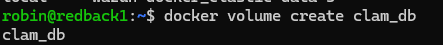

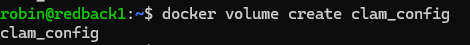

### 4.3. Identifying Writable Directories

Before starting the ClamAV container, you need to identify which directories you want to monitor. A simple way of doing this is looking for all user-writable (non-root) directories. Use the command `find / -writable -type d 2>&1 | grep -v "Permission denied"`. Here is a preview of some results you will see.

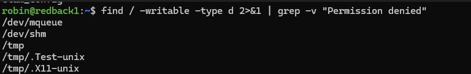

After parsing through the results, you will see many directories that are not unique to your user. These are /dev/mqueue, /dev/shm, /var/crash, /run/screen, and /run/lock. There are also common examples like /var/tmp, /tmp, and /home (this is the users' directory). Finally, you also want to monitor the volumes directory where all the container data is stored (such as the Streamlit file upload web app). This is at /var/lib/docker/volumes. With the exception of the volumes directory, the goal is to monitor all non-root directories where normal users can write files to, and perhaps hide payloads. Moreover, it also avoids performing a full-system scan, which would take up many resources.

### 4.4. Starting the Container

Before using Cronjobs to automate the scanning process, let us demonstrate how you can start up the container manually. Here is the code:

```
docker run -d --rm \
  --name "clam_container_01" \
  --log-driver=syslog \
  --log-opt tag="clamd" \
  --mount source=clam_db,target=/var/lib/clamav \
  --mount source=clam_conf,target=/etc/clamav \
  --mount type=bind,source=/home,target=/to_scan/home,readonly \
  --mount type=bind,source=/var/tmp,target=/to_scan/var/tmp,readonly \
  --mount type=bind,source=/tmp,target=/to_scan/tmp,readonly \
  --mount type=bind,source=/var/lib/php/sessions,target=/to_scan/var/lib/php/sessions,readonly \
  --mount type=bind,source=/var/crash,target=/to_scan/var/crash,readonly \
  --mount type=bind,source=/run/screen,target=/to_scan/run/screen,readonly \
  --mount type=bind,source=/run/lock,target=/to_scan/run/lock,readonly \
  --mount type=bind,source=/dev/mqueue,target=/to_scan/dev/mqueue,readonly \
  --mount type=bind,source=/dev/shm,target=/to_scan/dev/shm,readonly \
  --mount type=bind,source=/var/lib/docker/volumes,target=/to_scan/var/lib/docker/volumes,readonly \
  clamav/clamav:latest_base
```

The -d flag starts the container as a background process, and --rm removes the container in case it is stopped (to avoid having lingering containers stored with the same name). The --log-driver parameter ensures that the container's internal logs are stored and parsed via the host's syslog process. This is used to capture the ClamAV virus scans and save them on the host. Then, --log-opt sets the program logs of the container to be "clamd". This ensures that logs coming from the container are called "clamd", which is needed for the Wazuh decoders. 

As mentioned before, we mount the volumes against the database and configuration directories of the container. We also explicitly mount each of the target directories into a subdirectory of /to_scan in the container as readonly. This way, internally, ClamAV can access the directories and only scan them. 


>**Note**:
>You need to modify the clam.conf file under /var/lib/docker/volumes/clam_conf/_data/ and increase the MaxDirectoryRecursion variable to 20. Otherwise, you will experience scanning errors when running ClamAV. 

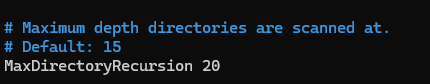

### 4.5. Performing Basic Scanning

After starting the container, there are two ways to perform scanning: with clamscan or clamdscan. The first option, clamscan, works independently from the clamd daemon and loads the virus database on its own. On the other hand, clamdscan relies on the clamd daemon to load the virus database and perform faster scanning. Moreover, clamdscan supports multi-threaded scanning. Since we are starting the container, which already runs clamd, it makes more sense to run clamdscan. 

>**Note**: clamd takes about 20 seconds to start up, once the container is started. You need to wait this period BEFORE running clamdscan, or else the tool will not work. 

For a basic scan, run `docker exec container_name clamdscan --fdpass /directory`. For a more concrete example, see the below screenshot. We use --fdpass to pass in the file descriptors for privileged files (thus avoiding privilege errors) and, for a quick example, we pass in the /to_scan/var/tmp directory, which is mapped to the host's /var/tmp directory. This has an EICAR executable in it. Note that by default, clamdscan performs recursive scanning, so you only need to pass in a top-level directory.

You will see a virus detected message. This message, via the syslog driver, will be sent to the host journald service, which Wazuh automatically monitors.

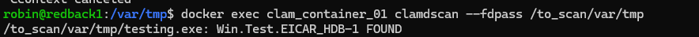

Over on the Wazuh Threat Hunting dashboard, we can see the corresponding alert.

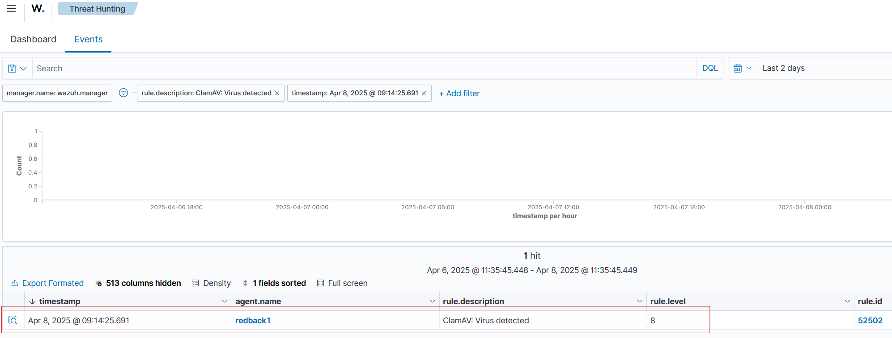
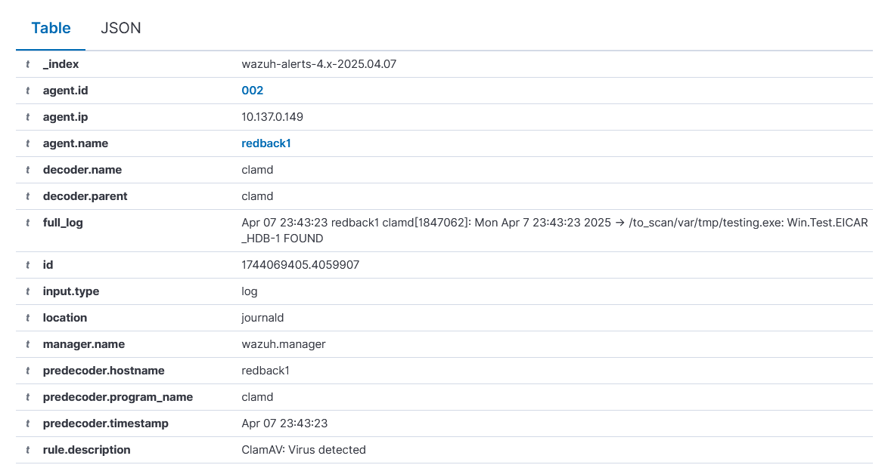

However, beyond the virus alert, there are also other ClamAV alerts mistakenly marked as virus alerts, when they are just for normal container stdout messages. This requires the decoder to be refined. 

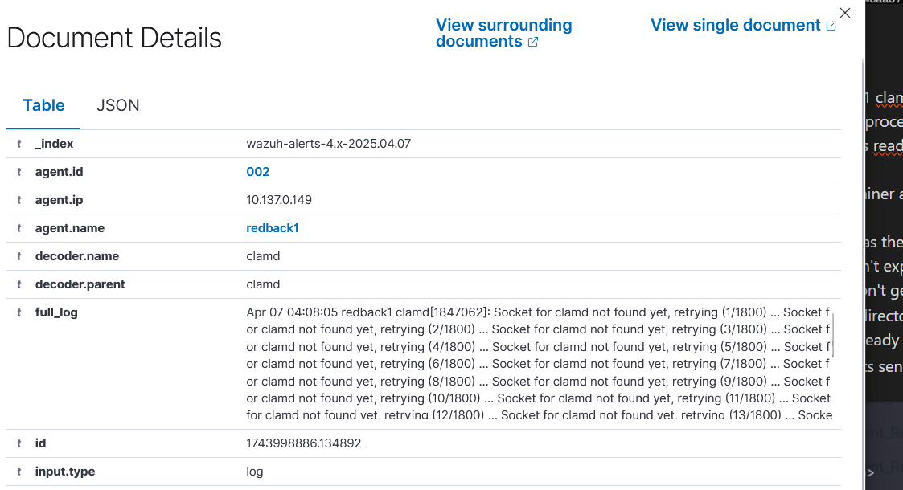

### 4.6. Refining the ClamAV Decoder

Note that earlier, we created the Docker container using the "syslog" plugin, and the name of "clamd". Since we are using a container architecture, the syslog logs would usually have the program name tied to the container ID, instead of "clamd". The decoder that Wazuh uses for ClamAV only monitors logs that have the "clamd" program name attached to them. Hence, we had to add the "clamd" name to the container.

One unintended consequence of this, however, is that all logs from the container get marked as from "clamd", even those that do not show any anti-virus scan logs. Thus, you are seeing those logs pop up in the Wazuh dashboard. 

See the decoder below, available under /var/ossec/ruleset/decoders/0075-clamav_decoders.xml in the Wazuh manager container. Note that it parses logs with the program name "clamd", and the child decoder further matches lines with the "FOUND" string, case insensitive. Now, note from the previous detection logs that they always had a "FOUND" string in capslock. Hence, if we modified this decoder to instead look for case sensitive "FOUND" strings, we could just filter out the detection logs.

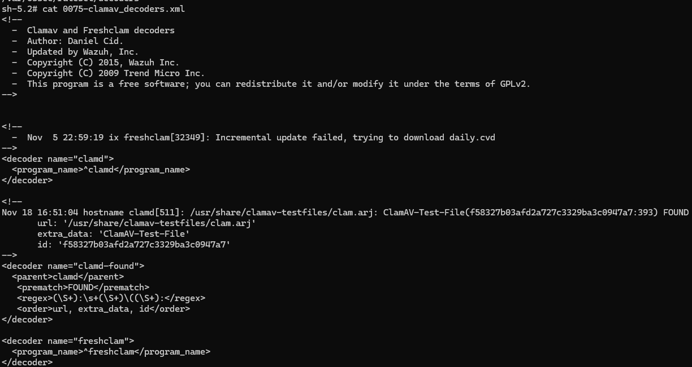

Following through with that logic, we will create a custom decoder file. Copy the contents of 0075-clamav_decoders.xml into the /var/lib/docker/volumes/single-node_wazuh_etc/_data/decoders directory on the host. Note the additional new line. This uses PCRE2 to match the FOUND string, case sensitive. 

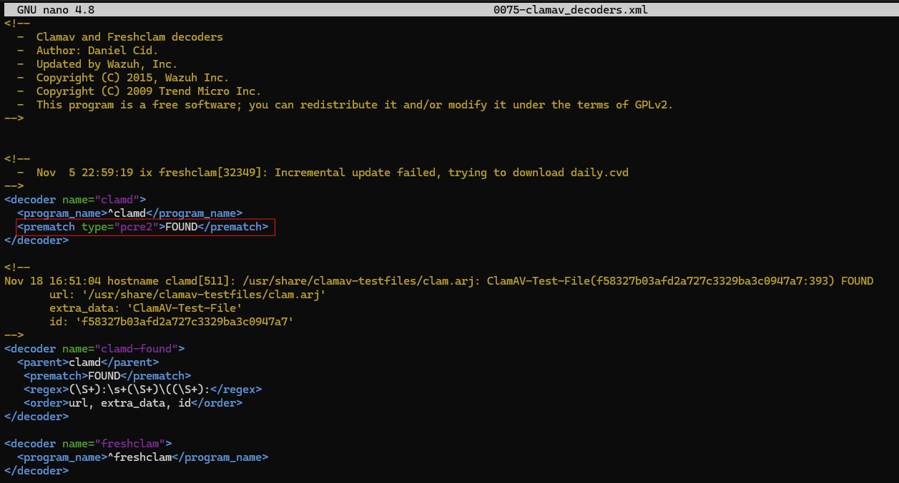

Then, we need to make the Wazuh Manager use this decoder instead of the old one. Modify the wazuh_manager.conf file of the server at /home/ben/wazuh-docker/single-node/config/wazuh_cluster/wazuh_manager.conf. Add the highlighted exclusion line and restart the Wazuh Manager container. Afterwards, you should only see virus alert notifications on the Wazuh dashboard. 

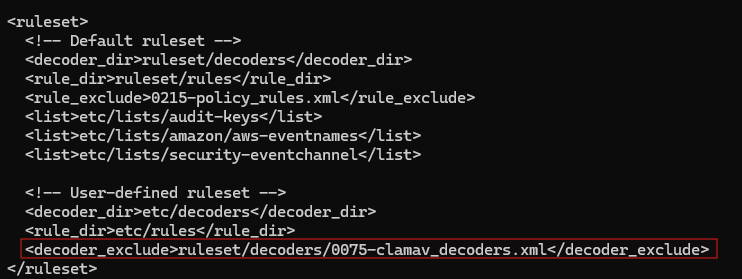

### 4.7. Automated Scanning

After setting everything up, you can manually scan files and directories for malware. To automate this process, you can create a Cronjob to automatically execute a script every, say, 12 hours. 

Here is a script you can use. It checks if the ClamAV container exists and stops it if necessary. Then, it executes the previous Docker command, and waits 20 seconds for the container to start up. Then, it runs clamdscan with the -w and -m parameters on the entire scanning directory. The -w parameter ensures that clamdscan waits up to 30 seconds in case the container has not started up, while -m enables multi-threaded scanning. The script stops the container after it has run to avoid using up resources. 

Note that every time the container is started, it will check for an updated signature database. 

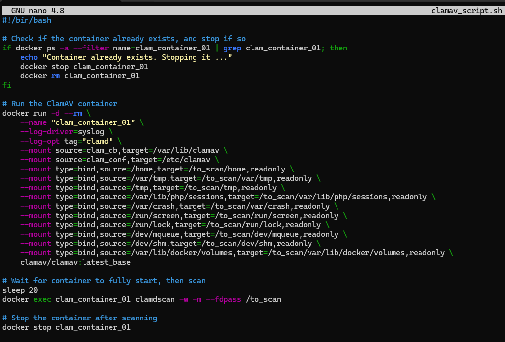

Using `crontab -e`, create a new Cronjob that runs the script every 12 hours.
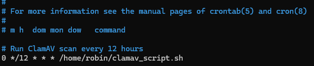

> ⚠️ **Warning**: you need to regularly check the scan results to ensure that the logs of ClamAV are being processed. 
> If they are not being processed for some reason, restart the Wazuh agent.


## 5. Final Thoughts

In this guide, we successfully implemented ClamAV across the company VM's critical directories. However, there are some considerations that could be included in future work.

On Linux, ClamAV is limited to file scanning, using features like heuristics and signatures. Unlike the Windows version, it cannot perform memory scanning in Linux. Thus, malware that resides in memory will not be detected by ClamAV. Future work should explore memory scanning tools and techniques, in particular Wazuh, which can, as an example, detect injection attacks (https://wazuh.com/blog/detecting-process-injection-attacks-with-wazuh/). 

Moreover, during this task, YARA and ClamAV integration was explored. However, it appears that YARA rules can only be passed invidually to ClamAV's scanning tools. Hence, YARA and ClamAV integration is limited to searching for individual malware strains. On the other hand, however, YARA can be integrated with Wazuh scripts to perform matching for monitored directories. YARA and Wazuh integration should be explored by future teams to enhance the ClamAV solution. 

## 6. References
- [Installing ClamAV via Docker](https://docs.clamav.net/manual/Installing/Docker.html)
- [ClamAV scanning options](https://docs.clamav.net/manual/Usage/Scanning.html)
- [Syslog Docker driver](https://docs.docker.com/engine/logging/drivers/syslog/)
- [Adding custom decoders](https://documentation.wazuh.com/current/user-manual/ruleset/decoders/custom.html)