# Integrating VirusTotal into Wazuh

:::info
**Document Creation:** 28 Mar, 2025. **Last Edited:** 28 Mar, 2025. **Authors:** Robin Spoerl.
:::

## 1. Introduction 
This document provides a brief overview of VirusTotal and the rationale behind integrating it with Wazuh on Redback Operations' VM. Additionally, this document will provide step-by-step instructions to show how future users can understand, maintain and improve the integration. It will also describe limitations and future work directions. 

## 2. Background

Redback Operations currently protects its company VM with a Wazuh SIEM and installed agent. The agent is installed directly on the VM and gathers information about the operating environment. The information is then forwarded to the Wazuh SIEM, which provides an overview of all events tracked by the agent. Currently, apart from the basic rootcheck module, the agent is not configured to check for malicious files, which poses a security risk. 

To this end, it is proposed that VirusTotal be integrated within Wazuh's FIM (file integrity module). The module can track changes made to key directories in real time, such as written files. If configured, the FIM module can extract the hashes of these written files and forward them to the online VirusTotal service. VirusTotal can look up these hashes and note if they are malicious or benign. This look up information can also be forwarded to the Wazuh SIEM. Thus, this integration allows Wazuh to check if any malicious files were written to an agent's system in real time.

## 3. Configuration Steps

### 3.1. Obtain an API key from VirusTotal

First, visit https://www.virustotal.com/gui/join-us and create a Community account.
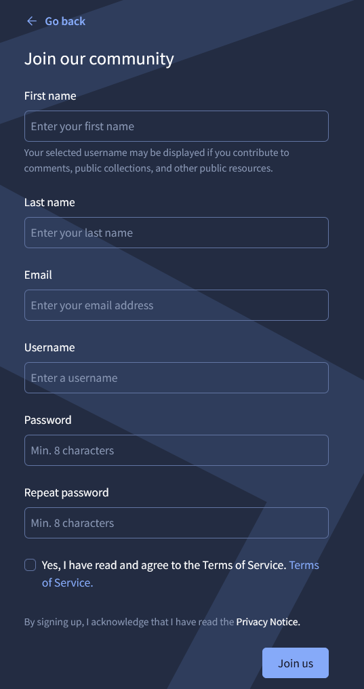

Press on your profile -> API Key. Copy the key. This key will be used to interact with VirusTotal. 
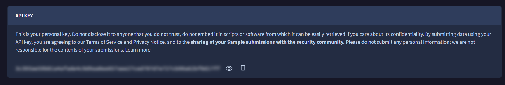

### 3.2. Modify the Wazuh manager's ossec.conf file

The Wazuh manager is a part of Wazuh and acts like the server. The manager reads from the **ossec.conf** file, which specifies configuration settings. You need to modify this file to add the API information for VirusTotal. 

To find the file, run `docker ps`. You will see a running instance called **single-node_wazuh.manager_1**. 
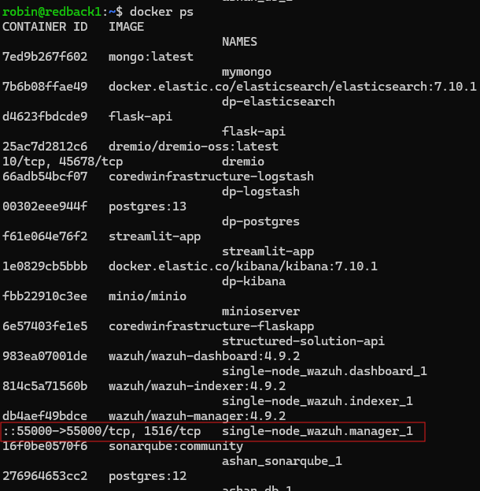

Inspect this instance using `docker inspect single-node_wazuh.manager_1`. Note the presence of **ossec.conf**. In fact, **ossec.conf** is a file stored inside the respective Docker instance. If you were to go into the Docker instance and modify the file directly, whenever the Docker instance restarts all progress would be lost. Instead, to achieve data persistence, these files are mapped to files outside of the containers. Modifying these mapped files ensures that no data is lost when the containers are restarted. In this case, the manager's **ossec.conf** file is mapped to **wazuh_manager.conf**. So, you need to modify this file instead.
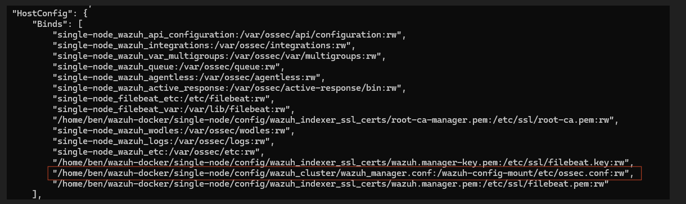

Open the file using any editor (you will need higher privileges for this) and add the following code block:
```
<integration>
  <name>virustotal</name>
  <api_key><VIRUSTOTAL_API_KEY></api_key> <!-- Replace with your VirusTotal API key -->
  <group>syscheck</group>
  <alert_format>json</alert_format>
</integration>
```
See the example screenshot. Since this resource is publicly available, half of the API key has been blurred out. 
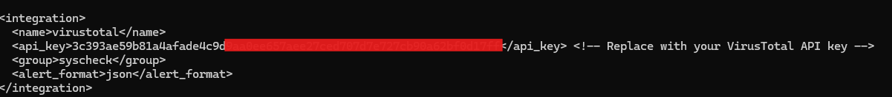

Save your changes and restart the manager container. 
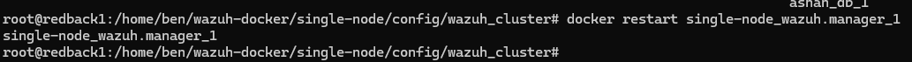

On the Wazuh dashboard, an option for VirusTotal will show up now. 
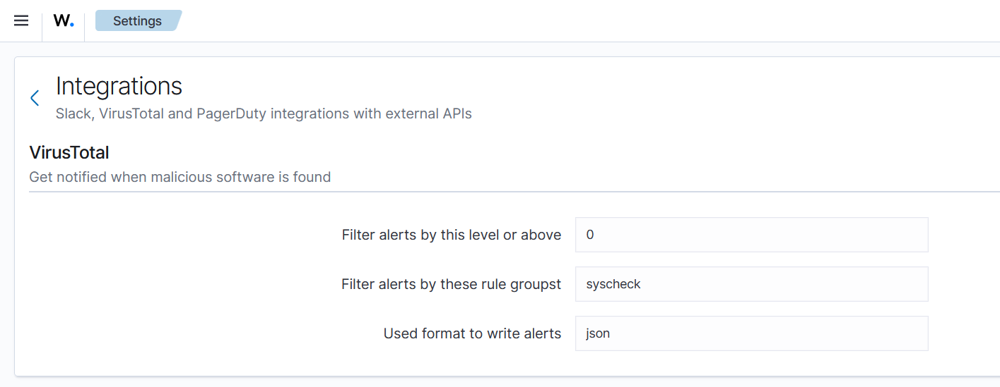

### 3.3. Change the agent's FIM settings

Now that the manager has been set up with VirusTotal, you need to modify the FIM settings to perform real-time scanning on a specified number of directories. By default, FIM performs a full system scan with several default system directories every 12 hours, but this is not ideal. To modify this, you need to access the **ossec.conf** file of the **agent**, NOT the **manager**. The agent file is by default stored under **/var/ossec/etc** in the agent's system. You need elevated privileges to access this file.
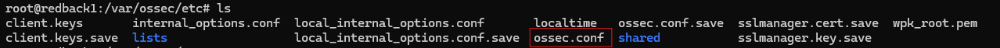

Once there, you can choose any directories to monitor. However, due to API limitations, these must be directories that are not very active. For example, since the Data Warehouse's file upload tool uses the **dw-bucket-bronze** directory, it is useful to monitor this directory in case a malicious file gets uploaded. While Deakin seems to have an IPS installed that detects malicious uploads on its network, it is valuable regardless to monitor this directory as an extra layer of security. 

Finally, the  **/usr/bin** and **/usr/sbin** directories store important system and user binaries. It would be valuable to monitor these.  

Add the following code block to the **syscheck** section:
```
<directories check_all="yes" realtime="yes">/usr/bin, /usr/sbin, /var/lib/docker/volumes/data-lakehouse_minio-data/_data/dw-bucket-bronze</directories>
```
**check_all** ensures that all important information is extracted from any files written to these directories, including their hashes. **realtime** ensures that these directories are always monitored. Note that you can modify these directories as needed.

See the example screenshot.
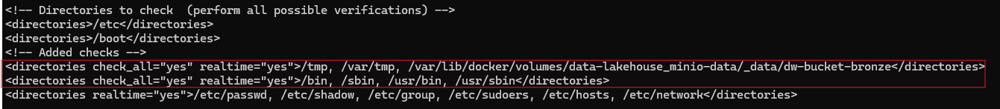

Note in the previous screenshot the second line containing critical system files like **/etc/passwd** and **/etc/shadow**. While not entirely related to VirusTotal integration, these files and directories were added to the real-time checking module, away from the default 12-hour checks. The rationale behind this was that these files and directories contain critical information that, when modified, could be indicative of an attack.

Save your changes and restart the wazuh-agent process.
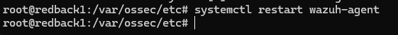

### 3.4. Test VirusTotal integration

You can write files to monitored directories and see corresponding alerts appear in both the FIM and VirusTotal modules. As an example, assume that you have modified the previous **sysconfig** block to monitor the non-critical **/tmp** and **/var/tmp** directories. While VirusTotal integration would not work well on these directories on an ongoing basis, they are good starting points nonetheless to try out the FIM without damaging anything. The actual company implementation does NOT monitor these directories.

To demonstrate the monitoring, "tst.txt" files were written to the non-critical **/tmp** and **/var/tmp** directories. The hashes of the files were extracted by FIM and sent to VirusTotal, which had no results.  
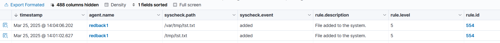
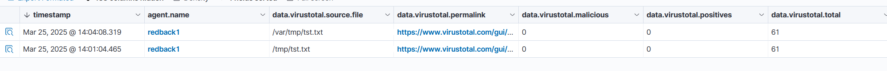

Moreover, you can also test the VirusTotal integration using malicious files such as EICAR. EICAR is a "safe" malicious file used to test basic anti-virus capabilities. First, download the file in any monitored directory.
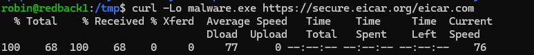

Note the corresponding warning on the VirusTotal tab, with a label ("1") noting that the file is malicious. There is also a corresponding link which describes the file in more detail.
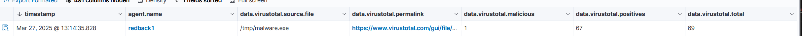

### 3.5. Limitations

The tool was implemented using the Public API, which is limited to 500 requests per day and 4 requests per minute. Thus, VirusTotal cannot be used for system-wide monitoring. Likewise, the Public API is severely limited to directories which do have a lot of recurring file modifications. While this is useful for, say, the internal file upload tool, it also means that popular malware directories like **/tmp** cannot be effectively monitored. Consequently, future work will need to focus on tools that do not rely on APIs, like YARA and ClamAV, to complement this hash-based approach. 

In addition, the tool uses hashes to detect uploaded malware samples. Yet, these hashes are limited to known malware samples. If an attacker were to apply an obfuscation or modification technique to an existing sample, which they have not applied elsewhere, VirusTotal would likely not detect the sample. Thus, while this integration enhances a defence-in-depth strategy, it should not be relied upon as the sole security measure. 

Finally, the Public API is forbidden to be used in a commercial setting. Hence, if Redback Operations were to move to a commercial setting in the future, they would need to investigate the Premium API or other options. 

## 4. References
- [VirusTotal Integration Wazuh Guide](https://documentation.wazuh.com/current/user-manual/capabilities/malware-detection/virus-total-integration.html)
- [EICAR](https://www.eicar.org/download-anti-malware-testfile/)
