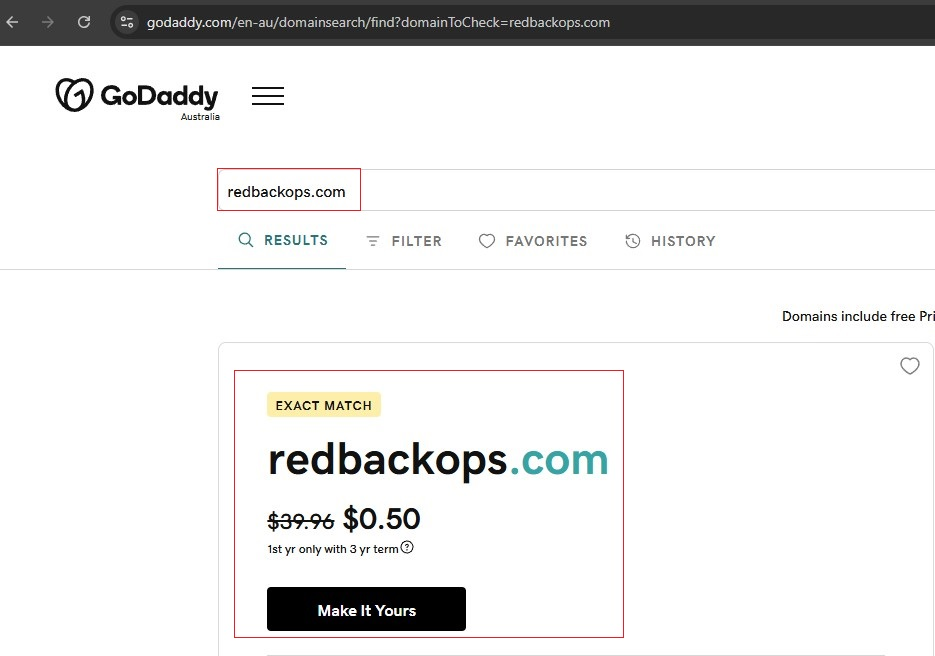
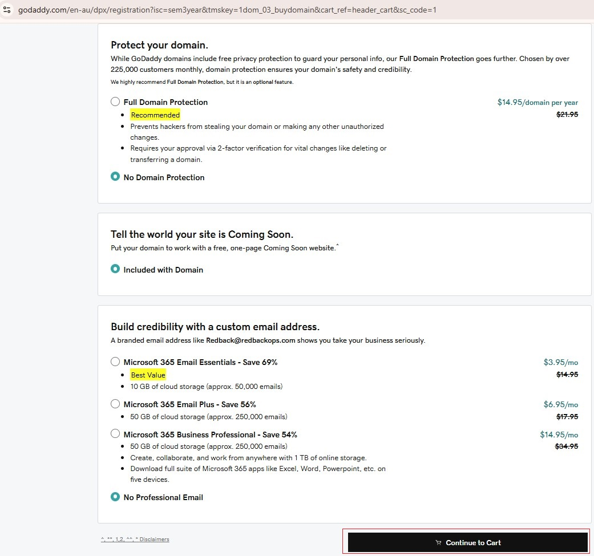
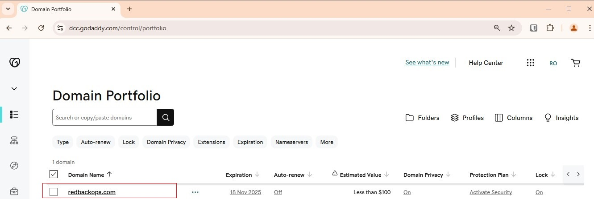
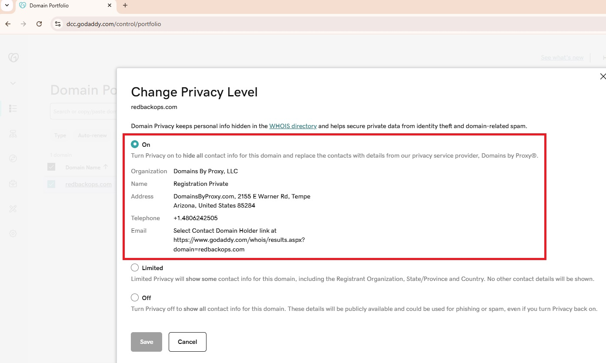
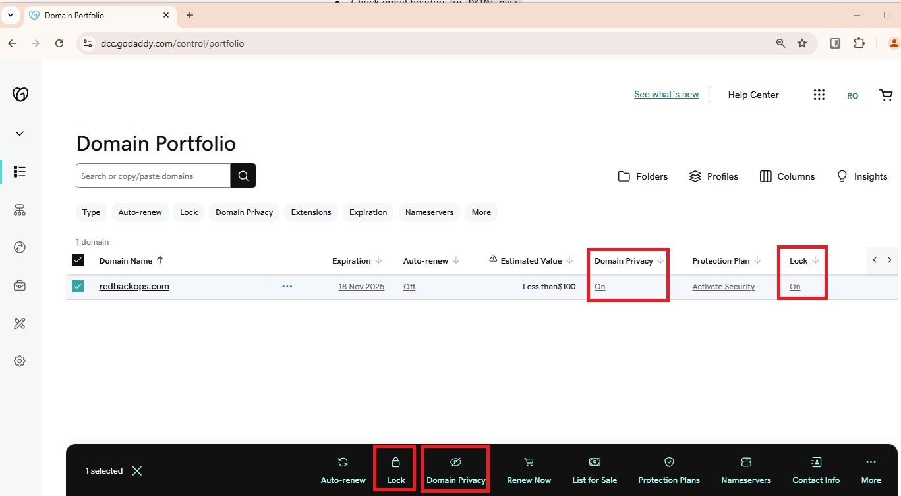
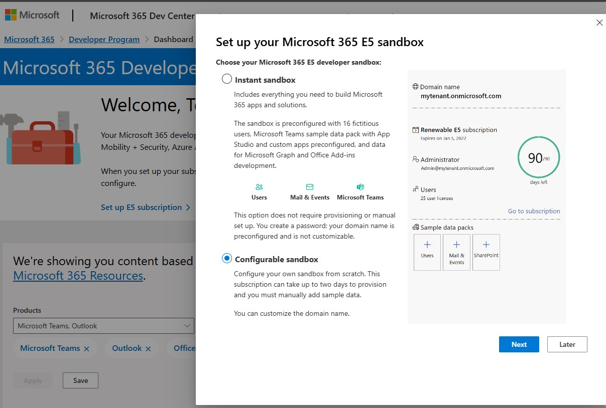
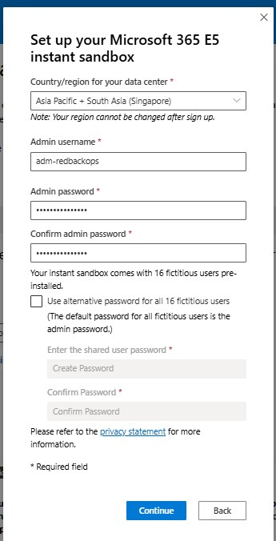

# Phase 1 – Domain Registration & Basic Email Infrastructure Setup
#  (As-Built Documentation)

:::info
**Document Creation:** 14 Dec, 2024. **Last Edited:** 14 Dec, 2024. **Authors:** Bikendra Gurung.
  **Effective Date:** 14 Dec 2024. **Expiry Date:** 14 Dec 2025.
:::

## Objective
The objective of this phase is to establish the foundational components for the implementation of a secure email infrastructure for Redback Operations. This phase focuses on:

1. **Domain Registration**: Securing a domain for Redback Operations.  
2. **Email Service Provider (ESP) Setup**: Setting up an Email Service Provider (ESP) with initial configurations.

## Deliverables
1. A registered domain.  
2. A selected Email Service Provider (ESP).  

---

## 1. Domain Registration
Outlined below are the steps undertaken for Domain Registration:

### 1.1. Domain Registration
#### 1.1.1. Select a domain name:  
For this project, the selected domain name is – `redbackops.com`.

> Initially, the domain name `redbackops.com.au` was considered, but registering a `.com.au` or `.net.au` domain requires the customer to:  
> - Be a commercial entity  
> - Have either an Australian Company Number (ACN) or Australian Business Number (ABN)

#### 1.1.2. Select a reputable domain registrar:  
For this project, the selected registrar is – **GoDaddy**.

#### 1.1.3. Register the domain:  
Register the domain with the chosen registrar (**GoDaddy**).  

#### 1.1.4. Verify domain ownership:  
Ensure that the domain appears under the ‘My Domains’ section in the dashboard.  

---

### 1.2 Domain Security Enhancement
#### 1.2.1. Enable Domain Privacy:  
Enable Domain Privacy to protect the personal information of the domain owners.  
[More Information](https://www.godaddy.com/en-au/help/what-is-domain-privacy-41145#options)

#### 1.2.2. Enable Domain Lock:  
Enable Domain Lock to prevent the domain from unauthorized transfers, changes, or modifications.  
[More Information](https://www.godaddy.com/en-au/help/unlock-or-lock-my-domain-410)

---

## 2. Email Service Provider (ESP) Selection

### 2.1 Research and Select an ESP
#### 2.1.1. Select an Email Service Provider (ESP):  
For this project, the selected email service provider is – **Microsoft 365 Exchange Online**.

#### 2.1.2. Criteria for the ESP Selection:  
1. Advanced security features, compliance, and governance capabilities.  
2. Scalability features to support future growth and integration with the company’s other systems.  
3. Support for advanced security capabilities and email authentication protocols such as SPF, DKIM, and DMARC.  
4. High availability is supported by Microsoft’s global infrastructure.

---

### 2.2. Set up Email Infrastructure by Configuring the Selected ESP
#### 2.2.1. Setup Process:  
For this project, the **Microsoft 365 Developer Program** was used to set up the M365 Exchange Online email infrastructure.  
[More Information](https://learn.microsoft.com/en-us/office/developer-program/microsoft-365-developer-program)

#### 2.2.2. Program Sign-Up:  
Sign up for the **Microsoft 365 Developer Program** for the project implementation.  

> **Note**: For this project, the ‘Instant sandbox’ option was chosen for quick setup. However, it is recommended to go with the ‘Configurable sandbox’ option.  
> - If you select a configurable sandbox, you can customize your domain name.  
> - You will have an empty sandbox that you must populate with sample data.  
> - The provisioning of the ‘Configurable sandbox’ may take up to two days.

---

### 2.3. Create an Initial Email Account
#### 2.3.1. Create Account:  
Create an initial email account (e.g., `adm-redbackops@redbackops.com`) as part of the Microsoft 365 Developer Program sign-up process.  

---

## References
- [Register a domain name - Business.gov.au](https://business.gov.au/online-and-digital/business-website/register-a-domain-name#:~:text=com.au%20or%20.,Australian%20Business%20Number%20(ABN))  
- [What is domain privacy - GoDaddy](https://www.godaddy.com/en-au/help/what-is-domain-privacy-41145#options)  
- [Unlock or lock my domain - GoDaddy](https://www.godaddy.com/en-au/help/unlock-or-lock-my-domain-410)  
- [Microsoft 365 Developer Program Overview](https://learn.microsoft.com/en-us/office/developer-program/microsoft-365-developer-program)  
- [Get started with Microsoft 365 Developer Program](https://learn.microsoft.com/en-us/office/developer-program/microsoft-365-developer-program-get-started)  

# DNS Configuration Records

| Protocol | Record Type | Name/Host                 | Value                                                                                                      | Notes                                                                                          |
|----------|-------------|---------------------------|------------------------------------------------------------------------------------------------------------|------------------------------------------------------------------------------------------------|
| SPF      | TXT         | @                         | `v=spf1 include:spf.protection.outlook.com -all`                                                           |                                                                                              |
| DKIM     | CNAME       | selector1._domainkey      | `selector1-redbackops-com._domainkey.6wz4nv.onmicrosoft.com`                                               | Add the following TXT record to the domain’s DNS (only if not already added in phase 2.)     |
| DKIM     | CNAME       | selector2._domainkey      | `selector2-redbackops-com._domainkey.6wz4nv.onmicrosoft.com`                                               | Run PowerShell scripts sequentially to enable DKIM signing. Scripts provide step-by-step guidance. |
| DMARC    | TXT         | _dmarc                   | `v=DMARC1; p=reject; pct=100; fo=1; rua=mailto:blueteam@redbackops.com,mailto:dmarc_agg@vali.email; ruf=mailto:blueteam@redbackops.com,mailto:dmarc_agg@vali.email;` | Use a [DMARC Record Wizard](#) to generate a DMARC record.                                    |

