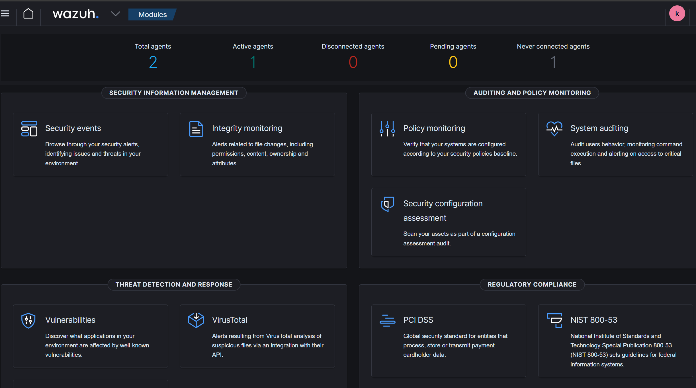
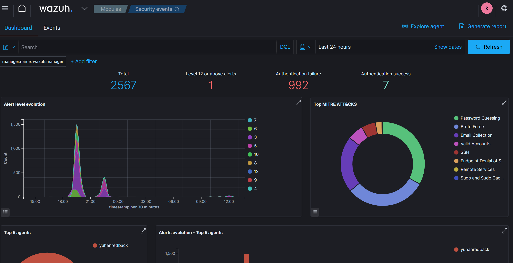
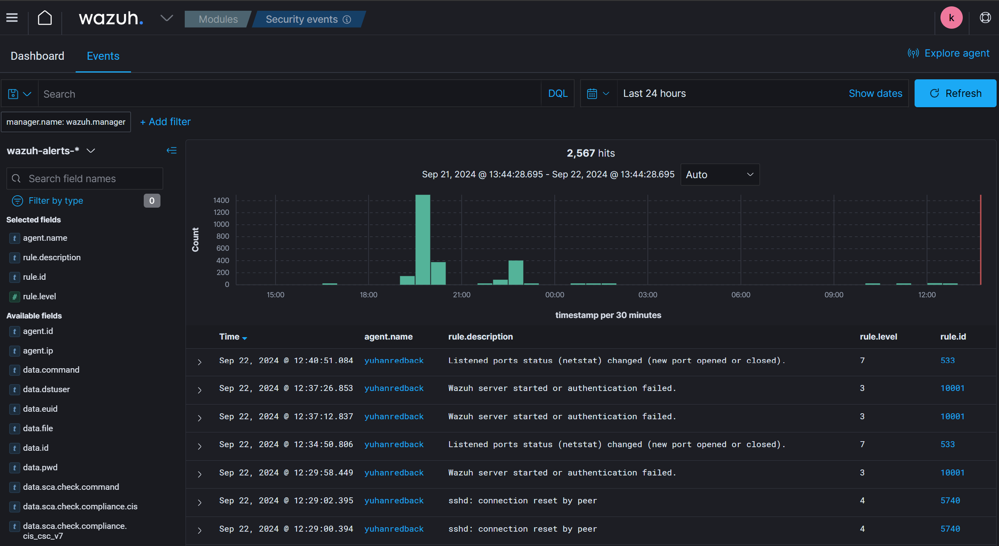

:::important

By **Prabhgun Singh**. **22/09/2024**

:::

# Cyber Security Gap Analysis Report for Redback Operations

# Executive Summary

This report evaluates the current state of IT and cybersecurity infrastructure at Redback Operations, identifies significant gaps in existing policies and procedures, and offers recommendations for enhancing the security framework. The focus is on the necessity for a comprehensive Information Security Management System (ISMS) and highlights areas where current policies are lacking or entirely absent.

# Purpose and Scope

The primary objective of this gap analysis is to benchmark Redback Operations' IT and cybersecurity policies against industry standards and best practices. The evaluation covers the robustness of security policies and procedures across multiple defense layers to ensure a thorough assessment.

# Current State Analysis

# IT Infrastructure and Technology

Redback Operations is transitioning to include both on-premise and cloud-based assets, particularly deploying Microsoft Azure alongside Google Cloud Platform. This shift has resulted in technical debt that needs addressing to mitigate risks and close security gaps. Due to this transitional phase, the report focuses on high-level security policy rather than a detailed technical policy and controls analysis.

# Cybersecurity Posture

Currently, the cybersecurity measures at Redback Operations encompass a limited range of policies, tools, and controls. The absence of a clear ISMS and security governance strategy has resulted in significant gaps in the security posture. Using defense-in-depth as a metric, the policies lack both depth and coverage.

# Regulatory and Industry Framework Compliance

Redback Operations complies with the Australian Privacy Act and adheres to the Australian Privacy Principles. However, there are only minor references to the Essential 8 Framework, and there is no adherence to comprehensive industry security frameworks such as NIST, CIS, or ASD ISM. The overall assessment indicates low cyber maturity due to incomplete and minimal custom policies.

# Gap Analysis

# Policy, Procedure, and Control Gaps

Redback Operations faces significant exposure due to the lack of core IT and IT security policies. Addressing these vulnerabilities is crucial for the company’s security and operational efficiency. The primary finding is the absence of a comprehensive ISMS. The lack of formal policies across various IT and cybersecurity domains is identified as a critical vulnerability. While additional standards, policies, procedures, and guidelines are necessary for improving cyber maturity, the fundamental policies outlined in this document are prioritized for development.

# Data Classification and Data Loss Prevention

Finding: No existing policy.

Objective: Mitigate risks associated with unauthorized data access and loss, ensuring the integrity and confidentiality of sensitive information.

Key Subjects:

•	Definition of data categories and sensitivity controls.

•	Standards for data handling, storage, and transmission.

•	Procedures for data loss prevention, including technological and process-based controls.

•	Roles and responsibilities for data management and protection.

•	Enhancement and integration with existing data breach reporting mechanisms.

# Cloud Security (Microsoft Azure)

Finding: No existing policy.

Objective: Define standards and controls for cloud-based assets, covering risk mitigation for cloud environments.

Key Subjects:

•	Security responsibilities of the cloud provider versus the organization.

•	Security policy and frameworks for deploying assets securely to Azure.

•	Access control and identity management for cloud services.

•	Secure development practices for cloud-based applications.

# Endpoint Security

Finding: Limited policy coverage, mainly referencing the Essential 8 Framework.

Objective: Protect organizational devices against cyber threats, ensuring the security of data accessed and processed by these devices.

Key Subjects:

•	Mandatory security software requirements (antivirus, firewall, etc.).

•	Regular update and patch management procedures.

•	Secure configuration standards for all endpoints.

•	References to the Essential 8 Framework.

# Server Security and Hardening

Finding: Limited policy coverage, mainly referencing the Essential 8 Framework.

Objective: Establish secure server operations, minimizing vulnerabilities through stringent security practices and hardening techniques.

Key Subjects:

•	Hardening guidelines for operating systems and services.

•	Patch management and vulnerability assessment schedule.

•	Access control measures and secure administration protocols.

•	Physical security measures for server environments.

•	Monitoring and response strategies for server-related security events.

# Encryption

Finding: Limited content on encryption standards, mostly related to existing infrastructure.

Objective: Ensure the confidentiality and integrity of data in transit and at rest through strong encryption standards.

Key Subjects:

•	Approved encryption algorithms and protocols.

•	Key management lifecycle, including generation, storage, and destruction.

•	Use cases for encryption (data at rest, data in transit, etc.).

•	Encryption audit and verification procedures.

# Monitoring and Log Analytics

Finding: Limited coverage, primarily related to Google Chronicle.

Objective: Enable timely detection and response to security incidents through comprehensive monitoring and analysis of system logs.

Key Subjects:

•	Log collection and management policy.

•	Real-time monitoring and alerting mechanisms.

•	Common incident response scenarios and playbooks.

•	References to common SOC (Security Operations Center) design principles.

# User Awareness Training

Finding: No existing training content.

Objective: Foster a security-conscious culture within the organization, empowering employees to recognize and respond to cybersecurity threats.

Key Subjects:

•	Overview of common cyber threats and attack vectors.

•	Secure practices for email, web browsing, and device usage.

•	Password management and multi-factor authentication.

•	Reporting procedures for suspicious activities or incidents.

•	Regular training schedule and policy compliance requirements.

# External Attack Surface Management

Finding: No existing policy.

Objective: Identify, map, assess, and secure external-facing assets to reduce the risk of attacks exploiting these exposures.

Key Subjects:

•	Inventory and classification of external-facing assets.

•	Regular assessment procedures for identifying vulnerabilities.

•	Remediation priorities and timelines for identified risks.

•	Coordination with third parties for securing shared assets.

•	Continuous improvement process for attack surface reduction.

•	Policy compliance requirements for onboarding new assets.

# BYOD and Mobile Device Management

Finding: No existing policy.

Objective: Establish control over personal devices used for work purposes, ensuring they meet organizational security standards.

Key Subjects:

•	Security requirements and controls for personal devices accessing corporate resources.

•	Device registration and compliance verification processes.

•	Data separation and encryption on personal devices.

•	Lost or stolen device response procedures.

•	Privacy considerations for employees and the organization.

# Technical Gaps

Due to ongoing platform changes and pending implementations of technical security tools, specific technical gaps are currently not applicable.

# Recommendations

# Strategic Recommendations

•	Develop and implement comprehensive policies for each identified gap area, aligned with industry best practices and regulatory requirements.

•	Establish a formal ISMS to oversee policy implementation and compliance.

•	Enhance user awareness training to cover critical cybersecurity threats and best practices.

•	Implement technical measures to address identified vulnerabilities in network, server, and application security.

•	Ensure the ISMS is operational and actively used to guide the company towards maintaining a robust security posture.

# Implementation Plan

The Redback Operations Infrastructure and Policy teams have already started addressing the identified gaps. This includes policy development, training programs, and technical security enhancements. Responsibilities are assigned to respective team members, with progress tracked using project management tools such as Trello.

# Conclusion

This gap analysis report highlights the urgent need for a comprehensive review and enhancement of Redback Operations' IT and cybersecurity policies. By addressing the identified gaps, the company can significantly improve its security posture and resilience against cyber threats.

# Screenshots

