# Wazuh Docker Container and Web Container Runtime Monitoring

:::info
**Document Creation:** 05 May, 2025. **Last Edited:** 05 May, 2025. **Authors:** Bikendra Gurung.
<br></br>**Effective Date:** 05 May, 2025. **Expiry Date:** 05 May, 2026.
:::

## Overview
This technical guide provides detailed step-by-step instructions on how to configure Wazuh to monitor Docker container lifecycle events and runtime web container logs on a Docker host. In addition, it enables detection of container activity and potential web-based attacks, enhancing overall visibility and incident response capabilities.

---

## Prerequisites
1. A Wazuh agent installed on the Docker host.
2. Docker installed on the host system.
3. Admin/Root access to the Wazuh Docker host (Linux server).
4. Familiarity with docker, docker-compose, and basic Linux operations.

---

## Step 1: Install Docker Python Library

Install the required Python library and dependencies to allow Wazuh to interface with Docker:

```bash
sudo su
cd ~
apt-get update && apt-get install python3
pip3 install docker==7.1.0 urllib3==2.2.2 requests==2.32.2
```

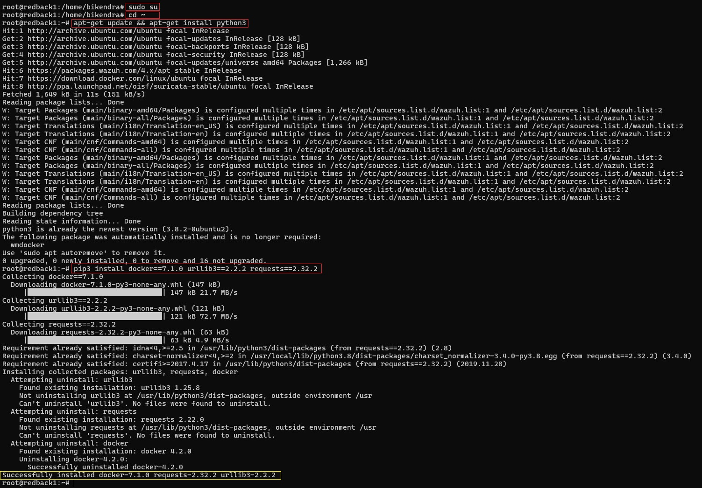

---

## Step 2: Configure Wazuh Agent for Docker Listener

### 2.1. Enable Docker Listener in Wazuh Agent

Edit the agent configuration file:

```bash
vim /var/ossec/etc/ossec.conf
```

Add the following block:

```xml
<wodle name="docker-listener">
  <interval>10m</interval>
  <attempts>5</attempts>
  <run_on_start>no</run_on_start>
  <disabled>no</disabled>
</wodle>
```

> Note:  
> • This enables the Wazuh Docker wodle to collect Docker container metadata and activity events.  
> • The listener attempts to execute five times at ten-minute intervals if it fails.

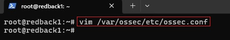
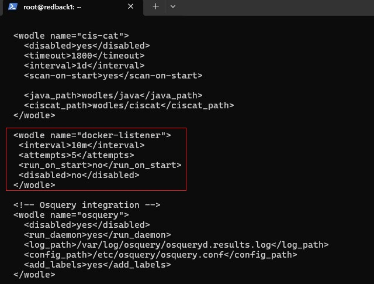

### 2.2. Restart Wazuh Agent

```bash
systemctl restart wazuh-agent
```

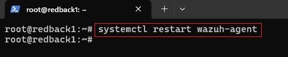

---

## Step 3: Test Container Lifecycle Events

### 3.1. Simulate typical container activity to verify detection:

```bash
# 1. Start a container
docker run -d --name test-container httpd

# 2. Pause the container
docker pause test-container

# 3. Resume the container
docker unpause test-container

# 4. Stop the container
docker stop test-container

# 5. Remove the container
docker rm test-container

# 6. Remove the image
docker rmi httpd
```

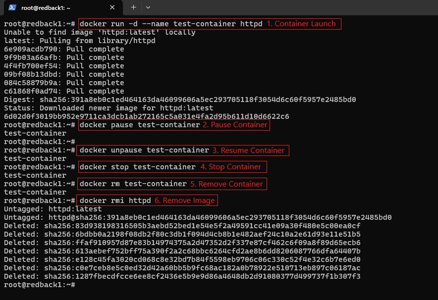

### 3.2. Observe the corresponding event logs

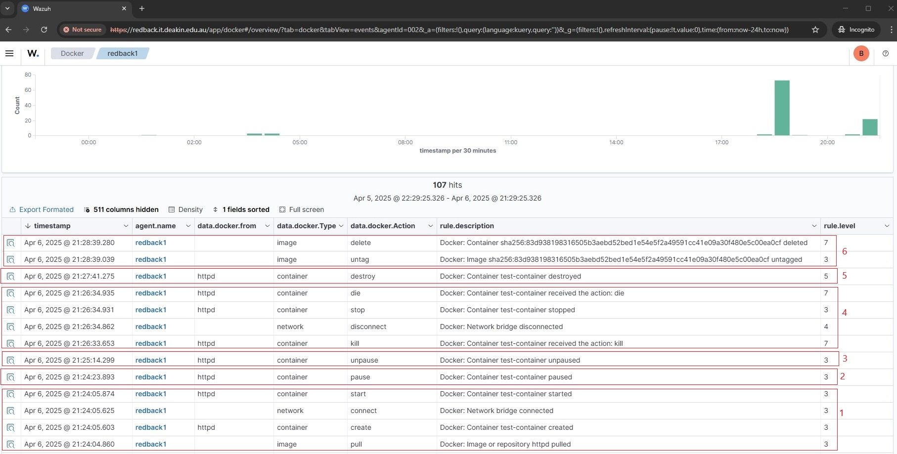

---

## Step 4: Configure Web Container Runtime Log Monitoring
Configure the Wazuh agent on the Docker server to forward all container runtime logs to the Wazuh server.

### 4.1. Modify Wazuh Agent Config

```bash
vim /var/ossec/etc/ossec.conf
```

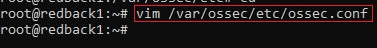

### 4.2. Add Configuration Block
Add the configuration block below to monitor container logs

```xml
<localfile>
  <log_format>syslog</log_format>
  <location>/var/lib/docker/containers/*/*-json.log</location>
</localfile>
```

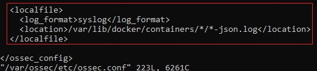

> Note:  
> • Wildcards * are used so Wazuh can monitor dynamically named container log paths.  
> • The typical pattern is `/var/lib/docker/containers/<CONTAINER_ID>/<CONTAINER_ID>-json.log`.

### 4.3. Restart the Agent

```bash
systemctl restart wazuh-agent
```

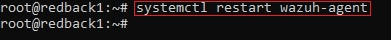

---

## Step 5: Configure Wazuh Server Decoders

### 5.1. Edit Local Decoder File

```bash
vim /var/ossec/etc/decoders/local_decoder.xml
```

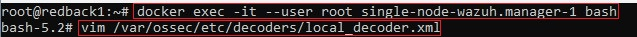

### 5.2. Add Decoders
Add the following decoders:

```xml
<decoder name="web-accesslog-docker">
  <parent>json</parent>
  <type>web-log</type>
  <use_own_name>true</use_own_name>
  <prematch offset="after_parent">^log":"\S+ \S+ \S+ \.*[\S+ \S\d+] \.*"\w+ \S+ HTTP\S+" \d+</prematch>
  <regex offset="after_parent">^log":"(\S+) \S+ \S+ \.*[\S+ \S\d+] \.*"(\w+) (\S+) HTTP\S+" (\d+)</regex>
  <order>srcip,protocol,url,id</order>
</decoder>

<decoder name="json">
  <parent>json</parent>
  <use_own_name>true</use_own_name>
  <plugin_decoder>JSON_Decoder</plugin_decoder>
</decoder>
```

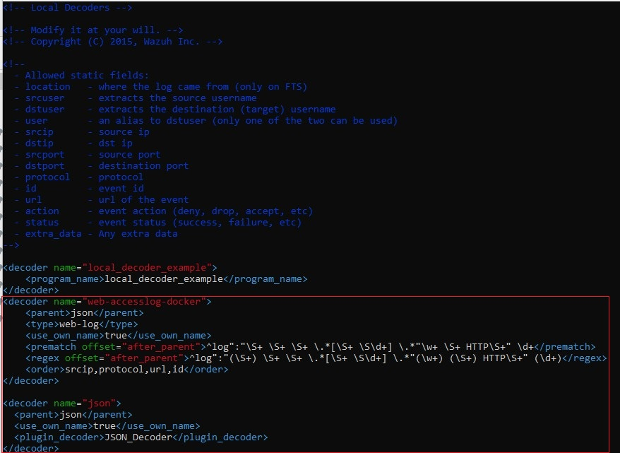

### 5.3. Restart the Wazuh Manager

```bash
docker restart single-node-wazuh.manager-1
```

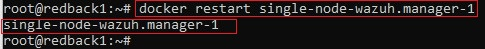

---

## Step 6: Simulate Web Attacks in Containers

### 6.1. Run a web container and simulate a SQLi attack to generate attack-like logs

```bash
# 1. Create a web container called test-container
docker run --name test-container -p 8082:80 -d nginx

# 2. Normal access – check that the web container is running and accessible by sending a request.
curl http://redback.it.deakin.edu.au:8082

# 3. Simulate a SQL injection attempt by sending a crafted request.
curl -XGET "http://redback.it.deakin.edu.au:8082/users/?id=SELECT+*+FROM+users"
```

> Note: If an alert isn’t triggered immediately, wait briefly and repeat the SQLi request.

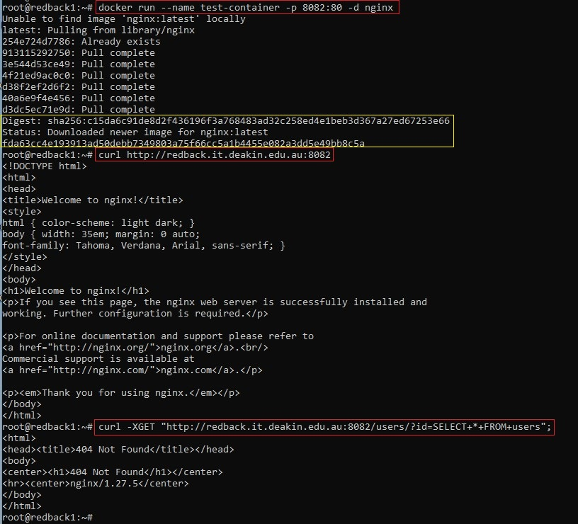

### 6.2. Observe the corresponding event logs in the Wazuh Dashboard.    
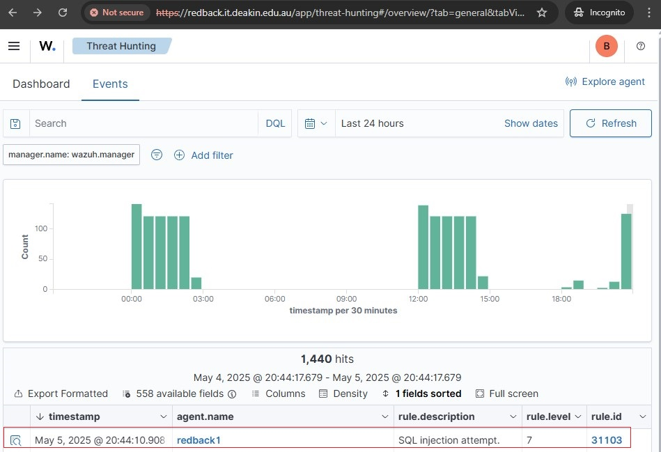
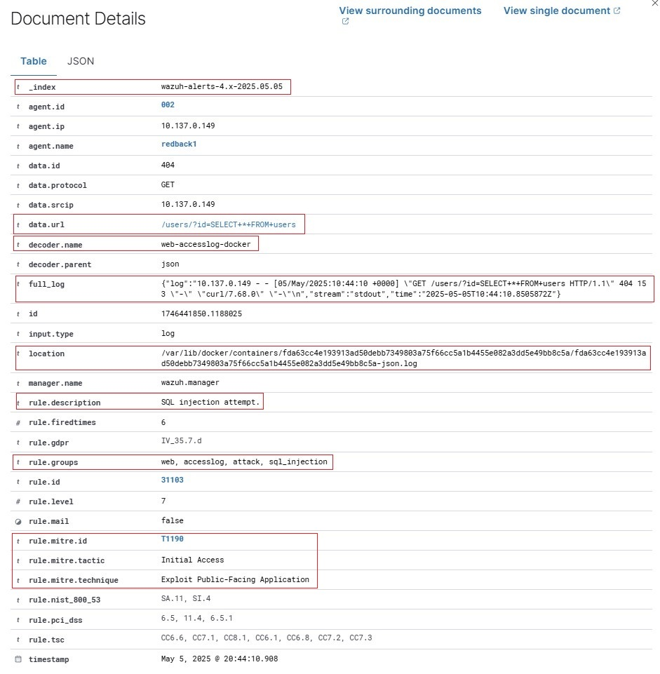
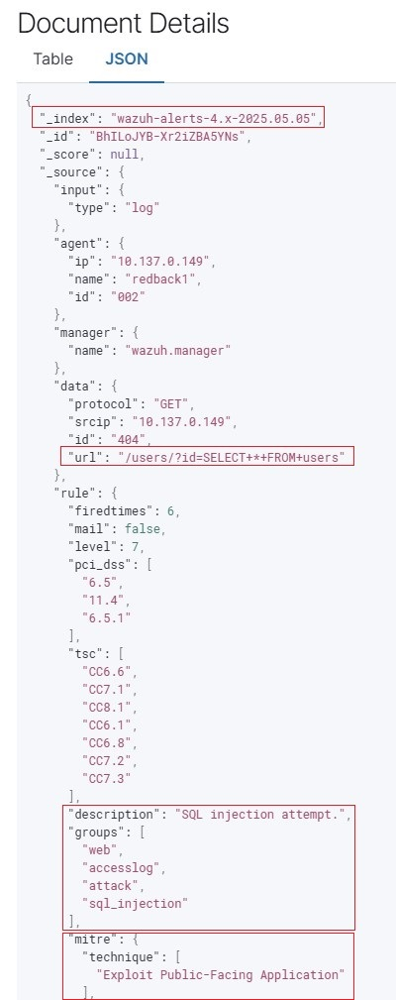
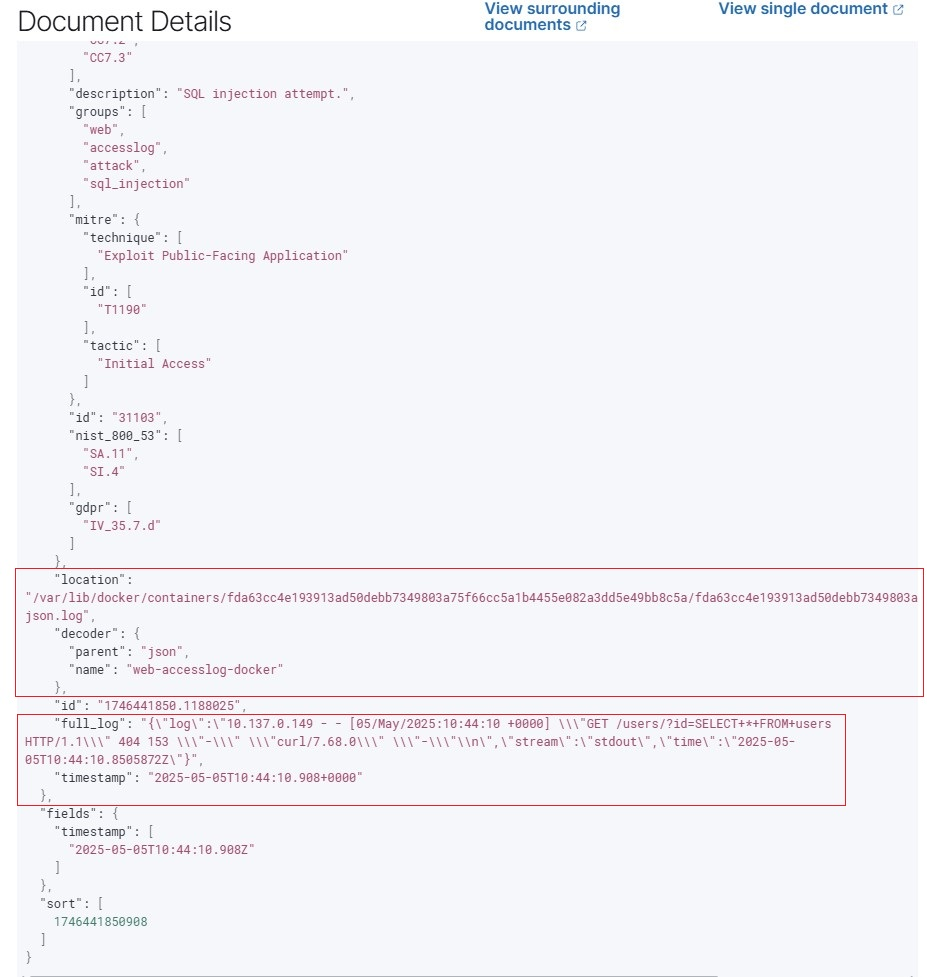

---

## Notes

- Ensure container logging drivers are set to `json-file` (default).
- Docker logs must be readable by the Wazuh agent.
- Alerts will appear in the Wazuh Dashboard tagged under `web`, `accesslog`, `attack`, and/or `sql_injection` for web access logs, and `docker` for container lifecycle events.

---

## References

- https://documentation.wazuh.com/current/user-manual/capabilities/container-security/use-cases.html
- https://wazuh.com/blog/docker-container-security-monitoring-with-wazuh/