# Wazuh Integration with Microsoft Entra ID – SSO and Role-Based Access Control (RBAC) Guide

:::info
**Document Creation:** 05 May, 2025. **Last Edited:** 05 May, 2025. **Authors:** Bikendra Gurung.
<br></br>**Effective Date:** 05 May, 2025. **Expiry Date:** 05 May, 2026.
:::

## Overview

This guide provides step-by-step instructions for integrating Microsoft Entra ID (formerly known as Azure AD) as an Identity Provider (IdP) to enable Single Sign-On and enforce Role-Based Access Control (RBAC) for the Wazuh SIEM platform at Redback Operations.

## Integration Overview

Outlined below are the major steps involved in the SSO and RBAC integration:
1. Microsoft Entra ID Configuration
2. Wazuh indexer configuration
3. Wazuh dashboard configuration
4. RBAC Role Mapping

## Step 1: Microsoft Entra ID Configuration

### 1.1. Prerequisites
1.1.1. Log in to the Microsoft Entra ID portal at https://entra.microsoft.com/.  
1.1.2. Ensure that the account that you are logged in with has one of the following roles assigned:
- Application Administrator
- Cloud Application Administrator
- Global Administrator

### 1.2. Create Enterprise Application
1.2.1. Navigate to **Microsoft Entra ID -> Enterprise applications -> New application -> Create your own application**.  
1.2.2. Select **Integrate any other application you don't find in the gallery**. Give a name to the application and click Create. In our case, we name this application `redback-wazuh-sso`.  
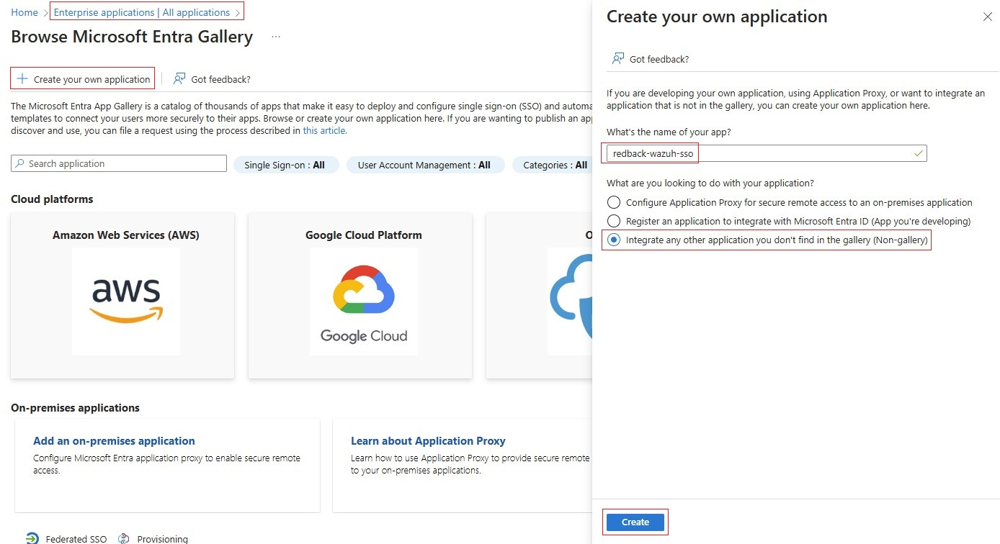

### 1.3. Create Application Role
1.3.1. Go back to the **Microsoft Entra ID** portal.  
1.3.2. Click on **App Registrations**.  
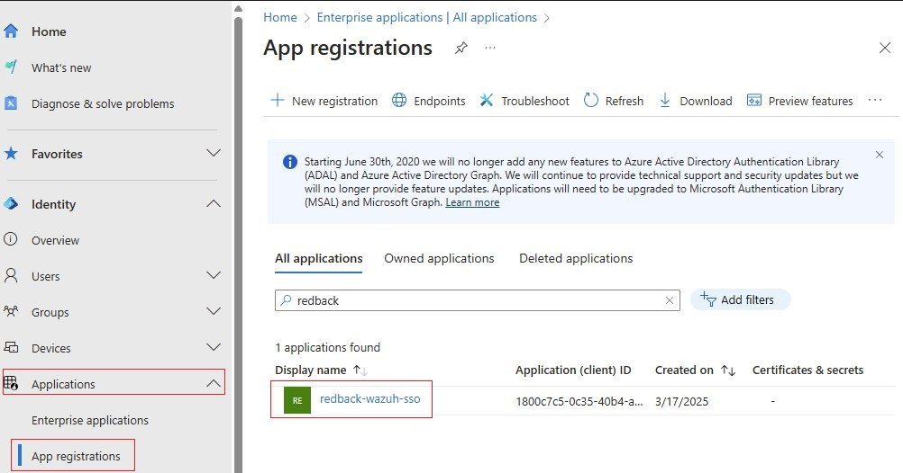  

1.3.3. Select the application created in step 1.2.2 above i.e. `redback-wazuh-sso`.  
1.3.4. Go to **App Roles -> Create app role**.  
1.3.5. Example of an App Role:  
• **Display name**: `Redback Wazuh Admin`  
• **Allowed member types**: `Users/Groups`  
• **Value**: `Redback_Wazuh_Admin`  
• **Description**: `Redback Wazuh Admin Role`  
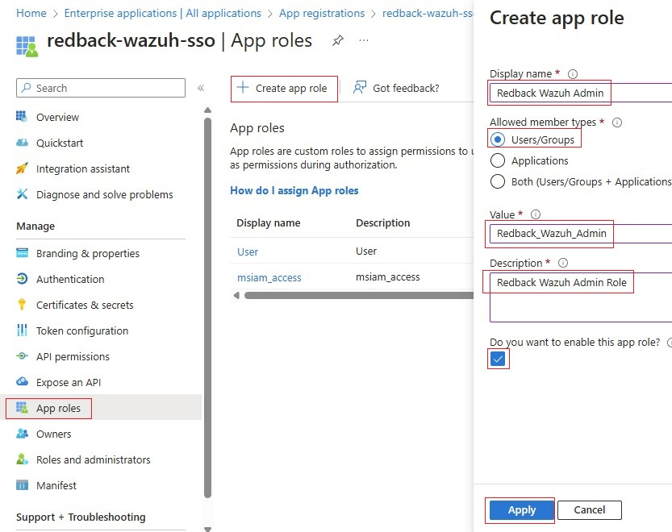 

1.3.6. Click **Apply** to save the changes and proceed to the next step.  
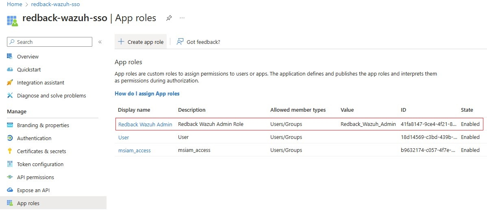

### 1.4. Assign Users/Groups
1.4.1. Go back to the **Microsoft Entra ID** portal.  
1.4.2. Navigate to **Enterprise Applications**.  
1.4.3. Select the application.  
1.4.4. Go to **Manage -> Users and groups**.  
1.4.5. Click on **Add user/group**.  
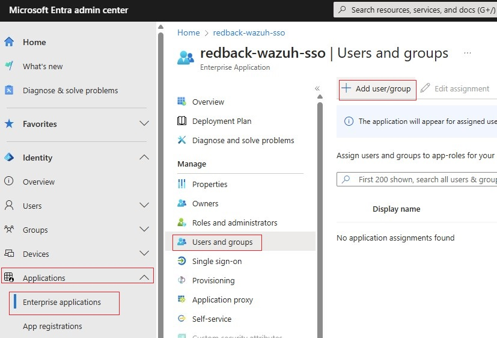  

1.4.6. In the **Add Assignment** step, add user/s or group/s or a combination of both as required. In our case, we add an Entra ID group called `Redback_Wazuh_Admin_Group` and assign it the app role `Redback_Wazuh_Admin`.
> **Note:**  
> • After the assignment, users/members of the `Redback_Wazuh_Admin_Group` will automatically be assigned the `Redback_Wazuh_Admin` backend role in Wazuh.

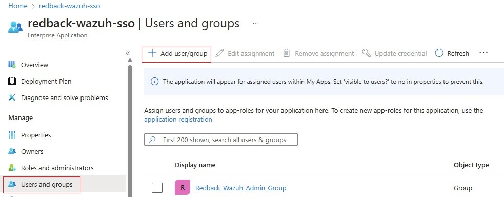  
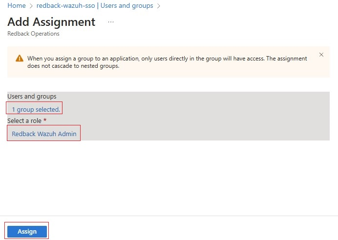  

1.4.7. Click **Assign** to save the configuration.

### 1.5. Configure Single Sign-On (SSO)
1.5.1. Go to the application **redback-wazuh-sso -> Set up single sign-on -> SAML**.  
1.5.2. Under **Basic SAML Configuration**, click **Edit** and set the following values:  
• **Identifier (Entity ID)**: `redback-wazuh-saml`  
• **Reply URL**: `https://<WAZUH_DASHBOARD_URL>/_opendistro/_security/saml/acs`  
• **Sign on URL**: `https://<WAZUH_DASHBOARD_URL>` | eg: `https://redback.it.deakin.edu.au`  
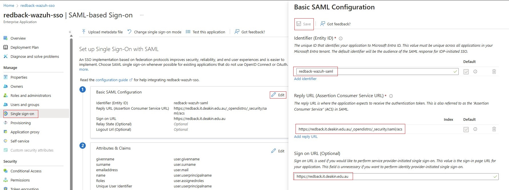

1.5.3. **Save** and proceed to the next step.  
1.5.4. Under **Attributes & Claims**, click **Edit** and select **Add new claim**:  
• **Name**: `Roles`  
• **Source Attribute**: `user.assignedroles`  
  
1.5.5. Note the parameters below, which will be used in the Wazuh indexer configuration later.  
• **App Federation Metadata Url** -> `idp.metadata_url`  
• **Microsoft Entra ID Identifier** -> `idp.entity_id`  
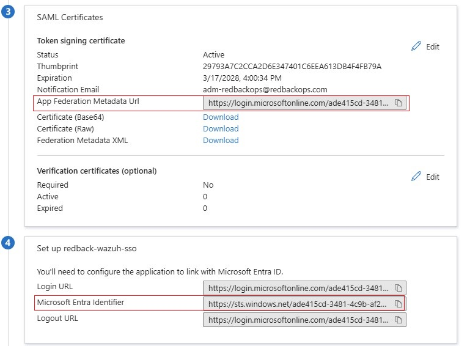


## Step 2: Wazuh indexer configuration

### 2.1. Generate exchange key
• Generate a 64-character long random key using the command - `openssl rand -hex 32`.  
• Please note the output key, which will be used as the **exchange_key** in the **/etc/wazuh-indexer/opensearch-security/config.yml** file.

```bash
openssl rand -hex 32
```
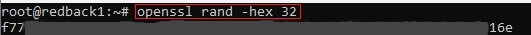

### 2.2. Edit /etc/wazuh-indexer/opensearch-security/config.yml 
2.2.1. Set order and challenge flag  
• **order**: `0`  
• **challenge**: `false`  

2.2.2. Add `saml_auth_domain` section under the `authc` section
```
saml_auth_domain:
    http_enabled: true
    transport_enabled: false
    order: 1
    http_authenticator:
        type: saml
        challenge: true
        config:
            idp:
				metadata_url: https://login.microsoftonline.com/.../federationmetadata/2007-06/federationmetadata.xml?appid=...
				entity_id: https://sts.windows.net/...
            sp:
				entity_id: redback-wazuh-saml
            kibana_url: https://redback.it.deakin.edu.au/
            roles_key: Roles
            exchange_key: <64-char key from above>
        authentication_backend:
          type: noop
```
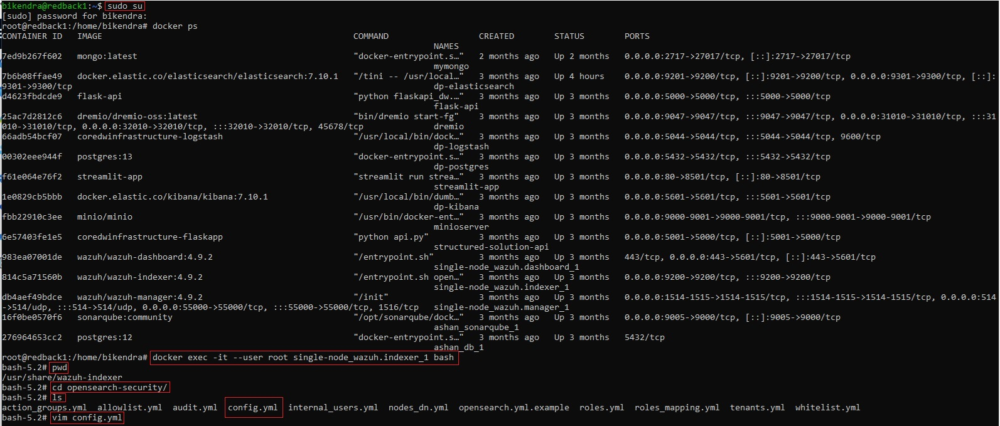  
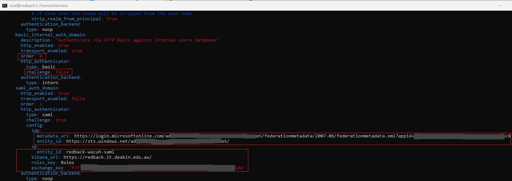

### 2.3. Apply with securityadmin.sh  
• Run the **securityadmin** script to load the configuration changes made in the **config.yml** file.
```
export JAVA_HOME=/usr/share/wazuh-indexer/jdk/ && bash /usr/share/wazuh-indexer/plugins/opensearch-security/tools/securityadmin.sh -f /usr/share/wazuh-indexer/opensearch-security/config.yml -icl -key /usr/share/wazuh-indexer/certs/admin-key.pem -cert /usr/share/wazuh-indexer/certs/admin.pem -cacert /usr/share/wazuh-indexer/certs/root-ca.pem -h redback.it.deakin.edu.au -nhnv
```

• You should see a similar output as shown in the screenshot below:
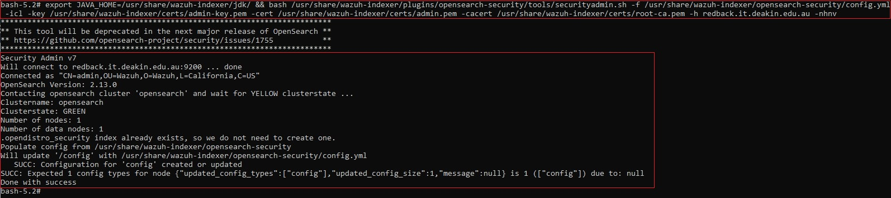

### 2.4. Edit /etc/wazuh-indexer/opensearch-security/roles_mapping.yml 
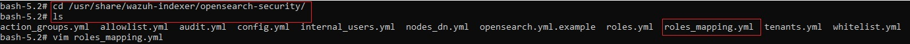  

### 2.5. Configure roles_mapping.yml file 
• Configure the **roles_mapping.yml** file to map the App Role value we have in Microsoft Entra ID to the appropriate Wazuh indexer role.  
• In this case, we map the **Redback_Wazuh_Admin** App Role value in Microsoft Entra ID to the **all_acces**s role in the Wazuh indexer as shown in the screenshot below:  
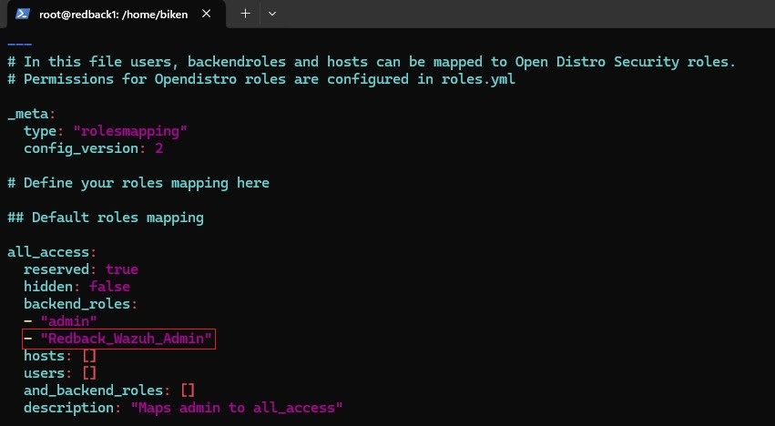 

### 2.6. Apply with securityadmin.sh 
• Run the **securityadmin** script to load the configuration changes made in the **roles_mapping.yml** file.
```
export JAVA_HOME=/usr/share/wazuh-indexer/jdk/ && bash /usr/share/wazuh-indexer/plugins/opensearch-security/tools/securityadmin.sh -f /usr/share/wazuh-indexer/opensearch-security/roles_mapping.yml -icl -key /usr/share/wazuh-indexer/certs/admin-key.pem -cert /usr/share/wazuh-indexer/certs/admin.pem -cacert /usr/share/wazuh-indexer/certs/root-ca.pem -h redback.it.deakin.edu.au -nhnv
```

• You should see a similar output as shown in the screenshot below:
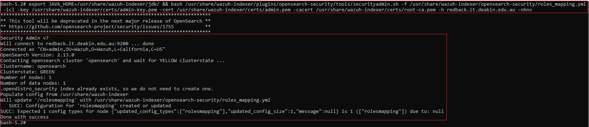


## Step 3: Wazuh dashboard configuration

### 3.1. Set run_as to false  
• Edit the **/usr/share/wazuh-dashboard/data/wazuh/config/wazuh.yml** configuration file.  
• Verify that `run_as` is set to `false`.
  
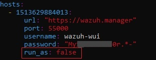

### 3.2. Add SAML config  
• Edit the Wazuh dashboard configuration file. Add these configurations to **/etc/wazuh-dashboard/opensearch_dashboards.yml**.
```
opensearch_security.auth.type: "saml"
server.xsrf.allowlist: ["/_opendistro/_security/saml/acs", "/_opendistro/_security/saml/logout", "/_opendistro/_security/saml/acs/idpinitiated"]
opensearch_security.session.keepalive: false

```
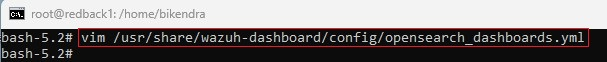  
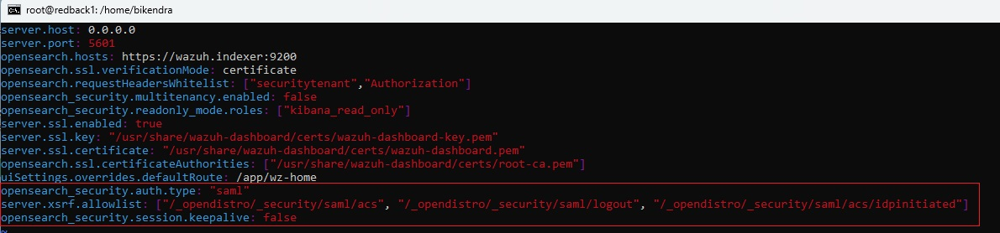

### 3.3. Restart the Wazuh Dashboard service  
```
systemctl restart wazuh-dashboard
```


## Step 4: Validate SSO  

4.1. Login to the Wazuh dashboard and verify successful login with your Entra ID account.
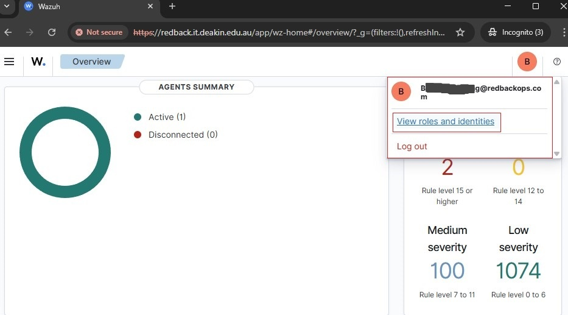  

4.2. Check and verify the assigned roles (permissions) and backend role.
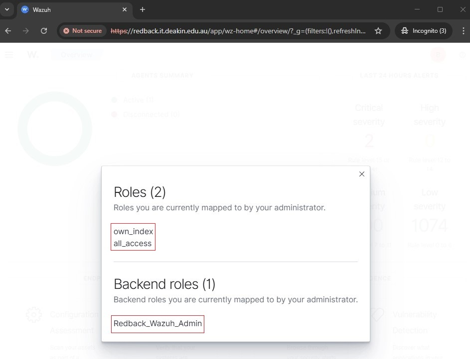


## Step 5: RBAC Role Mapping
> **Note:**   
> •	While Wazuh provides a GUI under **Server Management -> Security -> Roles Mapping** to assign users and roles, this interface does not replace the initial role mapping required in the **roles_mapping.yml** file (steps 2.4, 2.5, and 2.6 above).  
> •	For first-time setup, role mapping via **roles_mapping.yml** (step 2.4, 2.5) and the **securityadmin.sh** (step 2.6) tool is mandatory to bootstrap the connection between Entra ID roles and Wazuh internal roles.  
> •	After the initial SAML SSO integration is enabled, the Wazuh Dashboard GUI is then best suited, and therefore, it is used for ongoing role management. 

In this technical guide, we have configured Role-Based Access Control (RBAC) for the following Wazuh roles using Entra ID groups:  
1.	Redback_Wazuh_Admin (already configured and validated in steps 1 – 4 above as part of the initial SSO enablement)  
2.	Redback_Wazuh_Reader (configured in Step 5 below)  
3.	Redback_Wazuh_Analyst (configured in Step 5 below)  

### 5.1. Enable `run_as: true` in Wazuh Dashboard config file
• For ongoing role management via the Wazuh Dashboard GUI, edit the **/usr/share/wazuh-dashboard/data/wazuh/config/wazuh.yml** file.  
• Ensure the value of `run_as` is `true`.
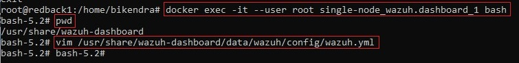  
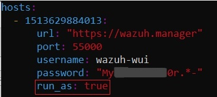

### 5.2. Restart the Wazuh Dashboard service  
```
systemctl restart wazuh-dashboard
``` 
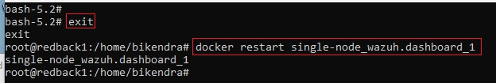

### 5.3. Create Entra ID groups in the Entra ID portal.
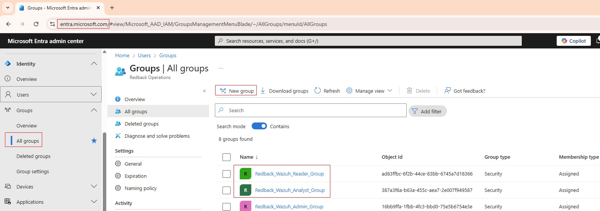  

### 5.4. Create new App Roles for the `redback-wazuh-sso` application.
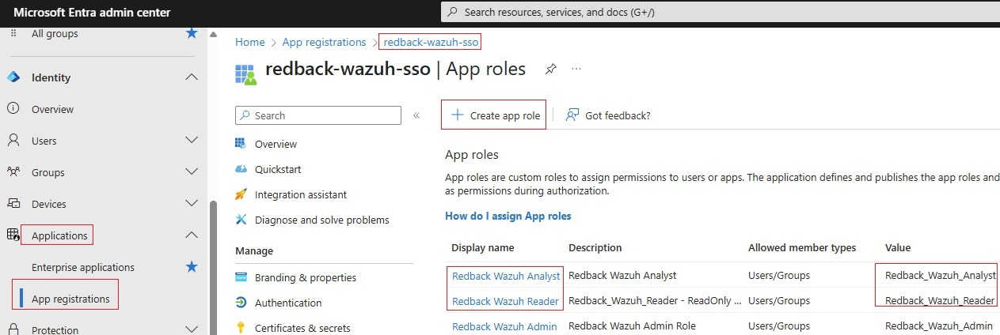  

### 5.5. Map the Entra ID groups to the corresponding Wazuh roles.
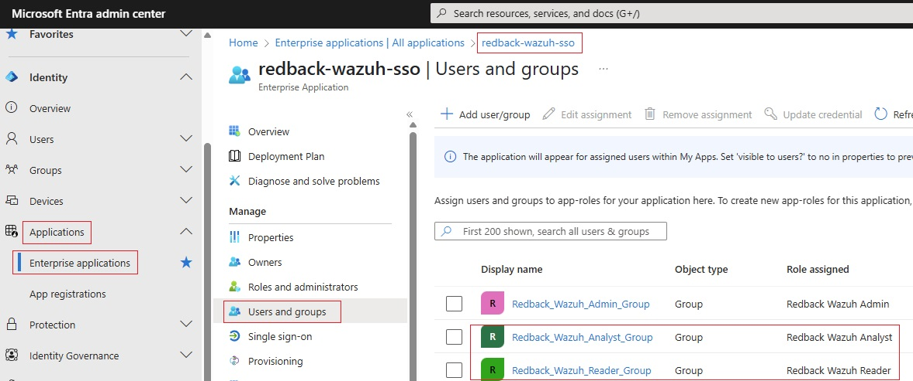

### 5.6. Login to the Wazuh dashboard
• Log n to the Wazuh dashboard at `https://redback.it.deakin.edu.au/app/wz-home` .

### 5.7. Create role 
• Create a custom role named **Redback_Custom_ReadOnly**.  
> **Notes:**  
> • **Redback_Custom_ReadOnly**: Core read-only custom role mapped to users via backend roles. Apart from the **all_access** default built-in role, this is the custom role that enables access and read permissions to UI and indices, without which users will not be able to log in to Wazuh Dashboard. Ensure to map any new app role values from Entra ID to this Wazuh custom group for access to Wazuh Dashboard.  
> • Admin does not need to be added to other roles separately — all_access covers it all.  

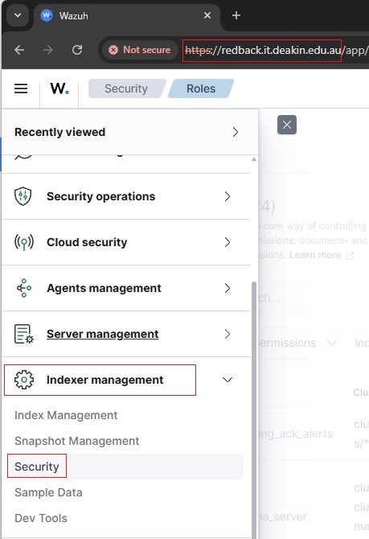  
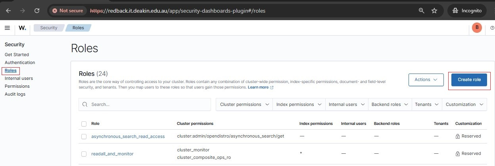  
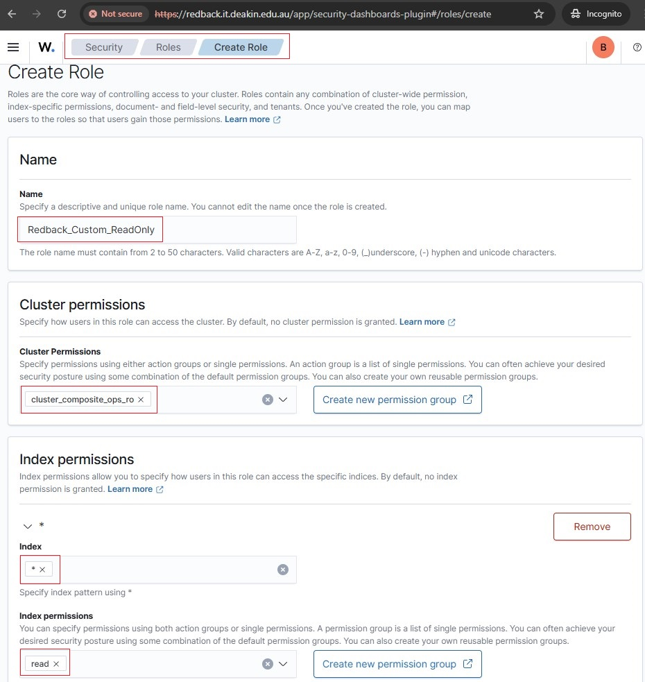  
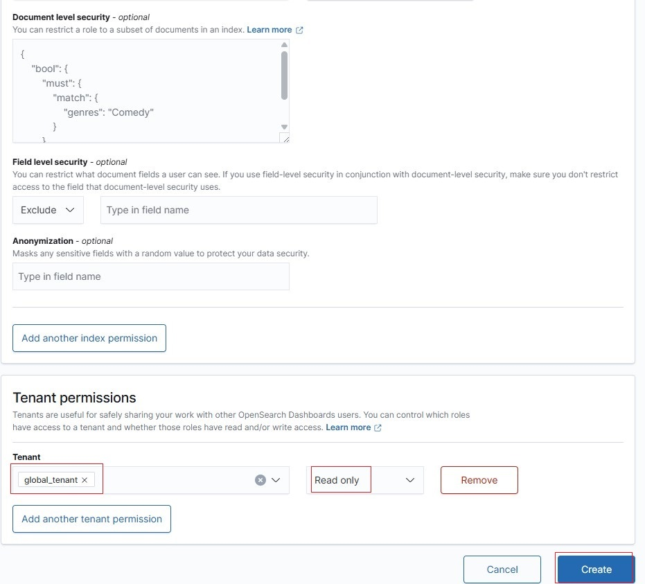  

### 5.8. Map to the custom role Redback_Custom_ReadOnly
• Map the Backend Roles (Entra App Role values) to **Redback_Custom_ReadOnly**.
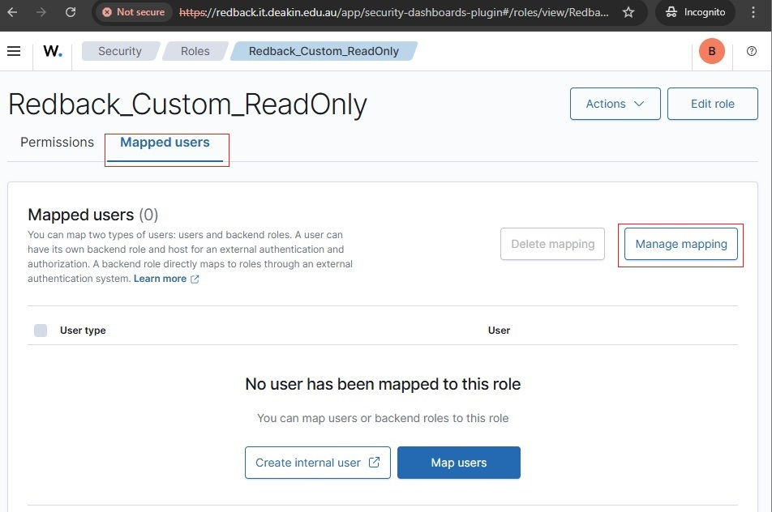  
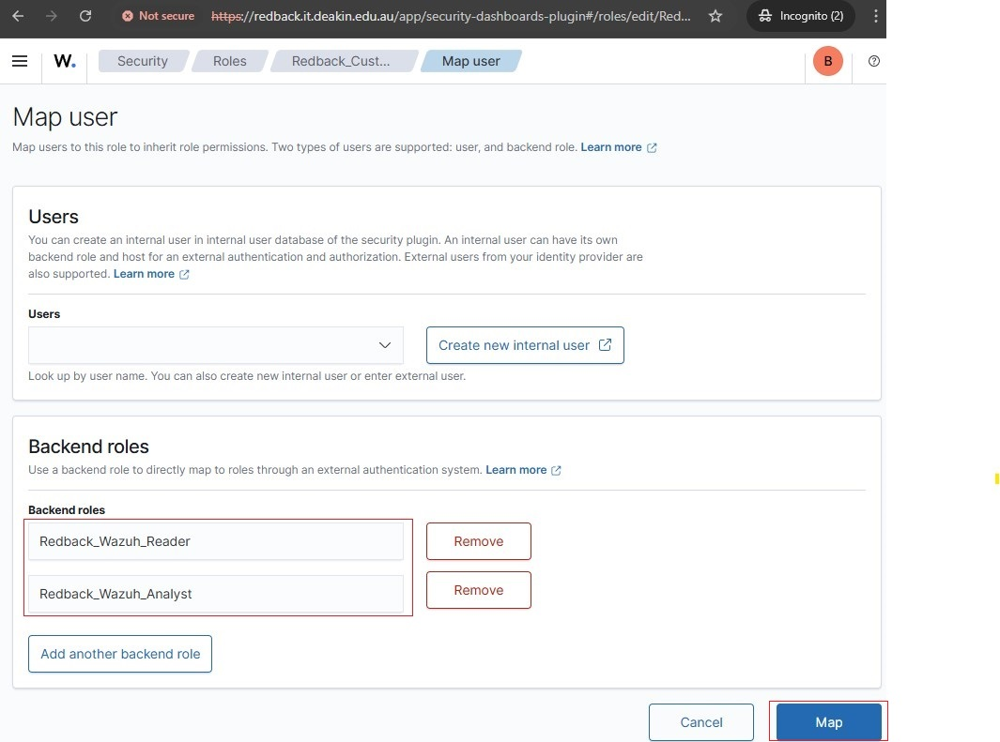
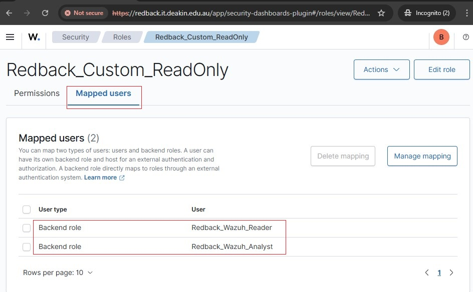

### 5.9. Backend role mapping  
• Assign/map the Backend Roles to the Wazuh roles based on the table below.
### 🔠Role Assignment Table

| **Entra Group**                         | **Backend Role (App Role Value)** | **Assigned Wazuh Roles**                                                                                                                                           | **Description / Purpose**                                                                                   |
|----------------------------------------|----------------------------------|--------------------------------------------------------------------------------------------------------------------------------------------------------------------|-------------------------------------------------------------------------------------------------------------|
| Redback_Wazuh_Admin_Group `Add users to this group to grant Admin role access into Wazuh.`              | Redback_Wazuh_Admin              | `all_access`                                                                                                                                                        | 🔧 Full administrative access across all management, features, indices, dashboards, and security settings   |
| Redback_Wazuh_Analyst_Group `Add users to this group to grant Analyst role access into Wazuh.`            | Redback_Wazuh_Analyst            | `Redback_Custom_ReadOnly`, `readall_and_monitor`, `wazuh_ui_user`, `alerting_full_access`, `anomaly_read_access`, `reports_read_access`, `reports_instances_read_access` | 📊 Analyze data, view dashboards, manage alerting rules, and view generated reports                         |
| Redback_Wazuh_Reader_Group `Add users to this group to grant Reader role access into Wazuh.`             | Redback_Wazuh_Reader             | `Redback_Custom_ReadOnly`, `readall_and_monitor`, `wazuh_ui_user`                                                                                                   | 👀 Read-only access to dashboards and data, limited to viewing only                                         |


• Outlined below are step-by-step screenshots demonstrating how to assign a Wazuh reserved role to a backend role.  
• For example, to assign `alerting_full_access` role, go to **Roles**, click on the role name, then navigate to **Mapped users → Manage mapping → Add a backend role**.
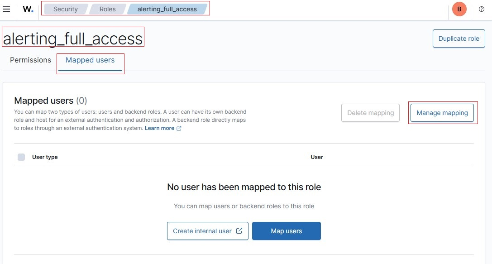  
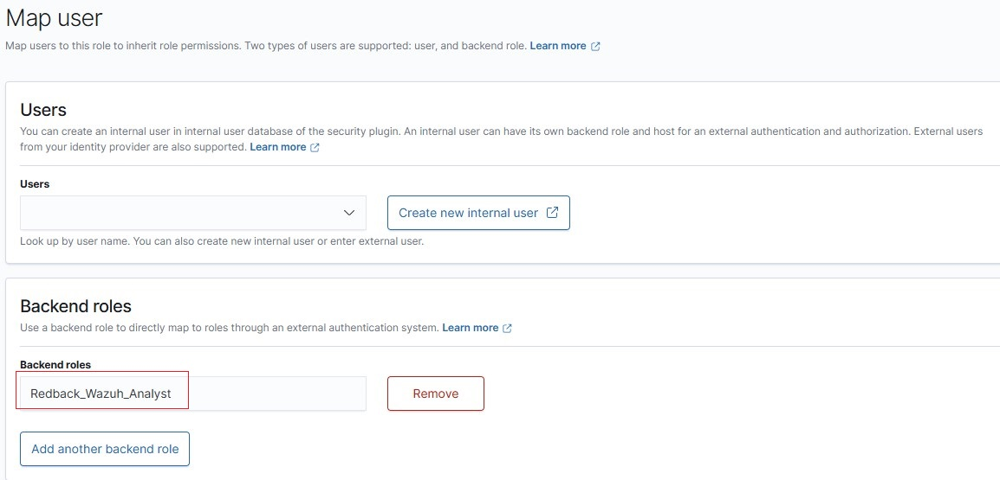  
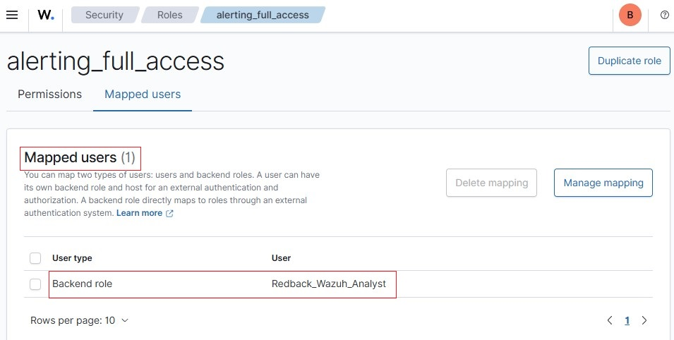

• After the role assignments are completed, it should look like as in the screenshots below:
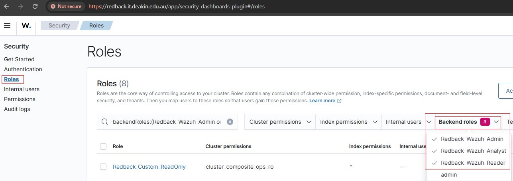  
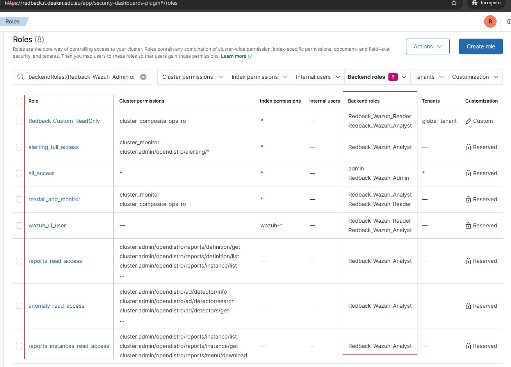  

## Step 6: Validate RBAC  

6.1. Login to the Wazuh dashboard and verify successful login with your Entra ID account.   
6.2. Check and verify the assigned roles (permissions) and backend role.  
6.2.1. If a user has been added to the **Redback_Wazuh_Analyst_Group** group, verify the correct assigned roles based on the table in step 5.9.  
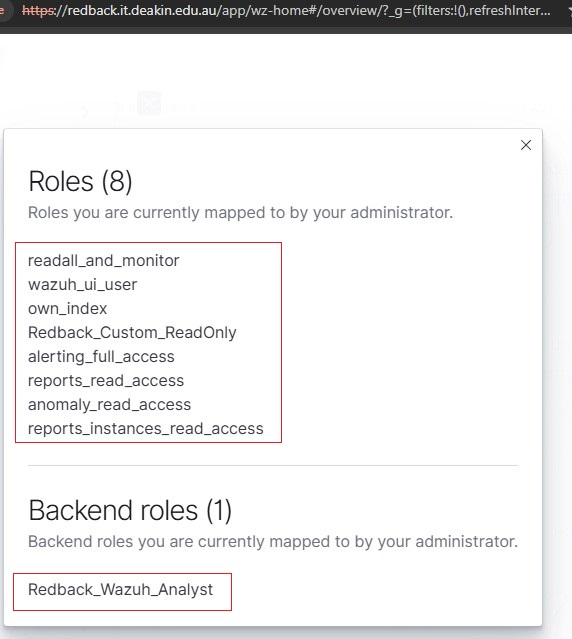

6.2.2. If a user has been added to the **Redback_Wazuh_Reader_Group** group, verify the correct assigned roles based on the table in step 5.9.  
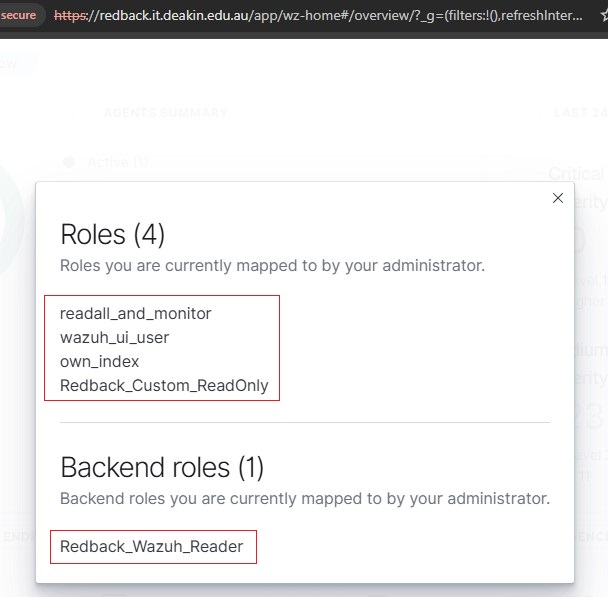  

## Important Note
> • To create additional roles (e.g., Redback_Wazuh_Auditor, Redback_Wazuh_BackupOperator), simply repeat the process outlined in **Step 5 (creation)** and **Step 6 (validation)**.

## Conclusion  
With this configuration, Wazuh is securely integrated with Microsoft Entra ID using SAML SSO, enabling centralised identity management and RBAC enforcement for all Wazuh users at Redback Operations.


## References
- https://documentation.wazuh.com/current/user-manual/user-administration/single-sign-on/administrator/microsoft-entra-id.html#wazuh-dashboard-configuration