:::info
**Document Creation:** 05 May, 2025. **Last Edited:** 05 May, 2025. **Authors:** Bikendra Gurung.
<br></br>**Effective Date:** 05 May, 2025. **Expiry Date:** 05 May, 2026.
:::

# Wazuh Agent Upgrade Guide

## Overview
This technical guide provides step-by-step instructions on how to safely upgrade the Wazuh Agent to the latest version, ensuring alignment with other Wazuh components – Dashboard, Indexer, and Manager.

## Prerequisites
1. A Wazuh agent installed on the Docker host.
2. Admin/Root access to the Wazuh Docker host (Linux server).
3. Familiarity with docker, docker-compose, and basic Linux operations.

## Important Note
If the `docker-compose` command does not work on your system, use `docker compose` instead (without a hyphen).

## Upgrade Steps

### Step 1: Install the GPG Key

1. Download the key  
   ```bash
   curl -O https://packages.wazuh.com/key/GPG-KEY-WAZUH
   ```

2. Import the key  
   ```bash
   sudo gpg --no-default-keyring --keyring /usr/share/keyrings/wazuh.gpg --import GPG-KEY-WAZUH
   ```

3. Fix permissions  
   ```bash
   sudo chmod 644 /usr/share/keyrings/wazuh.gpg
   ```
   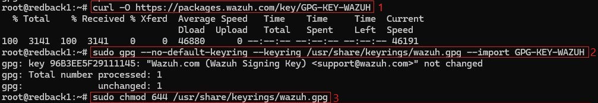

---

### Step 2: Add the Wazuh Repository

   ```bash
   echo "deb [signed-by=/usr/share/keyrings/wazuh.gpg] https://packages.wazuh.com/4.x/apt/ stable main" | sudo tee -a /etc/apt/sources.list.d/wazuh.list
   ```
   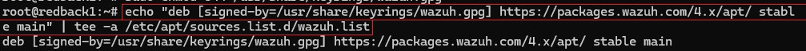

---

### Step 3: Update Wazuh Agent to the Latest Version

   ```bash
   sudo apt-get update
   sudo apt-get install wazuh-agent
   ```
   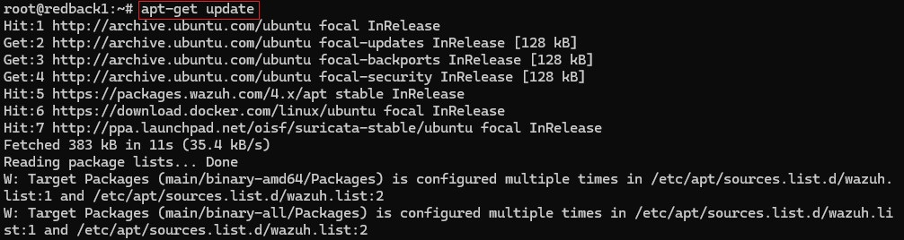<br/>
   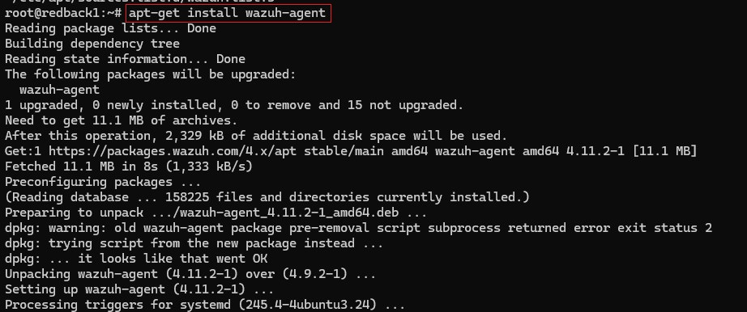

---

### Step 4: Disable Wazuh Repo (to prevent auto-upgrades)

After the upgrade, disable the Wazuh repository to avoid undesired upgrades and compatibility issues and ensure version alignment with the Wazuh Manager component.

   ```bash
   sudo sed -i "s/^deb/#deb/" /etc/apt/sources.list.d/wazuh.list
   sudo apt-get update
   ```
   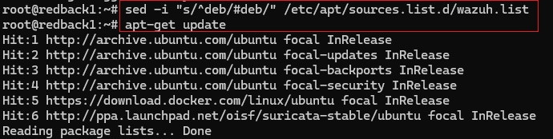

---

### Step 5: Restart Wazuh API Services

1. Access the Wazuh Manager container:  
   ```bash
   docker exec -it --user root single-node-wazuh.manager-1 bash
   ```
   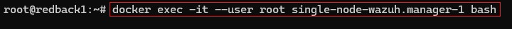

2. Restart all Wazuh services in Wazuh manager-1:  
   ```bash
   /var/ossec/bin/wazuh-control restart
   ```
   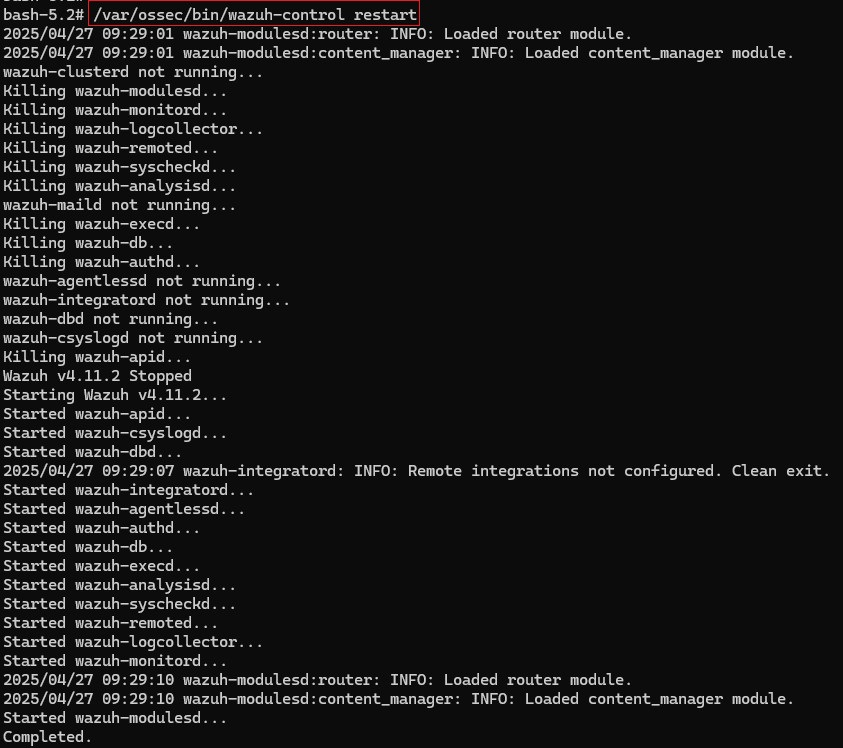

3. Verify the service status:  
   ```bash
   /var/ossec/bin/wazuh-control status
   ```
   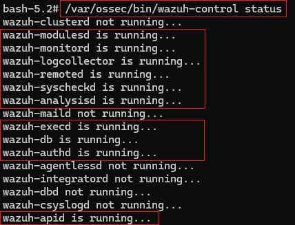

4. Review API logs for issues (if necessary):  
   ```bash
   tail -f /var/ossec/logs/ossec.log
   ```
   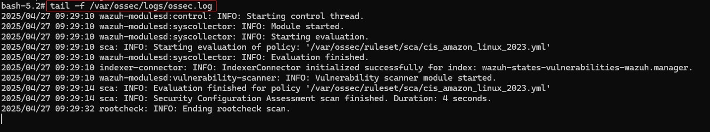

---

### Step 6: Restart and Validate Running

   ```bash
   sudo systemctl restart wazuh-agent
   sudo systemctl status wazuh-agent
   ```

   ✅ Look for:  
   ```
   Active: active (running)
   ```
   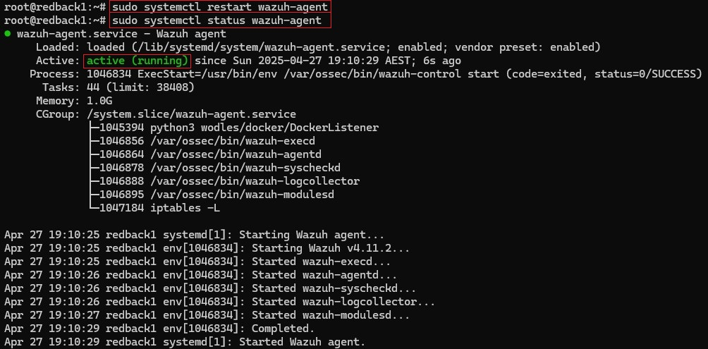

---

### Step 7: Post-Upgrade Validation

1. Log in to the Wazuh dashboard via a browser.  
2. Navigate to: **Agents → Manage Agents**  
3. Confirm the following:
   - The agent is listed.
   - The agent status is shown as `ACTIVE`.
   - The version matches the upgraded version (e.g., `4.11.2`).
   
   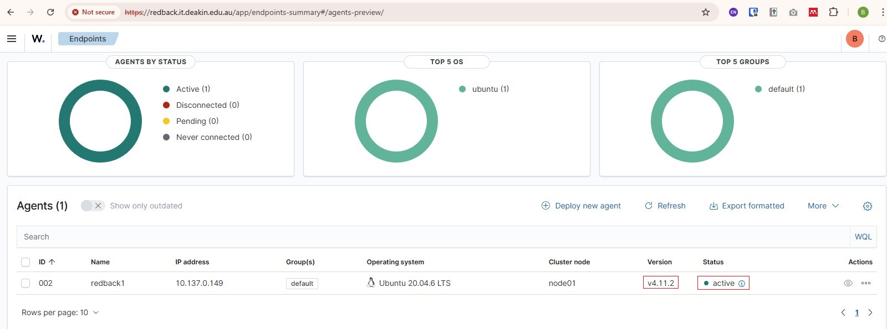

✅ This confirms a successful upgrade and validates registration, version alignment, and heartbeat communication with the Wazuh Manager.

---

## Reference

- https://documentation.wazuh.com/current/upgrade-guide/wazuh-agent/linux.html
