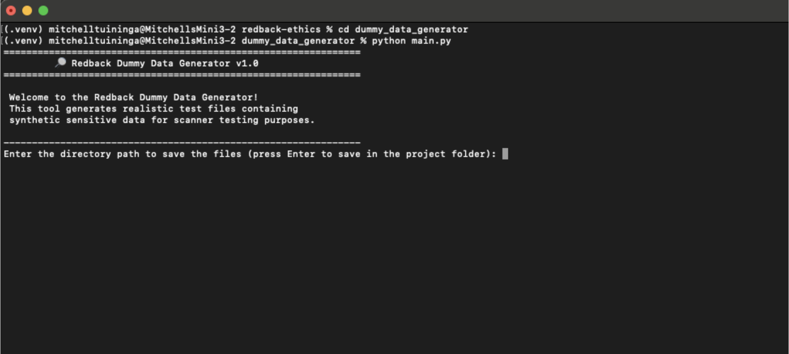

 Redback Dummy Data Generator – Implementation Guide

A Python-based tool designed to generate realistic dummy data across multiple file formats for testing the Redback Asset Assessment Tool (AAT). The generated files include a mixture of public and synthetic sensitive information to simulate real-world data repositories.

## Features

- Supports multiple file types: CSV, JSON, TXT, DOCX, and PDF

- Sensitivity levels: Low, Medium, High, Mixed

- Randomised file contents with realistic structure

- Console UI for interactive use

- Modular class-based architecture (DummyDataGenerator)

- Error handling for PDF generation edge cases

---

## Setup Instructions

1. Clone the Repository

- git clone https://github.com/Redback-Operations/redback-ethics.git
- cd redback-ethics/dummy_data_generator

This image shows the README file for the “Redback Dummy Data Generator” project, providing an overview of its features and detailed setup instructions, including cloning the repository, setting up a virtual environment, installing packages, and running the generator via a Python script.

2. Navigate to the Project Folder

- cd path/to/redback-ethics/dummy_data_generator

This image demonstrates how to clone the redback-ethics GitHub repository and navigate into the dummy_data_generator directory to begin setting up the project.

3. Create and Activate a Virtual Environment

- python3 -m venv .venv
- source .venv/bin/activate

- On Windows: .venv\Scripts\activate

This image shows the creation and activation of a Python virtual environment using python3 -m venv .venv and source .venv/bin/activate, preparing an isolated workspace for the project.

4. Install Required Packages

- pip install -r requirements.txt

This image shows the installation of required Python packages using pip install -r requirements.txt, ensuring all dependencies for the project are set up in the virtual environment.

5. Run the Generator

- python main.py

The generator will launch a console UI that prompts you to choose:

- Output directory

- Number of files

- Sensitivity level

- File types to generate

This image shows the execution of python main.py, which launches the Redback Dummy Data Generator’s console interface, prompting the user to specify a directory to save the generated synthetic test files.

---

## Output

The generated synthetic test files (e.g. .csv, .json, .txt, .pdf, .docx) will be saved in the directory you specified. These are designed to reflect realistic structures and sensitivity distributions.

-  Notes

Activate your virtual environment each time before running the generator (source .venv/bin/activate)

You can extend or modify the generation logic by editing main.py or extending the DummyDataGenerator class

If you add new packages, don’t forget to update requirements.txt

For troubleshooting, enhancements, or support, contact the Redback Ethics team or open an issue in the GitHub repository.

