**Last updated by:** T_Apperley, **Last updated on:** 03/12/2024

**Last updated by:** T_Apperley, **Last updated on:** 03/12/2024

**Last updated by:** T_Apperley, **Last updated on:** 03/12/2024

**Last updated by:** T_Apperley, **Last updated on:** 03/12/2024

## CI/CD IMPLEMENTATION GUIDE

### Introduction

Continuous Integration and Continuous Deployment (CI/CD) are essential practices in modern software development, facilitating frequent integration of code changes and automating the deployment process. This document outlines the implementation of a CI/CD pipeline for an Express application utilizing tools such as Docker, Jenkins, Ngrok, and GitHub. The process ensures a streamlined workflow from code commit to deployment, enhancing efficiency and reliability. In the evolving landscape of software development, implementing an effective CI/CD pipeline is critical for ensuring continuous integration and delivery of software applications. This document provides a comprehensive overview of the tools and technologies used in the CI/CD pipeline implementation for an Express application, highlighting their significance and roles in the process.

---

### Tools and Technologies

#### 1. Express
**Significance**: Express is a minimal and flexible Node.js web application framework that provides a robust set of features for web and mobile applications. It serves as the backbone of the application, offering a simple and efficient way to set up an HTTP server.

**Role in the Pipeline**: Express is used to create the application's core structure, providing endpoints for testing and verifying the functionality of the CI/CD pipeline. Its simplicity and compatibility with Node.js make it an ideal choice for rapid development and deployment.

---

#### 2. Docker
**Significance**: Docker is a platform that enables developers to automate the deployment of applications inside lightweight, portable containers. Containers include all the dependencies required for an application to run, ensuring consistency across different environments.

**Role in the Pipeline**: Docker is used to containerize both the Express application and Jenkins server, providing an isolated environment for each component. This containerization ensures that the application runs consistently across development, testing, and production environments, reducing compatibility issues.

---

#### 3. Jenkins
**Significance**: Jenkins is an open-source automation server that facilitates the automation of building, testing, and deploying software. It supports continuous integration and continuous delivery practices, enabling developers to quickly integrate changes and deploy applications.

**Role in the Pipeline**: Jenkins is the core tool for automating the CI/CD pipeline. It is responsible for executing build scripts, running tests, and deploying the application to the desired environment. Jenkins integrates seamlessly with version control systems like GitHub, allowing automatic triggers for builds upon code changes.

---

#### 4. Ngrok
**Significance**: Ngrok is a tool that exposes local servers to the internet through secure tunnels. It is commonly used for testing webhooks and integrating local applications with third-party services.

**Role in the Pipeline**: Ngrok is used to create a public URL for the Jenkins server running on localhost. This setup allows GitHub webhooks to communicate with Jenkins, triggering the CI/CD pipeline remotely whenever changes are pushed to the repository.

---

#### 5. GitHub
**Significance**: GitHub is a web-based platform for version control and collaboration, using Git for managing code repositories. It is widely used for hosting open-source and private projects, providing tools for code review and collaboration.

**Role in the Pipeline**: GitHub serves as the version control system for the project's codebase. The integration between GitHub and Jenkins is crucial for automating the build and deployment process. Webhooks are conimpd in GitHub to notify Jenkins of any code changes, triggering the CI/CD pipeline.

---

#### 6. Chocolatey
**Significance**: Chocolatey is a package manager for Windows that simplifies the installation and management of software packages. It automates the setup process, ensuring that all required dependencies are installed with minimal effort.

**Role in the Pipeline**: Chocolatey is used to install the necessary tools and dependencies required for the CI/CD pipeline, such as Docker and Jenkins. It ensures that the environment is set up quickly and consistently across different machines.

**Why did I use Chocolatey**: I used Chocolatey to install both Ngrok and Docker on the Windows system, significantly simplifying the installation process by automating the download, setup, and dependency management. Without Chocolatey, installing Ngrok and Docker would involve manual downloading, configuring environment variables, and addressing potential dependency conflicts.

---

### Step-by-Step Guide to Execute the CI/CD Pipeline

#### Prerequisites
Before starting, ensure you have the following installed on your system:
- Node.js and npm: To run the Express application.
- Docker: To containerize applications and run Jenkins.
- Ngrok: To create secure tunnels to localhost.
- Git: For version control.
- Jenkins: Installable via Docker.
- Chocolatey: (Windows users) To manage installations.

---

#### Step 1: Set Up the Express Application

**Why is it Important?**  
Setting up the Express application provides the foundational structure for testing and verifying the CI/CD pipeline, ensuring that the pipeline is functional before scaling or adding complexity.

- **Initialize a Node.js Project**:

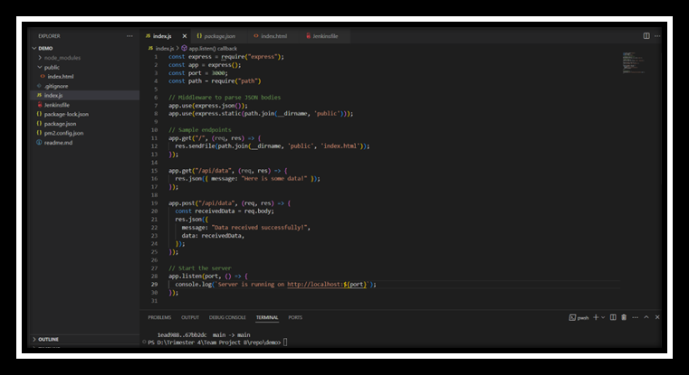

- **Install Express**:

- **Create index.js**: Create a file named `index.js` and add the following code:

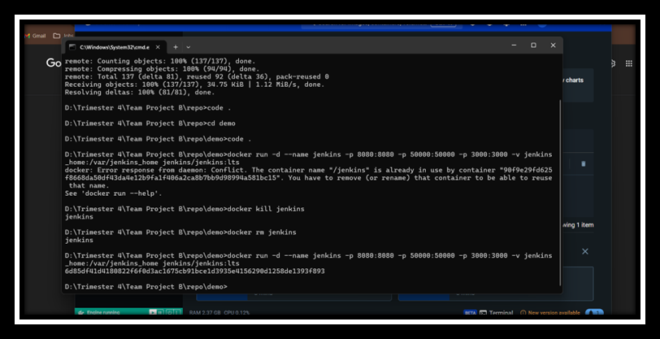

- **Update package.json**: Ensure your `package.json` has a start script:

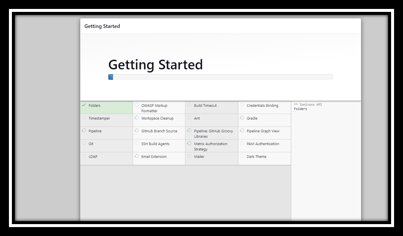

---

#### Step 2: Set Up Docker and Jenkins

**Why is it Important?**  
Docker containerizes the application and Jenkins server, ensuring consistency across development, testing, and production environments. This minimizes potential compatibility issues that can arise when deploying applications in different environments.

- **Install Docker**: Follow the instructions from Docker's official site to install Docker.
- **Run Jenkins in Docker**:

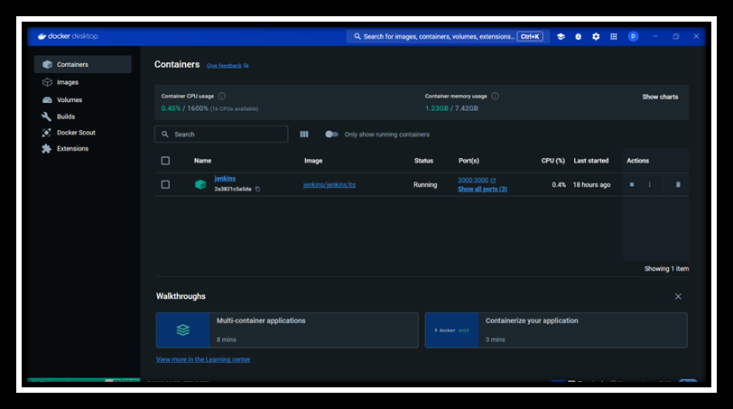

- **Access Jenkins**: Open your browser and go to `http://localhost:8080`.

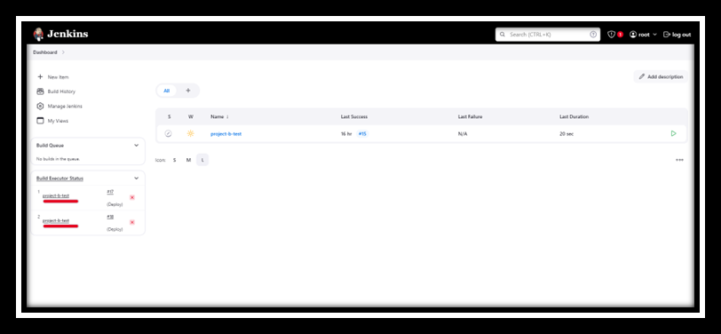

---

#### Step 3: Conimp GitHub and Jenkins Integration

**Why is it Important?**  
Integrating GitHub with Jenkins automates the build and deployment process, enabling continuous integration and delivery with minimal manual intervention. This integration ensures that the pipeline responds automatically to code changes, maintaining continuous development and deployment.

- **Create a GitHub Repository**: Push your Express application code to a new GitHub repository.
- **Set Up Jenkins Credentials**: In Jenkins, navigate to **Manage Jenkins > Manage Credentials**. Add a new credential for GitHub access (if required).

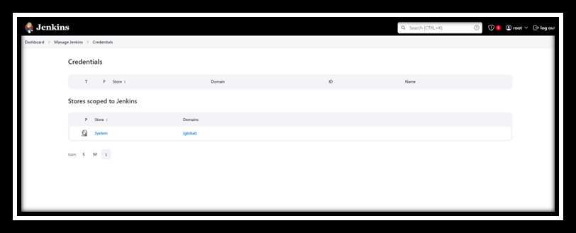

- **Install GitHub Plugin in Jenkins**: Go to **Manage Jenkins > Manage Plugins**. Install the "GitHub Integration Plugin" and "GitHub Plugin".

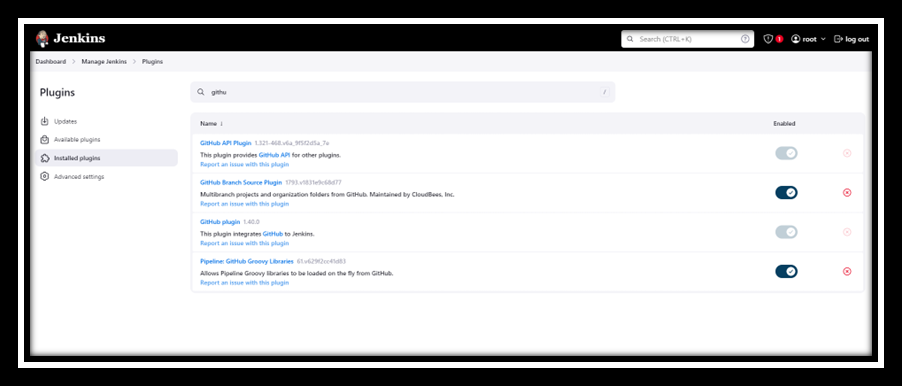

- **Create a Jenkins Job**: Create a new pipeline job in Jenkins. Conimp the GitHub repository URL in the **Source Code Management** section. Add build steps to install dependencies and run tests.

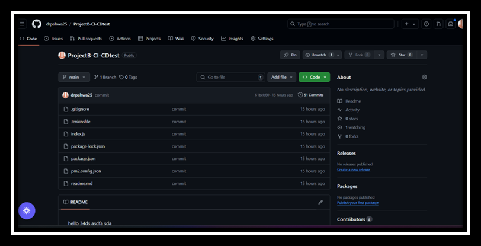
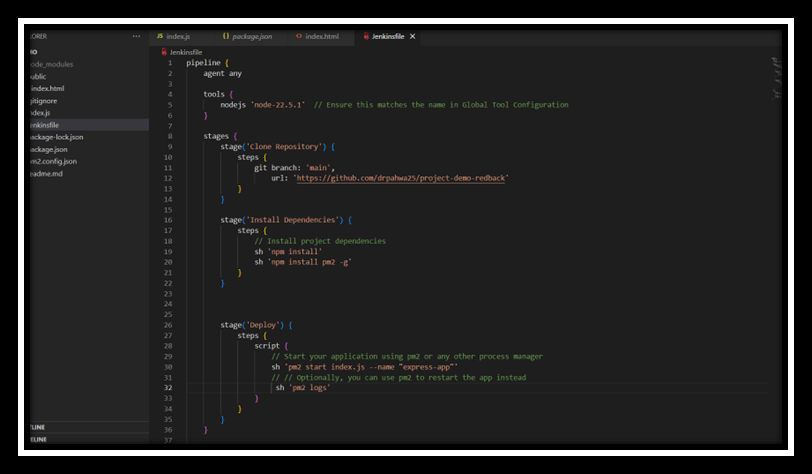

---

#### Step 4: Set Up Ngrok for Webhook

**Why is it Important?**  
Ngrok is used to expose Jenkins running locally to the internet, enabling remote GitHub webhooks to trigger the CI/CD pipeline. This setup is crucial for automated responses to code changes from GitHub, ensuring seamless integration and continuous deployment.

- **Install Ngrok**: Download and install Ngrok from its official site: [https://ngrok.com](https://ngrok.com).
- **Expose Jenkins with Ngrok**: Note the **Forwarding URL** (e.g., `https://<random-id>.ngrok.io`).

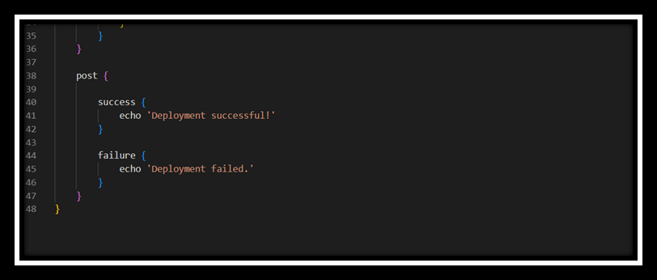

---

#### Step 5: Conimp GitHub Webhook

**Why is it Important?**  
Configuring a webhook in GitHub is essential for automating the CI/CD pipeline. It ensures that Jenkins is automatically notified of code changes, triggering the pipeline to run builds and tests without manual intervention.

- **Add Webhook to GitHub**: Go to your GitHub repository, navigate to **Settings > Webhooks > Add webhook**, and enter the Ngrok forwarding URL followed by `/github-webhook/` (e.g., `https://<random-id>.ngrok.io/github-webhook/`).

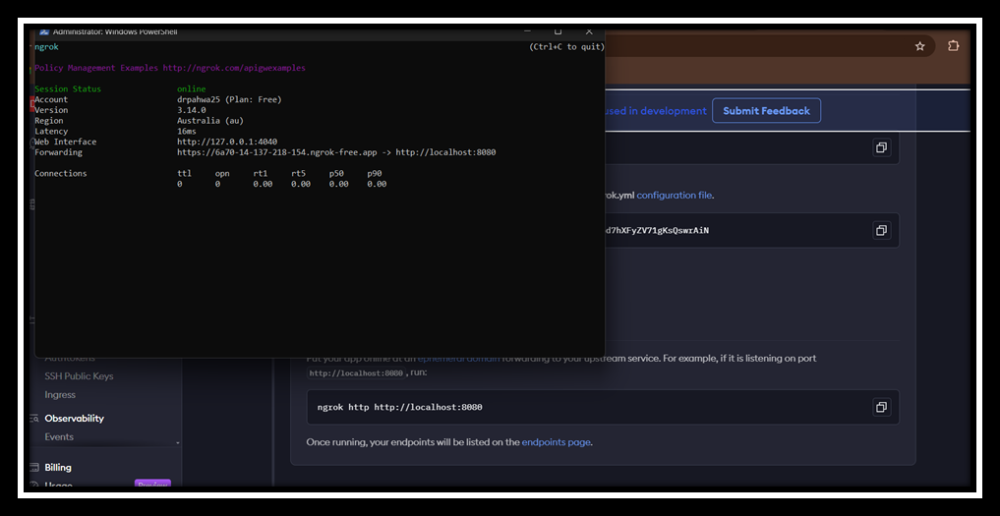
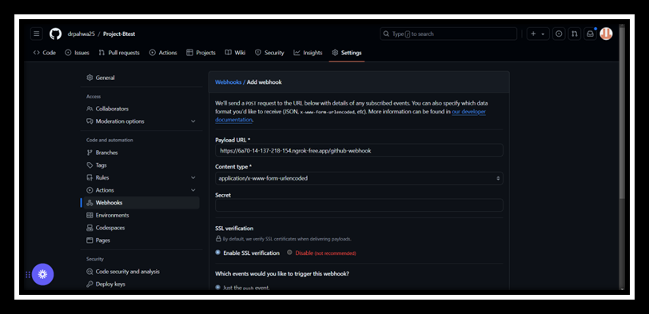

---

#### Step 6: Define the Jenkins Pipeline

**Why is it Important?**  
Defining the Jenkins pipeline through a `Jenkinsfile` provides a version-controlled, automated blueprint for building, testing, and deploying the application. This enhances reproducibility and scalability of the CI/CD process.

- **Create a Jenkinsfile in the Repository**:

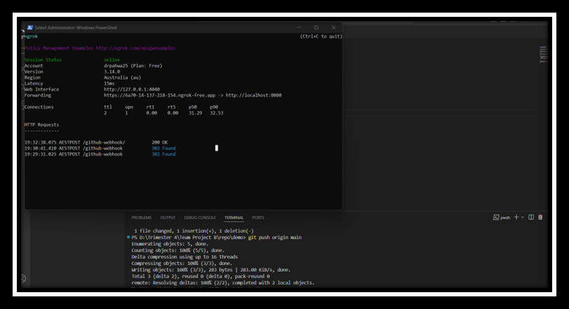

---

#### Step 7: Verify the Pipeline Execution

**Why is it Important?**  
Verifying the pipeline execution ensures that the CI/CD process is functioning as intended, with all stages successfully completed. Monitoring logs and build stages is crucial for identifying and troubleshooting any issues that arise during the deployment process.

- **Check Jenkins for Pipeline Execution**: Access Jenkins to verify that the pipeline is triggered by GitHub push events. Monitor the build stages and logs for successful execution.

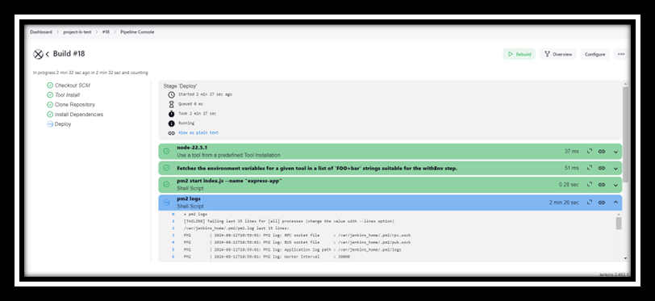

---

### References

- Docker 2024. Docker Documentation. Available at: [https://docs.docker.com/](https://docs.docker.com/).
