**Last updated by:** T_Apperley, **Last updated on:** 03/12/2024

**Last updated by:** T_Apperley, **Last updated on:** 03/12/2024

**Last updated by:** T_Apperley, **Last updated on:** 03/12/2024

**Last updated by:** T_Apperley, **Last updated on:** 03/12/2024

# Proof of Implementation: CI/CD

## Jenkins Docker Container Running in Docker Desktop with Resource Usage Overview

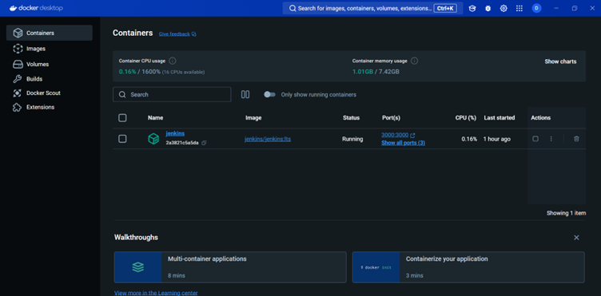

This screenshot showcases Docker Desktop with a Jenkins container actively running. The container's status is marked as "Running," indicating that Jenkins is currently operational. The image reflects that the Jenkins container is based on the `jenkins/jenkins:lts` image, which is a long-term support version. The ports mapped include `3000:3000` and others that ensure Jenkins is accessible via the browser for configuration and interaction.

The resource usage is minimal, with CPU usage at 0.16% and memory usage at 1.01GB out of 7.42GB available on the system. This indicates that the container is running efficiently on the host machine with Docker’s management.

This screenshot is significant as it demonstrates the successful setup of Jenkins in a Docker container environment. Docker's ability to isolate Jenkins in its own containerized environment ensures scalability, consistency, and ease of maintenance, which are crucial in continuous integration (CI) and continuous deployment (CD) pipelines.

---

## Accessing Ubuntu 20.04 Linux VM via SSH with Docker Version Verification

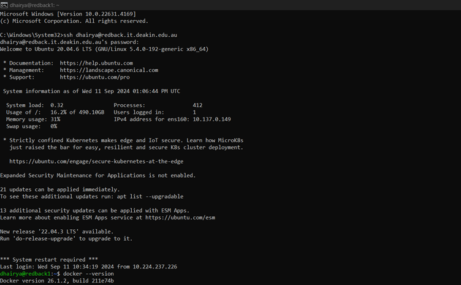

This screenshot displays a terminal session where the user is logged into an Ubuntu 20.04 Linux virtual machine (VM) via SSH. The login prompt confirms the session with the user credentials and hostname (`dhairya@redback.it.deakin.edu.au`). System information, such as CPU usage (0.32), memory usage (31%), and load average, is shown, which helps monitor the VM’s current resource utilization.

The system also indicates that a new Ubuntu version, `22.04.3 LTS`, is available for an upgrade, but the current version (`20.04.6 LTS`) is in use. The user has also executed the command `docker --version`, which confirms Docker is installed and running version `20.16.2`, build `d11e74b`.

---

## Troubleshooting Docker Port Binding Conflicts and Container Naming Issues

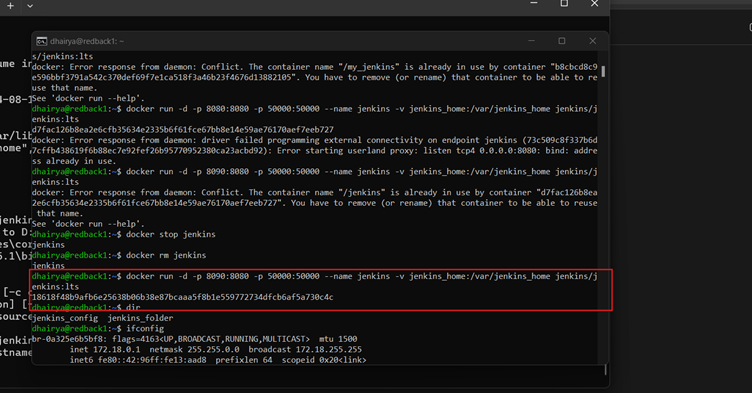

This screenshot captures a sequence of terminal commands and outputs that reflect common Docker-related errors and their resolution process. Initially, the user attempts to run a Docker container named "my_jenkins" and another as "jenkins," both intended to host Jenkins installations. However, conflicts arise due to port binding issues and duplicate container names, as indicated by error messages stating that ports are already in use and containers with those names already exist.

Commands like `docker stop jenkins` and `docker rm jenkins` are executed to remove the existing container, aiming to resolve the name conflicts. Furthermore, the user verifies the Docker version and inspects network settings using `ifconfig`, ensuring no underlying network issues are contributing to the Docker errors.

---

## Addressing Docker Engine and Container Naming Issues with Volume Inspection

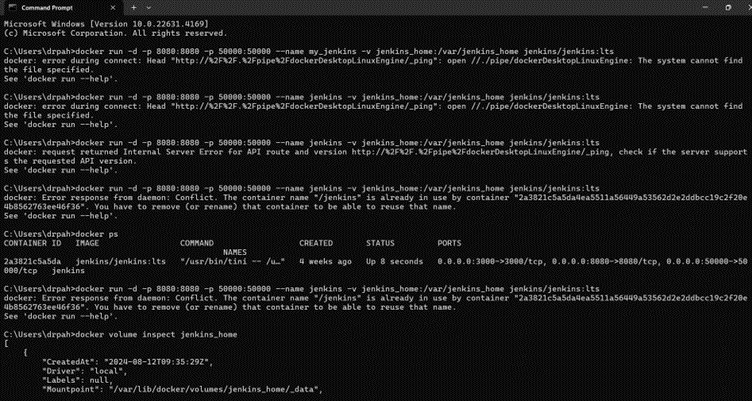

This screenshot captures a terminal session where the user attempts to run a Jenkins container using Docker commands but encounters multiple errors related to Docker Engine connectivity and container name conflicts. Initially, the user faces a connection issue with the Docker Desktop Linux Engine, resulting in an error message stating, "The system cannot find the file specified."

Subsequent attempts to start the Jenkins container also lead to an "Internal Server Error for API route," signaling a potential issue with the Docker API. After resolving the engine connectivity issue, the user inspects the Jenkins volume (`jenkins_home`) to ensure that the persistent data storage is correctly set up. The volume inspection reveals details such as the volume’s creation time, driver, and mount point (`/var/lib/docker/volumes/jenkins_home/_data`).

---

## Copying Jenkins Data from Docker Volume to Host System and Resolving Privilege Issues

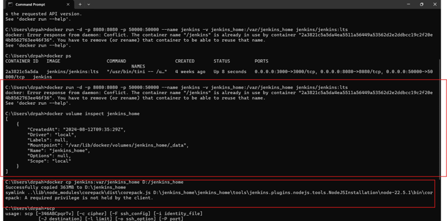

This screenshot shows a terminal session where the user inspects and copies Jenkins data from the Docker volume to the host system. Initially, the `docker volume inspect jenkins_home` command reveals details about the Jenkins volume, including its mount point (`/var/lib/docker/volumes/jenkins_home/_data`). The user uses `docker cp` to transfer Jenkins configuration files to a directory on the host machine (`D:/jenkins_home`), successfully transferring 363 MB of data.

However, a subsequent attempt to use `scp` (secure copy) encounters a permission error: "A required privilege is not held by the client." This error suggests that the current user lacks administrative rights to complete the transfer, likely due to Windows’ file security restrictions.

---

## Successful File Transfer via SCP after Resolving Permission Denial in PowerShell

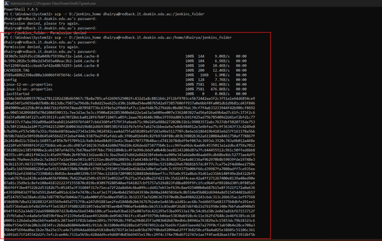

This screenshot shows a PowerShell session where the user successfully transfers files using `scp` after resolving the permission error. The files are copied from `D:/jenkins_home` to the remote server (`/home/dhairya/jenkins_folder`). The successful transfer of files, including `.cache`, `.properties`, and configuration files, is confirmed with specific file sizes and transfer speeds.

---

## Volume Copied

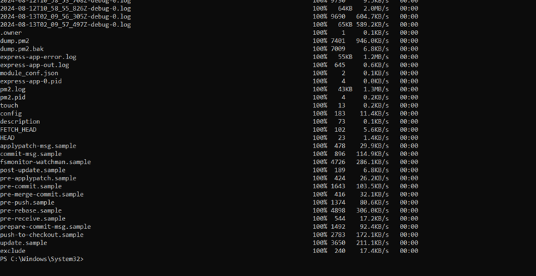

---

## Resolving Docker Container Name and Port Binding Issues for Jenkins Setup

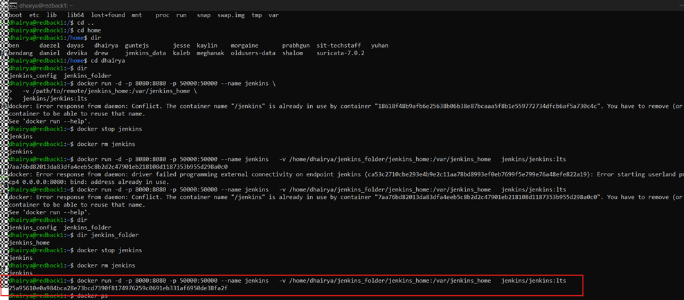

In this screenshot, the user resolves Docker container conflicts by stopping and removing the conflicting Jenkins container using `docker stop jenkins` and `docker rm jenkins`. A port binding conflict is also resolved by ensuring port `8080` is available for the Jenkins container.

---

## Verifying Running Jenkins Docker Container with Network Port Check on Ubuntu VM

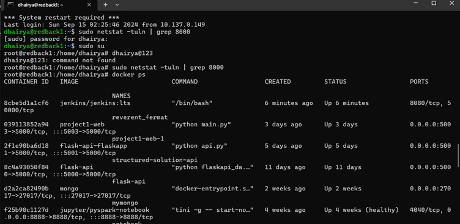

This screenshot shows the user verifying the Jenkins container status on an Ubuntu VM. The command `netstat -tuln | grep 8080` confirms that port `8080` is actively in use, suggesting Jenkins is running. The `docker ps` command shows a Jenkins container running for 6 minutes, with port `8080/tcp` exposed.

---

## Verifying Port 8080 Availability and Establishing SSH Tunnel for Jenkins Access

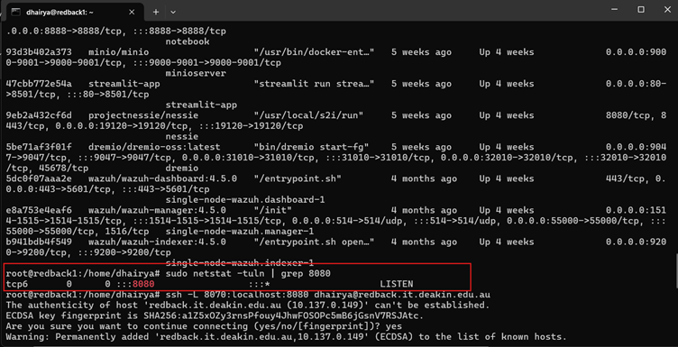

The user checks the availability of port `8080` with `netstat -tuln | grep 8080` and establishes an SSH tunnel using the command `ssh -L 8070:localhost:8080 dhairya@redback.it.deakin.edu.au`. This tunnel forwards local port `8070` to the remote server’s port `8080`, allowing secure access to Jenkins.

---

## System Information Overview and Network Configuration on Ubuntu VM

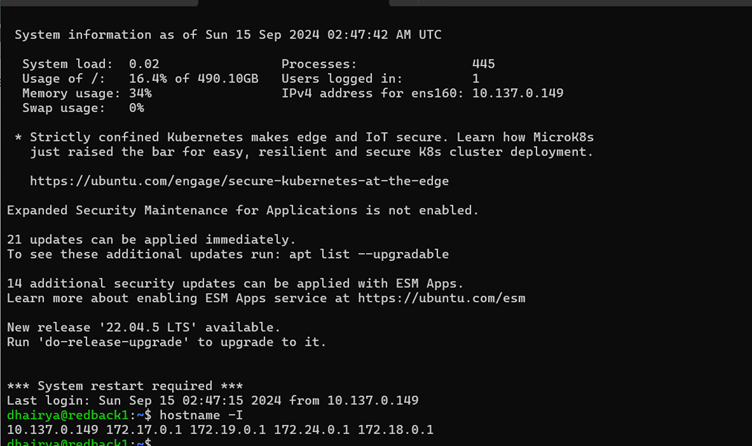

This screenshot provides an overview of the system status on an Ubuntu VM, including CPU load (0.02), memory usage (34%), and disk usage (16.4%). The system prompts for available updates, including security updates and a new version upgrade to `22.04.5 LTS`.

---

# Setting Up Jenkins:

## Unlocking Jenkins

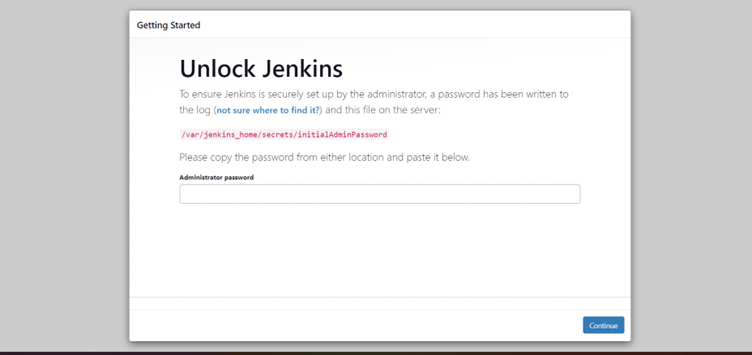

---

## Retrieving Jenkins Initial Admin Password from Docker Container on Ubuntu VM

In this screenshot, the user retrieves the Jenkins initial admin password using `sudo docker exec jenkins cat /var/jenkins_home/secrets/initialAdminPassword`.

---

## Installation of Jenkins

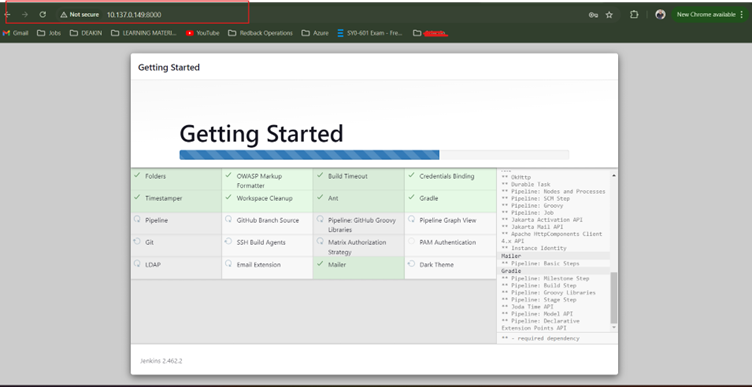

---

## Jenkins Ready to Use

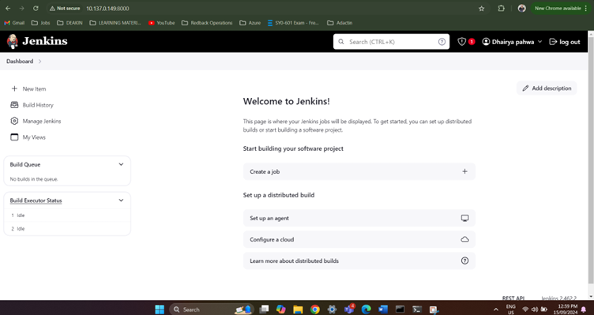

---

## Ready to Build and Run

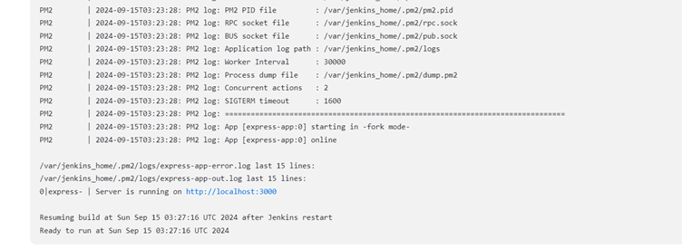
