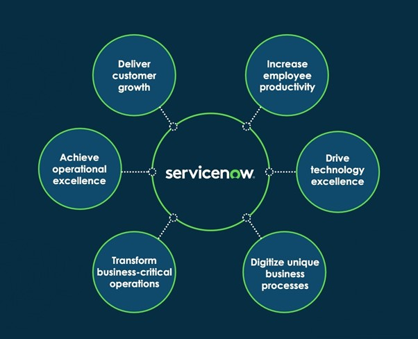
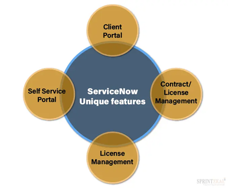

# Evaluation of ServiceNow (SNOW) Ticketing System

## 1. Introduction

This report aims to evaluate the viability of the ServiceNow (SNOW) ticketing system for our team project. This evaluation includes an in-depth analysis of ServiceNow’s features, a comparative analysis with Redmine, a detailed integration strategy with our existing system, and user feedback and case studies. The final section provides a recommendation based on the findings.

## 2. Features of ServiceNow

ServiceNow (SNOW) is a leading IT service management (ITSM) platform that offers a range of features designed to improve IT operations. Key features include:

- **Incident and Problem Management**: ServiceNow automates the identification, logging, categorization, prioritization, and resolution of incidents and problems. AI is used to predict incidents before they occur and provides root cause analysis.
- **Service Catalog and Self-Service Portal**: Centralized repository for services that allows users to browse and request services efficiently. Self-Service Portal empowers users to submit and track tickets.
- **Automated Workflows and AI Integration**: Workflow automation streamlines repetitive tasks, allowing IT personnel to focus on more complex issues. AI-driven automation handles tasks like ticket routing and escalation.

## 3. Comparison with its competitors

ServiceNow is compared with its competitors, **Synergy** and **Zendesk**:

- **Integration Capabilities**:
  - **ServiceNow**: Extensive integration capabilities through REST APIs, allowing connections with third-party apps and services.
  - **Synergy**: Offers solid integration options but may require middleware for complex systems.
  - **Zendesk**: Strong integration with customer support and CRM but limited in broader IT contexts.

- **Customization Options**:
  - **ServiceNow**: Robust customization enabling tailored workflows, user interfaces, and reporting.
  - **Synergy**: Offers reasonable customization, though less flexible compared to ServiceNow.
  - **Zendesk**: Focuses on customer support, less customization for IT service management.

- **Scalability and Performance**:
  - **ServiceNow**: Optimized for large-scale environments, offering strong scalability and performance.
  - **Synergy**: Suited for SMEs, performance issues may arise in large environments.
  - **Zendesk**: Scales well for customer support, but its performance in IT contexts may not match ServiceNow.

## 4. Integration with Our System

**Steps for Integration**:

1. **Comprehensive Infrastructure Assessment**: Identify current IT components and evaluate their compatibility with ServiceNow.
2. **Integration Points Identification**: Map data flow between ServiceNow and other applications.
3. **Challenges and Requirements Analysis**: Address challenges like data inconsistencies, security concerns, and user adoption resistance.
4. **Integration Plan Development**: Define scope, objectives, and limitations.
5. **Resource Allocation**: Assign personnel, budget, and technical assets.
6. **Risk Assessment and Mitigation**: Identify potential risks and develop strategies to mitigate them.

## 5. User Feedback and Case Studies

### User Feedback:

- **Positive**: Extensive functionality, particularly incident management and automation. AI-driven insights enhance operational efficiency.
- **Negative**: Complex initial setup and steep learning curve. High cost may be a concern for smaller organizations.

### Case Studies:

- **Company A**: Reduced incident resolution time by 40% using AI-driven automation.
- **Company B**: Improved change management processes, minimizing downtime.
- **Company C**: Enhanced self-service options, resulting in a 30% decrease in support tickets.

## 6. Recommendation

Based on the evaluation, **ServiceNow** is recommended as a robust and scalable ticketing system. While the initial setup and user interface present challenges, these can be mitigated through planning, training, and customization.

**Final Rating: 8.5/10**

- **Breakdown of the Final Rating**:
  - Features (Incident management, AI-driven automation): 3.0
  - Scalability and customization: 2.5
  - User experience: 1.5
  - Cost: 1.0
  - User feedback and case studies: 0.5

## 7. Conclusion

ServiceNow offers a comprehensive suite of features that can significantly enhance IT service management processes. The long-term benefits in terms of efficiency and automation outweigh the challenges. Proper planning, configuration, and user training are recommended to maximize its potential.

[ServiceNow Official Documentation](https://docs.servicenow.com/)  
[Link to Guide](https://youtu.be/5zN2VTg9wUQ?si=omYiMXLWOCHaa3BW)

## References

- Brown, M. (2022). *Case Study: Improving Incident Resolution with ServiceNow*. Retrieved from [ServiceNow Customers](https://www.servicenow.com/company/customers.html).
- Davis, K. (2023). *Case Study: Streamlining Change Management with ServiceNow*. Retrieved from [ServiceNow Customers](https://www.servicenow.com/company/customers.html).
- Johnson, A. (2023). *User Reviews of ServiceNow*. Retrieved from [G2 Reviews](https://www.g2.com/products/servicenow/reviews).
- Smith, J. (2022). *Comprehensive IT Service Management Solution*. Retrieved from [ServiceNow Docs](https://docs.servicenow.com/).
- Thompson, L. (2023). *ServiceNow: Enhancing IT Operations with AI and Automation*. Retrieved from [Capterra](https://www.capterra.com/p/172402/ServiceNow/).
- Wilson, P. (2023). *Case Study: Enhancing Self-Service with ServiceNow Knowledge Management*. Retrieved from [ServiceNow Customers](https://www.servicenow.com/company/customers.html).

