# Enumeration on Port 27107 

### Detect the services running on port 27017:

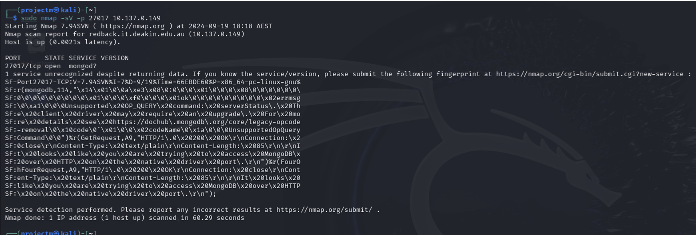

#### Explanation:
- 	-sV: This option enables version detection. It attempts to determine the version of the service running on the open ports.
-	-p 27017: This option tells nmap to scan only port 27017, which is commonly used by MongoDB.
-	The output tells that port 27017/tcp is open and that it is running MongoDB. However, nmap could not fully identify the version of MongoDB.
-	The scan also captured a series of HTTP-like responses, indicating that it could have identified a MongoDB REST API or other services associated with this port.
-	The result shows a successful connection to the MongoDB port but with limited information about the service version, suggesting that further probing or authenticated scanning might be necessary to fully identify the service.

### Service Version Detection on Port 27017:

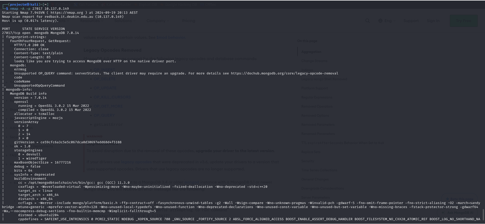

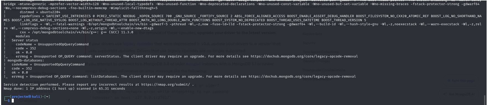

#### Explanation:
-	Service Detected: The scan revealed that port 27017 is open and running MongoDB version 7.0.14.
-	Errors Encountered: The scan showed errors for unsupported commands like serverStatus and listDatabases. These are due to MongoDB version 7.0.14, which no longer supports these commands as they were deprecated in MongoDB versions 4.2 and above.
-	Detailed build environment information was captured, including the MongoDB compilation environment (GCC version, compiler flags, etc.).
-	The scan completed successfully in 65.31 seconds, detecting MongoDB version 7.0.14 but with some limitations on command compatibility due to deprecated functionality.

### Service and Build Information on port 27017:

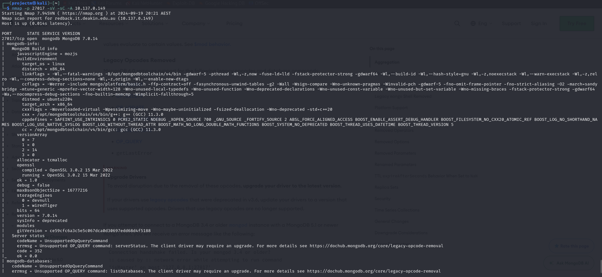

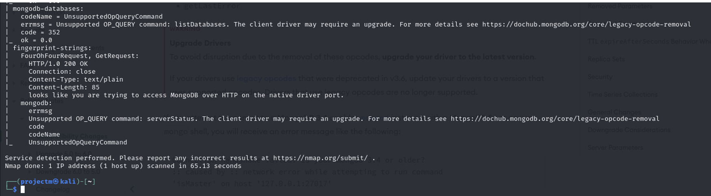

#### Explanation:
-	**Build Information:**
-	Details about how MongoDB was compiled and configured:
    -   GCC version: GCC (GNU Compiler Collection) 11.3.0 was used to build this MongoDB instance.
    -   MongoDB Build Options: Compilation flags like -fstack-protector-strong, -Wl,-z,now are visible, which provide insights into security measures like stack protection and memory management used during the build.
    - OpenSSL Version: The MongoDB instance uses OpenSSL 3.0.3 (March 2022), important for managing encrypted connections and security.
-   **Errors and Deprecated Commands:**
-   Several unsupported command errors are shown in the output:
    -    Error: Unsupported OP_QUERY command: serverStatus:
        -   The MongoDB server no longer supports the OP_QUERY for serverStatus. This suggests that MongoDB 7.0.14 has moved away from certain older commands used by the client or scanning tool.
    -   Error: Unsupported OP_QUERY command: listDatabases:
        -   Similarly, listDatabases is no longer supported via the legacy OP_QUERY command. This is related to changes in MongoDB's query protocol after version 4.2.
    -   These errors are accompanied by a message suggesting upgrading the client driver, and a link to the MongoDB documentation on legacy opcode removal for further clarification.
-   **Fingerprint Details:** The output includes HTTP-like fingerprinting strings showing attempts to access MongoDB over HTTP. However, these attempts fail, as MongoDB doesn’t communicate directly via HTTP on the native driver port (port 27017).
-   The scan finished after 65.31 seconds, successfully identifying the service (MongoDB 7.0.14) and capturing the deprecated commands and build information.

### Detect vulnerabilities on port 27017:

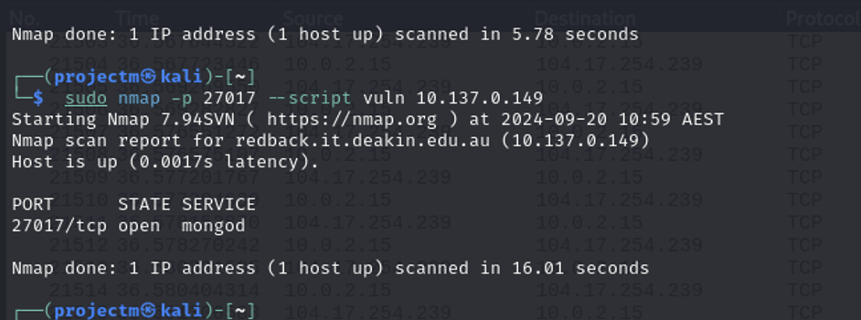

#### Explanation:
-	--script vuln: Instructs nmap to run vulnerability scripts. These scripts attempt to detect known vulnerabilities on the specified service (in this case, MongoDB running on port 27017).
-	The scan checked port 27017 for any known vulnerabilities in MongoDB using the vuln script.
-	No vulnerabilities were detected or listed in the output for the MongoDB service running on the target machine.
-	This could indicate that MongoDB 7.0.14 is well-secured or that any potential vulnerabilities require more advanced methods to detect.

### Install mongodb-clients: 

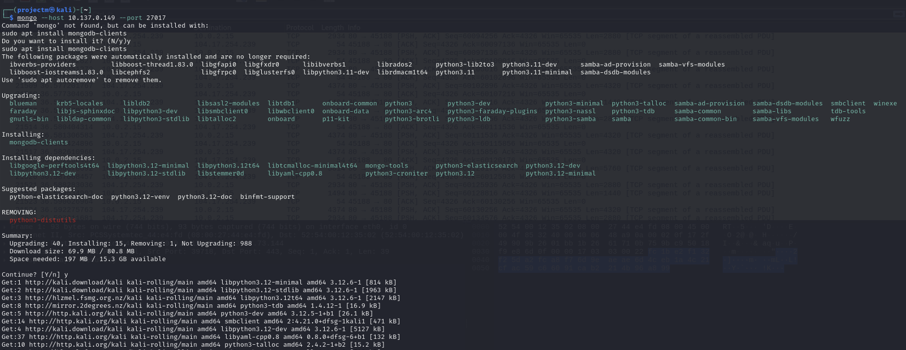

-	Run a brute-force attack on the MongoDB service to check for weak credentials using the mongodb-brute script. This script tries multiple username/password combinations to see if the MongoDB instance has weak or default credentials that can be exploited to gain access.
- **How the mongodb-brute Script Works:**
    -	The mongodb-brute script is part of Nmap's scripting engine (NSE), specifically designed for brute-forcing MongoDB credentials.
    -	The script tests for a variety of default or common credentials (like admin:admin, root:password) and can be configured to use custom username/password lists if specified.
    -	If successful, it will report back which credentials were used to access the MongoDB instance, which could indicate a security vulnerability (weak password).But the scan didn't reveal any credentials for the MongoDB Service.

### Installing Docker:

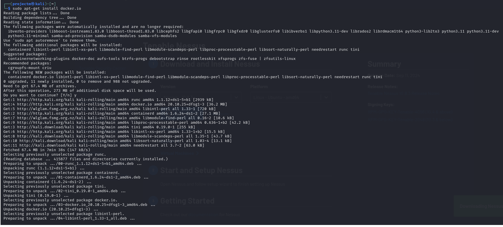

-	Installing Docker gives a flexible and isolated environment where we can run MongoDB instances on port 27017. This setup will allow us to:
    -	Run MongoDB in a safe, controlled environment.
    -	Test MongoDB configurations against security threats (like weak authentication or misconfigurations).
    -	Experiment with different MongoDB versions or settings without risking the security of your main system.

### Start Docker:

- docker run --help, displaying a list of options and flags for running containers, such as detached mode (-d), port mapping (-p), and custom container naming (--name).

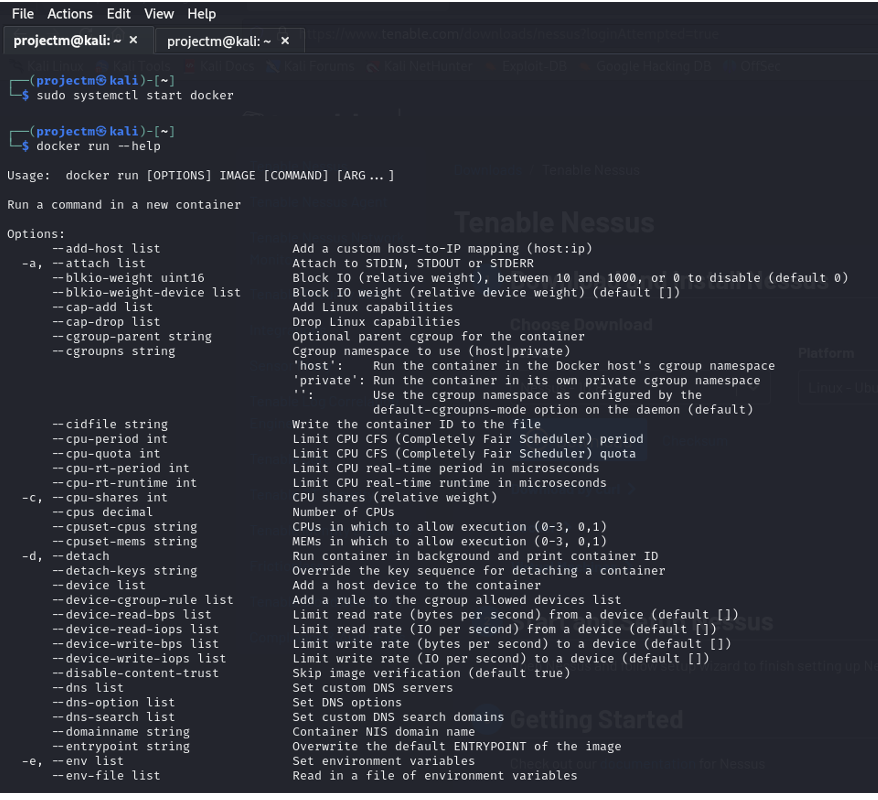

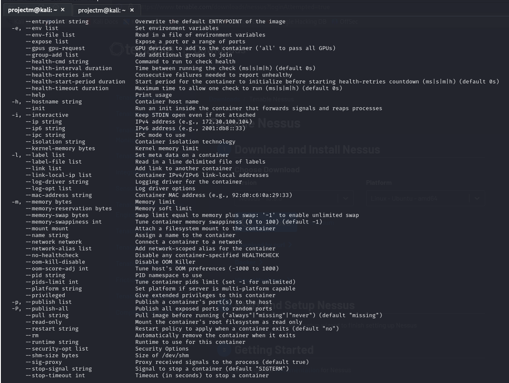

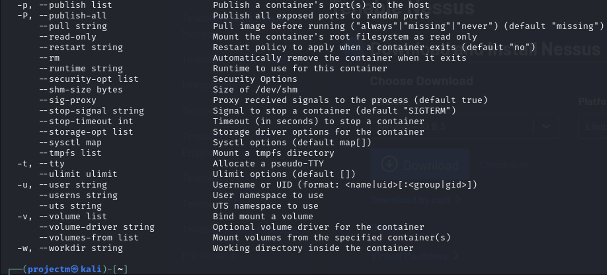

### Running MongoDB Container:

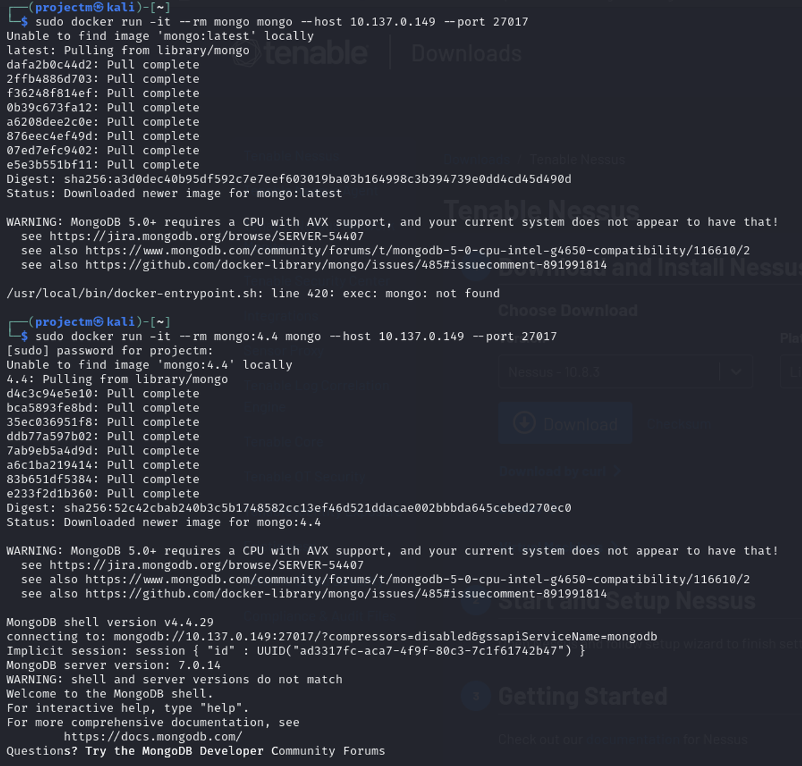

-	MongoDB Container Attempt: The first attempt involved running a MongoDB container using the mongo:latestimage (MongoDB 5.0) to connect to host 10.137.0.149 on port 27017.
-	Issue with MongoDB 5.0: The first attempt to pull mongo:latest (MongoDB 5.0) raised a compatibility warning:
-	CPU with AVX support is required: The system does not have a CPU that supports AVX (Advanced Vector Extensions), which is necessary for running MongoDB 5.0.
-	Switching to MongoDB 4.4: A second attempt pulled and used the mongo:4.4 image, which avoided the AVX compatibility issue.
-	MongoDB Shell and Server Versions: The MongoDB shell inside the container is version 4.4.29, while the server being connected to runs version 7.0.14, resulting in a version mismatch warning.
-	**Connection Established:** Despite the version mismatch, the connection to the MongoDB instance at 10.137.0.149:27017 was successfully established, allowing interaction with the server.

#### Connection Status:
The session is connected to the MongoDB server, but authentication failures and permission warnings are preventing full access to the databases or collections.

#### MongoDB's Security Posture:
- MongoDB 7.0.14 is a relatively recent release. The MongoDB development team actively maintains their software, so major vulnerabilities are typically addressed in newer versions.
Newer versions generally come with improved security features, making it harder to find vulnerabilities compared to older, unpatched versions.

### Conclusion:
To conclude, the process involved setting up and interacting with a MongoDB instance using Docker, while scanning port 27017 for vulnerabilities. Although a connection to MongoDB 7.0.14 was established, authentication attempts failed due to misconfigured credentials. MongoDB 7.0.14, being a recent version, is less likely to have easy-to-exploit vulnerabilities, but misconfigurations and poor security practices can still expose the database to risks. A security audit or penetration test should prioritize reviewing configuration issues, such as authentication, network access, and encryption, rather than focusing solely on known software vulnerabilities.

## Vulnerability Scanning of  Redback Operations IP address 10.137.0.149 Using Nessus:

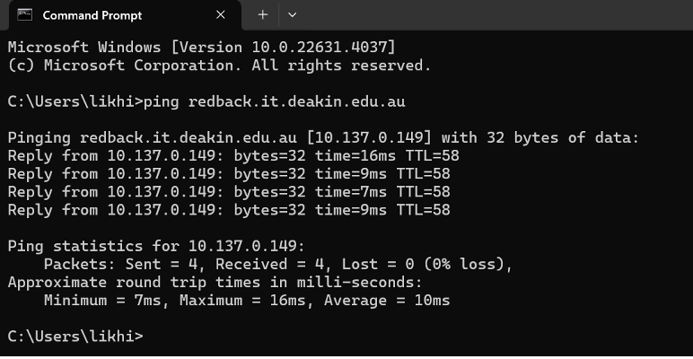

### Create a New Scan (Basic) Enter the IP Address:

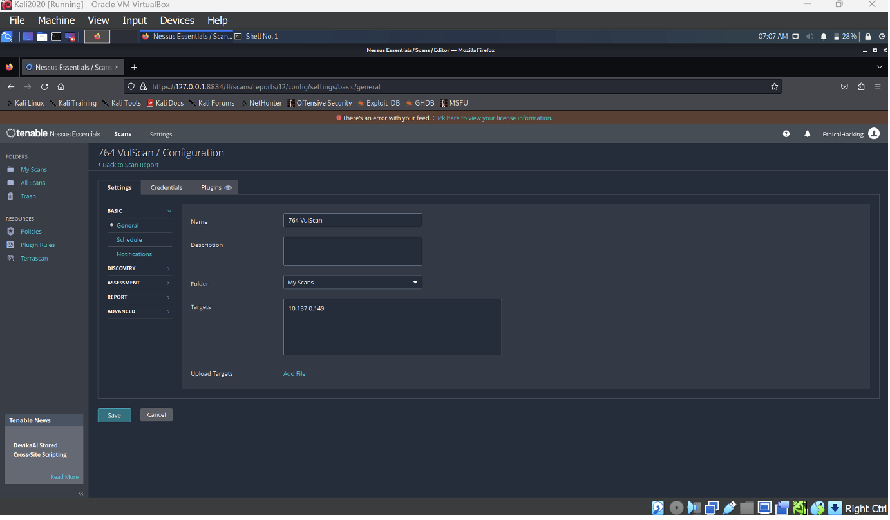

### Scanning the IP Address:

- Scan identified 30 vulnerabilities across various categories such as SSL, HTTP, and SSH, with a distribution of severity levels for Redback Operations.

### Hosts:

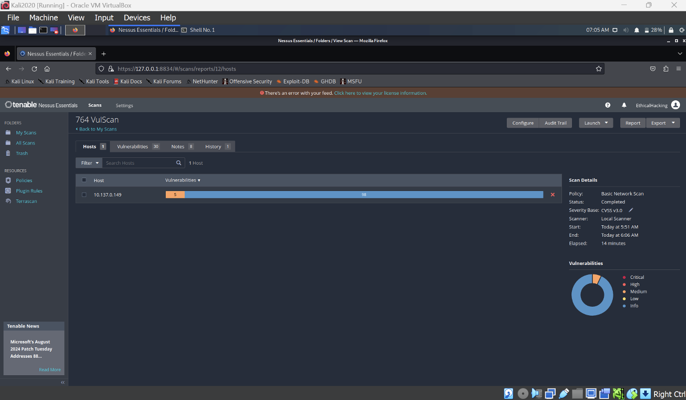

-	The Nessus vulnerability scan conducted on the IP address 10.137.0.149, belonging to Redback Operations, revealed 35 vulnerabilities across varying severity levels. The scan, titled "764 VulScan," was completed using a "Basic Network Scan" policy within 14 minutes. The vulnerabilities were assessed using the CVSS v3.0 scoring system, providing a standardized evaluation of the risks.

### History including start time and end time of the scan:

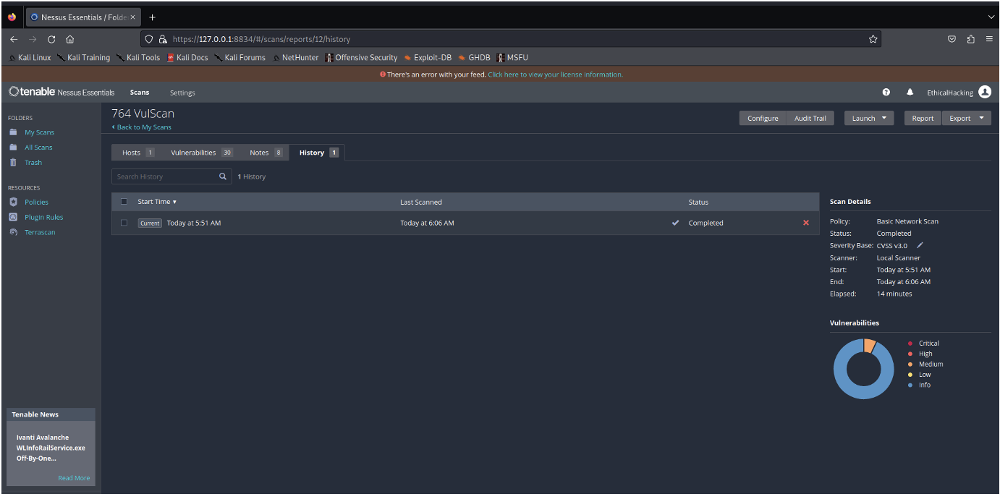

### Notes:

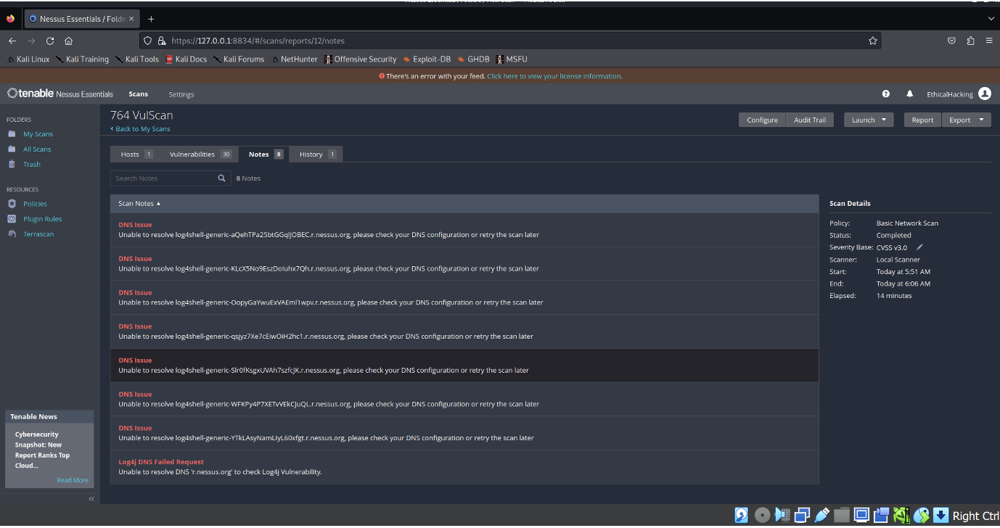

-	These notes indicate that during the scan, the Nessus tool encountered difficulties resolving certain hostnames, which may have impacted the ability to fully assess some vulnerabilities. The notes suggest checking the DNS configuration or retrying the scan to ensure accurate results. Despite these challenges, the scan was completed, and the findings provide valuable insights into the network's security posture. 

### Identified Mixed Vulnerabilities:

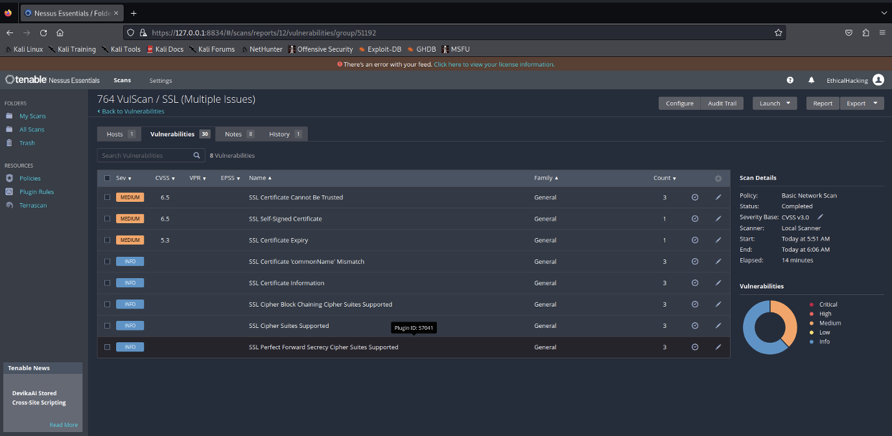

-	The mixed vulnerabilities identified during the Nessus scan on IP address 10.137.0.149 associated with Redback Operations presents a comprehensive list of detected issues across various severity levels, including critical, high, medium, and low. 
-	Each vulnerability is accompanied by specific details such as its description, affected services or ports, potential impact, and recommended remediation steps. This overview enables a clear understanding of the security posture of the system and assists in prioritizing and addressing the identified vulnerabilities effectively to enhance overall network security.

### Here are some of the High Severity Vulnerabilities:

1)	**SSL Certificate Cannot Be Trusted:**

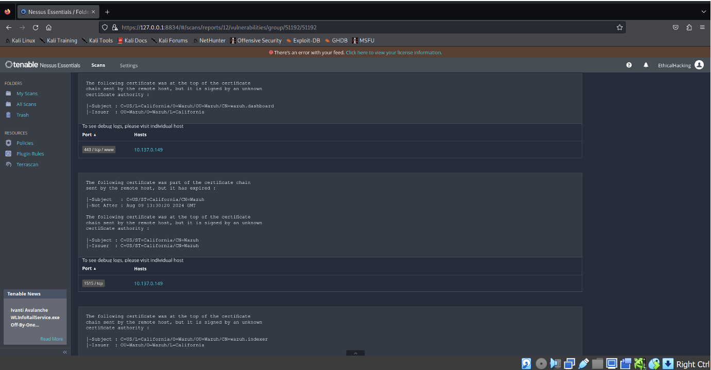

-	The scan identified a medium-severity vulnerability where the SSL certificate cannot be trusted. This issue arises from potential breaks in the certificate chain, use of untrusted or self-signed certificates, or other misconfigurations that could compromise secure communication.
-	The detailed output provides further evidence, showing that the certificates at the top of the chain are signed by an unknown or untrusted certificate authority, raising concerns about the authenticity and integrity of the connection. The scan suggests generating or purchasing a proper SSL certificate from a trusted certificate authority to mitigate this risk.
-	Addressing this issue is crucial to ensure the integrity and security of communications, thereby protecting the network from potential man-in-the-middle attacks and other vulnerabilities related to SSL/TLS configurations.

2)	**SSL Self Signed Certificate:**

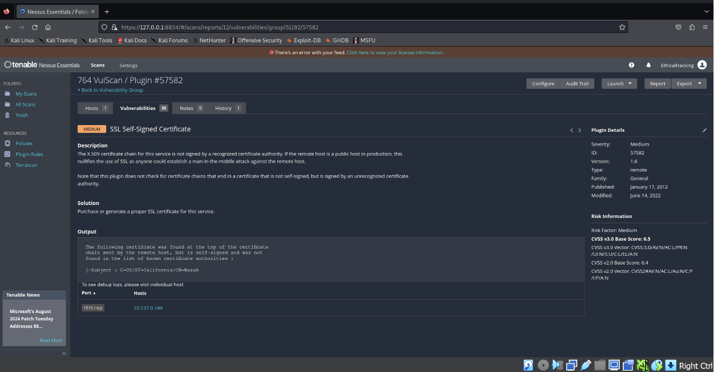

-	Addressing this issue is crucial to ensure the integrity and security of communications, thereby protecting the network from potential man-in-the-middle attacks and other vulnerabilities related to SSL/TLS configurations.
-	The scan indicates that the SSL certificate in use is not signed by a recognized certificate authority, which could undermine the trustworthiness of the connection. This issue poses a potential risk, particularly in a production environment, as it could allow attackers to execute man-in-the-middle attacks, compromising secure communications. The report recommends resolving this vulnerability by acquiring and deploying a properly signed SSL certificate from a trusted certificate authority. Addressing this issue is essential to enhance the security of the network and to maintain the integrity and confidentiality of data exchanges.

3)	**SSL Certificate Expiry:**

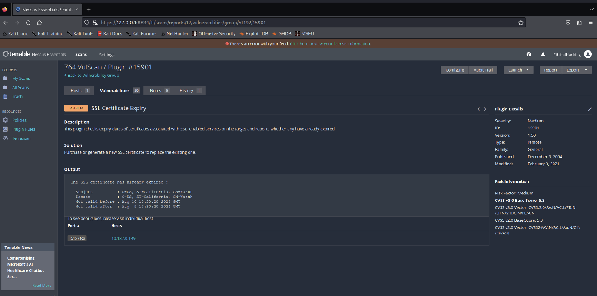

-	The report highlights that one or more SSL certificates associated with the services on this host have already expired. Expired certificates can compromise secure communications and may lead to potential security risks, such as enabling attackers to impersonate the affected services. 
-	To mitigate this issue, the report recommends purchasing or generating a new SSL certificate to replace the expired one. Addressing this vulnerability is critical to maintaining the integrity and security of encrypted communications on the network, ensuring continued trustworthiness of the services provided by Redback Operations.

### Completed the Scan Successfully:

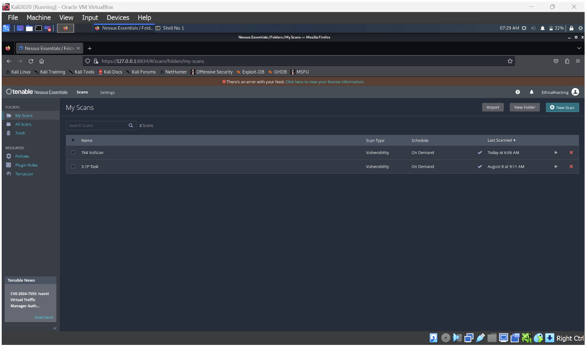

### Conclusion:
To conclude, implementing the recommended remediation steps will significantly reduce the risk of exploitation and improve the system’s resilience to cyber threats. By prioritizing the high and critical vulnerabilities, Redback Operations can take a proactive approach to securing its infrastructure and maintaining the integrity and confidentiality of its network communications.

