**Last updated by:** Manasa, **Last updated on:** 23/09/2024

**Last updated by:** Manasa, **Last updated on:** 23/09/2024

# Penetration Test of MQTT Server

## Introduction

The key concepts of penetration testing and MQTT (Message Queuing Telemetry Transport) are essential in the realms of cybersecurity and real-time messaging. Penetration testing plays an important role in identifying system vulnerabilities and enhancing defenses against potential threats. On the other hand, MQTT is widely used in IoT and messaging applications to facilitate communication between clients. Tools such as Nmap, which is used for network scanning, and Wireshark, for packet analysis, are vital in assessing and ensuring the security and efficiency of these operations. 

## Penetration Test on redback.it.deakin.edu.au MQTT Server:

### Nmap to Scan redback.it.deakin.edu.au (ip address 10.137.0149)

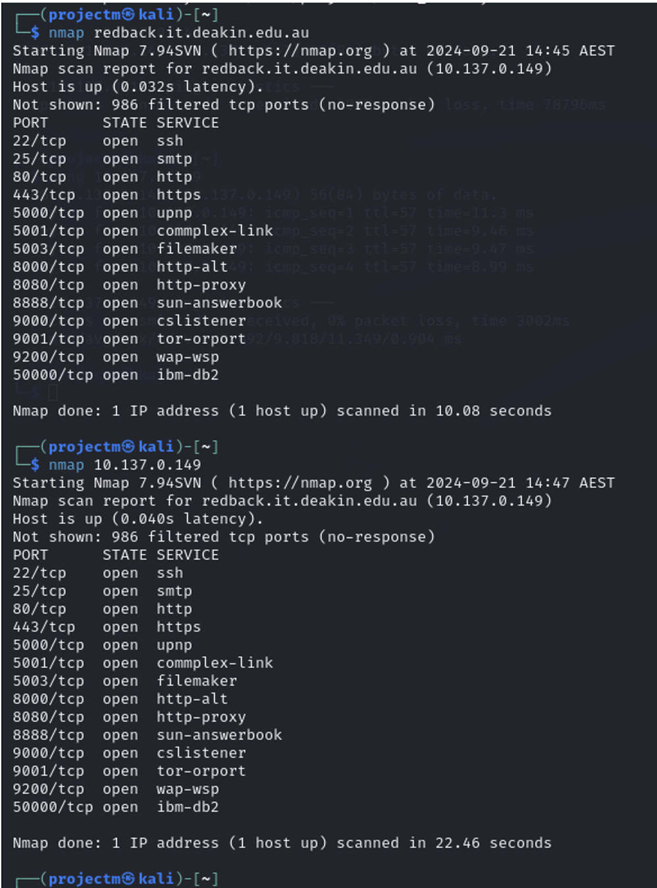

- nmap to check whether the host (redback.it.deakin.edu.au with IP 10.137.0.149) is online and responding to network requests. The output indicates that the host is up with a latency of 0.032 seconds.

### ping 10.137.0.149

#### Purpose:
- **Check Host Availability:** The ping command was used to verify whether the host at IP address 10.137.0.149 is reachable and responsive over the network. By sending ICMP (Internet Control Message Protocol) Echo Request packets, the command measures the time it takes for the host to respond, confirming its availability.

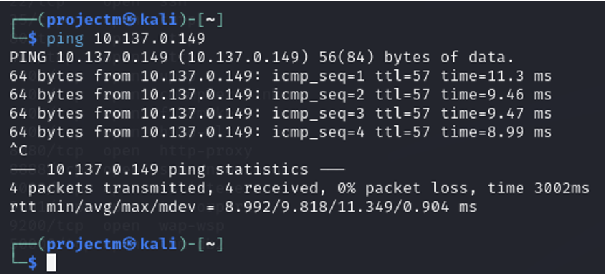

- The ping test confirms that the host at 10.137.0.149 is up and responding with minimal latency and no packet loss, making it reachable for further communication or scanning tasks.

**Opening the website:** We can see a file upload page on the site.

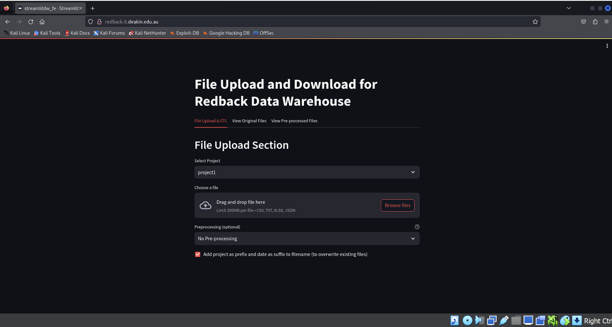

### Full Port Scan of 10.137.0.149

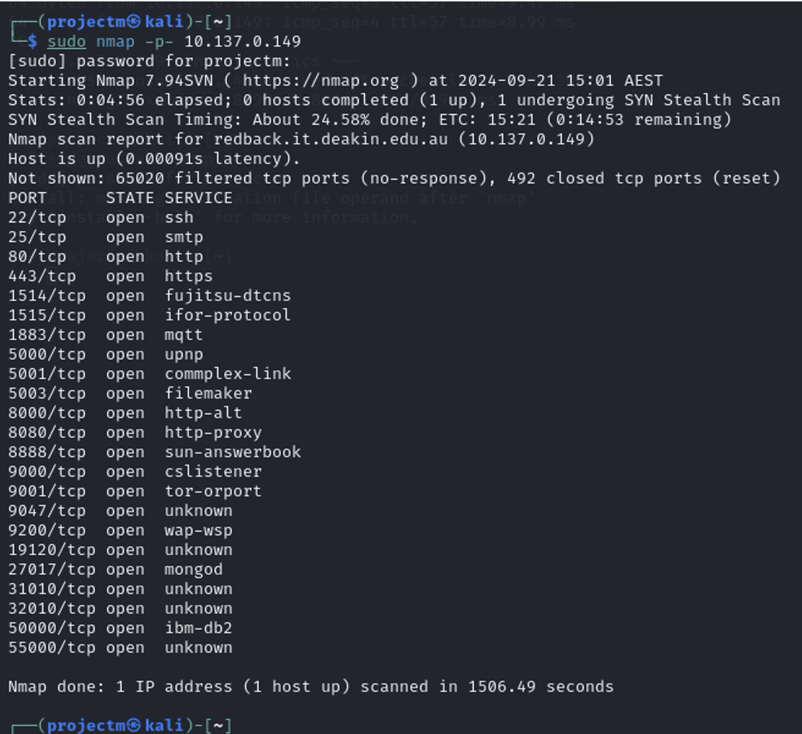

#### Purpose:
- **Comprehensive Port Scan:** The -p- flag tells Nmap to scan all 65,535 TCP ports on the target host (10.137.0.149). This command ensures that no port is missed, providing a full overview of which ports are open, closed, or filtered.
- **SYN Stealth Scan:** Nmap uses a SYN Stealth Scan by default when running with sudo privileges. This scan sends SYN packets and waits for responses to identify open ports, without completing the TCP connection. This is a faster and stealthier method of scanning compared to a full TCP connection scan.

#### Key Details from the Output:
- **Host Status:** The host 10.137.0.149 is up with a very low latency of 0.00091s, indicating a fast response from the host.
- **Filtered and Closed Ports:** 
    - 65,020 filtered ports: These ports did not respond to the scan, likely due to firewall rules or packet filtering.
    - 492 closed ports: These ports responded with a TCP reset, meaning no service is running on these ports.

- **Open Ports and Services:** The scan found several open ports with services running on them, including:
    -	22/tcp: SSH (Secure Shell)
    -	25/tcp: SMTP (Simple Mail Transfer Protocol)
    -	80/tcp: HTTP (HyperText Transfer Protocol)
    -	443/tcp: HTTPS (HTTP Secure)
    -	1514/tcp: Fujitsu DTCNS
    -	1883/tcp: MQTT (Message Queuing Telemetry Transport)
    -	5000/tcp: UPnP (Universal Plug and Play)
    -	5001/tcp: Commplex-link
    -	8000/tcp: HTTP-alt (Alternative HTTP Port)
    -	8080/tcp: HTTP Proxy
    -	8888/tcp: Sun Answerbook
    -	9000/tcp: CSListener
    -	9001/tcp: Tor ORPort (used for Tor network)
    -	27017/tcp: MongoDB (default port for MongoDB database)
    -	50000/tcp: IBM DB2 database
    -	Several other open ports with unknown services, such as 9047, 19120, 31010, 32010, and 55000.
- **Port 8883/tcp:** The port is filtered, meaning that network devices (such as firewalls) are blocking direct communication on this port. This suggests that secure MQTT (MQTT over TLS/SSL) is not currently accessible.
    
### Operating System of the Host

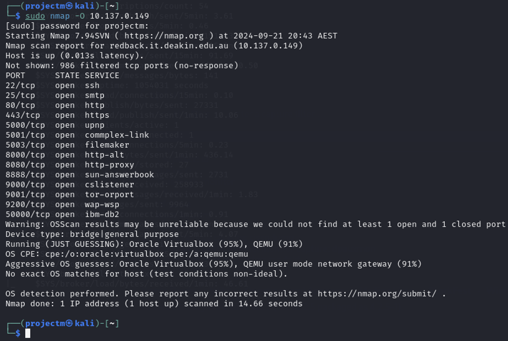

- Based on the Nmap scan results, it appears that the host (IP address 10.137.0.149) is most likely running in a virtualized environment. The OS guess provided by Nmap suggests that it is either running Oracle VirtualBox (95%)or QEMU (91%) as the virtualization software. However, the exact operating system could not be identified due to insufficient open and closed port data.This means the system could be running on a guest operating system inside one of these virtual environments.

### Nmap Command to Scan MQTT Ports (1883, 8883) on 10.137.0.149

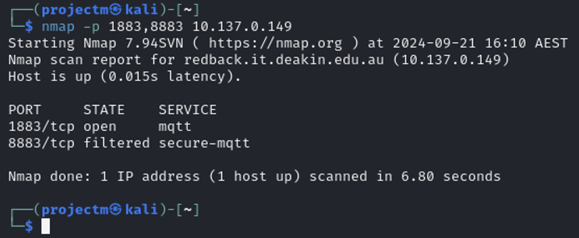

#### Key Details from the Output:
- -p specifies which port or ports to scan. In this case, you are telling Nmap to scan ports 1883 and 8883 only, which are the default ports for the MQTT protocol.
- Host Status: The host 10.137.0.149 is up, with a latency of 0.015 seconds, indicating a quick response from the host.
- Port 1883/tcp: This port is open, indicating that the MQTT service is accessible on this port for unencrypted communication.

### Service Version Detection Scan on Port 1883

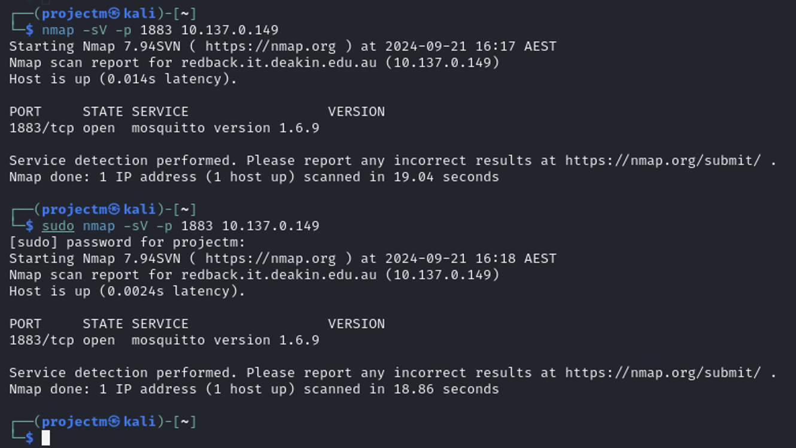

#### Explanation:

-	**Service Version Detection (-sV):** The -sV option in Nmap tells it to not only check if the port is open but also to attempt to detect the version of the service running on the specified port.
-	**Port-Specific Scan (-p 1883):** The scan is focused specifically on port 1883, which is the default port for MQTT services.
-	**Port 1883 is open:** Port 1883 is open, meaning the MQTT service is accessible on this
-	**Service:** Nmap detected that the service running on port 1883 is Mosquitto, which is a popular MQTT broker.
-	**Version:** The version of the Mosquitto broker is 1.6.9, providing detailed information about the service.

### Nmap Vulnerability Scan on port 1883 10.137.0.149

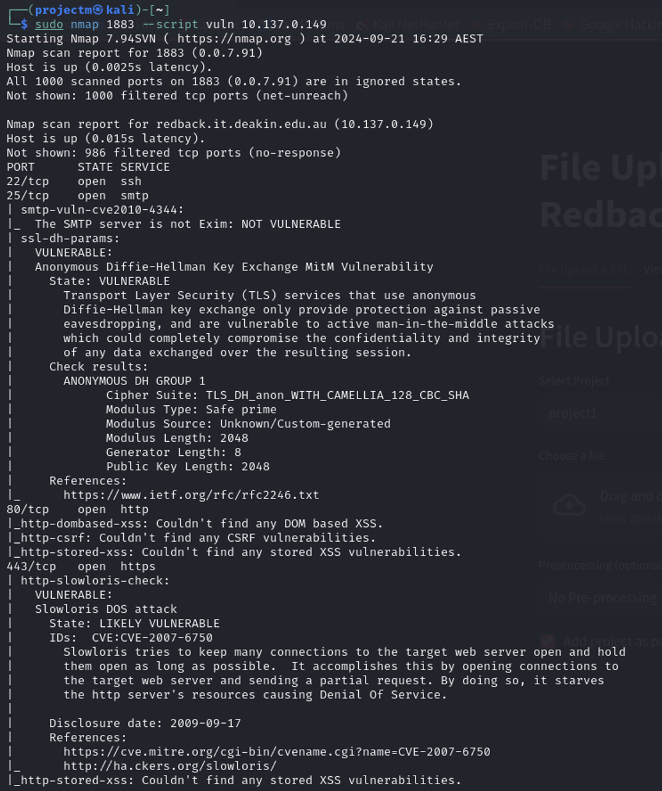

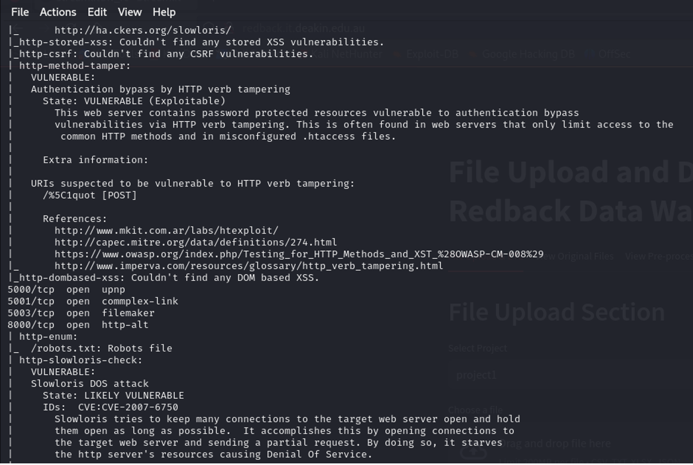

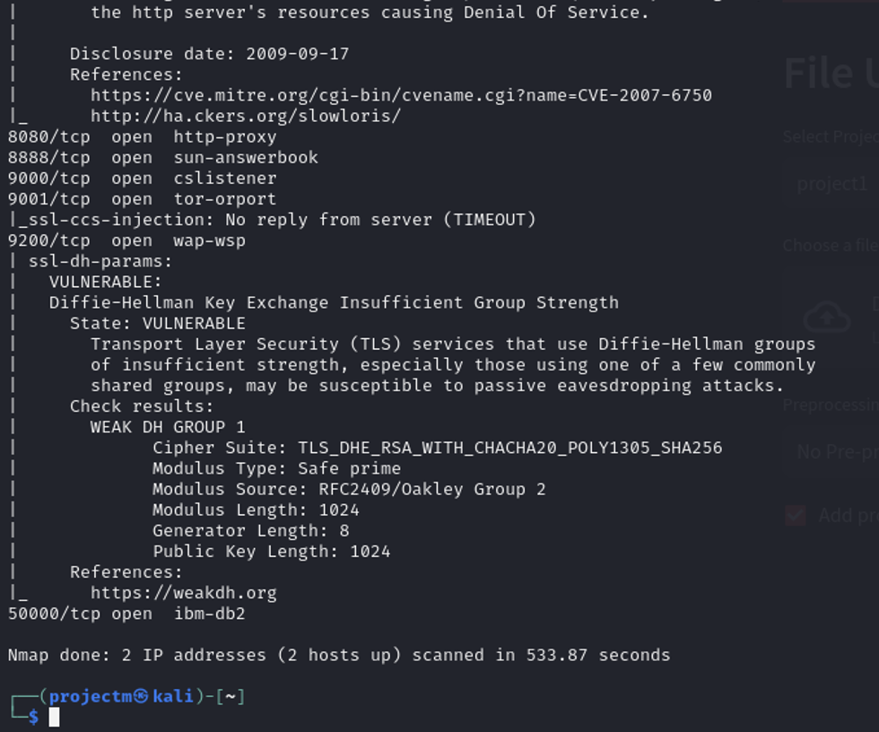

-	**Vulnerability Scan (--script vuln):** The --script vuln option in Nmap tells it to run a set of scripts that detect common vulnerabilities on the target host. This includes potential issues with various services running on the host.
-	**port 1883** (MQTT) was scanned, no vulnerabilities were detected specifically for the MQTT service running on that port. The scan focused on detecting commonly known vulnerabilities across all the open ports but did not flag any issues with the MQTT service on port 1883.

### Aggressive Scanning on Port 1883 Script Detection

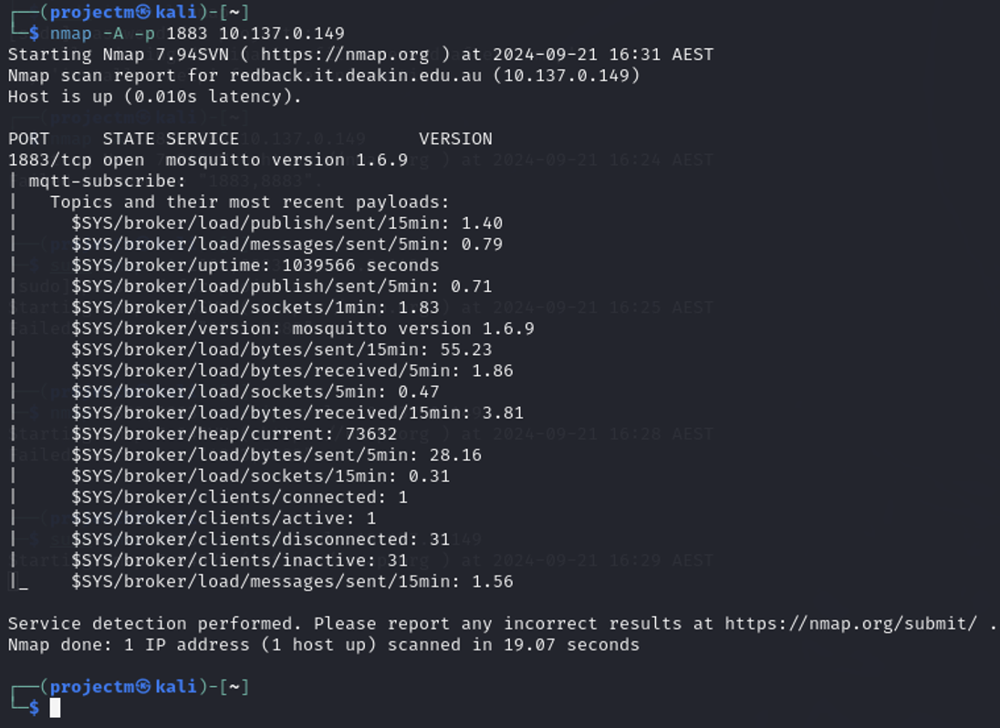

-	**Advanced Scan (-A):** The -A option in Nmap enables aggressive scanning, which includes OS Detection, Service Version Detection, Script Scanning and Traceroute.
-	**Host Status:** The host 10.137.0.149 is up, with low latency of 0.010 seconds.
-	**Port 1883 (MQTT) Service:** The service running on port 1883 is identified as Mosquitto MQTT broker, version 1.6.9.
-	**Script Output - mqtt-subscribe:** The script gathered real-time information from the broker’s system topics ($SYS/ topics) that provide internal metrics of the broker.

### Mosquitto and Mosquitto Clients Installation

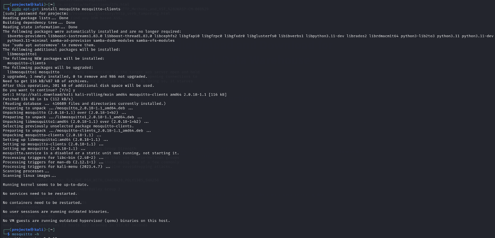 

- The mosquitto -h command provides an overview of the available options for starting and configuring the Mosquitto MQTT broker. We can use these options to customize the broker's behavior, such as setting a config file, changing the port, or running it in the background.

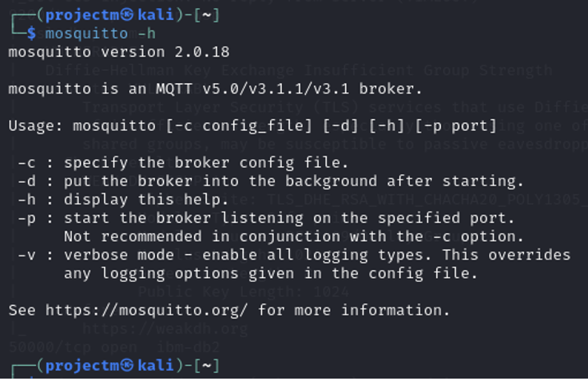

### Output with mqtt-subscribe Script

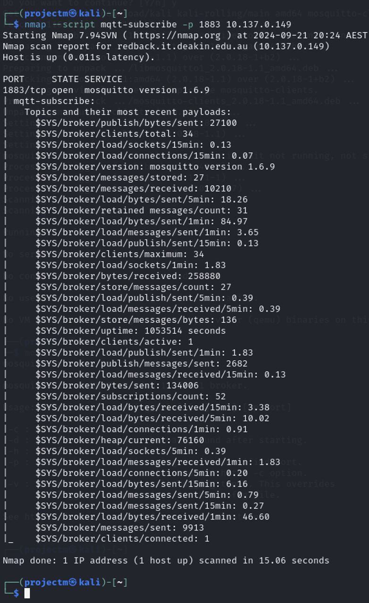

#### Purpose:
This command scanned the MQTT broker running on port 1883 of the target host 10.137.0.149 and used the mqtt-subscribe script to gather real-time system information by subscribing to MQTT topics, including the $SYS topics, which provide internal broker metrics.

#### Key Details from the Output:
**Host and Service Information:**
-	Host: redback.it.deakin.edu.au is up, with a very low latency of 0.011 seconds.
-	Service on Port 1883: The service running on port 1883 is Mosquitto, version 1.6.9.

**MQTT Topics and Metrics:** The script successfully subscribed to various $SYS topics and retrieved detailed metrics about the broker’s status:
-	**Broker Version:**
    - $SYS/broker/version: The broker is running Mosquitto version 1.6.9.
-	**Broker Uptime:**
    - $SYS/broker/uptime: The broker has been running for 1,053,514 seconds (~12 days).
-	**Clients:**
    -   $SYS/broker/clients/connected: Currently, 1 client is connected.
    -	$SYS/broker/clients/active: 1 active client.
    -	$SYS/broker/clients/total: A total of 34 clients have connected.
    -	$SYS/broker/clients/maximum: The maximum number of clients connected at any time was 34.
- **Message Traffic:8**
    -	$SYS/broker/messages/received: The broker has received 10,210 messages.
    -	$SYS/broker/messages/sent: The broker has sent 9,913 messages.
    -	$SYS/broker/publish/messages/sent: 2,682 messages have been published.
    -	$SYS/broker/messages/stored: There are 27 stored messages.
- **Load Metrics:**
    -	$SYS/broker/load/messages/sent/1min: The broker sent an average of 3.65 messages per minute over the last minute.
    -	$SYS/broker/load/bytes/sent/5min: 18.26 bytes were sent over the last 5 minutes.
    -	$SYS/broker/load/messages/received/1min: The broker received 1.83 messages per minute over the last minute.
-	**Other Key Metrics:**
    -	Subscriptions: $SYS/broker/subscriptions/count: There are 52 active subscriptions.
    -	Heap Memory Usage: $SYS/broker/heap/current: The current heap memory usage is 76,160 bytes.
    -	Data Transfer:
        - $SYS/broker/bytes/sent: 134,006 bytes have been sent by the broker.
        - $SYS/broker/bytes/received: 258,880 bytes have been received.

#### Wireshark Network Capture:

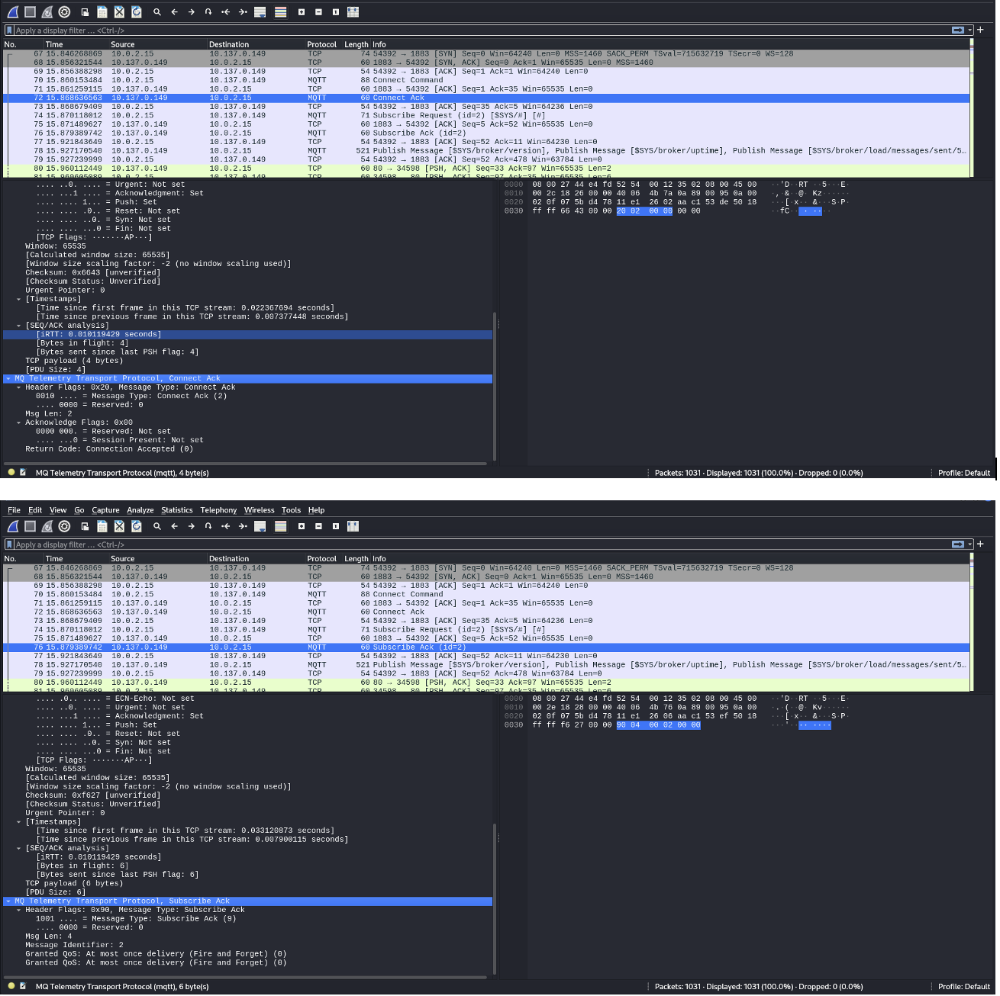

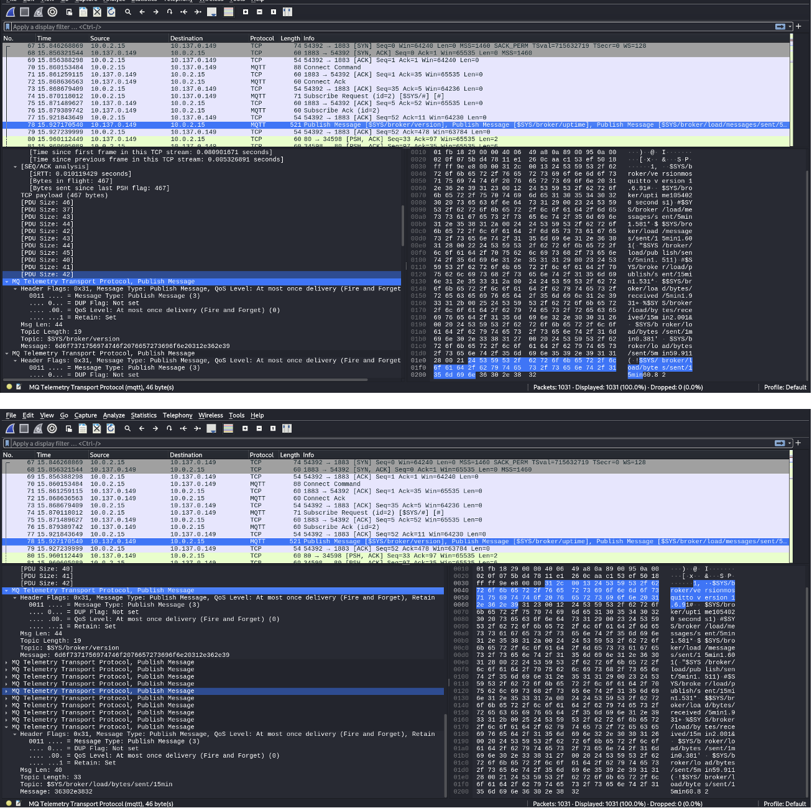

#### Information from the Captured Packets:
- SYN (Synchronize Packet): Initial connection request from the client to the server (10.137.0.149), indicating the start of a TCP three-way handshake.
- SYN-ACK (Synchronize-Acknowledge): The server responds to the client's SYN with a SYN-ACK, indicating that it is willing to establish the connection and synchronizing the sequence numbers.
- TCP ACK: The client acknowledges the server's SYN-ACK, completing the TCP three-way handshake. This opens the connection for data transmission.
- MQTT Connect: After the TCP connection is established, the client sends an MQTT Connect request to initiate communication with the MQTT broker. This is the start of the MQTT session.
- MQTT Connect ACK: The MQTT broker acknowledges the connection request by sending a Connect ACK, confirming that the client is successfully connected to the broker and can start subscribing or publishing to topics.

- MQTT Subscribe and Acknowledgement:
    - The client sends a subscription request to the MQTT broker (likely to topics like $SYS).
    - The broker acknowledges the subscription with an MQTT Subscribe ACK message.
- MQTT Publish:
    - The broker publishes messages on topics such as $SYS/broker/version, $SYS/broker/uptime, $SYS/broker/load/messages/sent, etc.
    - The client receives these messages, which include operational statistics and other data related to the broker’s current status.
- Key Information in Messages:
    - The published messages include important information such as the broker version (mosquitto version 1.6.9), number of active and connected clients, uptime, and load information.
    - Topics like $SYS/broker/load/bytes/sent/5min, $SYS/broker/clients/connected provide detailed statistics on broker performance.
- QoS (Quality of Service): The messages use QoS level 0 (At most once delivery), meaning messages are delivered on a best-effort basis, with no acknowledgment from the recipient required.

### Subscribing to all topics Listening port

The broker at 10.137.0.149 is actively listening on port 1883 as indicated by the Nmap scan results. This means it is ready to accept MQTT connections, print out all messages that are published to any topic, along with their topic names.
- **Breakdown:**
    - mosquitto_sub: This is the command-line tool to subscribe to MQTT topics. It allows you to receive messages published to specific topics on an MQTT broker.
    - -h 10.137.0.149: Specifies the host of the MQTT broker you are connecting to, which is at IP address 10.137.0.149.
    - -p 1883: Specifies the port on which the broker is listening for MQTT traffic. 1883 is the default port for unencrypted MQTT communication.
    - -t '#': Subscribes to all topics. The # wildcard subscribes to every topic on the broker, including system topics ($SYS/) and any custom topics being published.
    - -v: Enables verbose mode, meaning that both the topic name and the message payload will be displayed when a message is received.

### Publishing Non-Persistent Messages in MQTT 

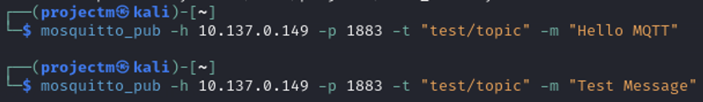

- Publishing the message "Hello MQTT" to the topic "test/topic".
- Publishing the message "Test Message" to the same topic "test/topic".

- Subscribes to all topics (# wildcard) on the MQTT broker with verbose mode (-v), which shows both the topic and message payloads when receiving messages.

#### Wireshark Network Capture:

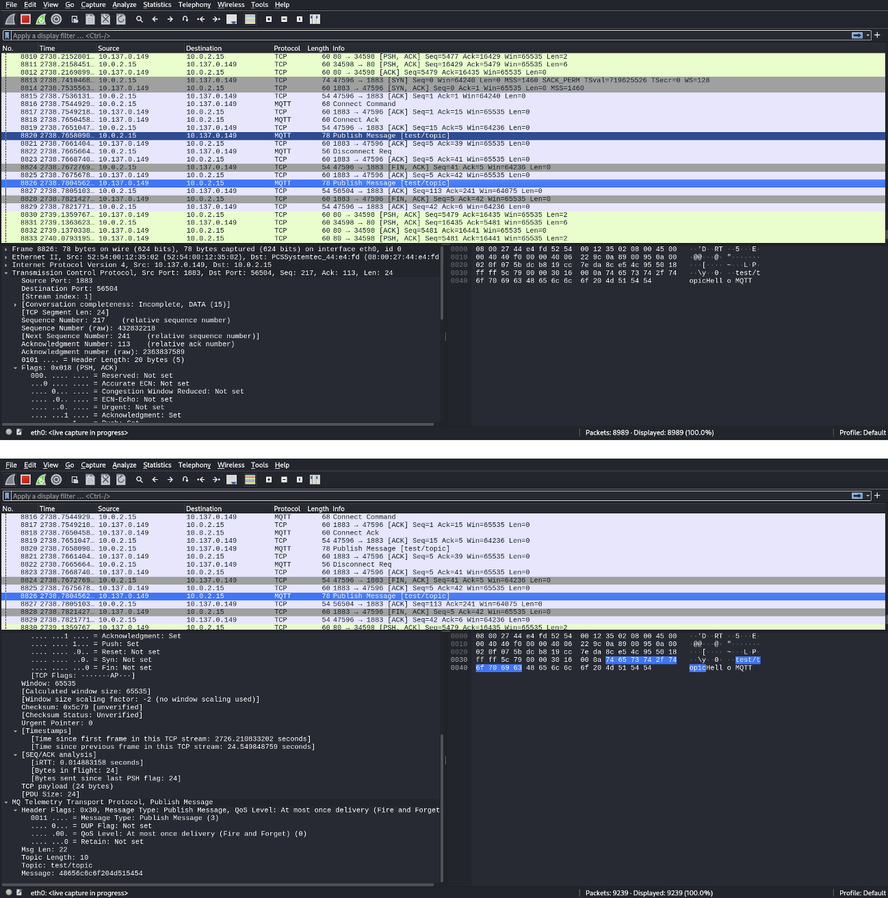

- **Analysis:**
    - The client sends the MQTT Connect request after establishing a TCP connection with the broker.
    - ACK (Acknowledgment) packets are exchanged after each publish to confirm the delivery of messages between the client and broker.
    - In the MQTT Publish packets, the message contents such as "Hello MQTT" and "Test Message" are visible in the data field.
    - The broker accepts and relays the messages to the subscribed clients (as seen in the subscription capture), but since QoS 0 (At most once delivery, fire-and-forget) is used, the messages are not stored by the broker.
- **Message Transmission:**
    - The messages "Hello MQTT" and "Test Message" are published to the broker and immediately received by the subscribed client.
    - The capture confirms the messages are transmitted in real time, but because QoS 0 is used, the messages are not retained or stored by the broker for future subscribers.

### Real-Time Message Transmission in MQTT with Retention

- Publishing the message "Good Morning MQTT" to the topic "test/topic" with the -r flag, meaning it is a retained message.
- Publishing the message "Nice to meet you MQTT" to the same topic, also as a retained message.
- If a message is published with the retained flag set, the broker will store the message even if no subscribers are currently connected. The broker will deliver the retained message to any new subscribers when they connect.

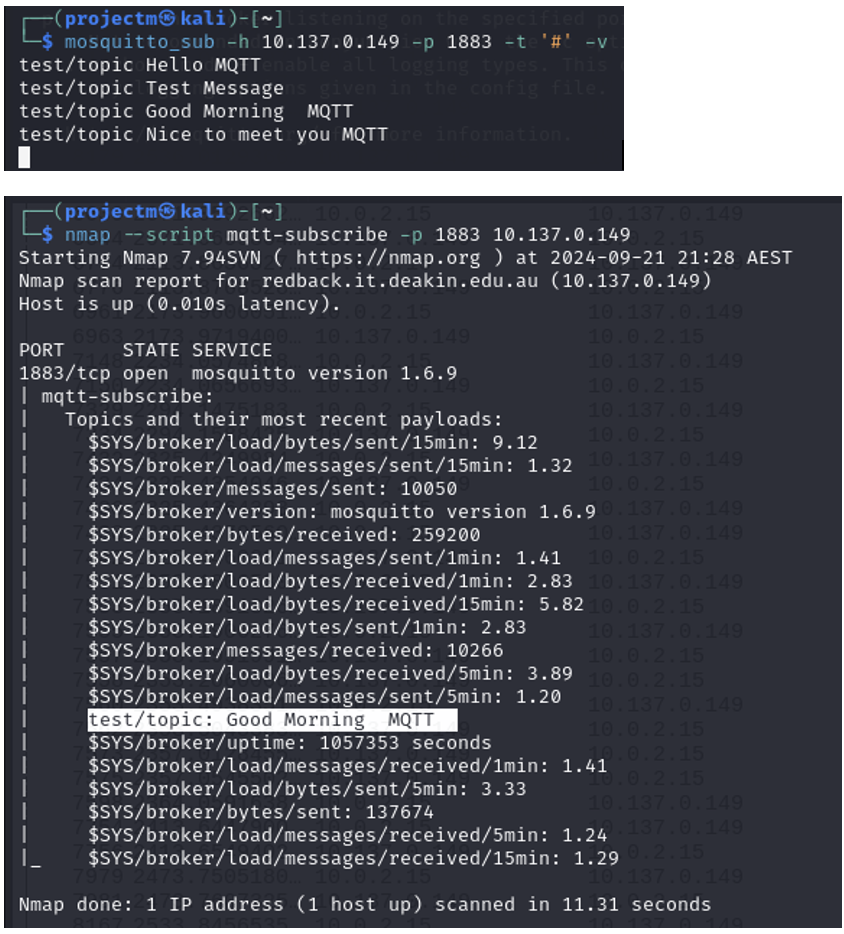

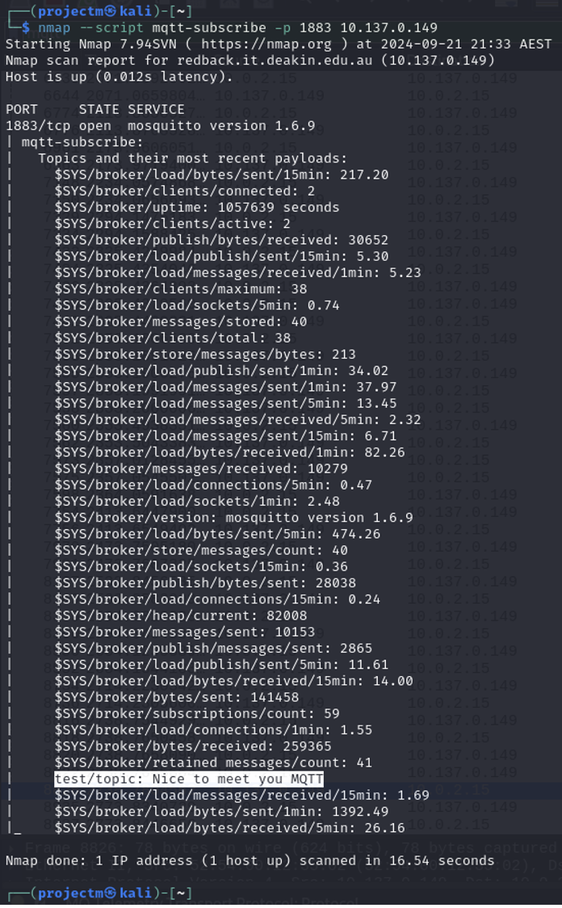

- When subscribing to the topic, the retained messages "Good Morning MQTT" and "Nice to meet you MQTT" are immediately delivered to the subscriber because they were stored on the broker as retained messages.

#### Wireshark Network Capture:

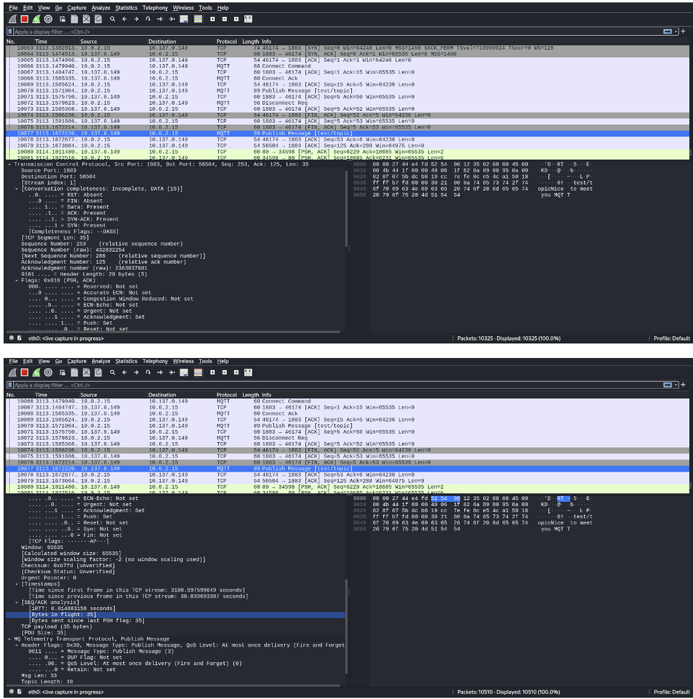

#### Key Points:
- **Retained Messages:** The MQTT messages are marked as retained, meaning that they will remain on the broker until they are overwritten or cleared. Any new subscriber to the test/topic will immediately receive the last retained message.
- **Real-Time Transmission:** The retained messages are also transmitted in real time to any current subscribers when published.
- **TCP & MQTT Acknowledgments:** The client receives TCP acknowledgments and MQTT ACKs after each message is published, confirming successful transmission.

### Findings:
- The mqtt-subscribe script provided valuable insights into the internal workings and metrics of the MQTT broker, including traffic, client activity, memory usage, and uptime. 
- **Vulnerability Found:** The broker at 10.137.0.149 allows anyone to subscribe and publish messages without authentication, it indicates that this broker is misconfigured to allow unauthenticated connections.
- This would be considered a security risk, as unauthorized users can subscribe to topics, potentially eavesdrop on messages, and perform malicious activities such as publishing unwanted data to the broker.

### Suggestions:
- To mitigate this risk, the MQTT broker should implement:
    - **Username/Password Authentication:** Require clients to authenticate before subscribing or publishing.
    - **TLS/SSL:** Encrypt communication between clients and the broker to prevent eavesdropping.
    - **Access Control Lists (ACLs):** Control which users or clients are allowed to publish or subscribe to specific topics.

### Conclusion:
In conclusion, penetration testing is a critical cybersecurity practice for identifying and addressing vulnerabilities in systems, networks, and applications before they can be exploited. Understanding the security of an MQTT broker is essential, as it can be a target for attacks, making strong security practices like penetration testing important to maintain secure operations.

