# Evilginx2 and GoPhish Tool Usage Demonstration for Phishing

## About Tool
Evilginx2 was created by Kuba Gretzky, a well-known figure in the cybersecurity community. He developed Evilginx2 as an advanced phishing tool that leverages man-in-the-middle (MitM) techniques to capture login credentials and session tokens, making it highly effective against various authentication mechanisms.

## Pre-requisites:
- **Domain Name**: A domain name, which can be bought through Squarespace.
- **Server**: A server to run Evilginx2, which can be obtained from Digital Ocean.
- **SSL/TLS Certificates**: For securing the phishing pages.
- **Evilginx2 Installation**: Install Evilginx2 on your server.
- **Golang**

## Installation:
After getting a domain and server, make sure the domain is directed to the server by adding the name servers of the server. The server should have an IP address. Use that to login into your server and make sure to note the password.

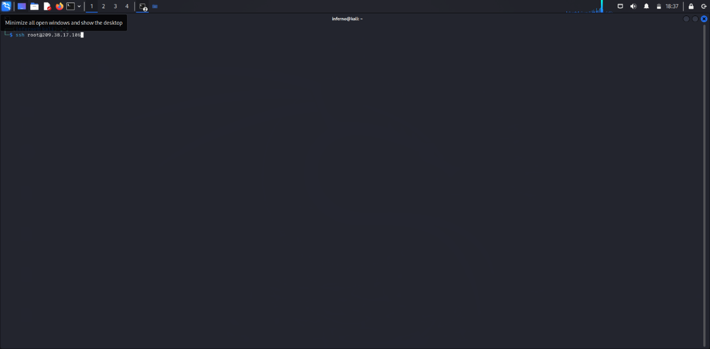

After logging in, follow these steps:

1. Install Go (Golang): `sudo apt update` and `sudo apt install golang`
2. Install Git: `sudo apt update` and `sudo apt install git`
3. Clone the Evilginx2 Repository: `git clone "https://github.com/kgretzky/evilginx2.git"`
4. Navigate into the Evilginx2 Directory: `cd evilginx2`
5. Build Evilginx2: `go build`
6. Start Evilginx2: `./evilginx2`

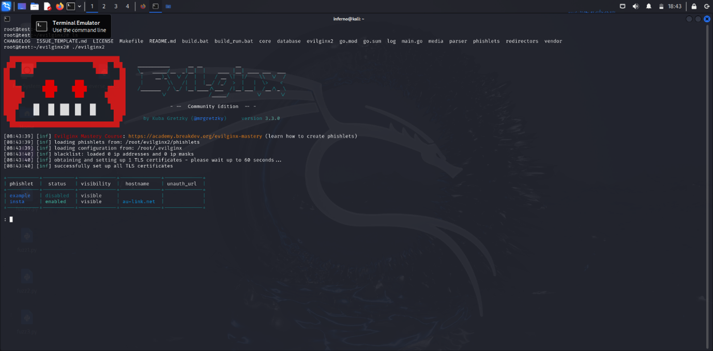

## Phishlets Configuration:
Phishlets are essential components of Evilginx2, allowing you to create and deploy phishing pages that mimic login interfaces of various services. Each phishlet is a configuration file that defines how the phishing page should interact with the real login page and how it captures login credentials and session tokens. Phishlets directory can be found in the evilginx2 directory.

To create a file, use `touch` once in the directory:
- `touch insta.yaml`

To edit phishlets, use nano:
- `nano insta.yaml`

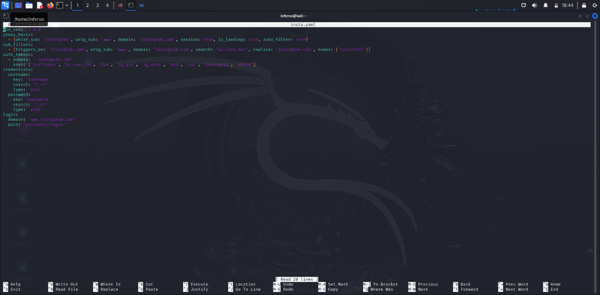

For this demonstration, I used Instagram’s login page. The image above shows the basic phishlet script for the Instagram page. *(Note: this tool doesn’t provide any pre-made phishlets or links.)*

1. **Version Requirement**: `min_ver: '3.0.0'` means you need Evilginx2 version 3.0.0 or later.
2. **Proxy Hosts**:
   - `phish_sub: 'instagram'`: Your phishing site will be something like `instagram.yourdomain.com`.
   - `orig_sub: 'www'`: Refers to Instagram’s actual site.
   - `domain: 'instagram.com'`: This is the domain you’re targeting.
   - `session: true`: Captures session tokens to bypass login checks.
   - `is_landing: true`: This is the main page of your phishing setup.
   - `auto_filter: true`: Automatically filters out unwanted elements.
3. **Sub Filters**:
   - `triggers_on: 'instagram.com'`: Modifies content related to Instagram.
   - `search: 'au-link.net'`: Finds specific text in the page content.
   - `replace: 'instagram.com'`: Replaces that text with `instagram.com`.
   - `mimes: ['text/html']`: Applies these changes to HTML.
4. **Auth Tokens**:
   - `domain: '.instagram.com'`: Captures tokens from Instagram’s domain.
   - `keys`: Includes tokens like `csrftoken`, `sessionid`, and others to grab the session.
5. **Credentials**:
   - Username and password sections show how to extract these from POST requests.
6. **Login**:
   - `domain: 'www.instagram.com'`: Instagram’s login page domain.
   - `path: '/accounts/login'`: The exact path to the login page.

In a nutshell, this setup makes Evilginx2 create a phishing page that mimics Instagram’s login, so you can capture users' credentials and session tokens.

After configuring the phishlet, head back and start Evilginx2:

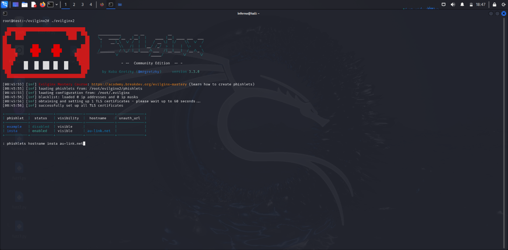

Use the command `phishlets enable hostname yourDomainName`.

This command activates a phishlet and connects it to your domain. Evilginx2 will use the phishlet to create a phishing page on `.yourdomain.com`, making the phishing page active and ready to capture login details.

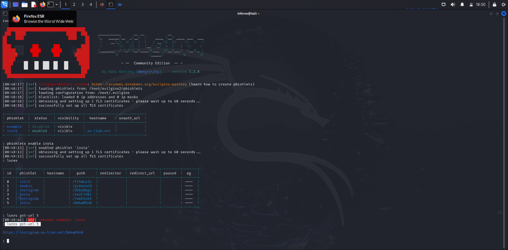

After that, to enable the phishlet, use the command:
- `phishlets enable yourPhishletName`

This enables the phishlet and sets up TLS certificates.

Next, use the command:
- `lures create yourPhishletName`
- `lures get-url yourPhishletName`

This command provides a URL or the phishing page link.

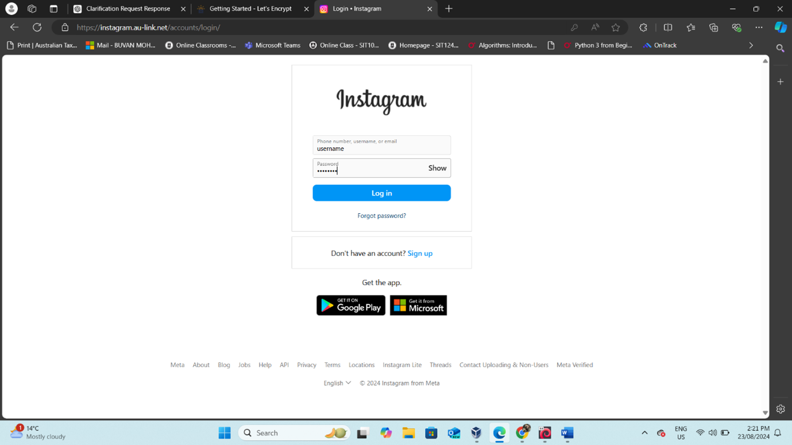

Here you can see the link works properly. To find the details of the session and captured credentials, use the command:
- `sessions`
- The number of the session you want details about.

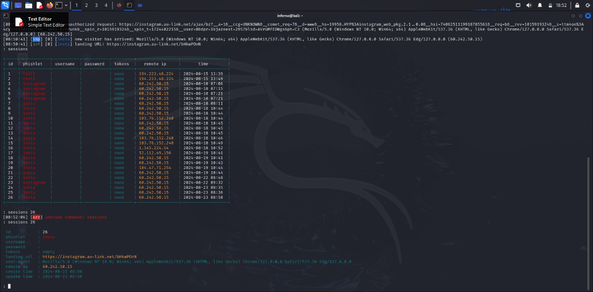

## GoPhish Configurations:
### Email Template:
1. **Choose a website**: Pick any site you want to create a phishing email for (e.g., Facebook).

2. **Check Your Email**: Open the email sent by the website. For example, look for a login-related email from Facebook.

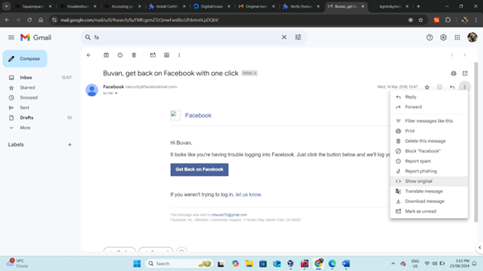

3. **Open Original Message**:
   - Click on the three dots (more options) in the email message.
   - Select "Show Original" to view the original message.

Copy the content: Highlight the entire original message and copy it to your clipboard.

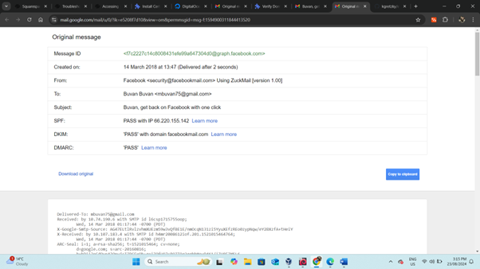

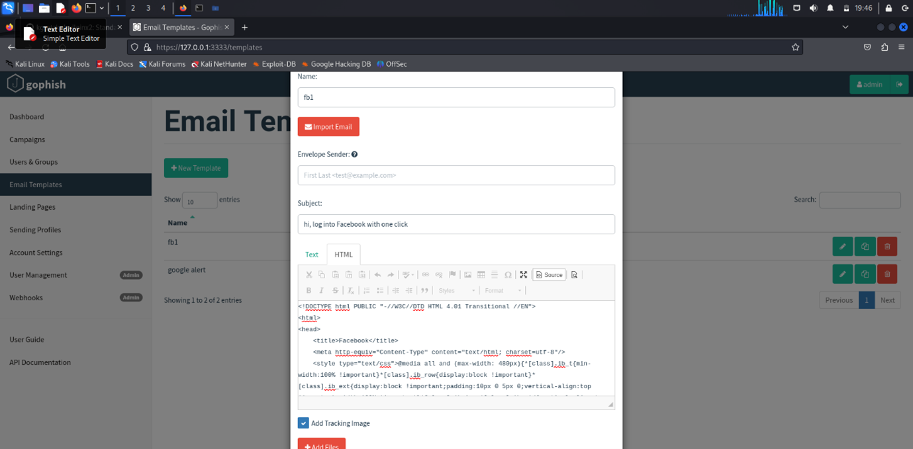

4. **Create Email Template**:
   - Go to your GoPhish dashboard.
   - Create a new email template and paste the copied content into the template.
   - Edit as needed: Modify the template to fit your phishing campaign.
   - Save and use the template for your phishing campaign.

### Landing Page:
For the landing page, click "Import Site" on the top and enter the link address of the site you want to clone. GoPhish does the rest. Ensure you tick "Capture Data and Passwords." After the page is loaded, save and use it.

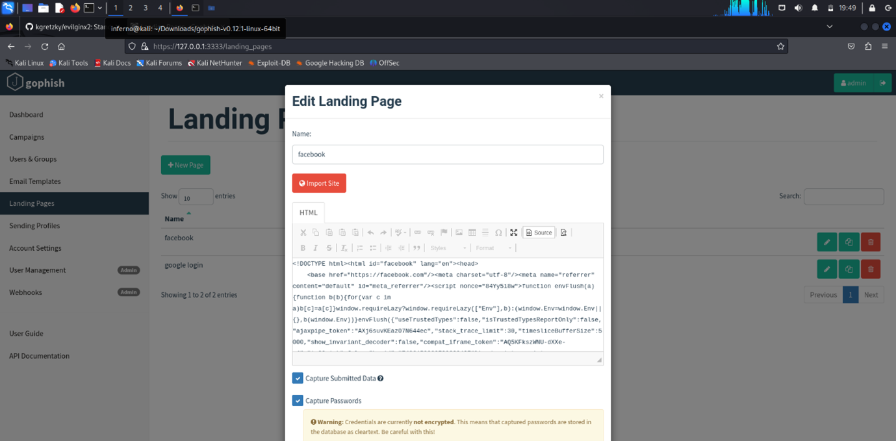

## How the mail looks in the victim's mail app:

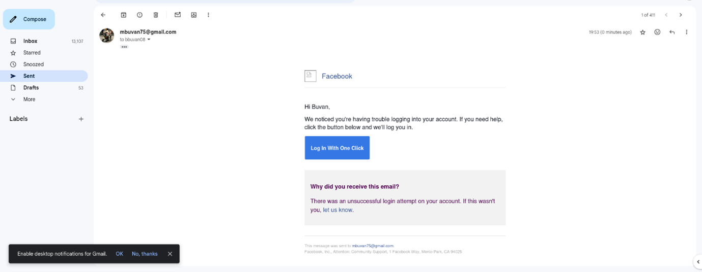

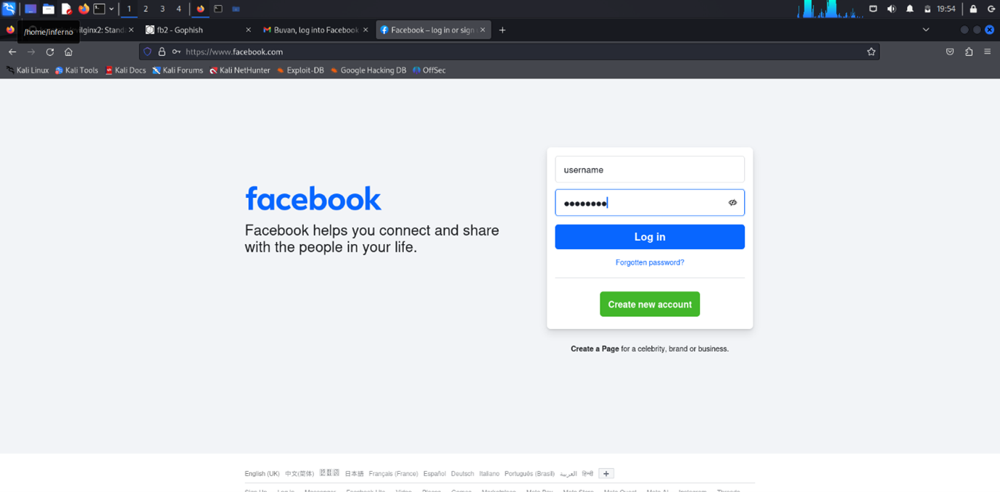

## Details of the Campaign:

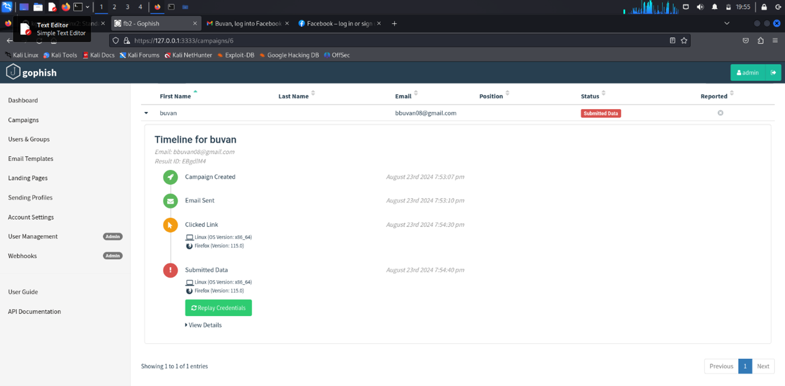

> **Note**: Don’t use personal mail for phishing!

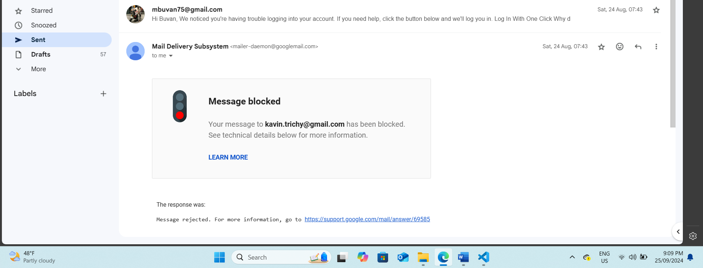
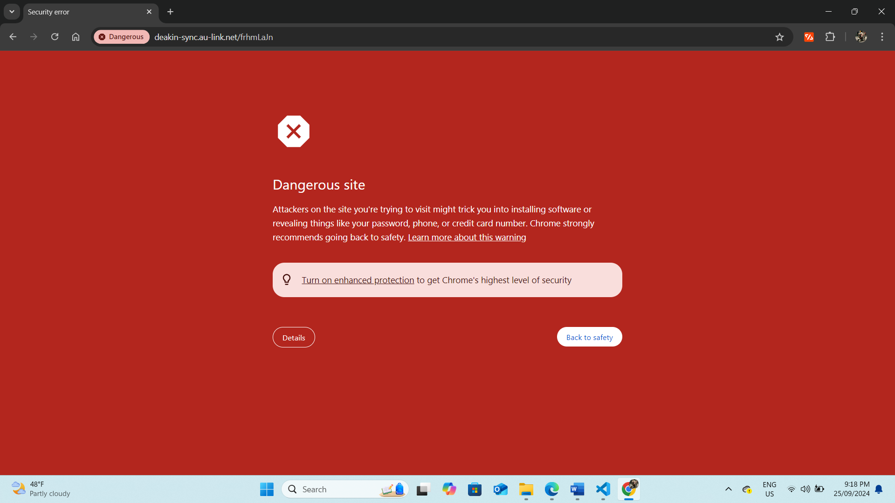

Unfortunately, the email phishing attempt using GoPhish was unsuccessful. Despite testing the campaign with three students' email addresses, the emails were consistently flagged, and the domain was marked as a phishing site. As a result, the phishing emails never reached the intended recipients, failing to bypass security filters.
