# SET Email Phishing

## Introduction

Email phishing is a cyberattack where attackers steal sensitive information, like usernames or passwords, by posing as legitimate sources through deceptive emails. These emails are crafted to look trustworthy, luring victims into providing personal data, similar to how bait attracts fish. With the growing reliance on email communication, email phishing has become increasingly common. Tools like the Social Engineering Toolkit (SET) are often used to execute these attacks, making the phishing emails appear...

## Rules of Engagement:

- Social Engineering only on Redback Operations Students or Redback Mentors

## Tool Used:

### Social Engineering Toolkit (SET)

The Social-Engineer Toolkit (SET) was created and written by Dave Kennedy, the founder of TrustedSec. It is an open-source Python-driven tool aimed at penetration testing around Social-Engineering. It allows users to simulate real-world phishing scenarios to understand the tactics used by cybercriminals and test the resilience of their security infrastructure.

## Installation:

Open a terminal in Kali Linux and follow these steps:

**Step 1:** Update the package list  
**Step 2:** Install SET  
**Step 3:** Verify the installation by launching SET  

This will launch the Social Engineering Toolkit, allowing you to start using it for various social engineering and phishing campaigns.

## Phishing Campaign:

1) SET launches with a menu offering various options. To start using it for social engineering attacks, you need to select the first option from the menu, which is "Social-Engineering Attacks." This option enables you to execute different techniques, including phishing simulations.

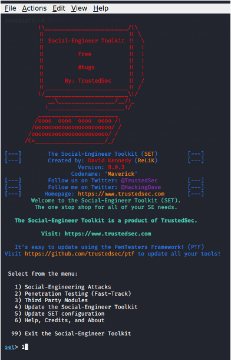

2) After selecting "Social-Engineering Attacks," we are presented with several attack vectors. To conduct a phishing campaign, choose "Mass Mailer Attack." This method allows attackers to send bulk phishing emails to multiple recipients at once or a single person appearing as legitimate messages from trusted sources. Mass mailer attacks are effective due to their wide reach, making it easier for attackers to target a larger number of potential victims in a single attempt.

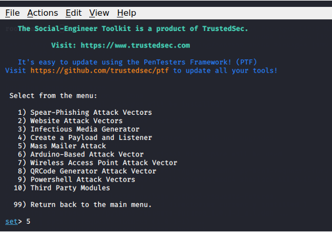

3)	In this step, select the option to send a single email, and the email was configured using a Gmail account, with a Gmail App Password created for authentication. 

**Example-1:** The display name was set as "GitHub Support Team" to make the email appear legitimate. The subject was "Verify your GitHub Account," and an HTML format was used to warn the recipient of unusual activity, prompting them to click a malicious link (using the Kali Linux IP) to prevent unauthorized access. The email was sent to the first student from Redback Operations as part of the phishing campaign.

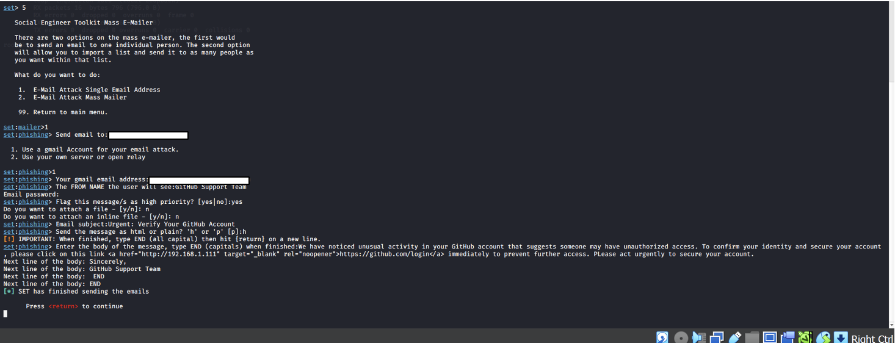

**Example-2:** The phishing email was sent to the second student from Redback Operations, appearing to come from "Snapchat Support." The subject was "Your Snapchat Account Needs Immediate Attention," with a malicious link designed to capture the recipient’s login credentials.

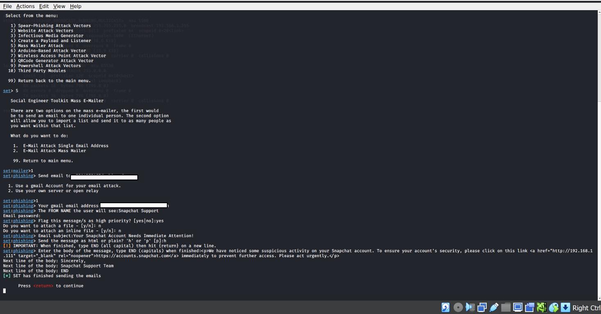

**Example-3:** The phishing email was sent to the third student from Redback Operations, appearing to be from the "Instagram Security Team." The subject was "Your Instagram Account is Hacked," with a malicious link intended to capture the recipient's login credentials.

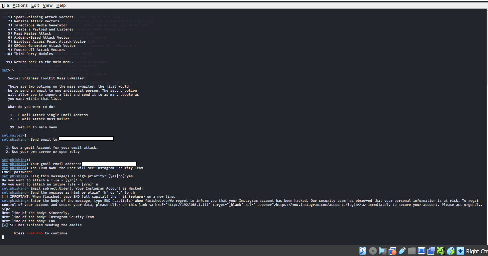

## Website Cloning: 

This process involves building a fake version of a legitimate website to deceive users into submitting their sensitive information, like usernames and passwords, on the counterfeit site. The website is then incorporated into a phishing email, which is sent to the target to capture their personal data.

1)	Open Social engineering toolkit in Kali Linux. Then, select social engineering attacks and then website attack vectors. This menu offers several methods for conducting web-based attacks, including Java applet attacks, credential harvesting, tabnabbing, and more. 

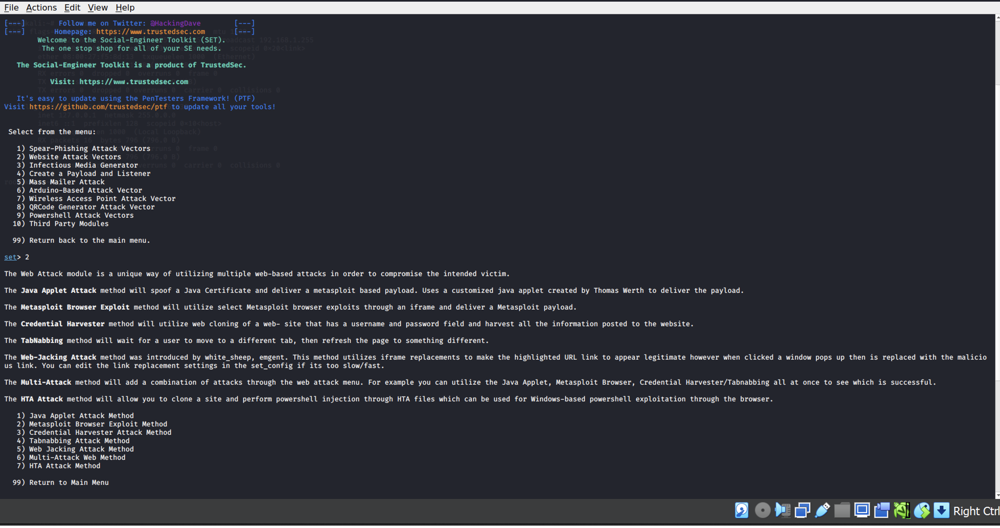

2)	Select the Credential Harvester Attack Method, which captures login credentials from a cloned website when the user enters their sensitive information. It stores the harvested data for later analysis.

3)	Next, select the Site Cloner option. This method allows us to create an exact replica of a legitimate website. The cloned site will be used to capture credentials when a target interacts with it, thinking it is the real site.

4)	Enter the Kali Linux IP address and then Enter.

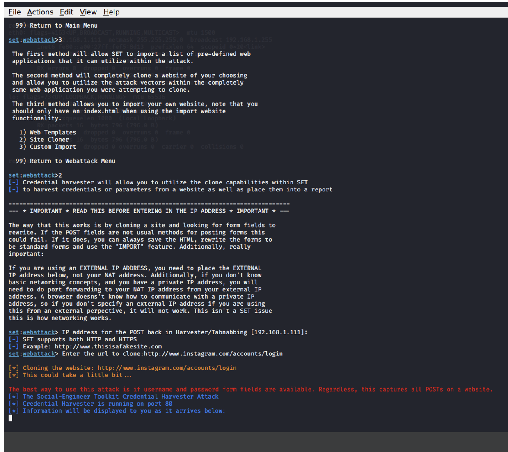

5)	Enter the cloned website URL, then SET will create an identical copy of the website login page and host it on a local server. When a victim accesses this cloned page and enters their login credentials, SET will capture the submitted data (username and password).

## Phishing Mails Sent to Targeted Students

The phishing emails was sent to all three students from Redback Operations. Each email was tailored to appear as a legitimate security notification, targeting Instagram, Snapchat, and GitHub accounts. 

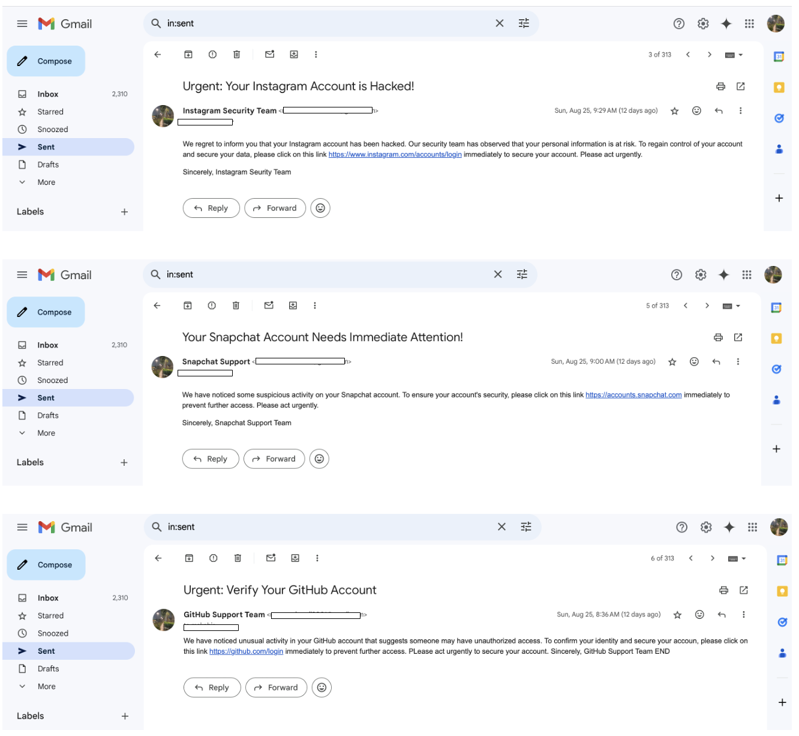

- This screenshot shows the phishing email successfully received by the student.

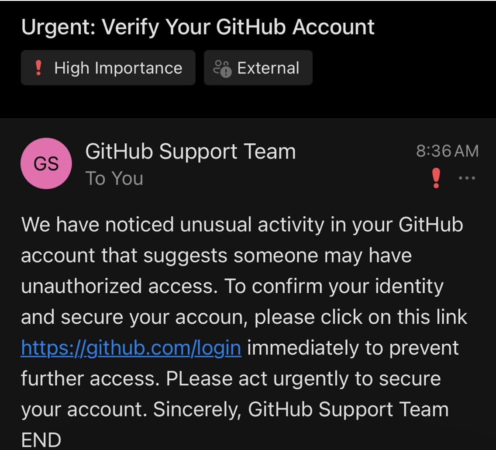

# Demonstration:

For demonstration purposes, I sent the phishing email to my own Gmail account. This allowed me to simulate a phishing campaign and monitor the email delivery process without causing harm to others.
I used Kali Linux to run the SET for generating the phishing email and creating the fake login page. For testing, I used Windows 10 to access the cloned page. However, the phishing link did not work on my host computer, likely due to network or server configuration issues.

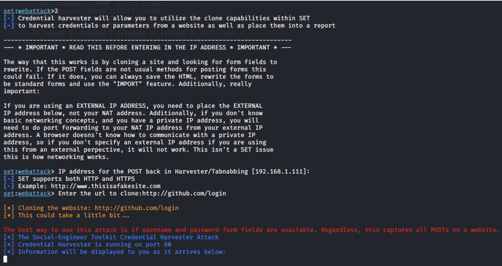

- ### Accesing the link in Windows 10 VM:

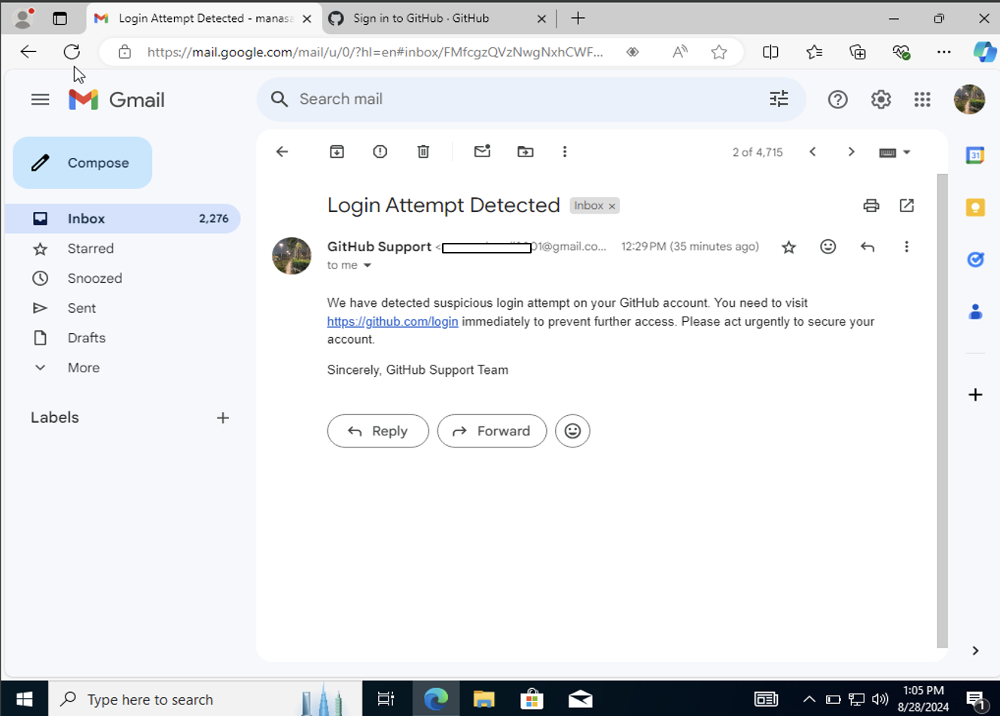

- ### Clicking the Link and Entering the Login Details:

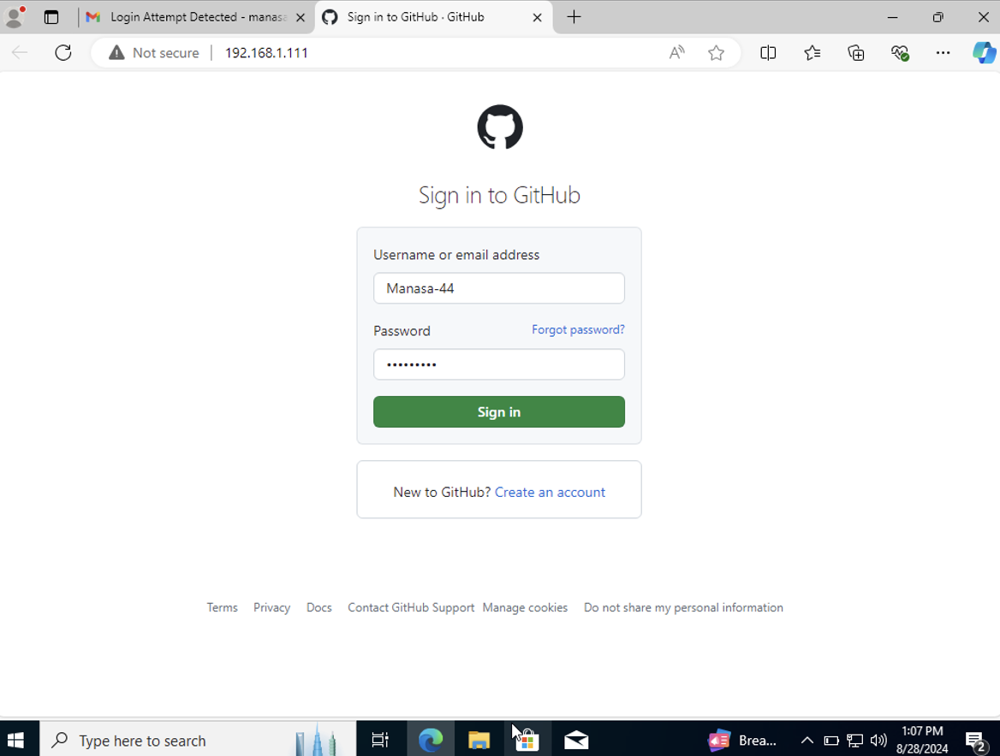

- ### Errors to Solve:
    - Add import html
    - Replace cgi.escape to html.escape

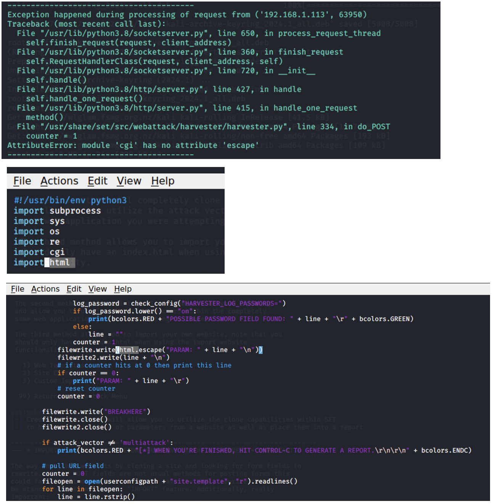

- ### When I entered the login details for the first time, the website captured my credentials but did not proceed to the actual login. Instead, it redirected me to the same login page, leading me to believe that I might have entered the wrong credentials.

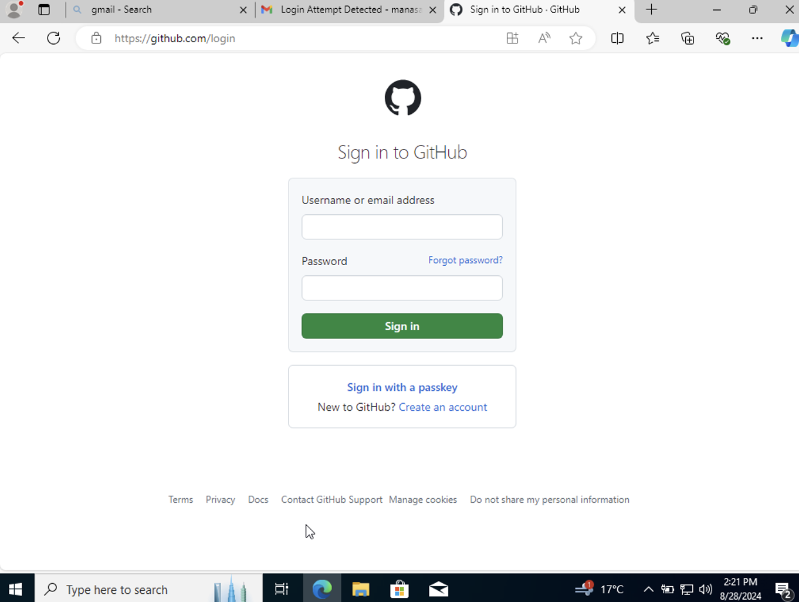

- ### This the Kali Terminal after I opened the link and entered my details.

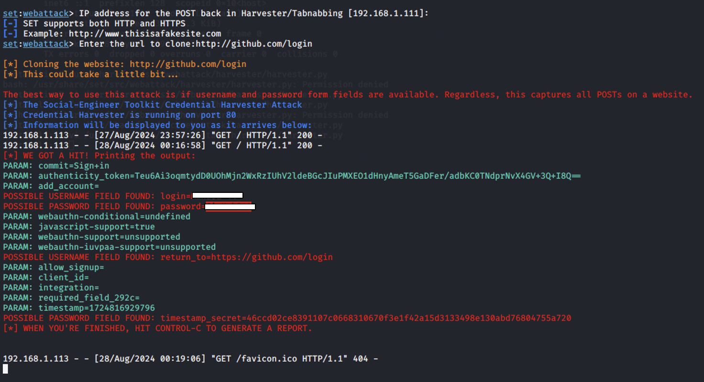

### Credential Capture Process:

- **User Interaction:** When I clicked the link, it showed that a user at IP address 192.168.1.113 interacted with the cloned GitHub login page.
- **POST Request:** The user submitted a POST request to the cloned page, which typically happens when a user enters their credentials (username and password) and clicks the login button.

### Captured Data:

- **POSSIBLE USERNAME FIELD FOUND:** The tool identified the username as Manasa-44.
- **POSSIBLE PASSWORD FIELD FOUND:** The tool captured the password associated with this username.
- This indicates that the user entered these credentials into the cloned login page, and the tool successfully intercepted and logged them.

## Findings:

- **Phishing Email Delivery:** The phishing email was successfully delivered to one student whose Deakin email starts with their name.
- **Undelivered Emails:** Two students with Deakin emails starting with student IDs (s22...) did not receive the emails.
- **Successful Credential Harvesting:** The Social-Engineer Toolkit was able to clone the GitHub login page and successfully capture a username and password when the user attempted to log in.
- **Use of a Local Network:** The IP address 192.168.1.113 shows that the user accessing the cloned page is within the same local network as the attacker's machine (which has the IP 192.168.1.111).
- **Stronger Spam Filters:** Deakin's email system likely has stricter spam filters for student ID-based addresses, blocking the phishing emails.
- **Lower Suspicion for Name-Based Emails:** Emails with name-based addresses might bypass stricter filters, as they are perceived as less likely targets for spam.
- **Better Email Reputation:** Name-based emails could have better reputations in the system, reducing the chances of being flagged as spam.
- **Blocked Link on Host Machine:** When I tried to open the link in my host machine, it didn’t work. The email system or browser security might be blocking the link as part of anti-phishing measures. Many modern security tools automatically block suspicious URLs.
- This demonstrates how phishing attacks can be conducted in a controlled environment. The attacker can now use the captured credentials to access the user’s account if the credentials are valid.

## Conclusion:

This demonstration effectively showcased the process of conducting a phishing attack in a controlled environment using the Social Engineering Toolkit (SET). By sending phishing emails and cloning legitimate login pages, I simulated a scenario where sensitive credentials were captured. Although some phishing emails were blocked due to spam filters, this highlighted the importance of email filtering systems.
Additionally, the successful credential harvesting in a local network environment emphasizes how phishing attacks can be executed. The failure of the phishing link on the host machine underlines the importance of correct network configurations during testing. To mitigate such risks, organizations should implement multi-factor authentication (MFA), conduct regular user awareness training, use strong spam filters, and employ network monitoring tools to detect suspicious activity. These measures are essential to defending against phishing attacks and minimizing their impact.