# REDBACK PENTEST REPORT
---
sidebar_position: 10
---

1. Executive Summary
2. Introduction  
    2.1 Scope  
    2.2 Objectives  
    2.3 Methodology
3. Information Gathering  
    3.1 Initial Ping  
    3.2 Host Scan  
    3.3 Port, Service, and OS detection
4. Vulnerability Assessment  
    4.1 Vulnerability Scanning Results
5. Detailed Findings  
    5.1 Port 8080 Analysis  
    5.2 Port 443 Analysis  
    5.3 Port 9200 Analysis  
    5.4 Port 9000 Analysis
6. Recommendations  
    6.1 Short-term Mitigations  
    6.2 Long-term Security Improvements
7. Conclusion
8. Appendices  
    8.1 Tools Used 

## 1. EXECUTIVE SUMMARY

This penetration test evaluated the security of the Deakin University server (redback.it.deakin.edu.au, IP: 10.137.0.149) and identified several critical issues:

- **Apache Vulnerabilities**: The Apache HTTP Server (v2.4.41) on port 8080 has severe vulnerabilities (CVE-2024-38476, CVE-2024-38474) that could enable remote code execution or denial of service.
- **Weak Authentication**: Default credentials on MinIO Console (port 9001) allowed unauthorized access and privilege escalation.
- **SSL/TLS Misconfigurations**: Problems included incomplete certificate chains, domain mismatches, and LOGJAM vulnerability (CVE-2015-4000).
- **Exposed Files**: Sensitive backup and certificate files were found, risking data exposure.
- **Content Security Policy Issues**: On port 443, the policy permits 'unsafe-eval' and 'unsafe-inline', making it vulnerable to cross-site scripting.
- **No HSTS**: The absence of HTTP Strict Transport Security leaves the server susceptible to downgrade attacks and cookie hijacking.

### Key Recommendations:

- Update Apache HTTP Server to the latest stable version.
- Strengthen authentication with unique passwords and enable multi-factor authentication.
- Fix SSL/TLS configurations and implement HSTS.
- Remove or secure sensitive files.
- Improve Content Security Policy to restrict unsafe practices.
- Perform regular vulnerability scans and penetration testing.

The ease of unauthorized access highlights the urgent need for a comprehensive security overhaul to protect Deakin University's digital assets.

## 2. Introduction

### 2.1 Scope

This penetration test targeted the Deakin University server redback.it.deakin.edu.au (IP: 10.137.0.149). The assessment focused solely on this server, its services, and associated ports.

### 2.2 Objectives

The test aimed to:

1. Evaluate the server's security posture.
2. Identify vulnerabilities.
3. Assess current security measures.
4. Provide improvement recommendations.

### Key Tasks Included:

- Initial ping and host scan.
- Port scanning and service detection.
- OS identification.
- Vulnerability scanning.
- Focused analysis of ports 8080, 443, and 9000.

### 2.3 Methodology

The test followed these steps:

1. Reconnaissance: Non-intrusive information gathering.
2. Scanning: Identifying open ports, services, and potential vulnerabilities.
3. Vulnerability Analysis: Assessing discovered weaknesses.
4. Exploitation: (If authorized) Attempting to exploit vulnerabilities.
5. Reporting: Documenting findings and recommendations.

Industry-standard tools and methods were used, prioritizing minimal disruption to server operations. Testing was conducted with Deakin University's permission and in compliance with relevant regulations.

## 3. INFORMATION GATHERING

### 3.1 Initial Ping

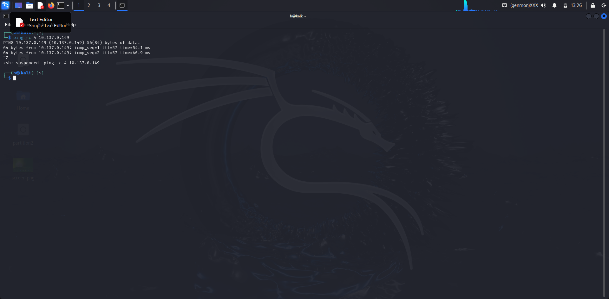

### 3.2 Host Scan

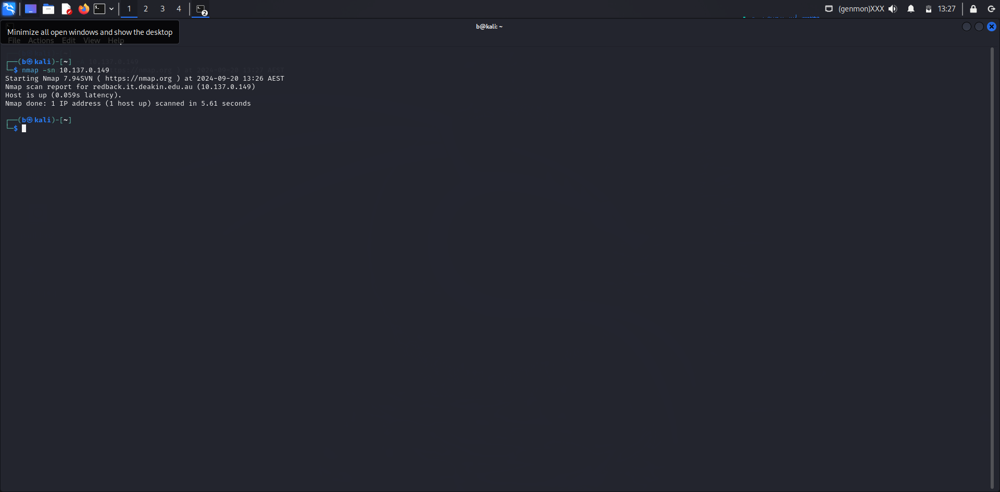

### 3.3 Port, Service, and OS Detection

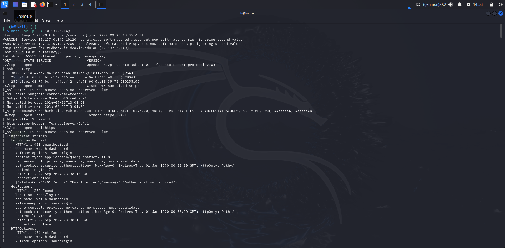
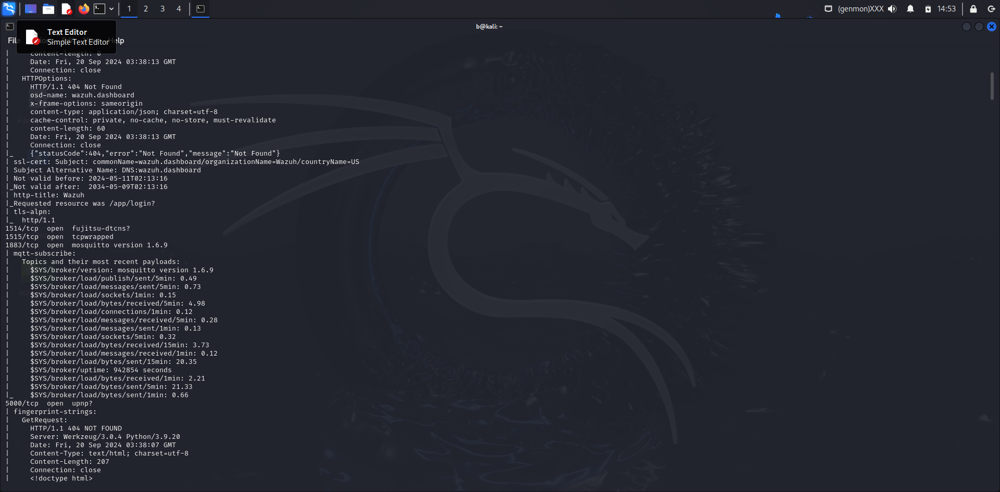
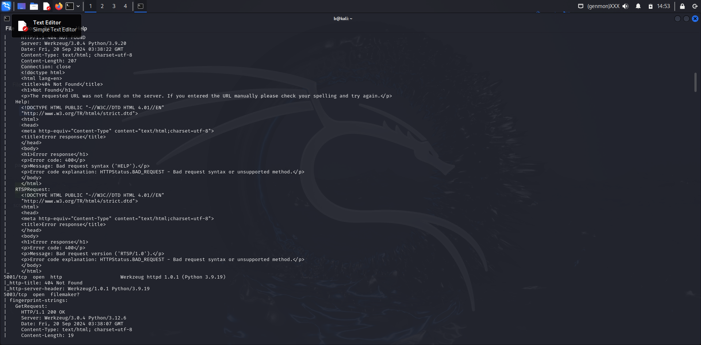
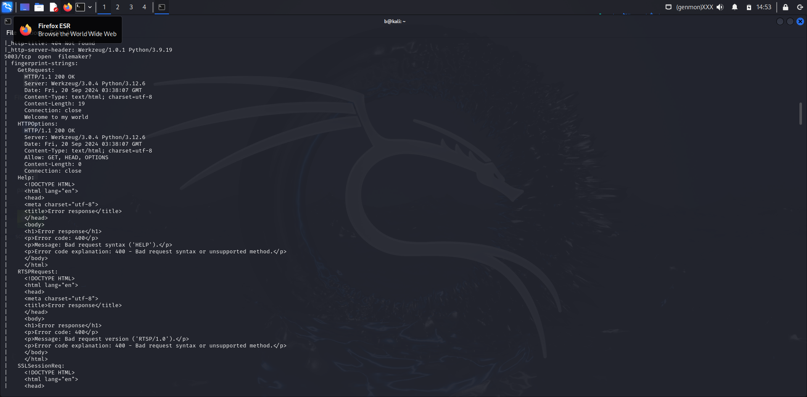
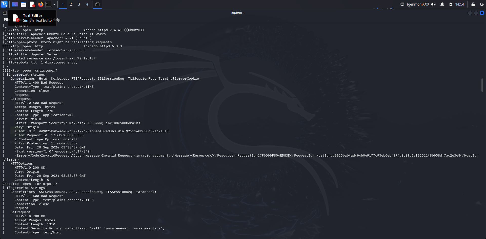
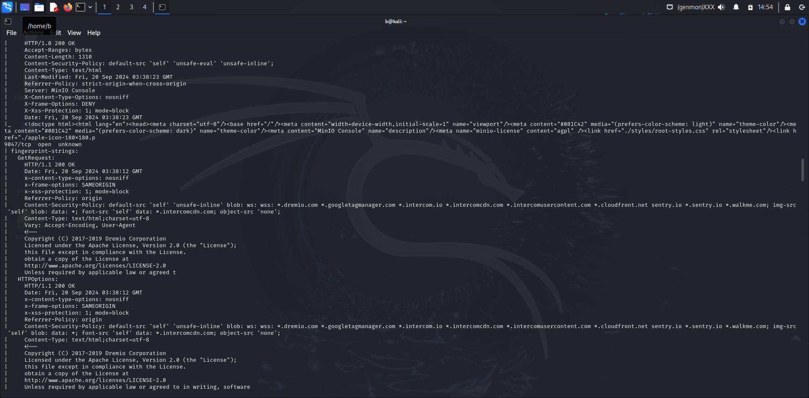

#### Nmap Command Used:

# Nmap Command Used:
nmap -sV -p- -A 10.137.0.149

## Scan Results
**Host**: 10.137.0.149 (redback.it.deakin.edu.au)
- **Status**: Host is up (0.053s latency)

## Open Ports and Services
1. **Port 22/tcp**
   - **Service**: SSH
   - **Version**: OpenSSH 8.2p1 Ubuntu 4ubuntu0.11 (Ubuntu Linux; protocol 2.0)
   - **Host Keys**:
     - RSA: 67:1a:44:c2:d4:1a:5e:4b:30:7e:59:18:14:b5:fb:59
     - ECDSA: 71:df:6f:48:bf:c1:95:15:e4:c6:ce:0e:b4:16:e8:f8
     - ED25519: d8:e1:08:77:9c:ff:f4:af:2f:bf:7f:60:9d:f8:39:72

2. **Port 25/tcp**
   - **Service**: SMTP
   - **Version**: Cisco PIX sanitized smtpd
   - **SSL Certificate**:
     - **Subject**: commonName=redback1
     - **Subject Alternative Name**: DNS
     - **Validity**: From 2024-09-01 to 2034-08-30
   - **SMTP Commands**: PIPELINING, SIZE 10240000, VRFY, ETRN, STARTTLS, ENHANCEDSTATUSCODES, 8BITMIME, DSN

3. **Port 80/tcp**
   - **Service**: HTTP
   - **Version**: Tornado httpd 6.4.1
   - **HTTP Title**: Streamlit
   - **HTTP Server Header**: TornadoServer/6.4.1

4. **Port 443/tcp**
   - **Service**: HTTPS (SSL)
   - **SSL Certificate**:
     - **Subject**: commonName=wazuh.dashboard/organizationName=Wazuh/countryName=US
     - **Subject Alternative Name**: DNS.dashboard
     - **Validity**: From 2024-05-11 to 2034-05-09
   - **HTTP Responses**:
     - 401 Unauthorized: Authentication required
     - 302 Found: Redirect to /app/login?
     - 404 Not Found: Resource not found

5. **Port 1514/tcp**
   - **Service**: Fujitsu DTCNS? (Not Identified)

6. **Port 1515/tcp**
   - **Service**: TCP Wrapped (Not Identified)

7. **Port 1883/tcp**
   - **Service**: MQTT (Mosquitto)
   - **Version**: 1.6.9
   - **MQTT Topics and Payloads**:
     - $SYS/broker/version: mosquitto version 1.6.9
     - $SYS/broker/load/publish/sent/5min: 0.49
     - $SYS/broker/load/messages/sent/5min: 0.73
     - Additional metrics on broker load

8. **Port 5000/tcp**
   - **Service**: UPnP? (Not Identified)
   - **HTTP Responses**:
     - 404 Not Found
     - 400 Bad Request: Errors related to request syntax

9. **Port 5001/tcp**
   - **Service**: HTTP
   - **Version**: Werkzeug httpd 1.0.1 (Python 3.9.19)
   - **HTTP Title**: 404 Not Found
   - **HTTP Server Header**: Werkzeug/1.0.1 Python/3.9.19

10. **Port 5003/tcp**
   - **Service**: FileMaker? (Not Identified)
   - **HTTP Responses**:
     - 200 OK: Welcome message
     - 200 OK: Allows GET, HEAD, OPTIONS methods

11. **Port 8080/tcp**
   - **Service**: HTTP
   - **Version**: Apache httpd 2.4.41 (Ubuntu)
   - **HTTP Title**: Apache2 Ubuntu Default Page: It works
   - **HTTP Server Header**: Apache/2.4.41 (Ubuntu)
   - **HTTP Open Proxy**: Proxy might be redirecting requests

12. **Port 8888/tcp**
   - **Service**: HTTP
   - **Version**: Tornado httpd 6.3.3
   - **HTTP Title**: Jupyter Server
   - **HTTP Server Header**: TornadoServer/6.3.3

13. **Port 9000/tcp**
   - **Service**: CSListener? (Not Identified)
   - **HTTP Responses**:
     - 400 Bad Request: Various error responses
     - 200 OK: MinIO Console

14. **Port 9001/tcp**
   - **Service**: TOR OR Port? (Not Identified)
   - **HTTP Responses**:
     - 400 Bad Request: Various error responses
     - 200 OK: MinIO Console

15. **Port 9047/tcp**
   - **Service**: Unknown
   - **HTTP Responses**:
     - 200 OK: Dremio-related content
     - Various Headers: Content-Security-Policy, X-Content-Type-Options, etc.

### 4. Vulnerability Scan Assessment

### 4.1. Vulnerability Scanning Results

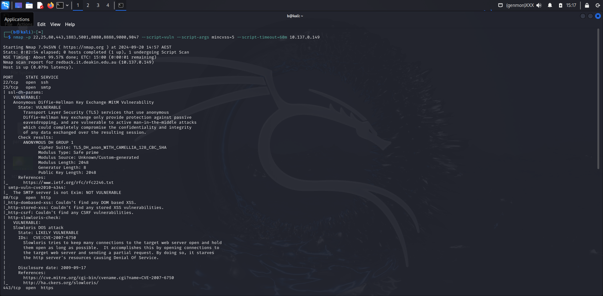
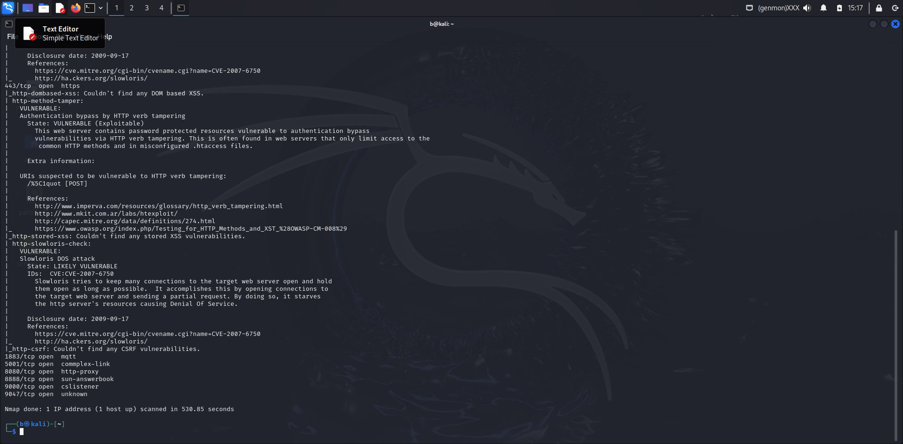

**Nmap Vulnerability Scan Report**

**Command Used:**:nmap -p 22,25,80,443,1883,5001,8080,8888,9000,9047 --script=vuln --script-args mincvss=5 --script-timeout=60m 10.137.0.149

**Port 25 (SMTP)**

* State: Open
* Vulnerabilities:
    * Anonymous Diffie-Hellman Key Exchange MitM Vulnerability
    * State: VULNERABLE
    * Description: The server uses anonymous Diffie-Hellman key exchange, which is vulnerable to man-in-the-middle attacks. This can compromise the confidentiality and integrity of data exchanged over the session.
    * Details:
        * Cipher Suite: TLS_DH_anon_WITH_CAMELLIA_128_CBC_SHA
        * Modulus Length: 2048
        * Generator Length: 8
    * References:
        * RFC 2246
        * SMTP Vulnerability: CVE-2010-4344
    * State: NOT VULNERABLE
    * Description: The SMTP server is not affected by CVE-2010-4344, which involves a vulnerability in the Exim mail server.

**Port 80 (HTTP)**

* State: Open
* Vulnerabilities:
    * Slowloris DOS Attack
    * State: LIKELY VULNERABLE
    * Description: The server may be susceptible to Slowloris attacks, which attempt to keep many connections open and exhaust server resources, leading to a denial of service.
    * References:
        * CVE-2007-6750
        * Slowloris Exploit
    * Checks:
        * DOM Based XSS: Not found
        * Stored XSS: Not found
        * CSRF: Not found

**Port 443 (HTTPS)**

* State: Open
* Vulnerabilities:
    * Authentication Bypass by HTTP Verb Tampering
    * State: VULNERABLE (Exploitable)
    * Description: The server is vulnerable to authentication bypass through HTTP verb tampering, allowing unauthorized access to protected resources.
    * Details:
        * Suspected Vulnerable URI: / %5C1quot [POST]
    * References:
        * Imperva Glossary
        * OWASP
    * Checks:
        * DOM Based XSS: Not found
        * Stored XSS: Not found
        * CSRF: Not found

**Other Ports**

* Port 1883 (MQTT)
* State: Open
* Port 5001 (Commplex-Link)
* State: Open
* Port 8080 (HTTP-Proxy)
* State: Open
* Port 8888 (Sun-Answerbook)
* State: Open
* Port 9000 (CSListener)
* State: Open
* Port 9047 (Unknown)
* State: Open

### 5. Detailed Findings

**Website:**

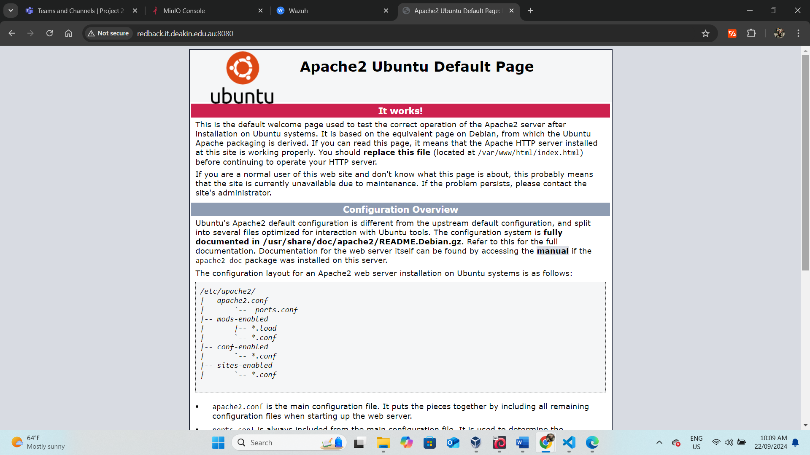

### 5.1. Port 8080

**Command Used:**

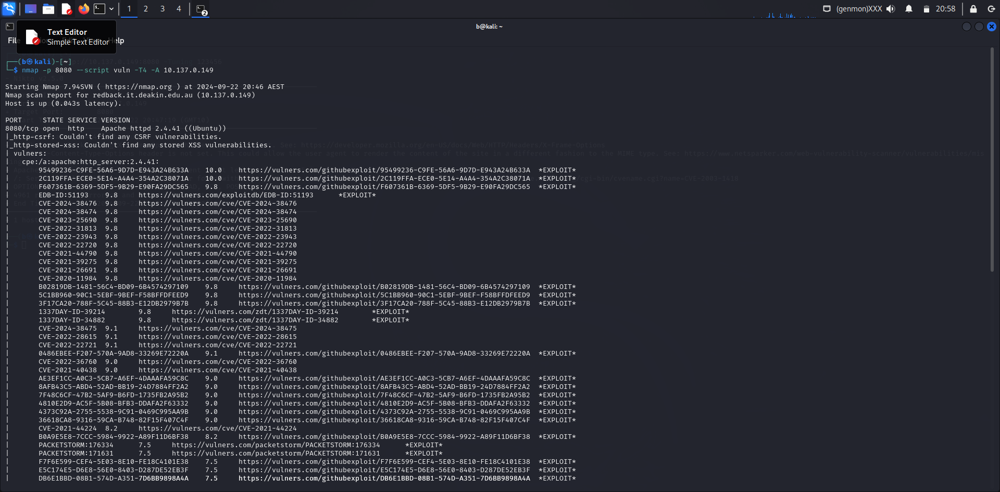
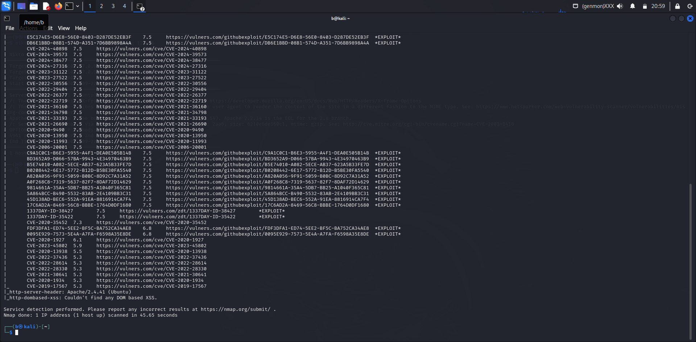

**Scan Results:**

* **Port Status:** Port 8080/tcp is open.
* **Service Detected:** The service running on port 8080 is identified as Apache HTTP Server version 2.4.41, running on Ubuntu.

**Vulnerability Findings:**

Several critical vulnerabilities have been detected for Apache HTTP Server 2.4.41. These include:

1. **CVE-2024-38476:**
   This is a critical vulnerability in Apache HTTP Server that poses a severe security risk. Detailed information can be found here.
2. **CVE-2024-38474:**
   Another critical vulnerability affecting Apache HTTP Server, requiring urgent attention. More details are available here.
3. **CVE-2023-25690:**
   This vulnerability also presents a significant risk to Apache HTTP Server users. Refer to this link for more information.
4. **CVE-2022-31813:**
   Identified as a critical issue in Apache HTTP Server. Additional information is available here.
5. **CVE-2022-23943:**
   This critical vulnerability affects Apache HTTP Server, as detailed here.
6. **CVE-2022-22720:**
   Another severe vulnerability in Apache HTTP Server. Full details can be found here.
7. **CVE-2021-44790:**
   This critical vulnerability impacts Apache HTTP Server, with more information available here.
8. **CVE-2021-39275:**
   A serious issue affecting Apache HTTP Server, detailed here.
9. **CVE-2021-26691:**
   Identified as a critical vulnerability, affecting Apache HTTP Server. Further details are available here.
10. **CVE-2020-11984:**
   A critical issue in Apache HTTP Server, with more information available here.

**Additional Exploits Identified:**

* **EDB-ID:51193:**
  This exploit targets vulnerabilities in Apache HTTP Server, as detailed here.
* **95499236-C9FE-56A6-9D7D-E943A24B633A:**
  This is a known exploit for Apache HTTP Server, detailed here.
* **2C119FFA-ECE0-5E14-A4A4-354A2C38071A:**
  Another exploit related to Apache HTTP Server, with details available here.
* **F607361B-6369-5DF5-9B29-E90FA29DC565:**
  This exploit affects Apache HTTP Server and is detailed here.

**Recommendations:**

Immediate action is required to address these critical vulnerabilities. It is advisable to update the Apache HTTP Server to the latest version that addresses these issues. Regularly monitor and apply security patches to mitigate potential threats.

For further information and specific actions, refer to the provided vulnerability and exploit links.

## 5.2 PORT 443 ANALYSIS

### Website

The server title is "Wazuh," and it appears to redirect to the login page (`/app/login?`). This suggests it might be running Wazuh, which is an open-source security monitoring platform.

The server on port 443 supports the following HTTP methods:
- GET
- HEAD
- POST
- OPTIONS

The HTTP headers for port 443 reveal the following:
- **Set-Cookie:** `security_authentication` is set but immediately expired.
- **Content-Security-Policy:** Allows `unsafe-eval` and `unsafe-inline`, which could be risky.
- **X-Frame-Options:** Set to `sameorigin`, which is good for preventing clickjacking.
- **Cache-Control:** Properly set to prevent caching.

The `Content-Security-Policy` header is notable. The use of `unsafe-eval` and `unsafe-inline` could be a security concern, as these settings can make the application more vulnerable to XSS (Cross-Site Scripting) attacks.

The SSL/TLS cipher suite results show the following:
- **TLSv1.2:** The server supports a range of strong ciphers, all rated "A" (excellent). There are no weak or deprecated ciphers.
- **TLSv1.3:** Similarly, the ciphers supported are also rated "A" and are strong.

# 5.3 PORT 9200 ANALYSIS

## PORT 9200:
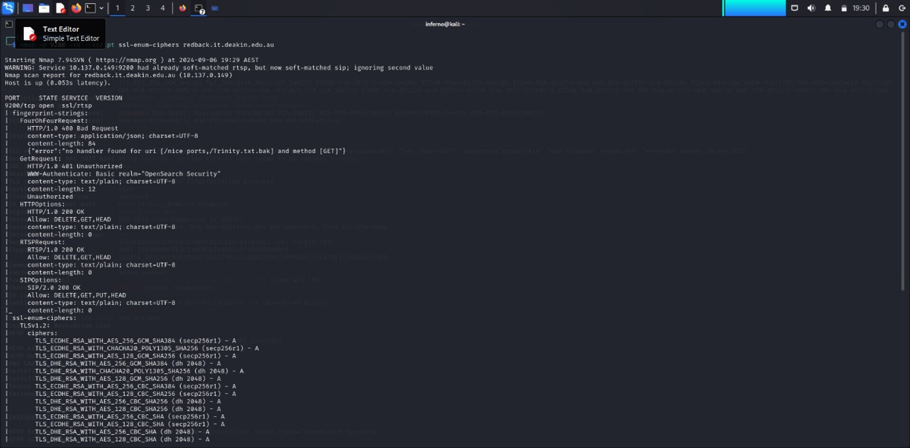

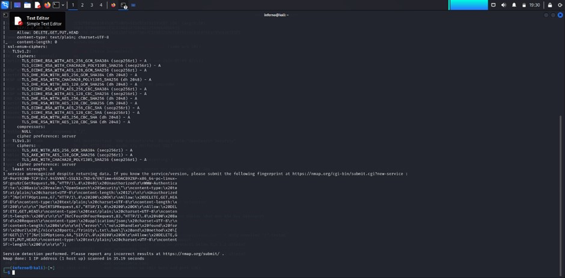

The output I received is from an Nmap scan using the `-sV` and `--script ssl-enum-ciphers` options. These options are used for service detection and to enumerate SSL/TLS ciphers supported by a service running on port 9200, which is typically associated with Elasticsearch or a similar service. From this scan, it's evident that the server is running SSL with several strong ciphers. The scan also provides detailed information about cipher strength, Diffie-Hellman key lengths, and the protocol versions in use (TLS 1.2 and TLS 1.3).

This scan is useful for identifying potential vulnerabilities related to cryptographic protocols. Weak ciphers, improper configuration, or insufficient Diffie-Hellman parameters can leave the service vulnerable to attacks like man-in-the-middle (MITM) or cipher downgrade attacks. However, based on the scan results, the server appears to be using secure and modern ciphers (all rated 'A'), which lowers the risk of vulnerabilities related to weak encryption.

One potential concern is the Diffie-Hellman key exchange (dh 2048). Although 2048-bit keys are generally considered secure, key sizes smaller than 2048 bits are often deemed weak. Moving forward, it might be advisable to consider upgrading to even stronger key sizes, such as 4096 bits, to enhance security further.

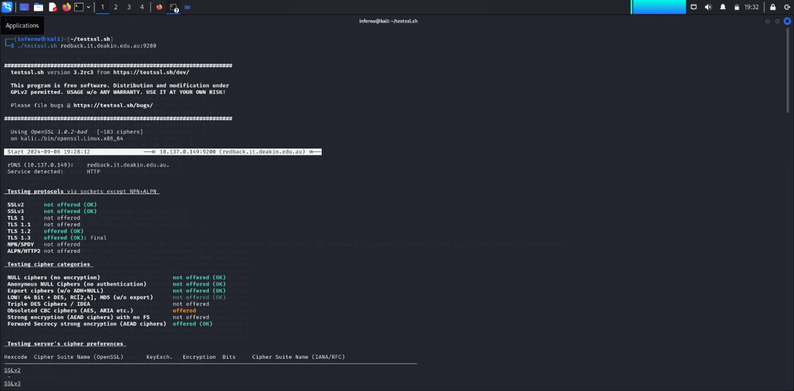

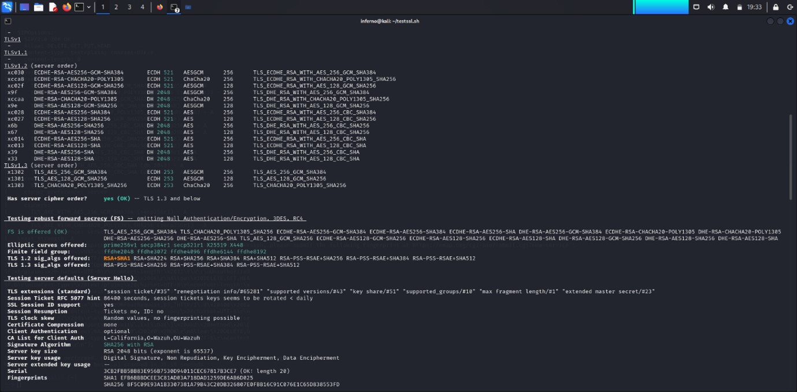

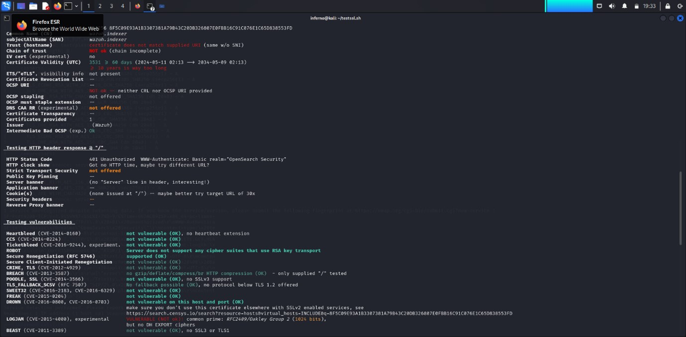

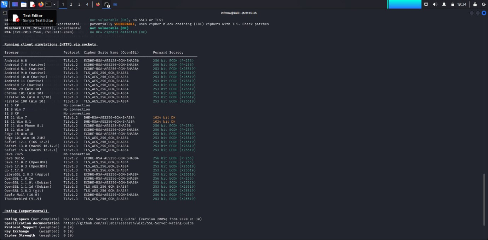

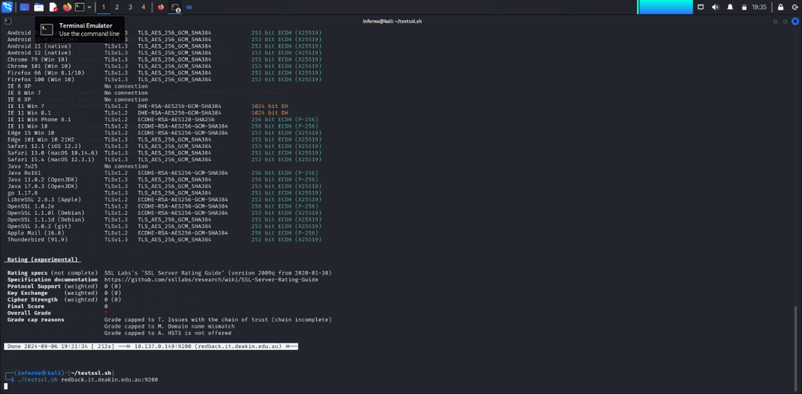

## 1. LOGJAM (CVE-2015-4000)

**Why It’s a Vulnerability:**
- **Description:** LOGJAM is a vulnerability affecting the Diffie-Hellman key exchange algorithm used in TLS. This vulnerability allows attackers to downgrade the security of encrypted communications by forcing the use of weak cryptographic parameters. Specifically, it targets servers that use common prime numbers (1024-bit) for key exchange.
- **Impact:** An attacker can potentially decrypt intercepted traffic or perform a man-in-the-middle attack, compromising the confidentiality and integrity of the data being exchanged.
- **Issue:** The report indicates that the server is vulnerable because it uses a common prime (RFC2409/Oakley Group 2, 1024 bits) for Diffie-Hellman key exchange.

**Explanation:**
- **Diffie-Hellman Key Exchange:** This algorithm allows two parties to securely share a common key over an insecure channel. However, if the parameters are weak, an attacker can exploit the weakness to decrypt the traffic.
- **Common Prime:** Using a common, weak prime makes it easier for attackers to perform mathematical attacks and recover the key used for encryption.

## 2. LUCKY13 (CVE-2013-0169)

**Why It’s a Vulnerability:**
- **Description:** LUCKY13 is a vulnerability in the implementation of the CBC (Cipher Block Chaining) mode of encryption used in TLS. This vulnerability allows attackers to perform a padding oracle attack, potentially leading to the exposure of plaintext data.
- **Impact:** An attacker could potentially recover sensitive information from encrypted traffic by exploiting timing discrepancies in the way the server handles padding errors.

**Explanation:**
- **CBC Mode:** CBC mode is a method of encrypting data where each block of plaintext is XORed with the previous ciphertext block before being encrypted. This mode can leak information about the plaintext through timing attacks if not implemented securely.
- **Padding Oracle Attack:** This attack exploits the way the server processes padding errors to infer details about the plaintext, which could be used to decrypt the message.

## 3. Certificate Chain Issues

**Why It’s a Vulnerability:**
- **Description:** The certificate chain is incomplete, meaning the server's SSL/TLS certificate does not correctly link back to a trusted root certificate authority (CA). This can result in issues with trust and validation.
- **Impact:** Browsers and other clients may not trust the server’s certificate, leading to warnings or failures in establishing secure connections.

**Explanation:**
- **Certificate Chain:** For a certificate to be trusted, it must be part of a chain that links it back to a trusted root CA. An incomplete chain means that intermediates or root certificates are missing, which prevents proper verification.
- **Trust Issues:** Without a complete chain, clients cannot validate the authenticity of the server’s certificate, which can lead to trust and security issues.

## 4. Domain Name Mismatch

**Why It’s a Vulnerability:**
- **Description:** The certificate presented by the server does not match the domain name used to connect to it. This means that the certificate is not valid for the domain in question.
- **Impact:** Clients connecting to the server may receive warnings or errors about the certificate mismatch, which can undermine trust in the server's identity and security.

**Explanation:**
- **Certificate Validation:** Certificates are issued for specific domain names. A mismatch occurs when the domain name on the certificate does not match the domain name of the server. This can happen if the server's certificate is misconfigured or if a malicious actor is intercepting connections.

## 5. HSTS Not Offered

**Why It’s a Vulnerability:**
- **Description:** HTTP Strict Transport Security (HSTS) is a security feature that forces browsers to use HTTPS for all communications with a server. If HSTS is not offered, browsers might not enforce this security measure.
- **Impact:** Without HSTS, users are vulnerable to man-in-the-middle attacks, where an attacker can intercept and modify communications between the browser and the server.

**Explanation:**
- **HSTS:** HSTS is a mechanism that tells browsers to only use HTTPS when communicating with a server, preventing any possibility of plain HTTP connections. This helps protect against downgrade attacks and eavesdropping.
- **No HSTS:** If a server does not use HSTS, it leaves users exposed to potential attacks where traffic could be intercepted or altered.

These vulnerabilities can significantly impact the security of your communications and data. Addressing them involves updating server configurations, improving encryption practices, and ensuring that certificates are correctly issued and validated.

# 5.4 PORT 9001 ANALYSIS

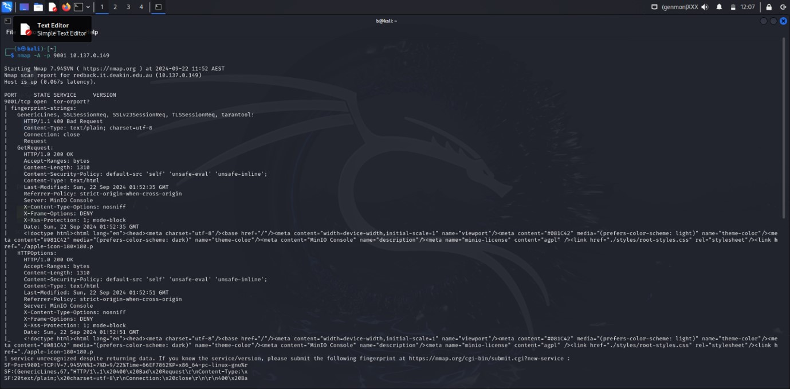
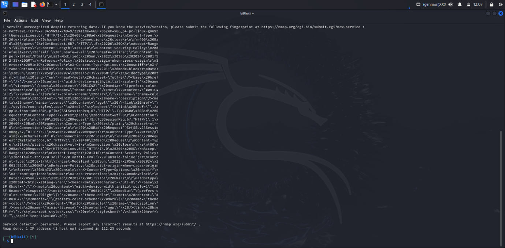

## Nmap Scan Results
The following command was used for scanning:
nmap -A -p 9001 10.137.0.149

### Findings
- **Port**: 9001/tcp
- **Status**: Open
- **Service**: Identified as `tor-orport`, though Nmap could not conclusively determine the specific service.

## Analysis of HTTP Responses

### Generic Response
- **HTTP Status**: 400 Bad Request
- **Content-Type**: text/plain; charset=utf-8
- **Connection**: closed
- **Details**: The server returned a 400 Bad Request error, suggesting that the request had invalid formatting or parameters.

### GET Request Response
- **HTTP Status**: 200 OK
- **Content-Type**: text/html
- **Content-Length**: 1310 bytes
- **Server**: MinIO Console
- **Security Features**:
  - **Content-Security-Policy**: Enforces that resources can only be loaded from the same origin and restricts unsafe evaluations and inline scripts.
  - **X-Content-Type-Options**: Nosniff (prevents MIME-type sniffing).
  - **X-Frame-Options**: DENY (prevents the page from being embedded in frames).
  - **X-XSS-Protection**: 1; mode=block (activates cross-site scripting protection).
- **Details**: The server is identified as running MinIO Console, which is an object storage service. The security headers indicate that the service is configured with measures to protect against common web vulnerabilities.

### HTTP OPTIONS Request Response
- **HTTP Status**: 200 OK
- **Content-Type**: text/html
- **Server**: MinIO Console
- **Security Features**: Same as those found in the GET request.
- **Details**: The OPTIONS request response verifies the same service and security configurations as the GET request.

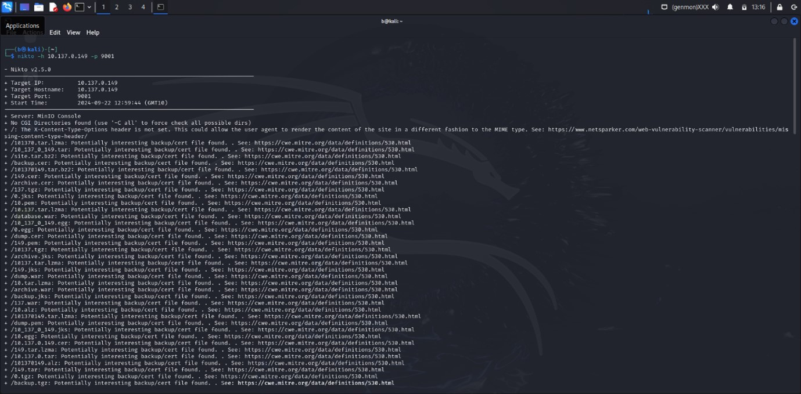
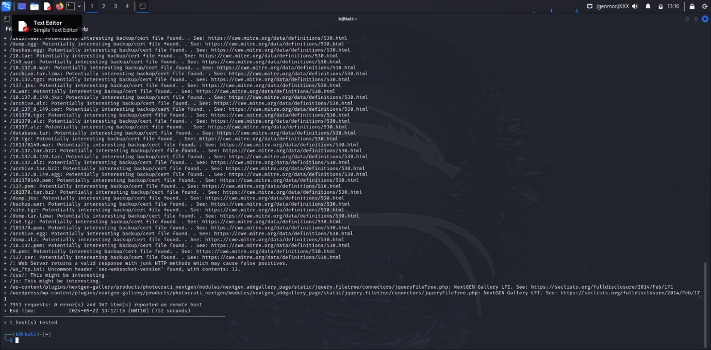

# Nikto Scan Report

## Target Information
- **Target Port**: 9001
- **Start Time**: 2024-09-22 12:59:44 (GMT+10)
- **Server**: MinIO Console

## Findings

1. **Missing HTTP Headers**:
   - **Issue**: The `X-Content-Type-Options` header is not set.
   - **Impact**: This could allow the user agent to render the content of the site in a different fashion than intended.
   - **Reference**: Netsparker - Missing Content-Type Header

2. **Potentially Interesting Backup/Certificate Files**:
   - **Issue**: Various files that could contain sensitive backup or certificate data were found.
   - **Files Identified**:
     - `/101370.tar.lzma`
     - `/10_137_0_149.tar`
     - `/site.tar.bz2`
     - `/backup.cer`
     - `/101370149.tar.bz2`
     - `/149.cer`
     - `/archive.cer`
     - `/137.tgz`
     - `/0.jks`
     - `/10.pem`
     - `/10.137.tar.lzma`
     - `/database.war`
     - `/10_137_0_149.egg`
     - `/0.egg`
     - `/dump.cer`
     - `/149.pem`
     - `/10137.tgz`
     - `/archive.jks`
     - `/10137.tar.lzma`
     - `/149.jks`
     - `/dump.war`
     - `/10.tar.lzma`
     - `/archive.war`
     - `/backup.jks`
     - `/137.war`
     - `/10.alz`
     - `/101370149.tar.lzma`
     - `/dump.pem`
     - `/10_137_0_149.jks`
     - `/10.egg`
     - `/10.137.0.149.cer`
     - `/149.tar.lzma`
     - `/10.137.0.tar`
     - `/101370149.alz`
     - `/149.tar`
     - `/0.tgz`
     - `/backup.tgz`
     - `/10137.cer`
     - `/database.alz`
     - `/site.jks`
     - `/0.tar.lzma`
     - `/10_137_0_149.tar.lzma`
     - `/10.137.0.149.tgz`
     - `/10137.tar`
     - `/10.137.0.149.war`
     - `/database.tar.bz2`
     - `/site.alz`
     - `/backup.tar`
     - `/dump.tgz`
     - `/101370.egg`
     - `/10.tar.bz2`
     - `/site.tar.lzma`
     - `/archive.tgz`
     - `/10137.jks`
     - `/149.tar.bz2`
     - `/149.alz`
     - `/database.cer`
     - `/10.137.egg`
     - `/10.137.0.tgz`
     - `/10.137.0.jks`
     - `/149.egg`
     - `/10.137.war`
     - `/site.tar`
     - `/backup.pem`
     - `/101370.war`
     - `/site.egg`
     - `/database.tar.lzma`
     - `/10.137.egg`
     - `/10.137.0.149.alz`
     - `/archive.tar`
     - `/10.137.0.149.pem`
     - `/archive.pem`
     - `/backup.tar.bz2`
     - `/10.137.0.pem`
     - `/backup.alz`
     - `/10137.egg`
     - `/10_137_0_149.tar.bz2`
     - `/10.137.0.cer`
     - `/site.war`
     - `/10137.pem`
     - `/0.tar.bz2`
     - `/10_137_0_149.pem`
     - `/10_137_0_149.alz`
     - `/10.137.0.tar.bz2`
     - `/10.137.cer`
     - `/10.137.0.alz`
     - `/101370149.tgz`
     - `/0.tar`
     - `/137.egg`
     - `/101370.cer`
     - `/site.pem`
     - `/10.137.0.149.tar.bz2`
     - `/backup.tar.lzma`
     - `/137.alz`
     - `/101370149.jks`
     - `/137.tar.bz2`
     - `/dump.tar.bz2`
     - `/10.war`
     - `/database.pem`
     - `/10.cer`
     - `/10_137_0_149.tgz`
     - `/10.137.0.149.tar.lzma`
     - `/101370149.tar`
     - `/database.egg`
     - `/10.137.0.tar.lzma`
     - `/10_137_0_149.war`
     - `/101370.jks`
     - `/10137.tar.bz2`
     - `/site.cer`
     - `/137.tar`
     - `/10.137.jks`
     - `/database.tgz`
     - `/0.alz`
     - `/database.jks`
     - `/0.cer`
   - **Impact**: These files could potentially contain sensitive information such as backups or certificates that may be exploited.
   - **Reference**: CWE-530: Exposure of Sensitive Information via Application Error

# Website

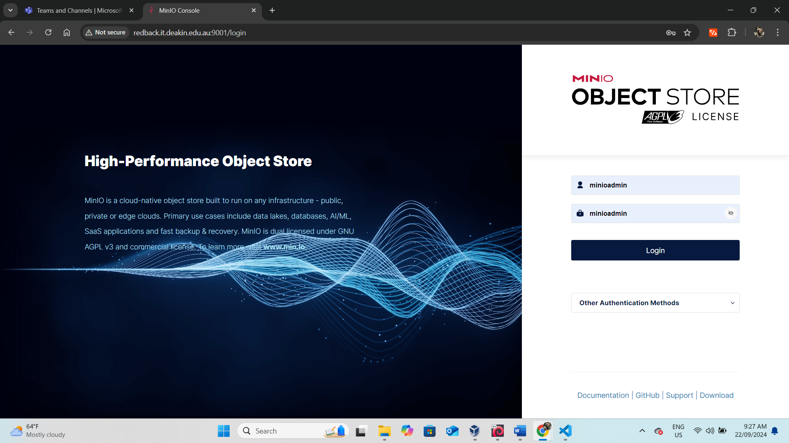

## Vulnerability Discovery
1. **Service Access**: Accessed the Redback service at `redback.deakin.it.edu.au:9001`.
2. **Login Details**: Logged in using the default credentials `password` and `minioadmin`, highlighting a vulnerability due to the use of weak or default login credentials.

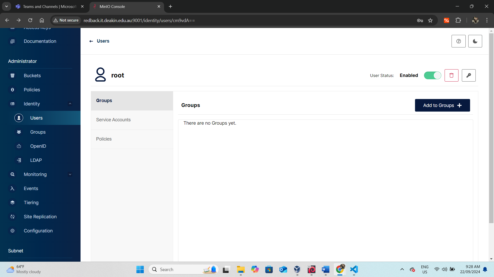

## Privilege Escalation Process
1. **User Creation**: Established a new user named `root` with full administrative privileges on the website, effectively gaining comprehensive control over the site.

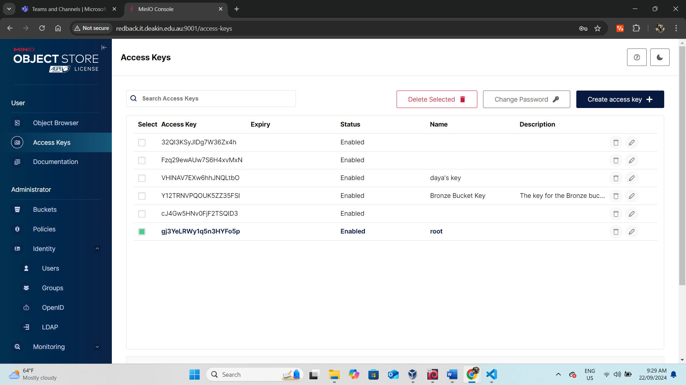

## Key Retrieval
1. **Key Acquisition**: Obtained both the secret key and access key for the website, which are crucial for performing authenticated actions.

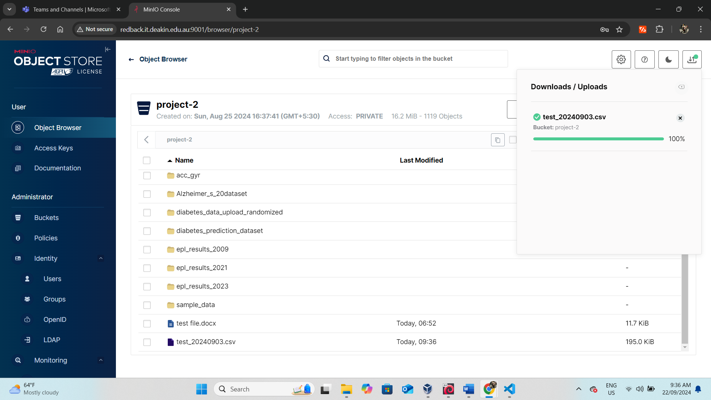

## File Management Testing
1. **File Operations**: Verified the ability to upload, delete, and modify files, confirming that the new user had appropriate permissions to manage these files.

# 6. Recommendations

## 6.1 Short-term Mitigations
- **Upgrade Apache HTTP Server**: Update the Apache HTTP Server running on port 8080 to the latest stable release to address critical vulnerabilities (e.g., CVE-2024-38476, CVE-2024-38474).
- **Strengthen Authentication**: Replace default credentials (e.g., on the MinIO Console) with strong, unique passwords. Implement multi-factor authentication where feasible.
- **Enhance SSL/TLS Security**:
  - Disable outdated and weak ciphers and protocols.
  - Resolve the LOGJAM vulnerability by adopting stronger Diffie-Hellman parameters (at least 2048-bit).
  - Enforce HTTP Strict Transport Security (HSTS).
- **Resolve Certificate Issues**:
  - Ensure that the SSL certificate aligns with the domain name.
  - Complete the certificate chain to prevent trust errors.
- **Secure Sensitive Files**: Remove or protect sensitive backup and certificate files found during the Nikto scan.
- **Improve Content Security Policy (CSP)**: Eliminate 'unsafe-eval' and 'unsafe-inline' from the CSP header on port 443.
- **Close Unnecessary Ports**: Review all open ports and close those that are not essential to operations.

## 6.2 Long-term Security Improvements
- **Conduct Regular Vulnerability Scans**: Automate routine vulnerability scans using tools like OpenVAS to detect and address new risks promptly.
- **Establish Patch Management**: Implement a structured patch management process to ensure timely updates across systems and applications.
- **Strengthen Network Segmentation**: Apply stronger network segmentation to limit damage in case of a breach.
- **Deploy a Web Application Firewall (WAF)**: Install a WAF to protect against common web-based attacks.
- **Perform Regular Penetration Testing**: Schedule periodic penetration tests to uncover and resolve potential security gaps.
- **Implement SIEM Solution**: Introduce a Security Information and Event Management (SIEM) system for better monitoring and incident response.
- **Develop and Test an Incident Response Plan**: Create a comprehensive incident response plan and perform regular drills to maintain readiness.
- **Apply the Principle of Least Privilege**: Ensure users and service accounts have only the minimal access they require.
- **Enhance Employee Security Awareness**: Provide regular training sessions for employees, focusing on recognizing phishing and adhering to security best practices.
- **Implement Data Loss Prevention (DLP)**: Use DLP tools to prevent unauthorized data leaks.

# 7. Conclusion

The penetration test conducted on the Deakin University server (redback.it.deakin.edu.au) revealed several serious vulnerabilities that demand immediate remediation. Key issues include multiple critical vulnerabilities in the Apache HTTP Server, weak authentication mechanisms, and misconfigured SSL/TLS settings.

One of the most concerning findings was how easily an attacker could gain unauthorized access and escalate privileges, demonstrated by the successful creation of an administrative user on the MinIO Console. Additionally, the presence of sensitive backup files and the use of default credentials pose significant risks to the system’s confidentiality and integrity.

Although some security best practices, such as the use of strong SSL/TLS ciphers in certain areas, are in place, the server’s overall security posture requires significant improvement. By implementing the short-term mitigations and long-term security enhancements outlined in this report, the system’s security can be substantially strengthened, reducing the risk of successful attacks.

Addressing these recommendations promptly, while conducting regular security assessments like vulnerability scans and penetration tests, will help ensure the continued security of the system. A proactive approach, combined with fostering a security-conscious culture, will help Deakin University protect its digital assets from potential cyber threats.

# 8. Appendices

## 8.1 Tools Used
- **Gophish**: Used to design and manage phishing campaigns to assess user awareness and email security.
- **Evilginx2**: Employed for advanced phishing, especially to bypass two-factor authentication.
- **Nmap**: Utilized for network discovery, port scanning, and identifying services/operating systems.
- **Nikto**: Used for scanning web servers to detect potential vulnerabilities and misconfigurations.
- **Metasploit Framework (msfconsole)**: Applied for exploiting vulnerabilities and conducting post-exploitation activities.
- **Gobuster**: Employed for brute-forcing directories and files on web servers.
- **Burp Suite**: Used for testing web application security, including intercepting and modifying HTTP/HTTPS requests.
- **OpenVAS**: Utilized for thorough vulnerability scanning and assessments.

