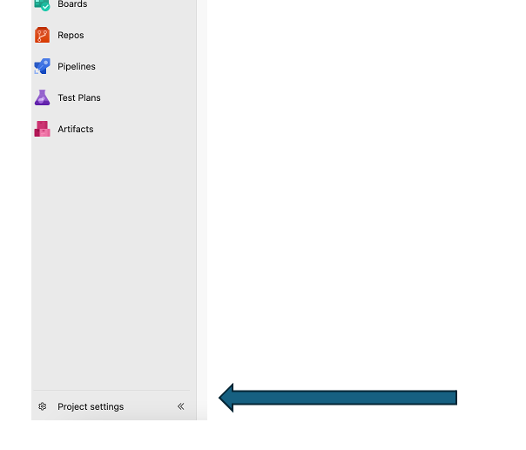
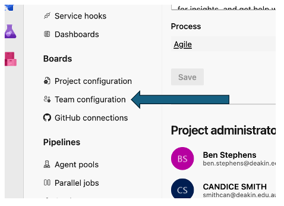
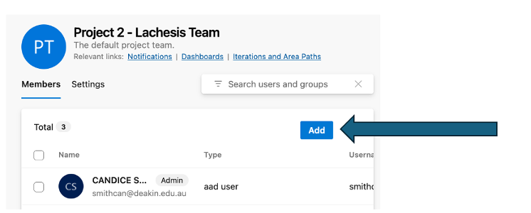

# Azure DevOps Quick Start Guide

:::info
**Document Creation:** December 15, 2024. **Last Edited:** December 15, 2024. **Authors:** Candice Smith.
**Document Code:** ADO-QUIK-001. **Effective Date:** December 15, 2024. **Expiry Date:** December 15, 2025.
:::

Following an assessment of Jira and Azure  we underwent configuration of Azure DevOps. We identified that there are two big risks we can ultimately mitigate with the migration:

- Publishing of all Redback content to our public GitHub repos exposes us to inadvertently publishing sensitive information such as credentials, API Keys, and personal and health information
- Planner not being a comprehensive enough project management tool to handle the dynamic and evolving nature of a Capstone company.
This trimester we focused on creating a minimum viable product which would facilitate initial migration and allow future teams to make iterative improvements to the environment. We created a project space for all teams, sprints for T1 2025 and boards for project management, then migrated all content from Planner to Boards. Wikis and dashboards have been set up where possible and testing of these tools has been conducted.

This guide will give you an overview of how to get started using Azure DevOps in place of Planner boards.

## Current Configuration Progress by Team

- Done CS - Candice Smith Completed
- Done Other - Completed by another team member
- OOS - Out of scope T3 2024
### Project 1

- Done CS - Set up project
- Done CS - Allocated Ben Stephens as admin
- Done CS - Set up Areas – IoT, VR, Web
- Done CS - Added sprints for T1 2025
- Done CS - Set Up Boards columns
- Done CS - Added “perpetual informational planner items” as Wikis
- Done CS - Added VR Team Work Details Handbook into Wiki
- Done CS - Added Welcome Wiki
- Done CS - Planner Migration (add planner tasks as user stories with checklist as tasks)
- Done CS - Embed Boards into Teams for T1 2025 instead of Planner.
- Not Started: GitHub Integration
- Not Started: Set up Dashboard
- Not Started: GitHub to Azure Repos migration
### Project 2

- Done CS - Set up project
- Done CS - Allocated Ben Stephens as admin
- Done CS - Added sprints for T1 2025
- Done CS - Set Up Boards columns
- Done CS - Added Welcome Wiki
- Done CS - Added Closed Tasks
- Done CS - Planner Migration (add planner tasks as user stories with checklist as tasks)
- Done CS - Embed Boards into Teams for T1 2025 instead of Planner.
- Not Started: GitHub Integration
- Not Started: Set up Dashboard
- Not Started: GitHub to Azure Repos migration
### Project 3

- Done CS - Set up project
- Done CS - Allocated Ben Stephens as admin
- Done CS - Added sprints for T1 2025
- Done CS - Set Up Boards columns
- Done CS - Added “perpetual informational planner items” as Wikis
- Done CS - Planner Migration (add planner tasks as user stories with checklist as tasks)
- Done CS - Embed Boards into Teams for T1 2025 instead of Planner.
- Not Started: GitHub Integration
- Not Started: Set up Dashboard
- Not Started: GitHub to Azure Repos migration
### Project 4

- Done CS - Set up project
- Done CS - Allocated Ben Stephens as admin
- Done CS - Added sprints for T1 2025
- Done CS - Set Up Boards columns
- Done CS - Added “perpetual informational planner items” as Wikis
- Done CS - Planner Migration (add planner tasks as user stories with checklist as tasks)
- Done CS - Embed Boards into Teams for T1 2025 instead of Planner.
- Not Started: GitHub Integration
- Not Started: Set up Dashboard
- Not Started: GitHub to Azure Repos migration
### Project 5

- Done CS - Set up project
- Done CS - Allocated Ben Stephens as admin
- Done CS - Added sprints for T1 2025
- Done CS - Set Up Boards columns
- Done CS - Added “perpetual informational planner items” as Wikis
- Done CS - Planner Migration (add planner tasks as user stories with checklist as tasks)
- Done CS - Embed Boards into Teams for T1 2025 instead of Planner.
- Not Started: GitHub Integration
- Not Started: Set up Dashboard
- Not Started: GitHub to Azure Repos migration
### Data Warehouse - Jesse

- Done Other - Set up project
- Done Other - Allocated Ben Stephens as admin
- OOS - Added sprints for T1 2025 – Jesse would prefer no sprints so all items can be seen in a unified task view
- Done CS - Set Up Boards columns
- OOS - Planner Migration (complete - The DW team's planner board is from T2 and can be deleted/wiped. All the required information or tasks that carried over to this trimester have been moved to azure boards.)
- Done CS - Embed Boards into Teams for T1 2025 instead of Planner.
- Not Started: GitHub Integration
- Not Started: Set up Dashboard
- Not Started: GitHub to Azure Repos migration
### Cyber Security - Tristan

- Done Other - Set up project - Done
- Done Other - Allocated Ben Stephens as admin - Done
- Done Other - Added sprints for T1 2025 - Done
- Done CS - Set Up Boards columns
- Codey to complete: Added “perpetual informational planner items” as Wikis
- Codey to complete: Planner Migration (add planner tasks as user stories with checklist as tasks)
- Codey to complete: Embed Boards into Teams for T1 2025 instead of Planner.
- Not Started: GitHub Integration
- Not Started: Set up Dashboard
- Not Started: GitHub to Azure Repos migration
### Web and Mobile Dev

- Done CS - Set up project
- Done CS - Allocated Ben Stephens as admin
- Done CS - Added sprints for T1 2025
- Done CS - Set Up Boards columns
- Done CS - Planner Migration (add planner tasks as user stories with checklist as tasks)
- Done CS - Embed Boards into Teams for T1 2025 instead of Planner.
- Not Started: Set up Dashboard
### Company Leaders

- Done CS - Set up project
- Done CS - Allocated Ben Stephens as admin
- Done CS - Added sprints for T1 2025
- Done CS - Set Up Boards columns
- Done CS – Used Board
## Start of Trimester 1, 2025

### For Mentors and Team Leaders

- Mentors must be assigned to their Project Teams with at least Basic access.
- They must assign at least 1 leader in their team with Basic access.
- View the Welcome Wiki found in “Overview” > “Wiki”.
- Mentors/Student Leaders must consider whether you want 1 unified team, or separate sub-teams.
- Go to:

- Then assign all Redback Operations students to their respective teams with Stakeholder access. Do this by clicking on the team’s name, then when you are in the team view click “Add”:

*If any of the student leaders need to make changes to project teams, they will need to seek approval from their mentor for basic access.

Area paths have been set up, so team members should only see their own boards.

Any perpetual informational tasks housed within the previous planner have been added to the Team Wiki which can be found within the Project space > Overview > Wiki.

### For Team Members

- Once you have been granted Stakeholder access to Azure DevOps login and navigate to your team Wiki. This can be found in the left-hand menu under Overview > Wiki.
- Read the Welcome Wiki understanding that some of this will already have been taken care of by your mentor or team leader.
- Once you have read through the welcome wiki go to Boards in the Boards menu in the left-hand pane. It's a good idea to review what was completed last trimester and any item sitting open or in the backlog. This may give you an idea of the direction that you may want to take your individual contribution in.
### For Everyone

At the start of the trimester once the team have looked over the information from the previous trimester it is a good idea to move any complete items you no longer need to reference into the completed previous trimesters column.

## During T1 2025

Here are some items you may want to consider moving into Azure DevOps in T1 2025, they were considered out of scope in T3 2024:

- Move the OnBoarding process into Azure DevOps.
- Set up Power BI Integration so teaching team can audit activity utilising BI reports
- Set up integration with current GitHub repos so teams can start working natively within Azure DevOps.
- Consider full migration of your team’s GitHub repo into Azure Repos, this will create much better security around our dev pipelines.
## At the end of T1 2025

- You may want to set up sprints for the trimester ahead so they can get started quickly.
- Ensure your board is updated and items are moved through the swim lanes accurately reflecting progress.
- Update Welcome Wiki with any knew information that may be required following your own contribution to Azure DevOps.
- You may even want to update this quick start guide for the next cohort to get started quickly in the platform.
