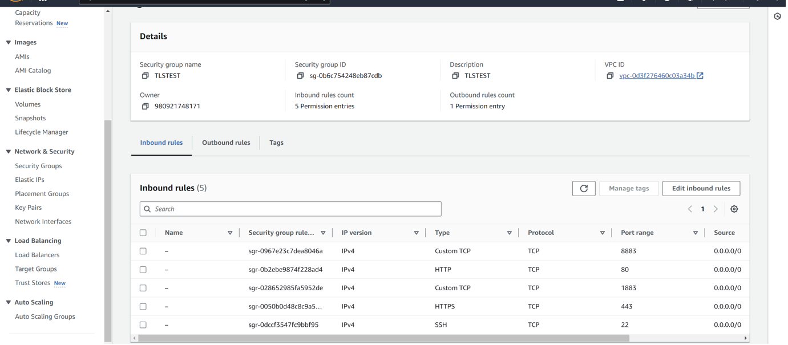
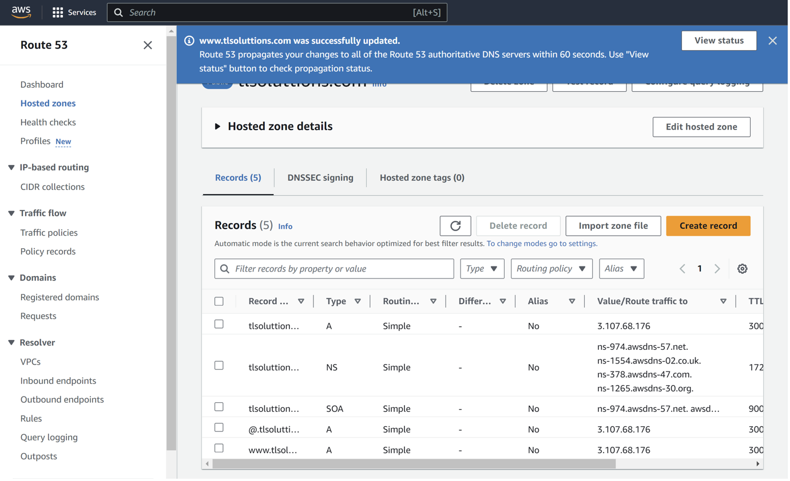
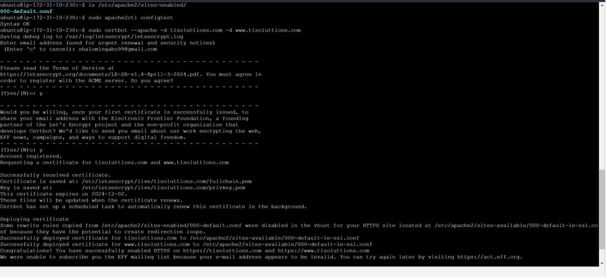
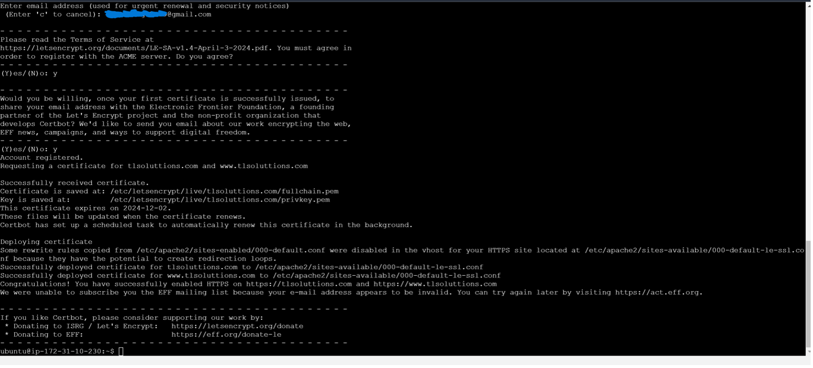
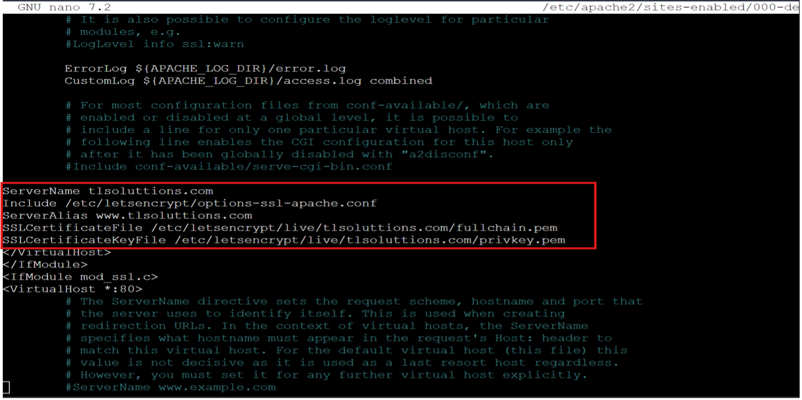
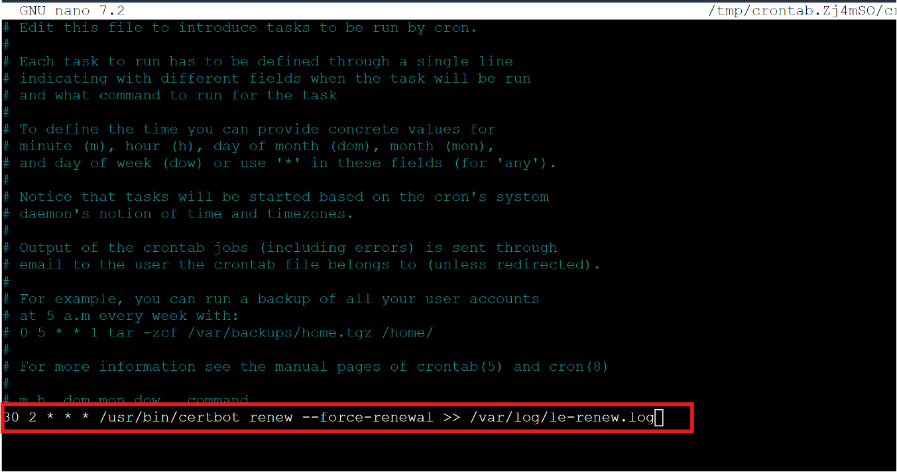
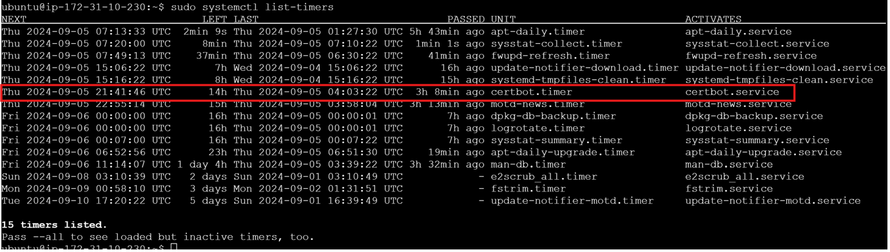
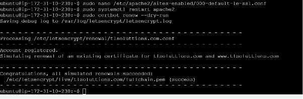
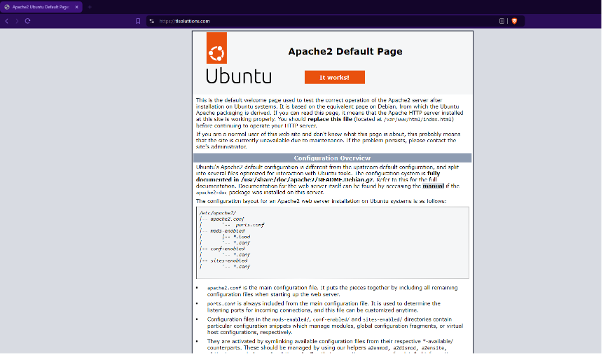
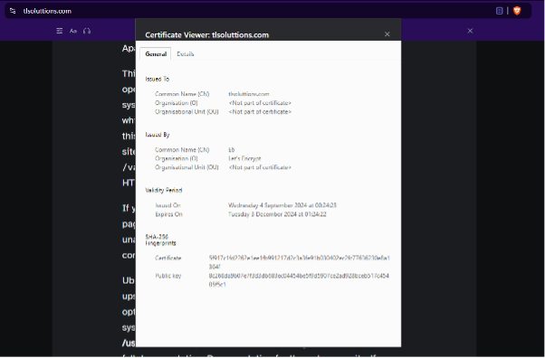

**Last updated by:** T_Apperley, **Last updated on:** 03/12/2024


**Last updated by:** T_Apperley, **Last updated on:** 03/12/2024


# **Certbot – Let's Encrypt TLS solution for Mosquitto MQTT broker**

## Proof of Concept

### Retrospective Review

| Version | Modified By     | Date       | Changes Made                                                                                   |
|---------|-----------------|------------|-------------------------------------------------------------------------------------------------|
| v1.0    | Candice Smith    | 03/09/2024 | Document Creation draft steps for MQTT Server TLS Implementation                                |
| v2.0    | Shalom Ingabo    | 05/09/2024 | Updated all process steps with confirmed process and added screenshots following technical PoC. |
| v3.0    | Candice Smith    | 05/09/2024 | Final formatting of document including division of testing categories, Out of Scope items, etc. |
| v4.0    | Candice Smith    | 20/09/2024 | Added Manik’s script        


# Steps taken and validated during PoC

## Set Up Test Environment

**Step 1: Set up EC2 instance**

Created a new security group to allow inbound rules for SSH, HTTPS and MQTT (1883 for secure MQTT and 8883 for non-secure MQTT). Since it was only for test purposes, I allowed access source from any IP address, however, in the case of production, this needs to be hardened through IP address access control to allow only the necessary IP addresses for security purposes.



Launch instance and connect via SSH using command: 
```
ssh –i /path/to/your-key.pem ubuntu@<EC2-Public-IP>
```


**Step 2: Link your Domain to the instance**

Created a domain using AWS called tlsoluttions.com

We used Route 53 on AWS to create a hosted zone for our domain tlsoluttions.com and did some configurations on the A record to point to our running cloud server instance



Tested domain link using domainchecker to ensure that our domain was being hosted using the IP address of the running instance (takes about 60 seconds for changes to be applied.)


## Set Up Test Mosquitto Broker

**Step 3: Install mosquitto**

Run the commands:
```
sudo apt update
sudo apt install mosquitto mosquitto-clients 
```
in our running instance. This commands updates and install the mosquitto broker to support the MQTT protocol

**Step 4: Configure mosquitto for tls**

 Edited the mosquitto configurations file to support secure connections by 	running the command: 
 ```
 sudo nano /etc/mosquitto/conf.d/default.conf
 ```

Add the following code to enable TLS:

```
listener 8883

cafile /etc/letsencrypt/live/mqttserver.domain.com/chain.pem

certfile /etc/letsencrypt/live/mqttserver.domain.com/fullchain.pem

keyfile /etc/letsencrypt/live/mqttserver.domain.com/privkey.pem

tls_version tlsv1.2
```

Explanation of the above code

listener 8883 specifies the port for TLS connections (default is 8883 for TLS).

cafile points to the CA certificate file (part of the Let's Encrypt chain).

certfile points to your server certificate.

keyfile points to your private key.

tls_version specifies the minimum TLS version to use.


Saved the file then restarted mosquitto using command: 
```
sudo systemctl restart mosquito
```


## Set Up Certbot and Let’s Encrypt Solution

**Step 5: Install Certbot for Let’s Encrypt TLS Certificates with Apache**

Install Certbot and Apcahe plugin using command
```
Sudo apt install certbot python3-certbot-apache –y
```

Obtain SSL Certificates using certbot by running the command: 
```
sudo certbot –apache –d tlsoluttions.com -d www.tlsoluttions.com 
```




[successful certificate generation]

In the above command, certbot uses the Apache plugin to automaticallly configure SSL for our site. Certbot will ask you to choose whether you want to redirect HTTP traffic to HTTPS (which is recommended)

Verify Apache SSL configurations by running the command : 
```
sudo nano /etc/apache2/sites-available/000-default-le-ssl.conf
```

You should be able to see the following lines which tells Apache to use Let’s Encrypt certificates for your domain



Restart Apache to ensure all changes take effect by running the command: 
```
sudo systemctl restart apache2
```


**Step 6: Set up automatic renewal**

To force certbot to renew the certificate every day, you can create a cron job that attempts to renew the certificate everyday by running the command: 
```
sudo crontab -e
```
Add the following line



Explanation of the line

30 2 * * *: This schedules the task to run at 2:30 AM everyday
```
/usr/bin/certbot renew –force-renewal
```
This command forces certbot to renew the certificate, even if it has not reached the typical renewal period which is typically 90 days
```
/var/log/le-renew.log
```
This appends the output of the command to a log file for review

To check the list of the active timer, run command: 
```
sudo systemctl list-timers and check for certbot.timer
```



**Step 7: Testing automatic renewal**

Let’s Encrypt certificates are valid for 90 days, but with the installation of certbot, the renewal process is automated and can be tested by running the command: 
```
sudo certbot renew –dry-run
```

[successful automated renewal]



[verifying Apache SSL]


# Automation – Script

**Setup Automation**

To streamline the deployment and configuration process, this is an automated script that sets up Mosquitto, configures TLS, installs Certbot, and manages SSL certificates. Below is the script used for this PoC:


**The script-**
```
#!/bin/bash

sudo apt-get update

sudo apt-get install -y mosquitto mosquitto-clients apache2 certbot python3-certbot-apache

sudo tee /etc/mosquitto/conf.d/mosquitto_tls.conf > /dev/null <<EOF

listener 8883

cafile /etc/letsencrypt/live/YOUR_DOMAIN/fullchain.pem

certfile /etc/letsencrypt/live/YOUR_DOMAIN/cert.pem

keyfile /etc/letsencrypt/live/YOUR_DOMAIN/privkey.pem

tls_version tlsv1.2

EOF

sudo a2enmod proxy proxy_http proxy_wstunnel ssl

sudo tee /etc/apache2/sites-available/000-default.conf > /dev/null <<EOF

<VirtualHost *:80>

ServerName YOUR_DOMAIN

ProxyPass /mqtt ws://localhost:1883/

ProxyPassReverse /mqtt ws://localhost:1883/

ProxyPass /mqttssl wss://localhost:8883/

ProxyPassReverse /mqttssl wss://localhost:8883/

ErrorLog \${APACHE_LOG_DIR}/error.log

CustomLog \${APACHE_LOG_DIR}/access.log combined

</VirtualHost>

EOF

sudo systemctl restart apache2

sudo certbot --apache -d YOUR_DOMAIN

sudo mkdir -p /etc/mosquitto/certs

sudo cp /etc/letsencrypt/live/YOUR_DOMAIN/fullchain.pem /etc/mosquitto/certs/fullchain.pem

sudo cp /etc/letsencrypt/live/YOUR_DOMAIN/privkey.pem /etc/mosquitto/certs/privkey.pem

echo "0 3 * * * certbot renew --post-hook 'systemctl restart apache2 && systemctl restart mosquitto'" | sudo tee -a /var/spool/cron/crontabs/root
```

**Steps to use the script**

Create a new file for the script: 
```
nano new_file.sh
```
Paste the automated script into the file. Make sure to replace YOUR_DOMAIN with your actual domain name

Change the script’s permissions to make it executable: 
```
sudo chmod +x new_file.sh
```
Execute the script to perform the setup: 
```
sudo ./new_file.sh
```

# Out of Scope

Additional steps and information that may be useful during implementation, deemed out of scope for PoC activity.


Alternative Certbot installation methods for various OS’s can be found here:  


Verify config by testing with MQTT Clients


```
mosquitto_sub -h mqttserver.domain.com -p 8883 -t test/topic \--cafile

/etc/letsencrypt/live/mqttserver.domain.com/chain.pem
```


*You may need to adjust the port -- please review


In the case a client fails to connect, check Mosquitto logs for errors.


```
sudo journalctl -u mosquito
```


Reload Mosquitto config after successful renewal:


```
sudo nano /etc/letsencrypt/renewal-hooks/post/reload-mosquitto.sh
#!/bin/bash
systemctl reload mosquitto
sudo chmod +x /etc/letsencrypt/renewal-hooks/post/reload-mosquitto.sh
```


# Proof of Concept Outcome

The outcome of this PoC has been to validate the process for the successful deployment of Certbot and Let’s Encrypt to secure a Mosquitto MQTT broker stored on a server utilising Apache as the operating system.


Not only does this provide a validated process for future TLS deployments but also provides a guide to creating a testing environment for any future proof of concept requirements resulting in a much more efficient process and more focus on testing the new technologies rather than the testing environment.


This PoC has resulted in the successful testing of the Certbot – Let's Encrypt TLS solution as applied to our test MQTT broker, with the successful renewal of the deployed certificate. All this is also captured in an easy to run script which will deploy a Mosquitto broker with TLS.

