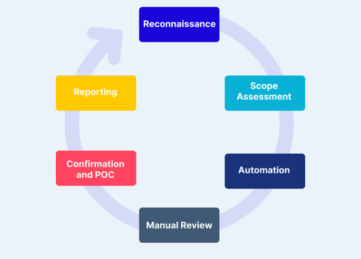
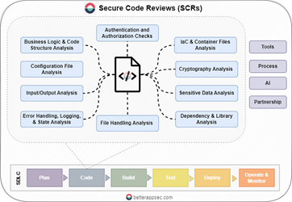
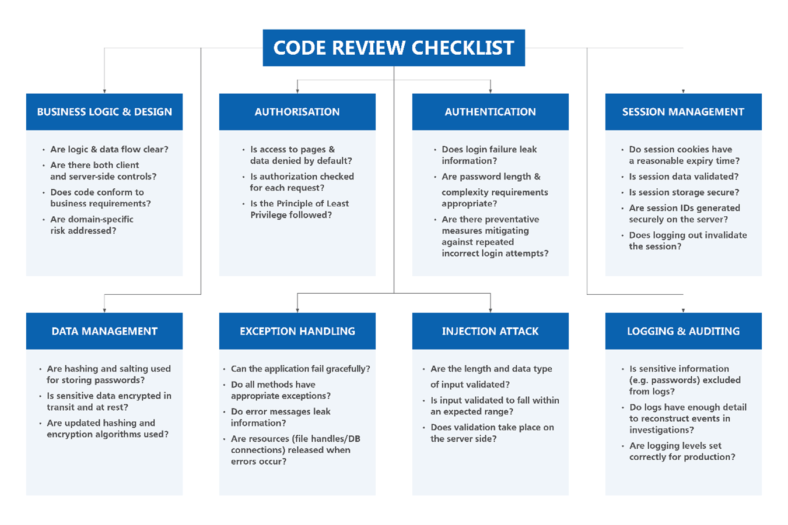

**Last updated by:** T_Apperley, **Last updated on:** 03/12/2024

**Last updated by:** T_Apperley, **Last updated on:** 03/12/2024

:::info
 **Last Edited:** 6 May 2024. **Author:** Tushar Sharma  **Version:** 3.0.
:::

# Secure Code Review

Introduction to guidelines and methodologies for performing secure code reviews, covering key principles, common vulnerabilities, and best practices.

## Secure Code Review

 Secure code review is a critical process of reviewing the source code of an application aiming to identify and mitigate vulnerability, threats that could have been unintentionally placed during development [1]. This involves the examining of source code to find the potential weaknesses, loopholes or bugs that could be exploited by attackers. Beyond safeguarding against potential exploits by malicious actors, it also plays a vital role to improve the overall quality of the codebase. It also uncovers the code inefficiencies, poor coding practices, and potential points of failure. Therefore, many organizations are investing in secure code review processes for not only mitigating security risks, but also create a strong foundation for the long-term success of their projects [2].

## Methods and Practices for Enhancing Software Security

There are various methods and practices that contribute to fortifying applications against cyber threats. While each approach serves its purpose and strategies to enhance Security.

### Security Requirements Analysis and Threat Modeling

Security requirements analysis and threat modeling are processes that help identify security needs and potential risks during software development. They ensure that security is considered right from the start and help decide which security measures are most important. However, they don't look at the code itself in as much detail as secure code review does.

### Static and Dynamic Application Security Testing (SAST and DAST)

Static and dynamic application security testing, known as SAST and DAST, examine software differently. SAST looks at the source code for vulnerabilities without running the program, while DAST tests the running application for vulnerabilities as it operates. Although these methods can uncover vulnerabilities, they might not catch all types of security issues and have limitations in their coverage.

### Code Signing

Code signing is a process that confirms the authenticity and integrity of code, which helps maintain its integrity. While code signing ensures that the code hasn't been tampered with, it doesn't directly deal with or resolve security vulnerabilities present within the codebase.

## Why Choose Secure Code Review?

### Proactive Vulnerability Detection

Secure code review stands as a proactive measure in software development, ensuring that potential security vulnerabilities are identified and addressed before they pose risks to the system. By conducting thorough reviews of the codebase during the development phase, teams can prevent potential exploitation by attackers, safeguarding the integrity and security of the application. By regularly reviewing and discussing security best practices and common vulnerabilities, developers gain a deeper understanding of secure coding principles and learn to identify potential security risks in their code independently.

For example, suppose a development team is building a web application that handles sensitive user data, such as financial information. During a secure code review, a developer identifies a section of code that doesn't properly validate user input before processing it, potentially exposing the application to SQL injection attacks. By catching this vulnerability early in the development process through code review, the team can implement proper input validation mechanisms to prevent such attacks, thereby enhancing the application's security posture.

### Integration with Development Process

Secure code review seamlessly integrates with the software development lifecycle, making it a cost-effective and efficient method for ensuring security. Integrating secure code review into the development workflow allows for continuous monitoring and improvement of security practices. As developers review each other's code and collaborate on identifying and resolving vulnerabilities, they gain valuable insights into secure coding practices and common security pitfalls. This iterative process helps build a stronger security culture within the organization and empowers developers to write more secure code from the start.

### Comprehensive Coverage

Secure code review offers a distinct advantage over other methods by providing a rough examination of the codebase. While other security practices may focus on specific aspects of security, such as system defenses or runtime testing, secure code review delves deeply into the code itself, examining every line for potential vulnerabilities. 
This comprehensive approach allows secure code review to uncover both common security weaknesses, such as input validation errors or insecure data handling, as well as more obscure vulnerabilities that may evade automated testing tools or go unnoticed during runtime analysis. 
For example, a static analysis tool may flag a potential SQL injection vulnerability in a particular code snippet, but only a human reviewer conducting a thorough code review may notice subtle variations in input validation logic that could also lead to injection attacks. By providing this level of scrutiny, secure code review helps organizations bolster their defenses against a wide range of security threats, from the most common to the most sophisticated.

### Continuous Improvement

Secure code review does the continuous improvement within development teams by encouraging adherence to secure coding practices, knowledge sharing, and skills development. 

While other security practices play crucial roles, secure code review stands out as a proactive and comprehensive approach for ensuring software security. By addressing vulnerabilities at the source code level, organizations can build resilient software systems that withstand cyber threats. Prioritizing secure code review is fundamental for mitigating security risks and ensuring the long-term success of software projects.

## Guide to Secure Code Review: A Step-by-Step Approach:

Conducting a secure code review is a critical process in software development aimed at identifying and mitigating security vulnerabilities within the codebase. Whether you're a seasoned developer or new to the field, following a structured approach can help ensure thorough examination and effective remediation of security issues. Here’s steps involved in performing a secure code review:

### 1. Understand the Application and its Requirements:

The first step involves obtaining a thorough understanding of the application's functionality, architecture, and specific security requirements. This knowledge acts as a roadmap for the review process, aiding in the effective prioritization of areas to focus on. Understanding the intricacies of the application's design and purpose is essential for conducting a targeted and efficient code review, ensuring comprehensive coverage of potential security vulnerabilities. Additionally, having a basic understanding of code is imperative to effectively assess the codebase.

### 2. Set Up Your Development Environment:

Ensure that you have access to essential tools, version control systems, and designated code review platforms. Familiarize yourself with the structure and organization of the codebase to facilitate seamless navigation during the review process. In our case, access to the project will be facilitated through a GitHub repository, where you will initiate a Git pull request to retrieve the codebase. 
Once accessed, consider conducting preliminary tests on the codebase to ascertain its functionality and identify potential areas of concern. Additionally, you have the flexibility to choose between conducting the secure code review on your local host machine or within a Linux environment, depending on your preference and requirements.
To enhance the effectiveness of the code review, consider utilizing multiple scanning tools such as Snyk, SonarQube, bandit and many more. These tools can assist in identifying security vulnerabilities, ensuring a comprehensive evaluation of the codebase. 

### 3. Define Review Criteria and Objectives

Establishing clear criteria and objectives for the code review is essential for ensuring a focused and effective evaluation of the codebase. Begin by defining the security standards and compliance requirements that the application must adhere to. Identify key areas of concern based on factors such as the application's sensitivity, potential impact of security breaches, and industry-specific regulations.
By setting clear criteria and objectives, you provide a framework for conducting the code review, guiding reviewers to focus on the most critical aspects of security. This systematic approach ensures that the review process is thorough, targeted, and aligned with the overall security goals of the organization.

### 4. Review Execution

Execute the code review process by systematically examining the source code for potential security vulnerabilities. This can be achieved through a combination of manual inspection techniques and automated scanning tools. 
During the review, you can start with common security flaws such as injection attacks (e.g., SQL injection, XSS), authentication issues (e.g., weak password policies, improper session management), and data validation errors (e.g., lack of input validation, insufficient output encoding). 
By following an approach that combines manual scrutiny with automated analysis, you can effectively identify and address security vulnerabilities within the codebase. This ensures that the application is fortified against potential threats and adheres to established security standards and best practices.

### 5. Identify Security Vulnerabilities

As you delve deeper into the codebase, consistently applying the review process, you'll begin to uncover potential security vulnerabilities. It's essential to maintain consistency and persistence during this phase, as it may initially be challenging to identify vulnerabilities. Don't be discouraged if you encounter difficulties in finding your first vulnerability; persistence is key. Keep iterating through the code, scrutinizing each component thoroughly, and remain vigilant for any signs of security weaknesses. Remember, every vulnerability identified brings the application one step closer to enhanced security and resilience. While conducting the review, it's vital to do more than just spotting vulnerabilities; take the time to understand why these vulnerabilities exist in the first place [2].

### 6. Document Findings and Provide Recommendations:

Documenting findings is critical for effective code review process. Documents should have identified vulnerabilities, their severity, and proposed fixes in your documentation. Provide actionable recommendations for remediation, prioritizing vulnerabilities based on their potential impact on system security. 
This documentation ensures that developers have clear guidance for addressing security issues and helps stakeholders understand the security posture of the application.
For documentation, we will provide you with a template, where you will document all your findings.

In conclusion, these steps offer a pathway to contribute significantly to the security and reliability of software applications. 

## Secure Code Review Checklist

## Key Concepts of Secure Code Review

### Security Principles

There are some guidelines to secure the system, and these guidelines are Security Principles. These principles serve as the foundation for cybersecurity practices by guiding to mitigate the risk, securing data, and ensuring confidentiality, integrating, and availability of information [3]. There are lot of principles, some of them I will be explaining here:

- Principle of Least Privilege: This principle restricts the privileges that are granted. Least Privilege states that users and processes should be granted only the minimum level of access or permissions necessary to perform their legitimate task. This design of security reduces the attack surface.

- Principle of Fail-Safe Defaults: This design of security encourages the system or software secure default settings. In simple language, at time of any failure, whether it is network failure, or misconfiguration, the system should fall back to secure state. This helps to prevent unauthorized access and data breaches.

- Principle of Complete Mediation: Principle of Complete Mediation states the validating and enforcing access controls for every request or operation performed within a system. This ensures only validated users can access the controls, therefore it prevents security bypass.

## Common Vulnerabilities and how to detect them

Various vulnerabilities are commonly found across different codebases. To identify these vulnerabilities, developers and secure code reviewers can refer to two widely recognized lists: CWE and CVE.
Common Weakness Enumeration (CWE): CWE is a publicly available list of software security weaknesses that identifies and categorizes common software vulnerabilities. It helps developers and security professionals understand potential security risks and provides a common language for discussing and addressing these weaknesses.
Common Vulnerabilities and Exposures (CVE): CVE is a database of publicly known security vulnerabilities and exposures used to identify specific security issues in software and hardware systems. Each CVE entry provides a unique identifier, description, and relevant details to track vulnerabilities and ensure proper patch management and mitigation strategies.
Secure code reviewers can use these lists to identify common vulnerabilities in codebases. Here are some of the most prevalent vulnerabilities, along with ways to detect them:

- CWE-79: Cross-Site Scripting (XSS): This occurs when user inputs are not properly sanitized, allowing attackers to inject malicious scripts into web pages. We can detect this vulnerability by looking after unsanitized user inputs in web applications. 
- CWE-89: SQL Injection: It Happens when user inputs are used to construct SQL queries without proper parameterization, leading to injection attacks. We can check for raw SQL queries with direct user inputs. 
- CWE-22: Path Traversal: Path Traversal occurs when a program improperly validates user-supplied file paths, allowing attackers to access restricted files or directories. Detecting this vulnerability involves looking for file operations that use user-controlled inputs, especially those involving directory traversal patterns like ../. To prevent path traversal, we need to validate and sanitize all file paths, restrict file access to specific directories, and avoid direct file system manipulation based on user input.
- CWE-434: Unrestricted File Upload: Unrestricted File Upload happens when an application allows file uploads without proper validation, potentially permitting malicious files. To detect this vulnerability, examine code that handles file uploads and ensure it validates file types and sizes. Implement security controls to allow only specific file formats and scan uploaded files for malware or suspicious content.
- CWE-120: Buffer Overflow: This happens when a program writes data beyond the allocated memory buffer, leading to crashes or code execution. This vulnerability can be detected by analyzing code for unbounded buffers and reviewing array operations to ensure proper bounds checking. 
- CWE-732: Improper Authorization: Improper Authorization occurs when a system does not enforce authorization checks which allows the unauthorized access to resources or functions. This vulnerability can be detected by reviewing authentication and authorization logic, ensuring proper role-based access control, and confirming that all sensitive operations are properly protected. Implement strict permission checks and ensure a robust authorization model.
- CWE-94: Code Injection: Code Injection occurs when an application allows execution of arbitrary code due to insufficient input validation or unsanitized inputs. Detecting this vulnerability involves analyzing code that constructs executable statements or scripts and ensuring proper validation and sanitization. 

You can read for the exploited vulnerability here to have an idea of CVE and CWE: 
[link](https://www.cyber.gov.au/about-us/view-all-content/alerts-and-advisories/2022-top-routinely-exploited-vulnerabilities)

## Common Patterns for Vulnerabilities:

There are some common patterns or coding practices that often lead to security vulnerabilities. We can ease our work by recognizing these patterns. We can quickly identify high-risk areas in the codebase and recommend necessary changes. Here are some of the most common patterns which lead to vulnerability:
- Direct Use of User Inputs: Most of the time in user input like constructing SQL queries or system commands, it creates a high risk for injection attacks. We should ensure that user inputs are properly sanitized, validated, and parameterized to prevent SQL Injection, Cross-Site Scripting (XSS).
- Improper Error Handling: Detailed error messages should not be revealed as it can leak the system information or data can be exploited by attackers to gain insights into the application's structure or identify potential weak points. Reviewers should check for error messages that disclose sensitive information and recommend a more generic approach to error handling to avoid information leakage.
- Hardcoded Credentials: Storing sensitive information like passwords, API keys, or security tokens directly in the code is a significant security risk. These hardcoded credentials can be easily extracted by attackers. 
- Insecure Configuration: Configuration files contains the security risks due to the reason exposed ports, weak permissions, or unencrypted connections, can lead to unauthorized access and other security issues. Reviewers should examine configuration files for these risks and recommend secure configuration practices, such as limiting access to only necessary users, using encrypted connections, and enforcing strong permissions.
- Inadequate Session Management: Improper handling of user sessions can lead to session hijacking or unauthorized access. We should check for secure session management practices, like generating unique session identifiers, implementing session expiration, and protecting sessions with encryption. Additionally, ensure that session tokens are not exposed or accessible to unauthorized users.
 

## Some important documents for upskilling and practices:

- OWASP Code Review Guide: 
[link](https://owasp.org/www-pdf-archive/OWASP_Code_Review_Guide_v2.pdf)

- Secure Code Review Best Practices [cheat sheet included]: 
[link](https://blog.gitguardian.com/secure-code-review-cheat-sheet-included/#:~:text=Some%20popular%20SCA%20tools%20include%3A%201%20GitHub%20Dependabot,2%20Snyk%20Open%20Source%203%20Synopsys%20Black%20Duck)

- Building a Practical Secure Code Review Process: 
[link](https://betterappsec.com/building-a-practical-secure-code-review-process-cdee8ebf68c8) 

- Secure Coding Practices Checklist: 
[link](https://owasp.org/www-project-secure-coding-practices-quick-reference-guide/stable-en/02-checklist/05-checklist.html)

## References

[1] 	Threat Intelligence, “Secure Code Reviews: What is it, Benefits and Checklist,” 10 March 2023. [Online]. Available: https://www.threatintelligence.com/blog/secure-code-reviews.
[2] 	The Cloud Native Experts, “What Is Secure Code Review? Process, Tools, and Best Practices,” 5 November 2023. [Online]. Available: https://www.aquasec.com/cloud-native-academy/devsecops/secure-code-review/.
[3] 	J. Mlakar, “InfoSec Design Principles – 8 Security Principles To Implement,” MlakarTechTalk, 16 April 2019. [Online]. Available: https://www.mlakartechtalk.com/infosec-design-principles-8-security-principles-to-implement/.

