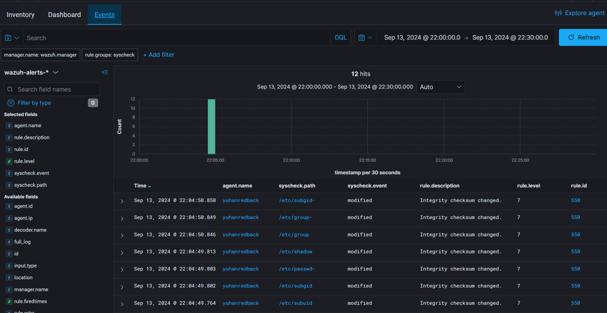

:::important

By **Prabhgun Singh**. **16/09/2024**

:::

# Screenshot of Wazuh

# Use Case: Endpoint Integrity Monitoring for Critical System Files 

# Overview

Monitoring and defending endpoints—such as workstations, servers, and mobile devices—against potential threats is the responsibility of endpoint security. System configuration files are one frequent way that attackers utilize to gain persistence or escalate privileges. It's essential to keep an eye on the integrity of these files to spot changes and stop possible security breaches.
 
# Solution

In this use case, Wazuh’s Syscheck module is configured to monitor critical system files (e.g., /etc/passwd, /etc/shadow, /etc/group). It regularly compares the files' checksums to detect changes. Alerts are generated whenever a file is modified, allowing security teams to investigate whether the changes were authorized or if they could be part of a malicious activity. 

# Steps

File Integrity Monitoring (FIM): The system continuously monitors key files and directories for any changes in content, ownership,or permissions. Examples include /etc/passwd, /etc/shadow, and other sensitive configuration files.

Alerting Mechanism: Upon detecting a change, Wazuh notifies the user and designates a level of severity according to the rule that was triggered (in this example, Rule ID 550 for "Integrity checksum changed"). The agent name, timestamp, file location, and event type (such as modification) are also recorded by the system. 

Security Response: 

1. These notifications are received in real-time by security operations teams, enabling them to promptly look into the source of the changes. 

2. The group will ascertain if the modifications were the consequence of malicious activity (such as an attacker trying to escalate privileges) or lawful actions (such as system updates and configuration changes). 

3. The incident response team can move quickly to detect unauthorized alterations by rolling back changes, isolating the impacted endpoint, and launching a more thorough forensic investigation. 

# Benefits

1. Proactive Threat Detection: Recognizing and reacting to modifications in important documents aids in the early detection of any breaches before they get worse. 

2. Reduced Attack Surface: Stop hackers from altering files that manage system settings or user permissions without authorization. 

3. Enhanced Visibility: The vital components of the endpoint are continuously under observation thanks to real-time monitoring. 

# Potential Risks

1. False Positives: Alert fatigue may result from notifications legitimately triggered by system procedures or updates not adjusted effectively. 

2. Performance Impact: If continuous monitoring is not set up effectively, it can marginally reduce performance on high-traffic endpoints. 

# Conclusion

Utilizing Wazuh's endpoint monitoring features, businesses may obtain vital information about the security stance of their endpoints. This lets businesses identify illegal changes to system files quickly and take corrective action to stop security breaches, which eventually increases the overall effectiveness of their security operations.

