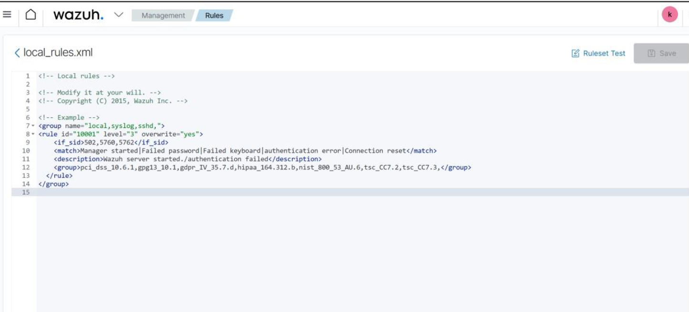
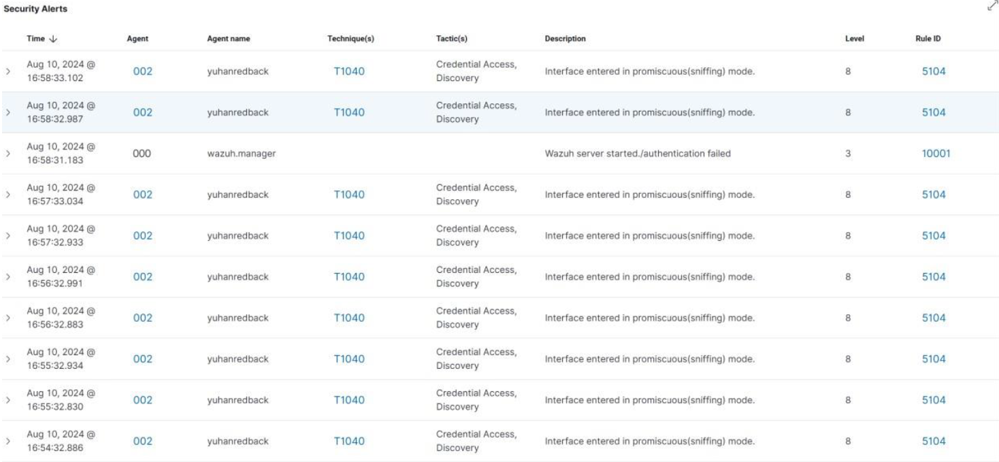
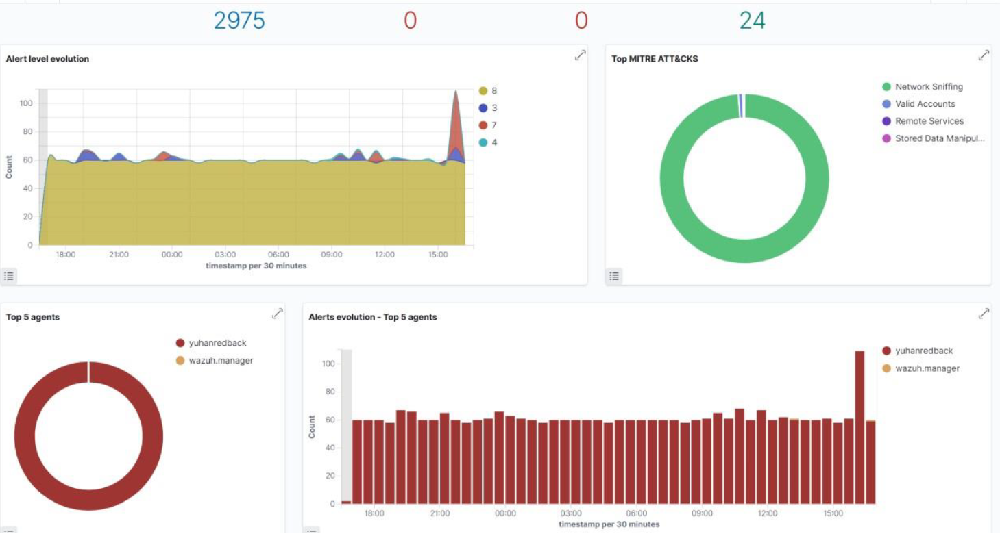

:::important

By **Prabhgun Singh**. **16/09/2024**

:::

# Rules Breakdown:
1. Identification of Rules: The rule with the id="10001" is recognized, and its severity level is set to 3, which denotes a somewhat high severity.

2. Group Details: The rule falls under the category of local_syslog,sshd, which groups it with events related to the SSH daemon and local Syslog.

3. Conditions of Match: Log messages with the following text patterns are matched by the rule: "Manager started," "Failed password," "Failed keyboard," "Authentication error," and "Connection reset." The rule kicks in if any of these keywords show up in the log.

4. Synopsis: Upon activation, the rule produces an alert titled "Wazuh server started/authentication failed," which provides an explanation of the event's potential causes.

5. Compliance Clustering: The regulation is connected to several compliance frameworks, such as NIST, PCI DSS, GDPR, and HIPAA. By recording and reacting to pertinent security occurrences, this aids in upholding adherence to these requirements.

# Screenshot of Wazuh

Made this rule

# Case Study for Security Operations: Monitoring Authentication Failures

It's critical for a Security Operations Center (SOC) to keep a close eye on all system authentication attempts. Rejected login attempts may be a sign of possible security risks like brute force attacks or illegal access attempts.

# Using Wazuh for implementation

You've set up a custom rule on the Wazuh platform to keep an eye on particular kinds of unsuccessful authentication attempts. The rule is intended to identify patterns in log files, such as "Failed password," "Failed keyboard," "Authentication error," and "Connection reset," that may indicate potential authentication problems.

# How Does It Work

1. Event Detection: The rule searches log files continually for the defined patterns. The rule is activated when any of these keywords are found, suggesting a failed attempt at login or a related problem.

2. Notifying and Taking Action:

    • When the rule is activated, an alert is produced with the subject "Wazuh server started/authentication failed".

    • After that, this warning is incorporated into the Security Operations process so that SOC analysts can look into why the authentication attempt failed.

    • Depending on how serious the incident is, an analyst may manually analyze it or automated responses, such banning the source IP, may be started.

3. Reporting and Conformance:

    • The rule also ensures that the SOC is complying with legal requirements in addition to keeping an eye out for potential risks, as it is linked to a number of compliance standards, including PCI DSS, GDPR, and HIPAA.

    • It is possible to create reports that demonstrate compliance with these requirements, which is crucial for audit purposes.

# Outcome

By establishing this rule, the SOC improves the organization's overall security posture by strengthening its capacity to identify and address possible security events involving authentication failures.
