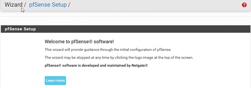

# pFsense Configuration Guide

Research Piece

:::info
**Author:** Kosta Thomson 
:::

## Abstract

In this guide you will be able to set up your own pfsense in a virtual environment. Pfsense is a free to use software that is easy to maintain and most importantly it is secure. This guide will show you how to set up the wizard, configure DHCP, Firewall rules, SSH into your pfsense and IDS/IPS using snort 

### 1. Setup the wizard

When you first enter your pFsense LAN IP address into your browser, you’ll be met with a setup wizard. 

If you logged into pFsense and you didn’t get prompt with a setup wizard, click on **System -> Setup Wizard** and that should start up the setup wizard. 

1. Click on **Next** twice as they are irrelevant. 
2. Step 2 is up to personal preference; you can name your **Domain** and **Hostname** to whatever you want. It is recommended to have a familiar and easy to remember name. For primary and secondary DNS, you can put in popular DNS’s such as Google’s DNS 8.8.8.8. Make sure to uncheck **override DNS**. 
3. pFsense NTP Time Server is completely fine, so leave that as is. Then change the Time zone to wherever you are, for me, I am in Melbourne, so I chose **Australia/Melbourne** as my Time zone. 
4. On step 4, configuring WAN, you will want to leave that as is, since our WAN DHCP will give us IP addresses. 
5. Step 5 is important as the default LAN IP is a popular IP address. It is recommended to change it; I will change mine to 10.32.30.1, you can change it to whatever you like, I’d recommend keeping it as a private address. Keep the subnet mask as 24. 

6. It is highly recommended to change your password to something secure. At least 8 characters in total with upper- and lower-case characters, include numbers and a special character for a secure password. 
7. Now your wizard is complete, all you need to do is click **Reload**. 
8. You will notice that you lost access to your pFsense, that is because you changed your LAN IP. Next you will have to release and renew your DHCP. To do this open your CMD and type in the following commands, **ipconfig /release -> ipconfig /renew**. Then type **ipconfig** to check if the DHCP has successfully renewed a new IP. 
9. Type in your new pFsense LAN IP in your browser and you should be prompted to the login page. 

It is important that your pfsense is up to date, to check for any available updates go to: **System -> Update**. Once you access the update page it will automatically check for any updates. You need to ensure that your pfsense Status states it is up to date 

### 2. Back-up and Restore

When configuring your pfsense you can easily brick or ruin your current configuration. To ensure this doesn’t happen: 

1. click the tab on the top right **Diagnostics -> Backup & Restore**. 
2. Click on the download button for your current configuration as XML and save it locally on your main device that you will access and configure your pfsense. 
3. If you come across a critical error on your pfsense, access your XML file in **Configuration file** option.  
4. Then click **Restore Configuration**. As simple as that, your pfsense is now running correctly. 

Note: Make sure you do this before you make big changes and updates to your pfsense. 

### 3. Configure DHCP

To access your DHCP configuration access **Services -> DHCP Server**  

Once you access your DHCP settings, you will notice an end-of-life service message, to ensure the stability of your pfsense for the foreseeable future you will want to change to the newer version.

Follow the steps shown in the image above, change to **Kea DHCP** and make sure you scroll down to the bottom and click **Save**.   

You can change your IP address range, by default it is set to its maximum, that is fine, you can change that if you like. 

From there your DHCP is set up and ready to go. 

### 4. Firewall configuration 

We will configure a firewall rule to allow port 22 for SSH to the VM. 

1. go to **Firewall -> Rules -> WAN -> Add**
2. Keep action to **pass** 
3. Since this will be SSH the protocol will be **TCP** 
4. You can keep source addresses to any, if you are concerned about security, you can change that to WAN Adress. 
5. Destination address will be the **This firewall (self)**, and the destination port ranges will be from 22 to 22 
6. In extra options it is recommended to add a description for future reference, I added **“Allow SSH”**. You can change the description to whatever you like. 
7. You can now click on save and apply changes. 

### 5. SSH into pfsense 

By default, SSH on pfsense is disabled, you can enable by accessing advanced settings. 

To do this go to **System -> Advanced** 

1. Scroll down to SSH section and enable SSH by ticking **Enable Secure Shell** 
2. Due to security concerns make sure SSHd Key is **Public Key Only**. Keep SSH port at 22. 
3. Now you will need to download putty and puttygen.exe, so you will be able to generate a public and private key. You can download from here: [download here.](https://www.chiark.greenend.org.uk/~sgtatham/putty/latest.html) 
It's simple to install, all you need to download is the 64bit MSI installer and scroll down and download puttygen.exe 64bit 
4. once you have downloaded putty Gen, click on **generate** and move your mouse around the screen to generate a key. 
5. You will then want to save the private key on your PC, it is recommended to you a passphrase. 
6. Copy the public key that’s in the text box. 
7. In your pfsense navigate to **System -> User Manager**. On the right of your user account you will see **Actions** pen, click on that. 
8. Scroll down to the **Keys** section and past in your public key in the text box. Make sure you click on **Save** before exiting. 
9. Open Putty and put in your **LAN IP address** in the session tab and make sure the **Connection Type** is set as **SSH**. 
10. You will then need to navigate in putty: **Connection -> SSH -> Auth -> Credentials to authenticate with -> Then browse and enter your private key file for authentication**. You should then be able to connect to your pfsense via SSH by clicking **Open** 

If everything is correct you should be prompted to login into your pfsense username.

Now you should be in an SSH session for your pfsense. 

### 6. Downloading snort for IDS/IPS 

In this section I will show you how to install snort in pfsense and configure a basic snort rule 

1. navigate to **System -> Package Manager -> Available Packages** and search for **“Snort”** 
2. Select the green install button and click on the confirm button to initialize the install for Snort 
3. Once the installation has been completed, you will be met with a success message. You will now see a new Snort option under the **Services** drop down box. 
4. Once you are in the Snort tab, under **Snort Interfaces** click on the green add button. 
5. This interface will be for the LAN, so change the **Interface** to LAN 
6. Under block settings check the option for **Block Offenders**, keep all the other settings as default. This is an IPS rule since we are preventing pings. 
7. Once all settings have been applied, scroll down to the bottom and click save. 
8. Go back to **Snort Interfaces** under **Snort Status**, click the blue start button to activate and to the right of your new LAN snort rule, and then click on the Pencil under **Actions**. 

9. Go to **LAN Rules**, here we can create simple rules, in this guide I will make an ICMP rule that will be blocking all pings. 
10. Enter this rule in the **Defined Custom Rules** text box: **“reject icmp any any -> any any (msg:”ping blocked”;sid:1000001)“** and click **save**. 
11. Open CMD and ping, I chose to ping my LAN IP of 10.32.30.1 

As shown in the **Blocked** tab we have blocked pings by snort after using ping: 
