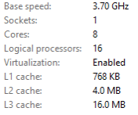

**Last updated by:** KostaThomson, **Last updated on:** 18/08/2024


**Last updated by:** KostaThomson, **Last updated on:** 18/08/2024


# pFsense Install Guide

Research Piece

:::info
**Author:** Kosta Thomson 
:::

## Abstract

This document's goal is to show how to create an effective and secure firewall/router using pFsense in a virtual environment that is useful for various testing purposes. This guide shows how to set up a LAN and WAN network interface, configure pFsense, and how to connect another VM to pFsense LAN. 

### Prerequisites

In order to run a virtual machine, you will first need to enable virtualization. You can see if it's enabled by going to **Task Manager -> Performance -> CPU.** Then at the bottom, check if Virtualization is enabled.



If it's not enabled, you’ll need to go into your BIOS by pressing F12, F10, DEL or ESCAPE during start up. 

Go to the **Advanced tab -> CPU Configuration**, if you are using an Intel CPU enable **Intel Virtualization Technology** and if you are using AMD enable **AMD-V**. Once completed save and exit to restart your PC. 

The minimum hardware specifications for a Windows 10 VM are: 

- A modern x86 Processor 

- No less than 4GB of memory 

- At least 20GB of free storage 

### 1. Download pFsense and VirtualBox

Download pFsense from their [website](https://www.pfsense.org/download/), make sure you down their latest version.
After successfully downloading pFsense 2.7.2 ISO, make sure you extract it using 7Zip.
Then download the latest version of [Oracle VirtualBox](https://www.virtualbox.org/wiki/Downloads), or your choice of VM software of choice. This guide we will be using VirtualBox.

### 2. Creating a New VM 

click on **New** in top right of VirtualBox.


Now configure the following settings in the **create virtual machine** wizard.

Under **Name and Operating System** tab:


1. Give your pFsense VM a name and locate the iso image for pFsense. It may be in your downloads folder if you cannot locate it.
2. Type will be **BSD** and **FreeBSD (64-bit)** as the version.
3. Uncheck **Skip Unattended Installation**


The minimum **hardware** requirements for pFsense:
1. **memory** = 1GB 
2. **processors** = 1CPU
3. **Storage** = 8GB

Recommeded settings:
1. 2GB of memory.
2. One processor is completely fine
3. 15GB of storage will suffice

You can change your hardware settings at a later date, so if you need more processors or memory, you can add more.

Once completed, click on **Finish**

### 3. Configuring the network interfaces 

In the top right click **Settings -> Network**

1. Set Adapter 1 to **NAT**.  This will be your WAN for your internet connection
2. Click Adapter 2, tick **Enable Network Adapter**, in the **Attached To** drop down box select **Internal Network**. This will be your LAN 
3. Click **Ok** to save the settings.


### 4. Installation process for pFsense 

Select pFsense VM and click Start

1. Read carefully and **Accept** the installers copyright notice
2. Select the first option **Install**, highlight **ok** and press enter
3. Select **Auto (ZFS)** highlight **ok** and press enter. 
**Note:** ZFS does tend to take up more memory, and is slightly faster, so if you are running on 	minimum specs, you can choose Auto (UFS), although a power outage can cause corruption 	if you are using UFS. 
4. For Configuration Options page leave the settings as default, highlight **select** and press enter
5. Choose the first option **Stripe**, highlight **ok** and press enter
6. Press spacebar to select your VirtualBox hard disk, highlight **ok** and press enter


7. Select **Yes** and press enter to destroy the current contents on your hard disk, this will start the install process, you wont be able to go back, so make sure all the settings are correct before moving forward.
8. Once the install is completed you will be prompted to reboot. **BEFORE** you do this, you need to unmount your iso for pFsense, if you **fail** to do this you will have to restart to step one. 
9. In the top left click **Device -> Optical Drives -> Select your ISO file for pFsense -> Select Force Unmount -> Now select Reboot in your pFsense VM -> Type Exit**
10. Turn on your pFsense VM, your home page should look similar to this image. 


Note: your **WAN** and **LAN** IP addresses may be different to the image above, that is fine.

### 5. Connecting another windows VM to pFsense

1. Download a Windows 10 VM (or any VM OS of your choice). You can find the ISO [Here](https://developer.microsoft.com/en-us/windows/downloads/virtual-machines/)
2. When creating Widows 10 VM, Type = Microsoft Windows, Version = Windows 10 (64-bit) 
3. Recommended requirements for windows 10 VM: 
- Memory = 4GB 
- Processors = 2 CPUs 
- Storage = 20GB 
4. Once you downloaded windows 10 VM select the Settings option then go to the Network panel. Select the **Settings option -> Network**
5. Change Adapter 1 to **Internal Network** so your vm can connect to your Lan
6. Turn on your Windows 10 VM, select **Yes** to network discoverability.


If done correctly your pFsense network will be automatically connected. If you do not have network discoverability on, you can navigate to **Control Panel -> Network and Internet -> Network and Sharing Center -> Advanced Sharing Setting** Then turn on Network Discovery. 

7. Type your pFsense LAN IP address into your browser. If all steps are done correctly, you should see this in your browser.


- Username: admin
- Password: pfsense

Now you have successfully installed pFsense to your virtual network.

### 6. Troubleshooting

If you have issues with installing pFsense iso due to Negate, you can also install the latest version without NetGate from here: 
[Link](https://repo.ialab.dsu.edu/pfsense/)

If you get this error at part 4 step 8, click **Machine -> Reset**
```
vm_fault: page read error, pid 1 (init)
vm_fault: page read error, pid 1 (init)
vm_fault: page read error, pid 1 (init)
vm_fault: page read error, pid 1 (init)
```

If you are facing other issues that are not here, you can find more troubleshooting guides using NetGate Docs:
[Netgate Docs](https://docs.netgate.com/pfsense/en/latest/troubleshooting/index.html) 