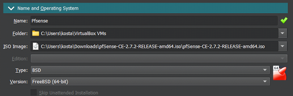
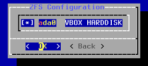
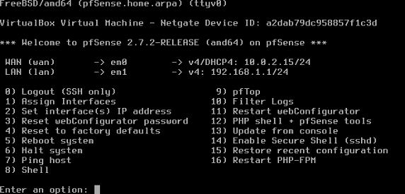
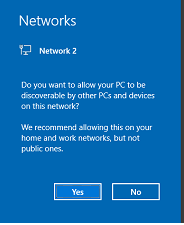

# pFsense Install Guide

Research Piece

:::info
**Author:** Kosta Thomson 
:::

## Abstract

This documents goal is to show how to create an effective and secure firewall/router using pFsense in a virtual environment that is useful for a various of testing purposes. Shoes How to set up a LAN and WAN interface,how to connect another VM to pFsense and troubleshooting.

### 1. Download pFsense and VirtualBox

Download pFsense from their [website](https://www.pfsense.org/download/), make sure you down their latest version.
After successfully downloading pFsense 2.7.2 ISO, make sure you extract it using 7Zip.
Then download the latest version of [Oracle VirtualBox](https://www.virtualbox.org/wiki/Downloads), or your choice of VM software of choice. This guide we will be using VirtualBox.

### 2. New VM 

click on **New** in top right of VirtualBox.


Now configure the following settings in the **create virtual machine** wizard.

Under **Name and Operating System** tab:



1. Give your pFsense VM a name and locate the iso image for pFsense. It may be in your downloads folder if you cannot locate it.
2. Type will be **BSD** and **FreeBSD (64-bit)** as the version.
3. Uncheck **Skip Unattended Installation**


The minimum **hardware** requirements for pFsense:
1. **memory** = 1GB 
2. **Proccesors** = 1CPU
3. **Storage** = 8GB

Once completed, click on **Finish**

### 3. Configure the network interface

In the top right click **Settings -> Network**

1. Set Adapter 1 to **NAT**.  This will be your WAN for your internet connection
2. Click Adapter 2, tick **Enable Network Adapter**, in the **Attached To** drop down box select **Internal Network**. This will be your LAN 
3. Click **Ok** to save the settings.


### 4. Install process for pFsense 

Select pFsense VM and click Start

1. **Accept** the installers copyright notice
2. Select the first option **Install**, highlight **ok** and press enter
3. Select **Auto (ZFS)** highlight **ok** and press enter
4. For Configuration Options page leave the settings as default, highlight **select** and press enter
5. Choose the first option **Stripe**, highlight **ok** and press enter
6. Press spacebar to select your VirtualBox hard disk, highlight **ok** and press enter



7. Select **Yes** and press enter to destroy the current contents on your hard disk, this will start the install process.
8. Once the install is completed you will be prompted to reboot. **BEFORE** you do this, you need to unmount your iso for pFsense, if you **fail** to do this you will have to restart to step one. 
9. In the top left click **Device -> Optical Drives -> Select your ISO file for pFsense -> Select Force Unmount -> Now select Reboot in your pFsense VM -> Type Exit**
10. Turn on your pFsense VM, your home page should look similar to this image. 



Note: your **WAN** and **LAN** IP addresses may be different to the image above, that is fine.

### 5. Connect another windows VM to pFsense

1. Download a windows 10 VM (or any VM OS of your choice)
2. Select the **Settings option -> Network**
3. Change Adapter 1 to **Internal Network** so your vm can connect to your Lan
4. Turn on your windows 10 VM, select **Yes** to network discoverability.



If done correctly your pFsense router will be automatically connected and should have internet access.
5. Type your pFsense LAN IP address into your browser. If all steps are done correctly, you should see this in your browser.


- username: admin
- password: pfsense

Now you have successfully installed pFsense to your virtual network.

### 6. Troubleshooting

If you have issues with installing pFsense iso due to Negate, you can also install the latest iso version from here:
[Link](https://repo.ialab.dsu.edu/pfsense/)

If you get this error at part 4 step 8, click **Machine -> Reset**
```
vm_fault: page read error, pid 1 (init)
vm_fault: page read error, pid 1 (init)
vm_fault: page read error, pid 1 (init)
vm_fault: page read error, pid 1 (init)
```
