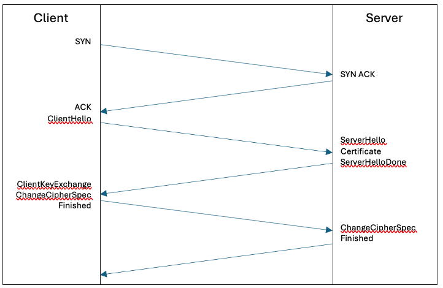
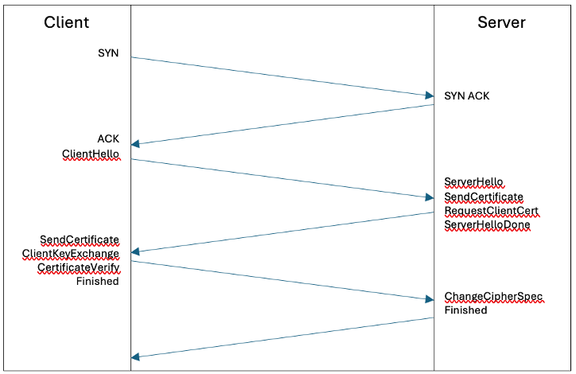
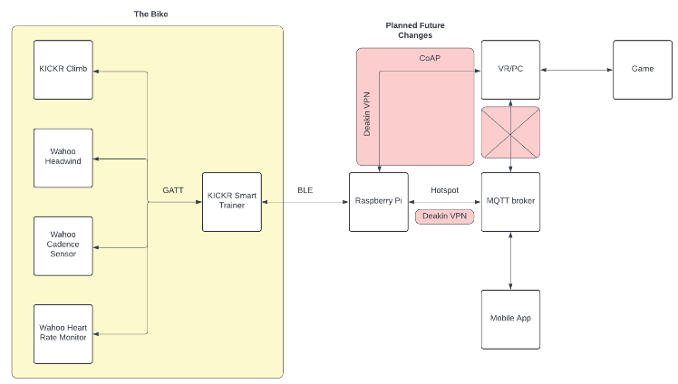
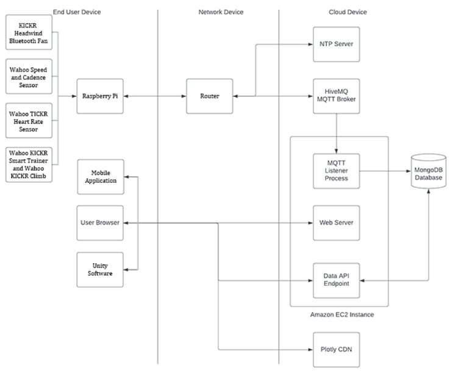
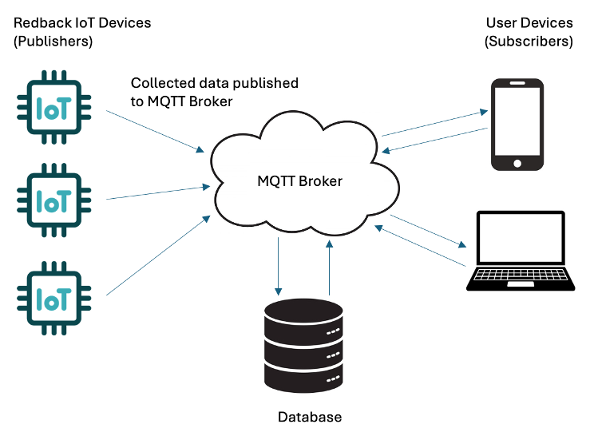
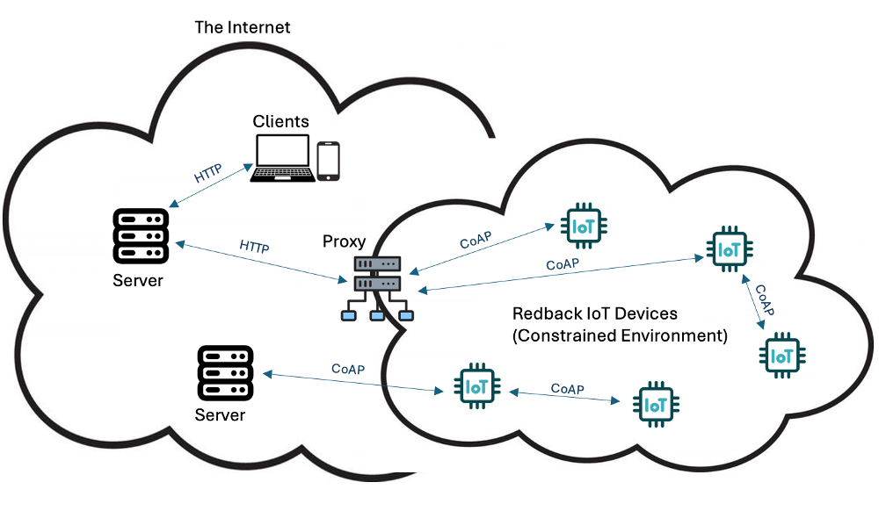
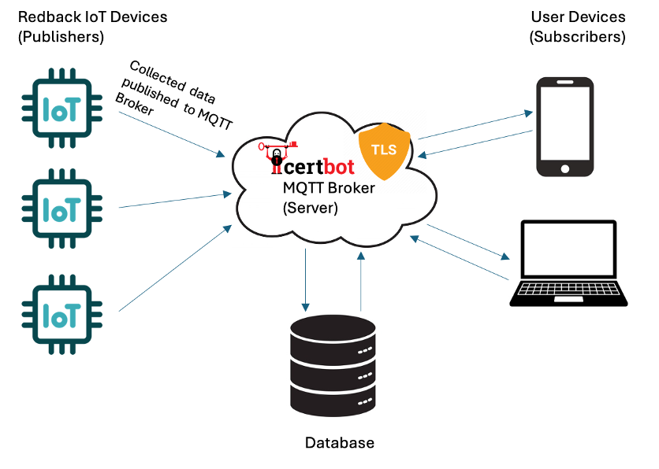
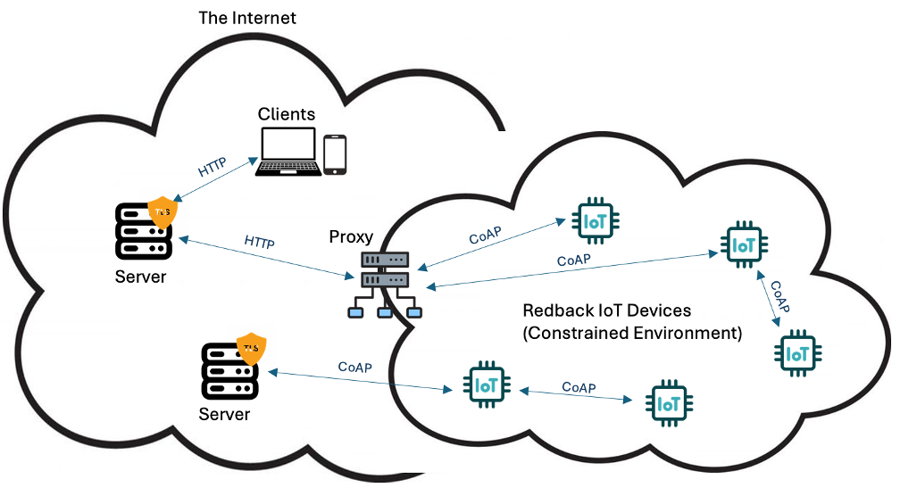

# **TLS Solution for MQTT and CoAP Protocols**

# Business and Implementation Plan

By Candice Smith 220484184, 25/07/2024

## Introduction

Redback Operations is dedicated to revolutionizing the fitness
experience by developing state-of-the-art connected fitness devices that
not only enhance the enjoyment of physical activity but also its
effectiveness. These devices are designed to transmit information
regarding the identity, behaviours and health of its users, data
outlined by the Redback Operations Security Guidelines as being
sensitive information, protected by the Privacy Act 1988 ("Privacy
Act"). For this reason, ensuring that communication is secure is of
foremost importance. With this report we seek to outline the current
state of security for data in transit from Redback Operations devices
utilising either the MQTT or CoAP protocols. We seek to outline
associated risk and propose an implementation plan for a solution that
will enhance the security posture across all associated devices.

### 

### Definitions

  |Term                    |Definition
  |------------------------|--------------------------------------------|
  |CoAP                    | Constrained Application Protocol -- UDP based internet application protocol for constrained devices.|
  |Data Lakehouse          |Database architecture that combines data lake and data warehouse benefits, by introducing table metadata to files in object storage.|
  |ECDSA Certificate       |Elliptic Curve Digital Signature Algorithm|
  |Encryption              |The process of converting plain, readable text to unreadable ciphertext to protect data.|
  |MQTT                    |Message Queuing Telemetry Transport -- common protocol used with IoT devices.|
  |Security Posture        |An organisation's strength and resilience in relation to predicting, preventing, and responding to cyber threats.|
  |TLS                     |Transport Layer Security    |
  |UDP                     |User Datagram Protocol      |
  -----------------------------------------------------------------------

### TLS Solution

TLS is a cryptographic protocol that works by setting up a secure
connection through a process called the TLS Handshake. This is performed
between a client and server and allows them to communicate in a secure
way that ensures data is protected by encryption from eavesdropping,
manipulation, and other attacks by providing confidentiality,
authenticity, and integrity. During the TLS Handshake a client initiates
a request known as the 'Hello' message to a server and the server then
responds with it's 'Hello' message. Once this connection is established
an authentication check is done to ensure that the server houses a valid
digital certificate including a private key. If there is no active valid
certificate installed, it has expired, or it has been revoked, the TLS
Handshake will fail, and a connection will not be established. If an
active certificate is present, the client and server complete the TLS
handshake, the server's identity is authenticated, and an encrypted
session is established. The client and server can then communicate
securely with all data encrypted by the session keys.



Mutual TLS, or mTLS as it is known, uses the same technology as TLS but
instead of having a certificate installed only on the server side, it
requires a second certificate to be installed on the client side. The
TLS process operates in the same way as above but allows for the
identity of the server and the client, such as IoT devices to be
authenticated. MTLS offers a much higher level of assurance and risk
mitigation of data breach than regular TLS due to the additional
authentication but is a more complex solution to implement. It should be
considered in future due to the data being transmitted and associated
privacy responsibilities, but this is currently out of scope for the
initial Proof of Concept and Implementation.



### Application of TLS Solution

TLS can be applied to a vast array of use cases, including, but not
limited to securing websites, securing IoT communication and
connections, email security, API security, VPN connection, FTP file
transfers, secure software update downloads, cloud services,
authentication via OIDC or similar and secure payments. Given the nature
of the information being captured and communicated throughout the
Redback Operations environment but internal and external, having
encryption and authentication in place to protect that data is a
critical, proactive measure that can be taken to secure that data.

While this implementation focuses on securing MQTT and CoAP
communications there are likely many additional use cases that can be
uncovered for the application of TLS in a very similar way, utilising
the Let's Encrypt and Certbot combination. This can be used for the
mobile app that is being developed, for the company website, for any
APIs that are to be utilized, for the database server, as just a start.
This planning document serves as the framework and guidelines for any
future application of TLS in the Redback Organisation.

## Current State

### Overview

Redback Operations have implemented a messaging protocol allowing their
devices to feed data to a central database where it can be processed to
provide value to users in diverse ways. The currently utilized protocol
is MQTT, which is a lightweight protocol that is scalable and reliable
and a common way to connect IoT devices over the internet. There is a
current review assessing the viability of CoAP as an alternative
protocol allowing an even more lightweight solution improving speed of
processing, though there is not a current implementation for this
protocol. Redback Operations Project 1 has plans to switch to CoAP later
this semester from the current MQTT communications.

Currently MQTT is used throughout the organisation in several ways.
Project 1 is using MQTT to communicate between a Raspberry Pi attached
to their smart bike, their VR game and are working toward communicating
with their mobile app. They are using a HiveMQ broker but have access
issues, and are looking into using data warehousing\'s VM\'s MQTT broker
which relies on Mosquitto. Project 4 -- Orion previously undertook an
assessment of various MQTT Servers, or Brokers, and identified the
recommended services to be provided by HiveMQ. This was followed by an
Implementation Plan and subsequent implementation of HiveMQ as the
broker for Project 1. The focus for this team was deployment of a
functional solution for the transmission of data collected by the
Redback devices, and sent back to a central database, currently Mongo DB
is utilized by some project teams, with a proposal to adopt Dremio as a
Data Lakehouse. Here is an overview of current Project 1 related
architecture:



Overview of broader proposed architecture including additional provision
of services such as web server, API and NTP server:



It has been recognized that the data Redback Operations is handling
requires protection as it is sensitive and protected by the Privacy Act.
Redback Operations is responsible for ensuring health, personal and
biometric data collected or transmitted by our devices is protected from
data leakage or breach.

### Current Architecture

**MQTT Architecture**



Central to an MQTT architecture is the MQTT Broker. There are several
MQTT Brokers available for implementation, Redback Operations currently
utilise two solutions, HiveMQ, and Mosquitto. The current HiveMQ broker
is hosted as a serverless cloud service offering usage limited to 100
free connections, 10GB data traffic per month, MQTT versions 3.1, 3.1.1,
5.0, WebSocket support, basic authorization rules and most relevant to
this report is the included MQTT over TLS/SSL offering. Some of risks
associated with this broker are that it includes basic authorization
rules, but does not offer any opportunity to configure the broker as a
developer, and there is an elevated risk with this being a shared MQTT
platform. This may mean it carries a higher risk of unauthorized access
or data breach. The limit of 100 connections presents an issue with
scalability, particularly if this is utilized as a companywide service
connecting with all devices utilising MQTT. HiveMQ identify this service
as being suitable only for basic MQTT learning and experimenting and the
application of this in Redback long term will likely not be suitable.
Finally uptime may be an issue as there are no uptime SLAs for this
solution.

The Moscquitto MQTT Broker is hosted within the on-premise
infrastructure for Redback Operations on a virtual machine that can be
accessed via SSH. This service will offer greater configuration
opportunity, greater control, and greater scalability. If managed well
it may offer greater reliability than the free cloud based HiveMQ broker
and it is possible for this broker to be deployed at scale as it
supports thousands of connections well, not millions though, which
should not be an issue for the scale of the Redback organisation.
Mosquitto offers the ability to integrate with Mongo DB which is
potentially a critical requirement of the Redback Operations
environment.

All other components of the MQTT architecture, called clients, connect
to the MQTT Broker and act as a publisher or subscriber. IoT Devices
that include sensors and other technologies used for gathering data
typically act as publishers, feeding data to the Broker to distribute to
other clients in the network. These other clients subscribe to receive
data from the broker based on categorisation called topics. When
publishers send their data to the Broker it is labelled with a topic,
that information is then distributed only to the devices that subscribe
to the associated topic.

**CoAP Architecture (proposed only)**



CoAP is a protocol
that has many similarities to HTTP, which makes it easy to implement for
developers with an existing understanding of HTTP. Like HTTP, CoAP
operates on a request-response communication model where a client sends
a CoAP request to a server and the server responds with the requested
data using GET, PUT, POST and DELETE methods. CoAP is suitable for both
device-to-server communication and machine-to-machine communication, and
it uses UDP which is a connectionless protocol rendering the solution
lighter than MQTT. One compromise with CoAP is that it does not
guarantee reliability by default, but requires a selection from
confirmable, non-confirmable and acknowledgement.

### Current Policies

There are currently several policies in place that require review to
assess whether the MQTT TLS solution should be included:

-   Cyber Security Guidelines: Project 1

-   Cyber Security Guidelines: Project 3 -- Wearable Technologies for
    Elderly People

-   Cyber Security Guidelines: Project 7 -- Smart Bike Project

-   Cryptography Policy

-   Endpoint Security Policy

-   External Attack Surface Management Policy

-   Server Security Policy

### Risks - MQTT

The number of known vulnerabilities with MQTT are growing year on year
with 23 known vulnerabilities in 2020, and 33 being recorded in 2021
with 18 of those being listed as critical vulnerabilities. Many of these
are still not patched today. Some examples are:

-   Use of insecure default configurations designed to prioritize ease
    of use over security.

-   In Eclipse Mosquitto to version 2.0.5, establishing a connection to
    the Mosquitto server without sending data triggers a process
    resulting in excessive CPU consumption. This could be used by a
    malicious actor to perform a denial-of-service type attack.

-   Remote code execution attacks can be caused by buffer overflow
    vulnerabilities allowing bad actors to inject and execute malicious
    code on IoT devices.

Aside from the above vulnerabilities with MQTT, which can mostly be
mitigated by ensuring the most recent updates and patches are applied,
the key issue with the deployment of MQTT within the Redback
Operations environment is that it is not currently secured using a TLS
solution. This is an optional feature of an MQTT configuration and
without TLS applied all data is transmitted in plain text meaning it
is vulnerable to data leak or data breach.

### Risks - CoAP

There are some good benefits of using CoAP -- it is a lightweight
protocol, often preferred for gathering telemetry data. Like devices
using MQTT, devices using CoAP are often reachable via public facing
IP addresses accessible from the internet. This creates insecure end
points where data can leak, DDoS attacks can be carried out, and
access can be exploited.

Unlike the MQTT protocol, CoAP incorporates DTLS, which is based on
the TLS protocol. The difference being DTLS uses UDP, which is the
transport layer CoAP uses. Like TLS, DTLS will provide encryption, but
also makes sure that the content cannot be altered by third parties
along the network path. DTLS requires a valid EDCSA certificate with a
preference to have been issued by a trusted CA to avoid the issues and
vulnerabilities that go along with self-signed certificates.

## Proposed Future State

### Overview

Both the MQTT and CoAP require a TLS x.509 certificate to ensure the
data being transmitted is encrypted and not delivered in plain text. The
solution proposed will enable TLS for the current MQTT related
architecture and outlines the application of TLS for a suggested
application of CoAP.

### Architecture - MQTT



To implement a TLS solution for an MQTT architecture we need to install
a certificate on the MQTT Broker. We have reviewed the use of Let's
Encrypt certificates and have identified them as being a feasible
solution in conjunction with Certbot to manage the renewal of those
certificates every 90 days. It is possible to implement mTLS by adding
certificates to the clients as well as the server, but this is optional.
It is also possible to use self-signed certificates to establish this
connection, but that requires the root certificate to be installed on
all clients to establish and maintain trust. Once the certificates are
installed, configuration must occur on both the client and broker side
to facilitate the secured connection TLS offers.

### MQTT Server TLS Implementation

*Please refer to PoC Retrospective document for validated process

1.  Connect to the Redback Ops server containing the MQTT Broker
    (Mosquitto) via SSH.

2.  Check Mosquitto is installed and running by entering the following
    command:

    ```
    sudo systemctl status mosquitto
    ```

3.  Ensure Certbot is not already installed -- the expected return is
    nothing:

    ```
    which certbot
    ```

4.  Install Certbot, commands are dependent on OS:

    ```
    sudo apt update
    
    sudo apt install certbot
    ```

    Additional details can be found here: <https://certbot.eff.org/instructions>

5.  Ensure you have a domain associated with your server IP, for this
    instructional we'll refer to it as mqttserver.domain.com

6.  Prove domain control and obtain a certificate:

    ```
    sudo certbot certonly \--standalone -d mqttserver.domain.com
    ```

7.  You should now be able to locate the certificate files in
    /etc/letsencrypt/live/yourdomain.com/.

8.  Locate files: fullchain.pem (cert file), and privkey.pem (private
    key)

9.  Copy Mosquitto config file -- usually found at
    '/etc/mosquitto/mosquitto.conf' rename copy as
    '/etc/mosquitto/tlsconf.d/'.

10. Add the following code to enable TLS:

    ```
    listener 8883
    cafile /etc/letsencrypt/live/mqttserver.domain.com/chain.pem
    certfile /etc/letsencrypt/live/mqttserver.domain.com/fullchain.pem
    keyfile /etc/letsencrypt/live/mqttserver.domain.com/privkey.pem
    tls_version tlsv1.2
    ```

-   listener 8883 specifies the port for TLS connections (default is
    8883 for TLS).

-   cafile points to the CA certificate file (part of the Let\'s Encrypt
    chain).

-   certfile points to your server certificate.

-   keyfile points to your private key.

-   tls_version specifies the minimum TLS version to use.

11. Restart Mosquitto to apply the config changes:

    ```
    sudo systemctl restart mosquitto
    ```

12. Verify config by testing with MQTT Clients

    ```
    mosquitto_sub -h mqttserver.domain.com -p 8883 -t test/topic \--cafile
    /etc/letsencrypt/live/mqttserver.domain.com/chain.pem
    ```

    **\*You may need to adjust the port -- please review**

13. In the case a client fails to connect, check Mosquitto logs for
    errors.

    ```
    sudo journalctl -u mosquitto
    ```

14. Once TLS secured connection is active, automate certificate renewal.

15. Check to see if Certbot has a cron job or systemd timer set up
    correctly:

    ```
    sudo systemctl list-timers
    ```

    \*You are looking for "certbot.timer".

16. Reload Mosquitto config after successful renewal:

    ```
    sudo nano /etc/letsencrypt/renewal-hooks/post/reload-mosquitto.sh
    #!/bin/bash
    systemctl reload mosquitto
    sudo chmod +x /etc/letsencrypt/renewal-hooks/post/reload-mosquitto.sh
    ```

### Raspberry Pi TLS Implementation for mTLS option

For reference if an mTLS solution is required in future. Below process
will need to be tested and validated.

1.  Start by ensuring system is updated:

    ```
    sudo apt update
    sudo apt upgrade
    ```

2.  Install Certbot, this is the command for all OS except Apache:

    ```
    sudo apt intall certbot
    ```

3.  Ensure you have a valid domain name pointing at your IP, and that
    port 80 and port 443 are not blocked. If you are using Cloudflare
    DNS services have the DNS set to bypass proxy servers. Ensure port
    80 is also forwarded.

4.  Let's assume we are not running Apache, we now need to grab a Let's
    Encrypt cert using the built in standalone python server:

    ```
    sudo certbot certonly \--standalone -d devicedomain.com -d www.devicedomain.com
    ```

5.  Enter required detail for Let's Encrypt as prompted. Certificate
    should then be issued. If you experience issues double check
    settings in question 3 and try again.

6.  Certificates should now be stored at
    /etc/letsencrypt/live/devicedomain.com/

7.  Installing the certificate (this is a NGINX guide, you may need to
    redefine for other OS), start by opening NGINX config file:

    /etc/nginx/ or /etc/nginx/sites-available/

8.  Open file in text editor and look for a block as follows:

    ```
    server
    {
        listen 80 default_server;
        listen \[::\]:80 default_server;
        root /usr/share/nginx/html;
        index index.html index.htm;
        server_name devicedomain.com;
        location / 
        {
            try_files \$uri \$uri/ =404;
        }
    }
    ```

9.  In this code block, find:

    ```
    listen \[::\]:80 default_server
    ```

10. Below this line we will need to add an additional command to
    instruct NGINX to listen on port 443, which is the port that handles
    HTTPS/SSL traffic and web browser connections:

    ```
    listen 443 ssl;
    ```

11. Find:

    ```
    server_name example.com;
    ```

12. Below this add:

    ```
    ssl_certificate /etc/letsencrypt/live/devicedomain.com/fullchain.pem;
    ssl_certificate_key /etc/letsencrypt/live/devicedomain.com/privkey.pem;
    ```

13. NGINX now knows how to locate the certificate files for the TLS
    Handshake, and decryption.

### Architecture - CoAP



In the
case of CoAP we need to issue and install ECDSA certificates onto the
CoAP server(s). As we are using DTLS, rather than TLS, we need to
convert the certificate files from .pem to PKCS12 format for them to be
usable in this context. We then configure the CoAP server -- these are
most commonly Eclipe Californium or libcoap based -- and set up the
KeyStore and TrustStore. As in the case of MQTT, if you choose to
implement mutual authentication, certificates can be installed on
clients, but this is not essential.

### CoAP Implementation

1.  Set up CoAP server within the on-premises, or cloud environment, and
    ensure it has an associated domain that we can prove control of.

2.  Install Certbot -- this is dependent on which OS you are utilising,
    command line instructions can be found here:
    <https://certbot.eff.org/instructions> . An example of this is:

    ```
    sudo apt-get update
    sudo apt-get install certbot
    ```

3.  Prove domain control (coapserver.domain.com) and obtain an ECDSA
    certificate:

    ```
    sudo certbot certonly --standalone --preferred-challenges http --key-type ecdsa -d coapserver.domain.com
    ```

4.  You should now be able to locate the certificate files in
    /etc/letsencrypt/live/coapserver.domain.com/.

5.  Locate files: fullchain.pem (cert file), and privkey.pem (private
    key)

6.  Because we are using DTLS, not TLS we need to convert the .pem files
    to PKCS12 format

    ```
    openssl pkcs12 -export -in /etc/letsencrypt/live/coapserver.domain.com/fullchain.pem -inkey /etc/letsencrypt/live/coapserver.domain.com/privkey.pem -out coap-server.p12 -name "coap-server"
    ```

7.  You may need to extract key and certificate from the P12 file:

    ```
    openssl pkcs12 -in coap-server.p12 -nocerts -out coap-server.key -nodes
    openssl pkcs12 -in coap-server.p12 -clcerts -nokeys -out coap-server.crt
    ```

8.  Next you will need to configure your CoAP server with DTLS -- the
    commands will depend on your chosen CoAP implementation. A popular
    option is libcoap where you would perform the following commands:

    Install libcoap:

    ```
    sudo apt install libcoap2 libcoap-dev
    ```

    Configure DTLS on your CoAP server:

    ```
    TBC - CoAP server must be identified
    ```

9.  Ensure CoAP server is running and configured with DTLS.

10. Test using CoAP Client library:

    ```
    coap-client -m get -u "your-username" -k "your-password" coaps://coapserver.domain.com/resource
    ```

### Risk Mitigation and Best Practice

There are several actions we can take to mitigate risk and apply best
practice. These include:

Enabling encryption of data transmitted using MQTT connections through
Transport Layer Security (TLS) ensures confidentiality and integrity.

Ensure you regularly check for and apply any updates and patches
released by your MQTT software vendor. You may need to update your
broker, clients and libraries to ensure you are addressing
vulnerabilities as they are discovered.

Monitoring and intrusion detection practices are critical in both MQTT
and CoAP environments to identify and respond to suspicious activity on
either network.

In a CoAP based environment ensure both DTLS and ECDSA are utilised. The
combination of the two will provide the best security and the best
performance.

Key rotation is important in both MQTT and CoAP. The shorter the life of
your keys the more secure your environment is, as any vulnerability
relating directly to the key in use is mitigated by rotating to the new
key. It means there is only a limited time attackers have to 'break'
your cryptographic key and assume control of your data and systems. With
Let's Encrypt, certificates have a maximum lifespan of 90 days, and they
are rotated automatically with the use of Certbot.

Key Storage is also very important and in the case of any key and secret
storage, these assets are best held within an HSM, whether it be
hardware or software based.

### Feasibility Assessment

**Technical Feasibility**

Certificate Issuance and Management

By using a combination of Let's Encrypt and Certbot certificates can be
successfully issued and installed in both the MQTT and CoAP use cases.
Certbot ensures that certificates are rotated as required to provide
continuity of valid certificates on the server or device we are
protecting.

Certificate Details

The certificates issued by Let's Encrypt are in .pem format. This format
is suitable for MQTT but not for CoAP. However, CoAP can utilise a .p12
certificate file which can be derived from converting a .pem file into
this format. CoAP also requires the use of an ECDSA based certificate
which utilises an Eliptic Curve based algorithm for encryption. In this
way we can cover both use cases successfully.

MQTT Broker Configuration

Redback Operations use both Mosquitto and HiveMQ Brokers, and both of
these options do support TLS.

**Financial Feasibility**

The above solutions are all free of charge, so pose a feasible option
from a financial perspective. The components are Certbot to handle
certificate automation, and Let's Encrypt to issue free digital
certificates. These tools are presented with a recommendation to utilize
a Mosquitto MQTT broker which is also free of charge.

**Operational Feasibility**

The proposed solution is relatively simple to deploy and incorporate
into operational process as a standard across the organization. It can
be incorporated into the management and associated development of
Redback Operations end points and does not add great complexity to
current processes. The benefit of standardizing the use of this TLS
solution for MQTT and CoAP is that it greatly reduces risk of data
compromise and improves the overall security posture of the
organization. This is a lightweight solution that should not jeopardise
performance or scalability of Redback Operations product offering.

**Security Feasibility**

The addition of TLS for MQTT and DTLS for CoAP will each add great
security benefit as it results in encrypted data hidden from attackers
or eavesdroppers within the Redback environment. It also protects data
from being tampered with. The other benefit for these solutions is
authentication. These security protocols allow a process of
authenticating a server to a client to ensure they are communicating
with the legitimate machine.

### Change Management

**Planning**:
-   Define objectives and scope.
-   Define current state.
-   Define proposed future state.
-   Assess current knowledge and skill level for this solution.
-   Engage current stakeholders including developers of IoT and other
    appliance code, owners of end points including authority for current
    MQTT infrastructure, Project Team Leaders, Organisation Leaders.

**Design and Configuration**:
-   Design TLS for MQTT solution, configuration, and security policies.
-   Design DTLS for CoAP solution, configuration, and security policies.
-   Record all planning and design content within Business and
    Implementation Plan Document.

**Pilot Implementation**:
-   Set up and configure TLS certificates and MQTT brokers and clients for
    single use case.
-   Set up and configure DTLS certificates and CoAP brokers and clients for
    single use case if available.

**Testing and Validation**:
-   Validate and record step-by-step guide for use as an enablement tool.
-   Perform functional, security, and performance testing.
-   Optimize configurations as needed.

**Org-wide Deployment**:
-   Ensure enablement materials are in place prior to broader deployment.
-   Map additional use cases and applicable projects.
-   Plan and execute deployment of solution to wider organisation.

**Post-Deployment**:
-   Monitor, maintain, and manage certificates.
-   Update documentation and provide training.
-   Review and implement improvements.
