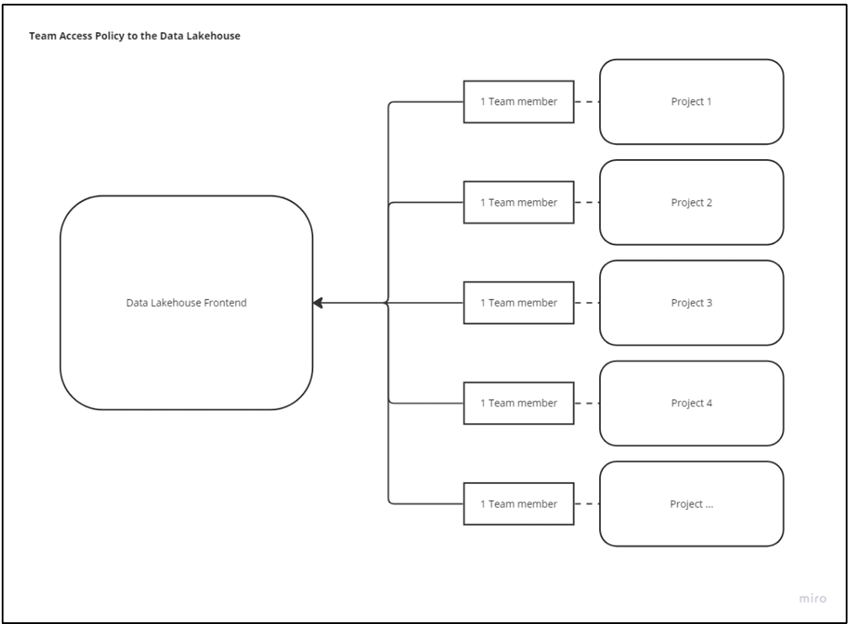
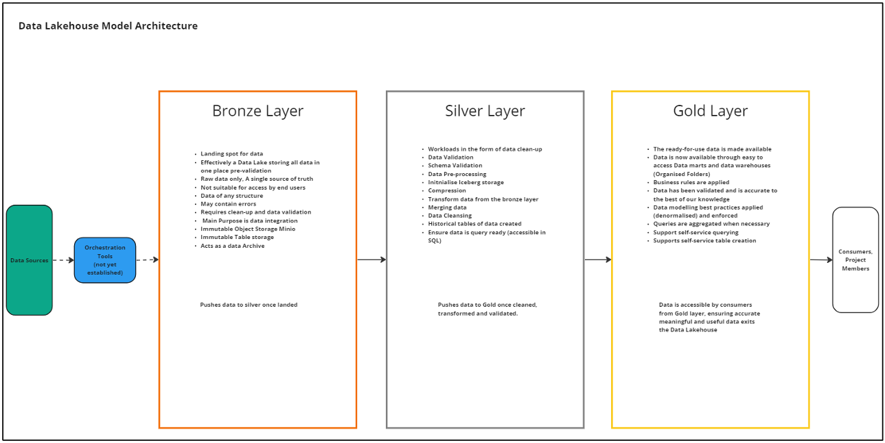
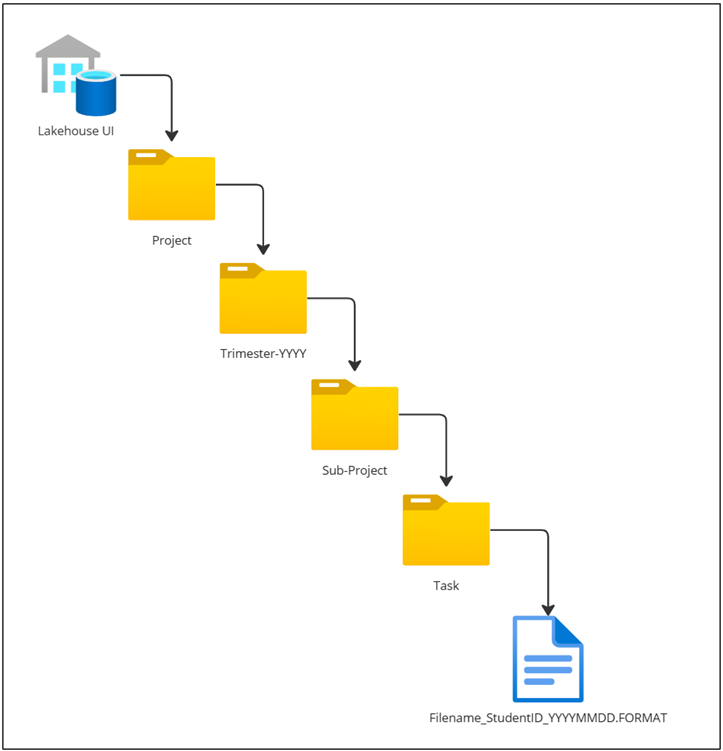
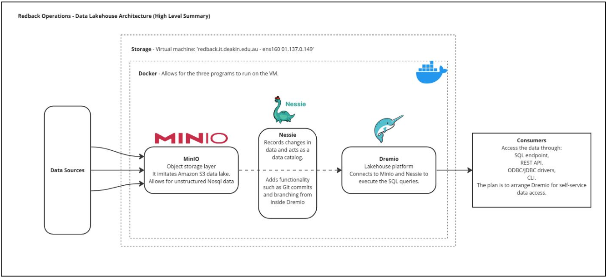
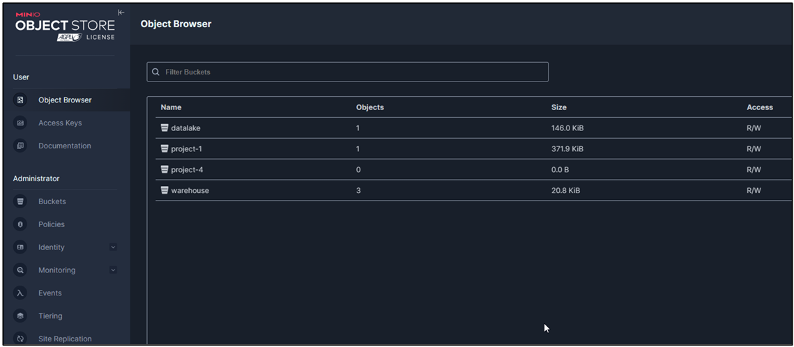
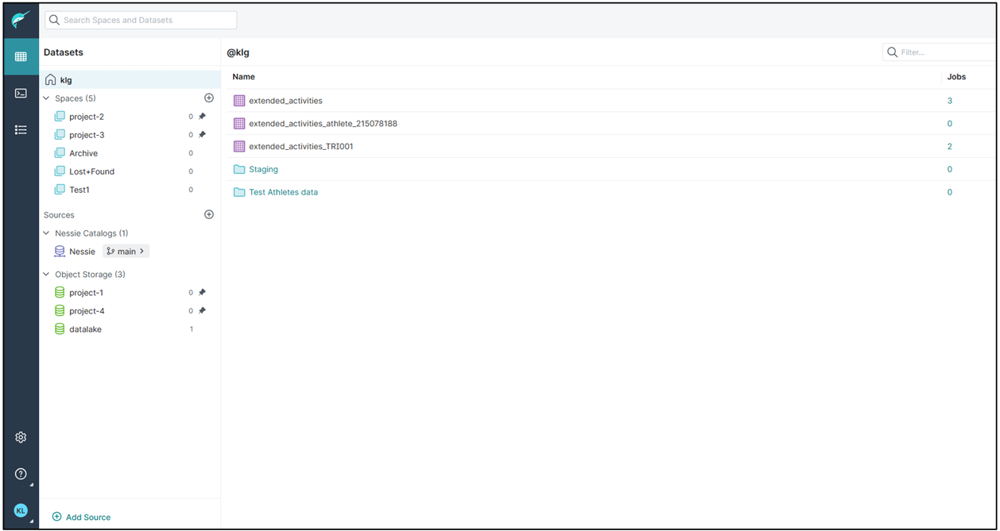

#  Data Architecture

:::info
**Document Creation:** 19 May, 2024. **Last Edited:** 19 May, 2024. **Authors:** Kaleb, kghdxx.
   **Document Code:** ARC1. **Effective Date:** 19 May, 2024. **Expiry Date:** 19 May, 2025.
:::

## Background 

At the end of trimester 3 2023, Reback operations was operating without a data warehouse, the 
company members were making do with what was available and performing research against 
alternative storage methods with limited success. Trimester 1 2024 began with the first 
companywide requirements gathering in an effort to match a potential data warehouse solution 
correctly with the needs of the company. This process involved interviews with company 
leaders and a survey for company members, resulting in an accurate list of requirements and a 
plan for the implementation of a data warehouse solution. Following the requirements gathering 
activities an accompanying options paper was prepared, as well as a strategy for 
implementation as well as a change in direction, this change was to explore the deployment of a 
Data Lakehouse solution.  

This decision was presented and discussed and ultimately accepted during Tri 1 2024 panel 
meetings and has the endorsement of the company leaders and Director. 

This document has two purposes; to explain the architecture of the data Lakehouse and how to 
use/access data in the data Lakehouse. 

Selecting the Data Lakehouse platform and associated tools required an extensive decision
making process to ensure that the most appropriate supporting technologies were chosen for 
the data Lakehouse tool. As a result of this Dremio was chosen as the Data Lakehouse 
platform. 

## Data Lakehouse Decision 

Considering multiple options, given the requirements outlined Dremio has been selected as most 
appropriate option. Dremio was selected as the Data Lakehouse platform given it meets individual team 
requirements and can also incorporate the Deakin virtual machine as a storage layer.  

With the combination of other tools Dremio can operate on top of and query data from the VM’s storage. 
This is critical because in the absence of a cloud storage budget all software and storage is effectively 
required to integrate with the VM as a data source to be considered viable. Unfortunately, this disqualified 
IOmete (a cloud alternative to Dremio) and other cloud-only operating systems for this Trimesters Data 
Lakehouse decision, when in the event of a cloud storage layer option there was a potential advantages 
for these platforms as a use-case.  

With the requirements given careful thought we can move onto how to access the Data Lakehouse. 

## How to use the Data Lakehouse 

Firstly, to enter data into the data Lakehouse an admin of the Lakehouse (someone from the data 
warehouse team) needs to set up a Dremio account on your behalf.  

This effectively gives you access to the Lakehouse, with a user account and password. 

To keep the data Lakehouse from becoming a data swamp it’s important to have tight governance on how 
data is stored on the Lakehouse. 

It’s proposed that the best practice for redback is to have one user who contributes data to the Lakehouse 
per team unless required so the overarching data warehouse administration can keep track of data 
ownership. 

#### For users with access to the data Lakehouse 
There are two forms of data storage: 
1. Structured data, (csv’s flat files) 
2. Unstructured data (images, videos or streaming data, Json) 

Depending on what type of data you are storing, depends on what process to follow. 

#### Storing flat files/structured data requires following the proposed layout below: 
1. Ask your team leader who is the data warehouse representative, they will have access to the Data 
Lakehouse frontend. 
2. The Data Warehouse team member can share the link to Dremio, which when followed opens the 
UI in your browser. 
3. Find the folder representing the Team/Project that you are a part of and follow the subfolders to 
the appropriate level e.g project_6 > 2024 > t1_2024 > sub-project name > task_name > 
student_ID(optional) 
4. Use the upload data function in the folder icon on the right-hand side of the UI. 

#### Using object storage: 
1. Same as steps 1 & 2 above 
2. Object storage requires access to Minio, the Data warehouse team manages this set-up. 
3. Following the Minio URL provided allows access to create an AWS s3 ‘bucket’, which has some 
specific naming conventions enforced and supplies some credentials to link to Dremio, 
4. The Data Warehouse team can link this to object storage in Dremio, within Minio you can link or 
upload the object storage directly to the bucket created and once connected in Dremio, the data 
will be available in the Dremio UI for querying. 

Additionally, if required in edge-cases, users may need access to the virtual machine.

## Lakehouse Architecture 

Data Lakehouse Architecture is a form of data management that intends to combine the best 
features of traditional data lakes and data warehouses, this is ideal for Redback operations 
because as a company we share the same storage system (data lake) while needing 
individualised places to store the data for each project. 

The benefits of Lakehouse architecture have been written about extensively and are utilised by 
many elite companies however, some key reasons why Redback Operations specifically will 
benefit from Lakehouse architecture over traditional data warehouse architecture are: 

➢ Storage: the ability to store data in native formats, while remaining scalable 
➢ Combined sources: one data Lakehouse can accommodate batch and streaming data sources.  
➢ Better governance and schema enforcement: While maintaining flexibility around sources, data 
Lakehouse’s by design can better enforce formal mechanisms for storing and accessing data, 
which helps to keep the Lakehouse tidy and efficient, now and moving forward with member 
turnover. 
➢ ML and data science integration: redback has a large contingent of analytics and data science 
users, a data Lakehouse can be designed in a way to accommodate ‘stages’ of data from 
ingestion for data engineers (data warehouse) and self-service analytics (Data science teams) 
while maintaining order and data integrity. 
➢ Cost effective: Data Lakehouse architecture is free and can be built on open-source tools. 

Finally, the prosed data pipeline ends with access to the data at any level of the medallion architecture. 
Bronze being raw data, silver being transformed and cleaned data with any necessary merges or appends 
of other tables and gold a layer of that has analysis ready data with aggregations and a specific scope for 
a more specific use. This concept is expanded on further later in the document. 

Initially we propose that one member of each team interface with Lakehouse to maintain governance over 
any changes. Having one representative per team ensures no duplication of efforts and a point of contact 
when tracing actions in the platform.

Each team accesses the Data Lakehouse through a representative

## Modelling Architecture 

Our architecture is made up of an arrangement of folders existing in an iceberg format, stored on a virtual 
machine accessed and governed by ingestion, cataloging and Lakehouse platform tools. 

The layout is integral to the success of the data Lakehouse and is designed with each project redback 
specific requirements in mind. 

The style of the architecture is known as medallion, Bronze, Silver, Gold. 

Medallion style architecture is a key aspect of data Lakehouse storage. Each stage (medallion) explained 
briefly below: 

Bronze: The bronze layer is effectively the Data Lake part of the Data Lakehouse. This is where source 
data is stored as is, so there is consistent source of truth of where any data transformations can be traced 
back to. The bronze layer isn't accessible by end users and serves as a starting point for the silver and 
gold layers to build off. Bronze layer will become particularly valuable as a landing folder when 
orchestration platforms are established and need somewhere to dump data to. 

Silver:    Flowing on from bronze layer, the silver layer is where the data is first transformed into Iceberg 
tables, this particular format is explained later in the document, but allows for historical version of data to 
be stored as snapshots in the same file behind the current data, meaning that in silver we are able to 
effectively capture and itemise historical data for each source. Silver is also the layer involved in merging, 
transforming and cleaning the data as tables to prepare them for the gold layer next. 

Gold:       The Gold layer of the data architecture is where the data that has been cleaned, prepared 
validated is stored, this data can be accessed directly queried or pushed downstream for use in models. 
The point of contact for data users.

The Data Lakehouse Layers as medallion architecture

## Folder Architecture 

The folder layout for the Data Lakehouse is important to allow for proper governance, by keeping a rigid 
folder structure users are better able to build pipelines to orchestrate data and to find necessary data 
when required. 

In the event of an orchestration tool this folder style will be flexible to accommodate migration to a more 
time focused folder layout as it already encourages naming data in a YYYY-MM-DD fashion. 

Below is the Data Lakehouse file structure.

The folder layout  for the Data Lakehouse

## The Tech Stack

Data flow through the Data Lakehouse tech stack

### Data Storage 

Our data storage is the Deakin university virtual machine server [ redback.it.deakin.edu.au ] with 
500gb of available storage, the VM server is Linux based and can be accessed through 
command prompt. 

It’s important to regularly check the functionality of the VM. Its administration is outside of our 
control and lies with Deakin IT department. 

Virtual machine is the BareMetal storage, in our on-prem architecture, typically and perhaps 
moving forward could data storage would replace this as part of our data Lakehouse 
architecture. 

### Docker 

Docker containerises the Lakehouse tools and allows them to be utilised on non-Linux 
environments. Docker is crucial to running the Lakehouse platform and all the components are 
run as part of a docker container. 

### MinIO 

Minio is a object storage solution that acts like amazon s3 cloud storage and supplies a 
compatible API for Dremio to connect to and store all forms of data and bring this through into 
the Data Lakehouse. Minio compliments Dremio by having a focus on speed, a key requirement 
for our use case and a reason Dremio was also chosen for the Lakehouse architecture.

Minio User Interface

### Nessie 

Nessie is a Data Catalog, that records changes in the data or ‘Transactions’ as the 
documentation calls it. This program essentially gives the Lakehouse GitHub functionality by 
way of branching and commit actions. If there is a disaster, the Lakehouse and data can be 
rolled back to a state before any damage was made. 

### Format 

Apache Iceberg is a table format, specifically for Data Lakehouses, the format has a metadata 
layer that the other tools utilise to enable versioning and make the tables that are Iceberg 
format ACID compliant, that is basically ensuring that the file you access is correct and current. 

### Dremio 

Dremio is the UI and the Query engine, The UI allows access to the folders that are arranged in a 
style that is defined as a Data Lakehouse, this design aims to bring together the benefits of a 
data lake and a data warehouse, basically the folders are layered and named with strict rules in 
an effort to make finding and querying the data needed as efficiently as possible. 

Dremio runs on Linux only and requires Docker to run the container. This setup is relatively short 
and doesn’t require much upskilling. This can be the responsibility of a single admin to initially 
boot up and maintain governance of the container running on the VM, these are both important 
when handling-over responsibilities to incoming team members each Trimester moving 
forward. 

Dremio, when incorporated with Minio allows for unstructured or semi-structured data to be 
stored in the form of AWS S3 buckets, with all features typical of S3 storage. 

Nessie the catalog management tool, is leveraged with Dremio for its additional features of 
inbuilt catalog for versioning and rollback as well as metadata management important for data 
governance, ensuring each project, team and user can locate the necessary data they need. 

Dremio itself provides the user interface and query engine which is SQL compatible, the query 
language for ad-hoc and source data retrieval. 

Dremio The Data Lakehouse platform 

### Migration 

To migrate data from an existing source to the data Lakehouse involves a small number of steps. 
Which as outlined at the beginning of this project, were to be kept as concise as possible to 
allow for ease of new users with each trimester’s juniors. 

Currently to migrate data from an outside project to the Data Lakehouse requires creating the 
object storage in Minio, gathering the access key and token, moving to Dremio and inserting 
these credentials, where an object storage bucket is created and can be used for storage. 

This concept is covered in detail as part of the handover document. 

## Orchestration and Pipelines 

Currently, importing project data is a manual process, moving forward there is plenty of scope 
to accommodate pipelining and automation of ingestion. Setting up the data Lakehouse first 
before orchestrating source data is best-practice and Dremio platform has the capability to 
accept most sources and being open-source should accommodate a workaround if needed. 

## Mongo DB 

To help accommodate existing data processes, part of the overall Data Lakehouse platform will 
include MongoDB object storage. Using Mongo DB alongside the Data Lakehouse ensures there 
is no disruption to teams currently relying on MDB moving forward. Mongo DB is currently 
utilised as unstructured storage by some project teams. 

## Next Steps 

Our architecture plan extends beyond its current state. While we have the Dremio UI and the 
object storage correctly functioning as a proof of concept with some project data existing in the 
data Lakehouse further steps are required for full integration. 

The accessibility currently relies on the cooperation of Data warehouse staff. It would be best 
practice to arrange some governance around this. 

Most importantly, we need to incorporate an orchestration tool this will eliminate the manual 
processes involved in entering the data and remove potential for human error as part of this 
process. At the time of writing (TRI 1 2024) no decision has been made in regard to orchestration 
and has been raised as a possible project for Tri 2 2024.

