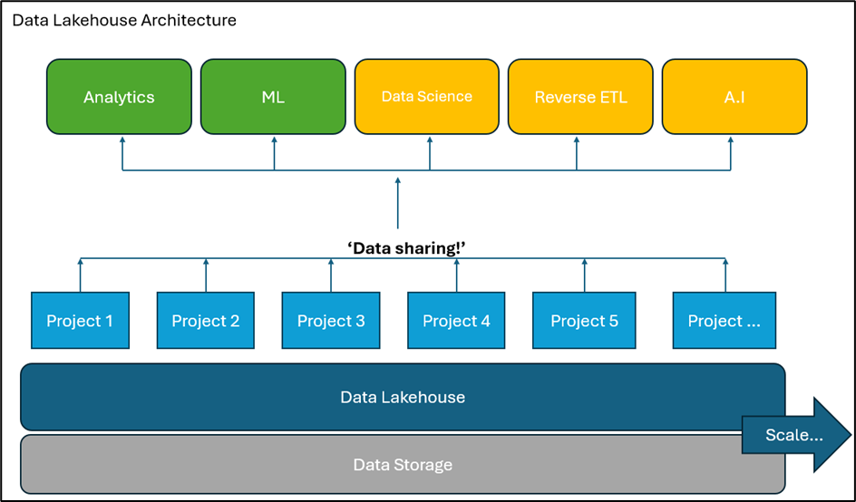
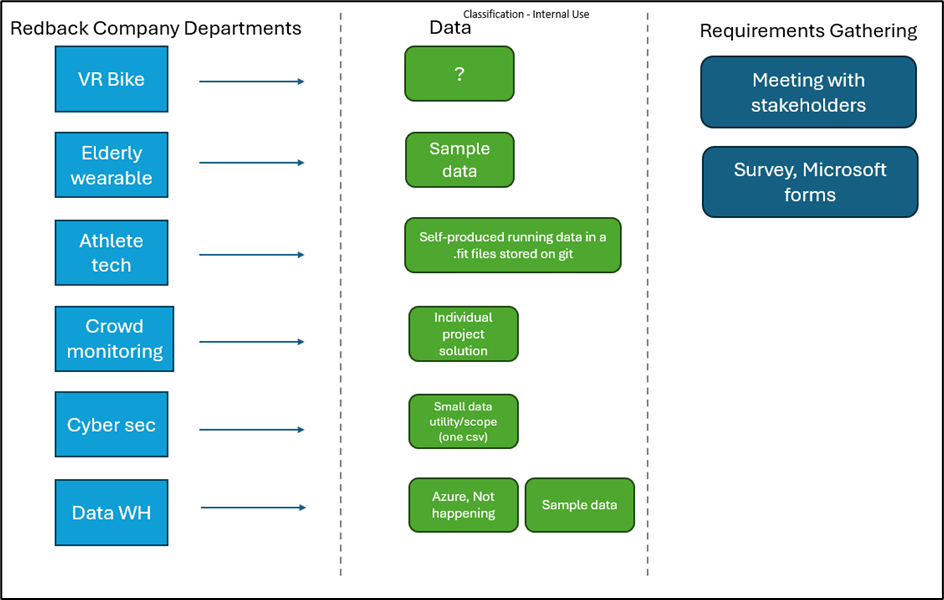
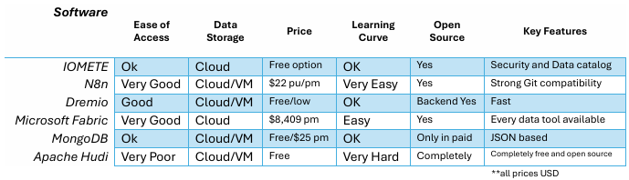
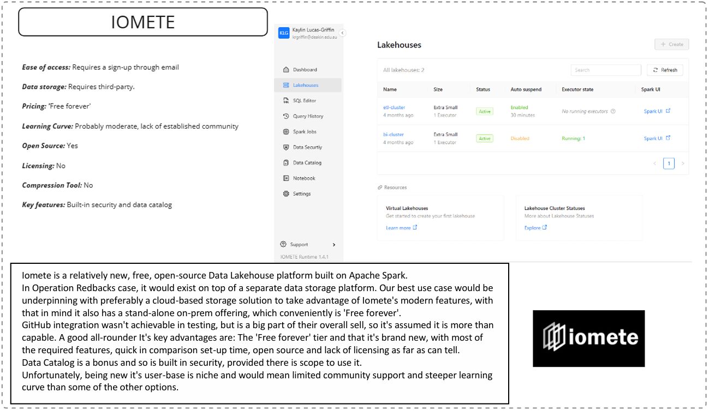
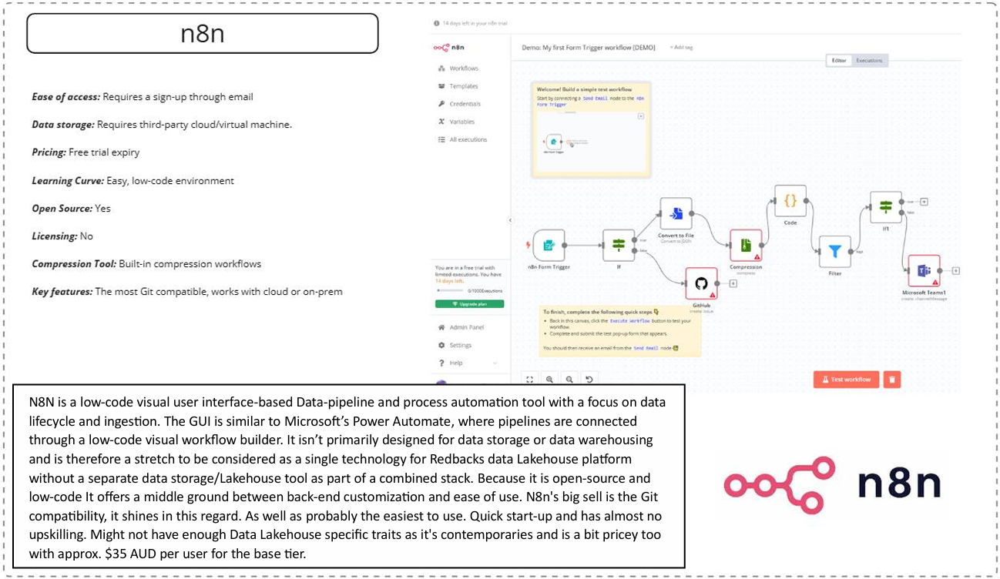
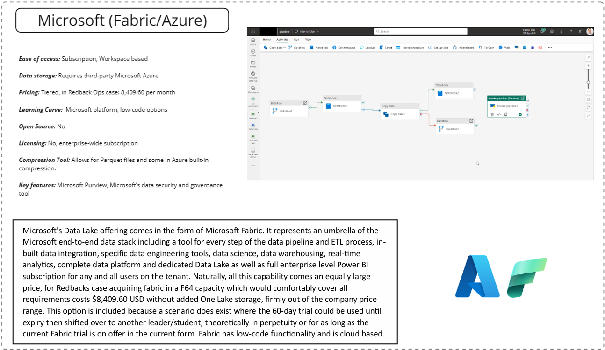
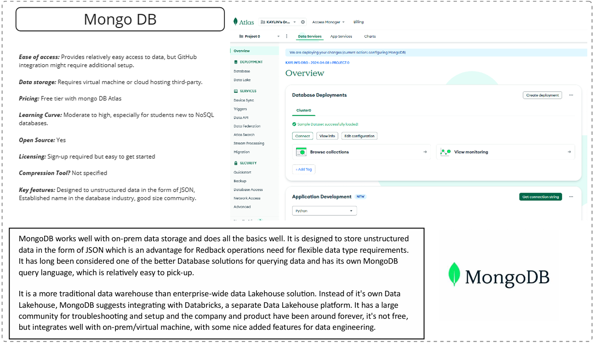
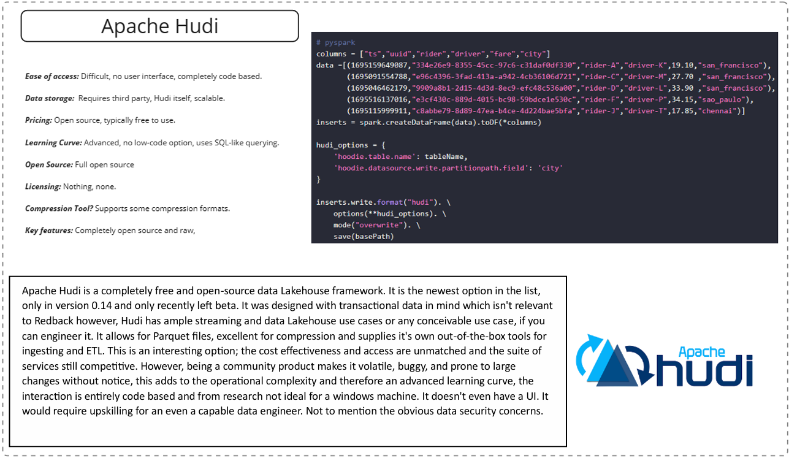

#  Data Warehouse Requirements

:::info
**Document Creation:** 19 May, 2024. **Last Edited:** 19 May, 2024. **Authors:** Kaleb, kghdxx.
   **Document Code:** ARC1. **Effective Date:** 19 May, 2024. **Expiry Date:** 19 May, 2025.
:::

## Background 

Redback Operations is currently without a permanent scalable contemporary data solution.  

While workarounds currently exist, such as storing data in GitHub folders or on the personal computers of 
company members this is far from best-practice and doesn’t represent a sustainable longer-term 
solution. 

While pervious work has been dedicated to a data warehouse solution and the ‘Project 4 - Data 
Warehousing Team’ is underway this trimester, both have given results with a focus on meeting short-term 
requirements in an ad-hoc fashion. These endeavours brought success for what was required under the 
constraints of a two-trimester unit and given the nature of the capstone program with the considerable 
budgetary and limited working hours. It is commendable the progress made so far is of such a high 
quality. 

The purpose of this document is to present information on how data is currently used in Redback 
Operations and present a set of options which, if executed aim to improve the way data is to be used in 
the company. 

Currently, data is sought out only when it is needed to be accessed, processed, utilized, and then most 
likely saved or discarded once it is no longer required. Within this process, includes a series of 
unnecessary steps which can be simplified or reduced, made more efficient, replaced or removed all 
together with a proper data model, data architecture, engineering, and data-lifecycle. 

The first step, and that being the focus of this document and Project 4 is to establish what’s required from 
a potential Data Lakehouse. A proper best-practice data solution should not be acquiring hardware or 
software without considering and migrating across all records from existing storage solutions and 
continuing from there. Nor does it involve opening the gates for Junior and Senior company members to 
spin-up storage space, create and populate their own folders for storage without any guidance or overall 
modelling and data-lifecycle to ensure efficient use of resources. A Redback Operations data solution 
must begin with a cycle of planning as with any other project before jumping straight into a solution. 
While a data warehouse or data storage solution is a key component of the overall goal, to properly 
implement a data solution in line with an industry standard would mean a complete overhaul of the 
existing data processes for Redback (in some cases implementing for a lack of current data processes). 
This would consist of a body of work more akin to a ‘Data Transformation’ than a Data warehouse 
implementation. 

While planning and implementing a project of this size given the timeframe would be ambitious for any 
company. A data transformation would require an introduction of many fundamental aspects typical of a 
high-functioning data department. This better ensures a solution foundation rooted in industry standards, 
including appropriate data architecture, data modelling, overall data framework, insights management 
and data security.

## A Note on Data Warehouse 

‘Data Warehouse Team’ is this company’s project allocated to a data storage solution, as has been the 
project objective since its inception.  

The project name has been appropriate for general understanding given that practically yes, this project 
aims to implement a data storage solution, however; if any recommendation of this document is to be 
approved and bring the project up to industry standards and best practices, the projects objective would 
be looking to acquire and implement a state-of-the-art Data Lakehouse or similar company-wide data 
storage solution no longer a standalone Data Warehouse for one project alone. 

## The Plan 

A proposed data transformation requires input from a wide variety of stakeholders and would require a 
separate document. 

A proposed plan may look like: 

#### Requirements Gathering 

Requirements gathering process including survey results and Requirements gathering document.

#### Assess current infrastructure

Gather information on the current data architecture/lack of.

#### Options paper, Choosing a platform

Storage layer 
Platform  
Options paper document

#### Design Architecture

Data ingestion 
Storage 
Processing 
Analytics 
Data governance 

#### Data ingestion 

Part of the platform decision 

#### Data Storage 

Virtual machine 
Cloud storage 

#### Data Query and Analytics  

Review tool stack for data analytics, Power BI, Tableau 

#### Security and governance 

Define access and encryption policies for sensitive data

#### Training and documentation 

How-to’s and documentation
Decision register 
Project retrospective

## Requirements Gathering 

The first stage of the data transformation involves requirements gathering, searching for pain points, and 
understanding how the company uses its data. Background documentation and consultation with 
company data stakeholders indicates prior requirements gathering has not been performed beyond a 
surface level and has been limited to the domain of Data warehouse leaders and some other key 
stakeholders.  

Rigorous requirements gathering allows for an overall understanding of how the company uses its data, 
this in-turn gives a greater understanding of what is required to improve the data solution and helps to 
focus the scope when going to market for a SaaS solution or whether there is even need for a solution at 
all. 

So far, as part of the requirements gathering process we have conducted five meetings with leaders from 
projects in the company.  

The current Redback company projects (Trimester 1 2024), their data and the upcoming requirements gathering 
phases. 

## Pain Points  

The results of a requirements gathering process at the beginning of Trimester 1 2024 indicate pain points 
of: 

There currently isn’t an easy way to update the dataset for the various data analytics sources. 
Currently they must go through a GitHub fork/pull request.  

The solution needs to have the capability to store unstructured, NoSQL objects and structured 
data. 

Limited budget, subject to approval at all phases. 

Preferably a more common language/low code approach for upskilling, due to high student 
turnover given nature of the capstone unit.  

There is no central ‘repository’ for storing company wide data, adding steps to potential 
collaboration. No shared Data Lake that projects can derive insights from. 

Individual user licenses present an obstacle every trimester, given student turnover.

Project 3 Data Pipeline

## Requirements gathering is an ongoing process

A second requirements gathering exercise in the form of a survey is planned for Trimester 1 
University week 6 (08/04/2024). 

Data Lifecycle comparisons

So far, the pain points from the interview process alone can be summarized as requirements and 
favorable key features for a Data Lakehouse/Data solution. These become important to critique the 
suitability of options when choosing Redbacks Data Lakehouse. 

➢ Large enough to support the current data storage requirements. 
➢ Easily scalable to incorporate future projects and data requirements. 
➢ Unstructured file storage, to support projects with object storage requirements. 
➢ Cost effective, with a free trial or free forever tier to begin with. 
➢ Ease of use and minimal upskilling will be favored. Commonality taken into consideration. 
➢ Contemporary solutions, Redback Operations projects all have state-of-the-art objectives, and a 
data solution should be no different. 
➢ Preferably an enterprise-wide solution not individual user-based licensing. 

## Survey 

While company and project leaders have been consulted in meetings, end users will be offered a survey 
to gather how the majority of company members use data, mainly focused on members who aren’t 
directly involved in a data analysis/data science project. (Consultation of the Epic 2 - Data Analysis group 
is ongoing)  

You can find the results from the week 6 survey [here](https://docs.google.com/forms/d/1f_yKuMUv3uBu7ocXRXMCy38Mhl3gOlJoVz2j7X6TZB4/edit)

The goal of the survey is to add to the overall requirements gathering process, namely how Redbacks 
company’s and non-data focused users currently use data, given the preliminary requirements gathered.

## Options  

The following options in this document represent a result of a formal process of requirements gathering 
through questioning and interviewing key stakeholders in Redback to assess pain points as well as 
researching industry leaders and trusted comparison companies, consultation from outside sources 
including industry professionals and individual set-up/testing each technology. 

The six options in this document are the remainder of an initial field of which each option to qualify was 
required to meet at least a majority of requirements before each technology was tested to examine a 
potential use case further. 

A final recommendation is planned to be provided after the results of the Requirements survey examined 
and the larger requirements gathering process concluded to maximize the information in making any 
decision.

Summary table of Data Lakehouse options

### IOMETE

### N8n

### Dremio

### Microsoft Fabric/Azure

### MongoDB

### Apache Hudi

## Data Storage 

Data storage for the initial implementation of the Data Lakehouse platform will be the Deakin virtual 
machine, this will operate as BareMetal on-premises storage. In future Trimesters there is scope to secure 
funding for a cloud storage solution.