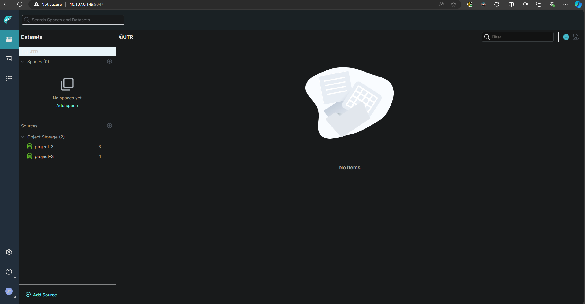
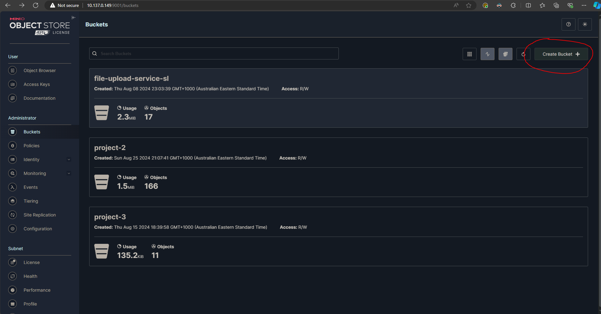
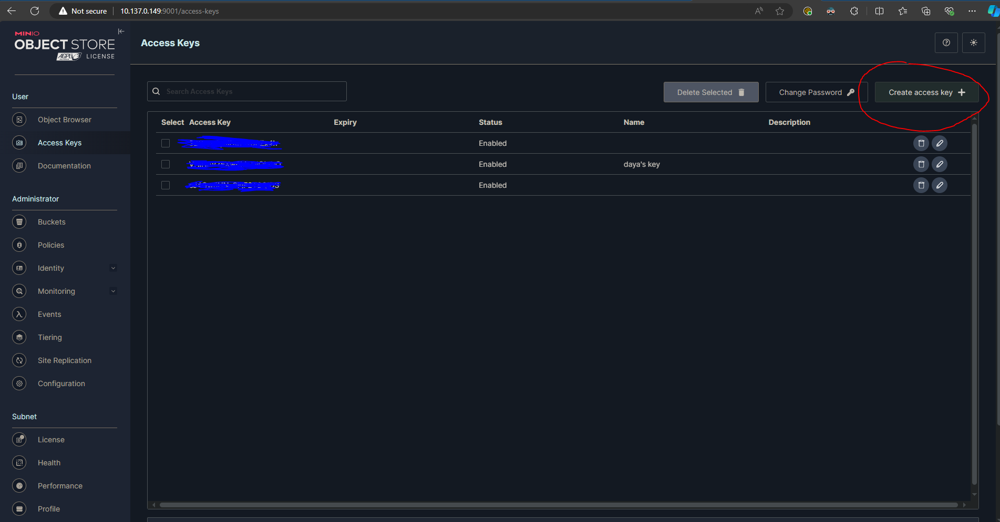
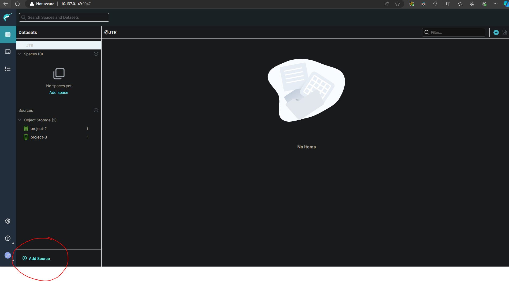
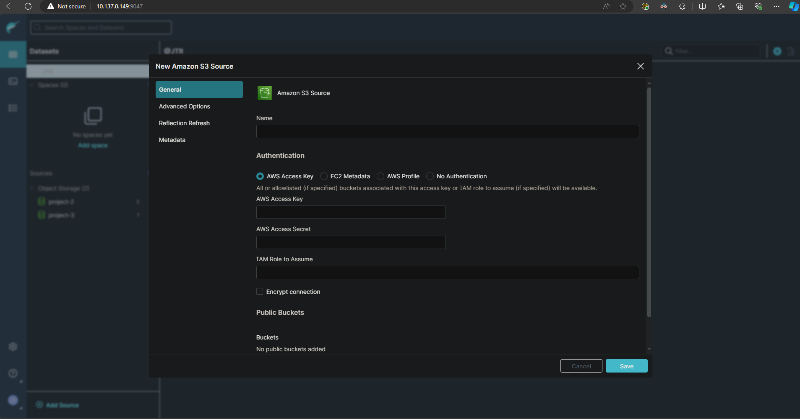
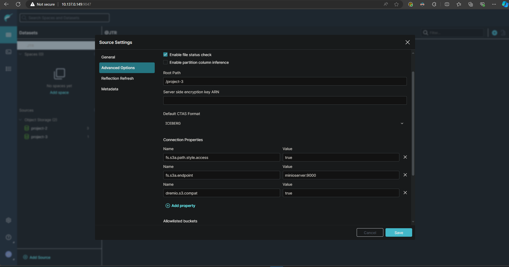

# Maintaining the structured Dremio solution
  

### Accessing the virtual machine
Follow this [guide](https://redback-operations.github.io/redback-documentation/docs/data-warehousing/Data%20Lakehouse/How-To%20-%20Accessing%20the%20Redback%20Operations%20Virtual%20Machine) which will walk you through connecting to the VM running the dremio, minio and the flask api docker containers, it also has the docker-compose file for dremio and minio though that can be found on [github](https://github.com/Redback-Operations/redback-data-warehouse/blob/main/File%20Upload%20Service/data-lakehouse2.yml) aswell. The guide has a prerequesite of having installed [anyconnect VPN](https://www.deakin.edu.au/students/student-life-and-services/health-wellbeing-and-safety/safety-security/online-safety-security/secure-your-devices/vpn).

In order to access the UI's for dremio and minio you will need to speak to the leader of the datawarehousing team who will either provide you with login details or direct you to someone who can.

### How the solution works
Think of the structured solution as a datalakehouse (Minio) which can store files of any type with Dremio layered over it as the interactable UI for doing sql queries on a sql table. They are linked through adding minio as a source for dremio to store and access the data. As of writing this documentation we have three buckets on minio though only project-2 and project-3 are connected to dremio.  

### How minio works

To create a new bucket simply go into minio and select the buckets tab, name it and press create. 

To link it to dremio you'll need to go into minio again and create an access key and copy down the access key and secret key it gives you. 

### How dremio works

Then go to dremio click add source. 

Then select amazon s3.

For the first tab of details simply enter any desired name for the source, the access and secret key you copied from the minio section and ensure encrypt connection is off. 

Then for the advanced details tab specify the path of the bucket like below, it should just be /nameofbucketinminio and add three connection properties filling them out the same as seen below. 

Then press save and it should add it.

### Creating tables in dremio

As of writing this documentation the method of converting and uploading data as a sql table is through this [script](https://github.com/Jesse-Rees/redback-data-warehouse/blob/Structured-Solution/Structured%20Dremio%20Solution/Script/pipeline.py) which is currently only uploaded to a forked repository of Redback Operation's github but should be merged soon in the directory: redback-data-warehouse/Structured Dremio Solution/Script/pipeline.py.

The script takes in a csv file and creates a sql table out of it in dremio. If you have access to dremio you can see the table and use the sql runner tab on the left to query it.

### How the flask api works
The flask api is a level of security and convenience on top of the dremio rest api to prevent malicous use of sql commands. It allows people connected to the deakin network through anyconnect VPN to query their data in dremio.

The code for the app and docker container running it can be found [here](https://github.com/Jesse-Rees/redback-data-warehouse/tree/Structured-Solution/Structured%20Dremio%20Solution/Flask-api), that link is the same fork as the script and should be added to the main branch soon in the same directory.

The guide on how to use the api as a data analyst will be uploaded alongside this one and should be found in the same folder labeled structured solution.
