**Data Orchestration for Redback Operations**

**Exploring Platforms and Implementation for Efficient Data Management**

**Prepared by[\
\[]{.underline}**Guntej Singh**[\]]{.underline}**

**Time period[\
\[]{.underline}**Throughout Trimester 2**[\]]{.underline}**

**Redback Operations**

{width="2.9166666666666665in"
height="2.9166666666666665in"}

**Table of Contents**

1.  **Introduction**

2.  **Data Orchestration Overview**

3.  **Why Data Orchestration is Needed at Redback Operations**

4.  **Platform Comparison**

5.  **Platform Decision**

-   **5.1 Key Considerations**

-   **5.2 Why Prefect is the Best Fit**

6.  **Implementation Steps**

-   **6.1 Virtual Environment Setup**

-   **6.2 Flow, Tasks, and Subflows**

-   **6.3 Deployments**

-   **6.4 Work Pools and Cloud Integration**

-   **6.5 Blocks and Github**

7.  **Conclusion and Recommendations**

8.  **References**

9.  **Appendices**

<!-- -->

1.  **Introduction**

The purpose of this report is to explore the implementation of data
orchestration within Redback Operations. With multiple ongoing projects
and teams, managing data efficiently is becoming increasingly complex.
Data orchestration offers an automated solution to organize and
integrate data from various sources, ensuring timely and accurate
availability for analysis.

This report will discuss the benefits of data orchestration for Redback
Operations and compare several platforms, including Apache Airflow,
Azure Data Factory, Luigi, and Prefect. After a thorough comparison, the
report will focus on why Prefect has been chosen as the most suitable
tool for Redback Operations. The final sections outline the steps
required for implementation and highlight the advantages of moving to a
cloud-based orchestration platform.

{width="3.46875in" height="1.9425in"}

2.  **Data Orchestration Overview**

Understanding what is Data Orchestration;

-   It is an automated process for taking data from multiple storage
    locations.

-   After taking the data from multiple storage locations you combine
    and organise it which will then be made available for analysis.

-   It basically ensures that the correct data is moved to the right
    place at the right time, thus ensuring all the data stays connected
    and works smoothly.

3.  **Why Data Orchestration is Needed at Redback Operations**

Why do Redback Operations need Data Orchestration?

-   As redback operations have so many projects going on and some many
    teams assigned to projects I think a Data Orchestration would be a
    very good idea for this company as it will ensure reading and
    finding data will be easier if it's in one place.

-   A step that I must do is have a look at the requiring gathering info
    my team in data warehousing has done to get a better understanding
    of how all the projects are working and to see how data
    orchestration will benefit specific projects.

4.  **Platform Comparison**

What are some platforms we could use?

-   Apache Airflow: is a very common and popular platform that is used
    for orchestrating data pipelines.

Some other common ones include:

-   Azure Data factory

-   Google cloud Composer

-   Kebola

-   Metaflow

These are just some platforms but there are many we could use. I have to
see and need to discuss which platform is the best for company, which
ensures that we don't have data leaks and keeps all the data secure.

I am leaning towards potentially using Luigi or Prefect. These two names
sound unique it might be interesting to learn these for this task. This
unit provides a unique opportunity where you can try new things and it
might not work the first time but you if you keep trying, eventually you
will have learnt a new skill.

Important things to consider for data orchestration:

-   Automation: as mentioned above.

-   Data Integration: How will I integrate it into a pipeline is
    something to consider.

-   Error Handling: For me this a very important one as the platform I
    choose, should be able to handle errors and ensure the data runs
    smoothly.

-   Something I need to do is automate getting the data into the VM as a
    pipeline. This will be something extremely important.

 

-   Also putting the steps into a plan so I know how the use the data
    orchestration and anyone who wants to use it.

 

5.  **Platform decision**

**5.1 Key Considerations**

It's a tossup between three; Luigi, prefect and Kebola.

Setup:

Luigi- Requires more manual setup, so you need to most of the things
yourself. It's a better option for people with extensive coding
experience.

Prefect- Easier to set up and use. It's more flexible, modern api and
can be used with minimal configuration. It's more beginner friendly,
which is what I need.

Task scheduling:

Luigi- Does not have built-in scheduling.

Prefect- Built-in scheduler with flexible options.

Error Handling:

Luigi- Only provides basic error handling. Prefect- has advanced error
handling features, like customizable error handling logic.

Cloud Native Features:

Luigi- You can integrate it with cloud services, but it takes extra
effort.

Prefect- Cloud-native by design. Prefect Cloud offers a managed
environment with scalable cloud infrastructure, built-in integrations
with cloud platforms

**Summary**

-   **Luigi** is better suited for developers with experience who need a
    simple, stable orchestration tool and are comfortable with more
    manual setup and configuration.

-   **Prefect** offers a more modern, flexible approach with easier
    setup, advanced scheduling, and built-in monitoring. It's more
    suited for teams looking for cloud-native features and greater ease
    of use.

**5.2 Why Prefect is the Best Fit**

I am leaning towards using Prefect because it\'s more user-friendly,
especially for beginners. Prefect and Luigi are free to use, which is a
significant advantage. Prefect\'s ease of setup makes it the better
choice for our current needs. As I become more proficient with the
platform, there is potential for the team to consider switching to Luigi
in the future if the need arises

Find the details to download it.( I have downloaded it)

-   Kebola not a bad option as well; Keboola handles more of the data
    pipeline and is easier to use if you want everything in one place.
    To be honest, did not to enough research on Keboola hence we will
    not be using this one for this project.

6.  **Implementation Steps**

-   **6.1 Virtual Environment Setup**: How you set up the environment to
    run Prefect.

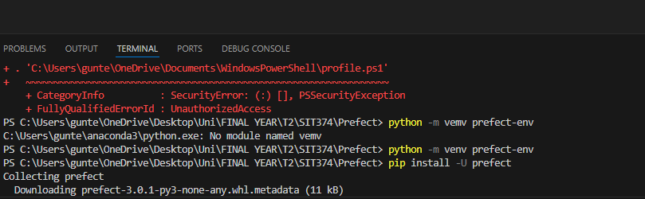{width="6.268055555555556in"
height="1.9368055555555554in"}

Creating a virtual environment to do prefect work.

{width="6.268055555555556in"
height="1.9291666666666667in"}

This checks the version of prefect I am going to use.

{width="6.268055555555556in"
height="1.4388888888888889in"}

This starts the server.

-   **6.2 Flow, Tasks, and Subflows**:

{width="3.4796522309711286in"
height="3.8963768591426073in"}

Here I created a simple python script as well as adding a flow.

{width="6.268055555555556in"
height="3.2416666666666667in"}

Here it started the server and even it created it's own IP address for
my server.

You can see the code for the flow in previous picture and it updated
here.

-   3 concepts we are going to use **flow**, **task** and **subflow**.

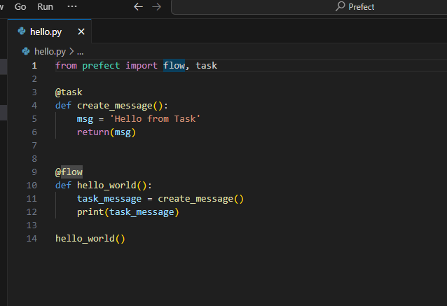{width="6.268055555555556in"
height="4.293055555555555in"}

Now I've added a task to the script.

{width="6.268055555555556in"
height="0.8208333333333333in"}

Have a new version here.

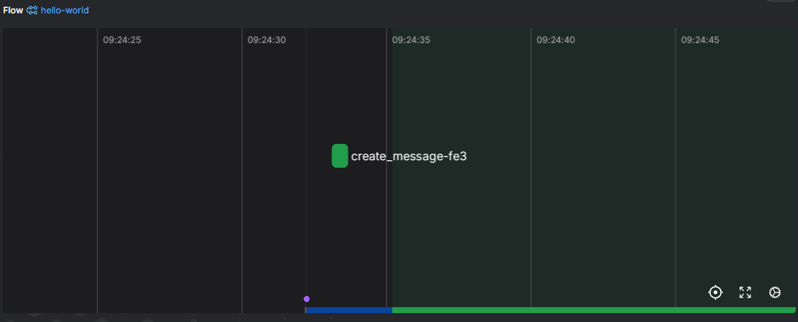{width="6.268055555555556in"
height="2.532638888888889in"}

Here it is now logging the create_message task.

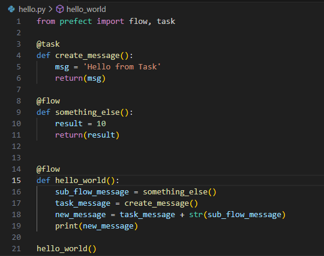{width="5.625785214348206in"
height="4.458955599300087in"}

The added code in this script reflects the subtask, there will be some
subtle changes in the ui.

{width="6.268055555555556in"
height="0.2763888888888889in"}

Added as another flow.

Three concepts for prefect and something to implement in our scripts.

-   [Flows]{.mark}: are the most basic Prefect object. This is a
    container for workflow logic and allows users to interact with and
    reason about the state of their workflows. In Python we represent
    this as a single function.

-   [Tasks]{.mark}: is a function that represents a discrete unit of
    work in a prefect workflow. Tasks enable you to encapsulate elements
    of your workflow logic into observable units that can be reused
    across flows. Very convenient as they can do nearly everything a
    python function can do.

-   [Subflow]{.mark}: Is essentially a child to flow. A subflow run is
    created when a flow function is called inside another flow.

How we implement these have been mentioned above.

-   The task is called within the flow. Think of task as something
    that's within the flow.

-   It's also important to note that choosing a sub flow over a task is
    something you would want to pick. It just helps with the
    coordination and organization of code.

**6.3 Deployments**

Now we are shifting to deployments, which will help with scheduling and
will help other people to get involved to also schedule tasks.

-   2 steps to create a deployment. First, build then we apply it .

-   But we are getting a big issue as the build and apply are coming up
    as errors on the visual studio, so this is becoming an issue.

-   The issue has been resolved. ( I had a problem because I was using
    the syntax of an old perfect version hence issues were coming up.

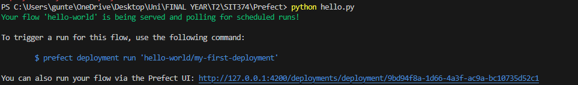{width="6.268055555555556in"
height="0.9243055555555556in"}

I ran the command.

{width="6.268055555555556in"
height="1.2201388888888889in"}

Now my deployment exists.

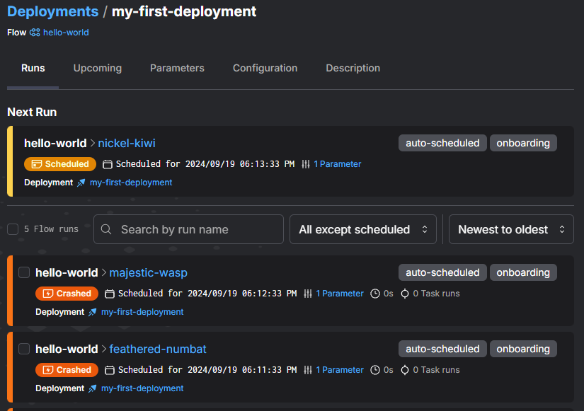{width="5.166666666666667in"
height="3.5722222222222224in"}

After clicking on it, we can investigate it more and see when you can
schedule these.

-   Deployments are API representations of flows and basically allow for
    remote configuration and scheduling. A deployment is a server-side
    concept that encapsulates a flow, allowing it to be scheduled and
    triggered.

**6.4 Work Pools and Cloud Integration**

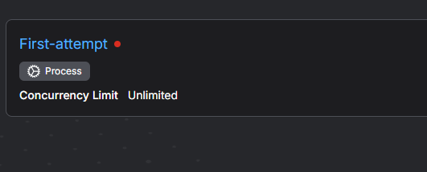{width="5.532022090988627in"
height="2.239896106736658in"}

Having a pool allows you to manage different flows and set limits maybe
depending on the complexity and what the project requires.

Everything has been done locally.

Why do you want to shift to cloud and how can this benefit the team;

-   Don't want to host a server. As we can see there is quite a few
    steps involved and you can get lost trying to set everything up.

-   With cloud you can get the built in- authentication as well as
    integrations. This will help with different permissions and will
    help keeping everything organised.

-   Cloud option tends to keep it easier for workflow, so for the team
    and Datawarehouse team in general it will be easier for workspaces
    sharing it throughout the team. It will just be easier and
    preferably and if we can get this is the deakin vm for redback
    operations that will make it easier to access across the
    organisation.

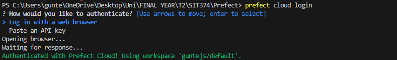{width="6.268055555555556in"
height="0.9611111111111111in"}

I am authorized to shift to cloud.

{width="6.268055555555556in"
height="1.0180555555555555in"}

After running the script everything is coming up the same as it was on
locally.

-   Only thing that did not come up was the work pool which I will fix
    now.

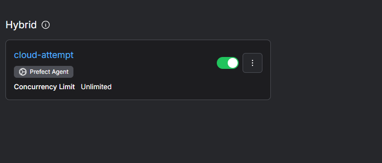{width="6.268055555555556in"
height="2.6777777777777776in"}Fixed up.

-   Work pools allow you to prioritize and manage deployment runs and
    control the infrastructure they run on.

-   This is the next thing I am targeting to make sure everything runs
    smoothly. This is where the cloud is very convenient and important
    and something we have discussed above.

**6.5 Blocks and GitHub**

-   Blocks securely store credentials and configuration to easily manage
    connections to external system.

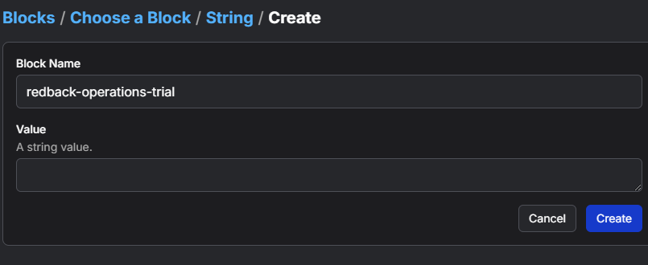{width="6.268055555555556in"
height="2.5694444444444446in"}

This is me starting to work on blocks.

{width="6.268055555555556in"
height="2.2625in"}

Adding the block to the code.

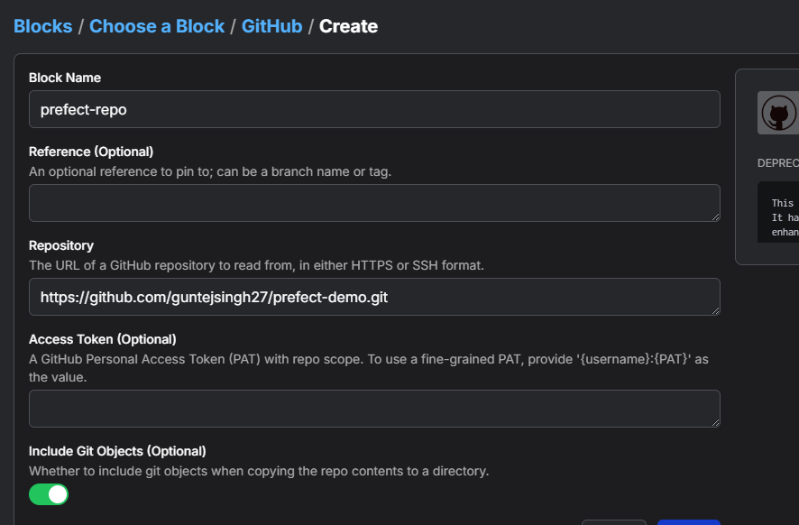{width="6.268055555555556in"
height="4.117361111111111in"}

Adding Github to the work we are doing.

7.  **Conclusion and Recommendations**

-   A quick summary; prefect allows for coordinating.

-   It allows for custom scripts which is helpful for our Datawarehouse
    team because we have many python scripts we use.

It also allows for Scheduling & Alerting.

-   To expand more on the scripts, for this task we are using python
    scripts so we can design any script we want but as we are using
    prefect we have to implement certain things that the prefect tool
    uses.

-   First to install prefect we do ([pip install -U prefect]{.mark})

-   To check the version ([prefect version)]{.mark}

Important to know the version because every version has different syntax
and also has different lines to run the script you made or want to run,
hence it's important to know the version you are using in your machine.
Also as mentioned before it's highly recommended to do the work in a
virtual environment so there is commands to do the work in a virtual
environment as well.

As a future recommendation, If we could get some code together that adds
a button or a drop down to anonymise the data in a csv that could be
used in stream lit app to put it in there and see if we can get it
working. 

Furthermore, more work will be required to master prefect integration,
as well informing the team how this works. In particular the ones who
have control and work with the website. We can also explore advanced
options such as Luigi how I mentioned above for future. For now, Prefect
will streamline operations and be beginner-friendly for the team

8.  **References**

-   **<https://www.google.com/url?sa=i&url=https%3A%2F%2Fprateekjoshi.substack.com%2Fp%2Fwhat-is-data-orchestration&psig=AOvVaw31M4J4EGoW-wz1xFm2w1jh&ust=1727064994541000&source=images&cd=vfe&opi=89978449&ved=0CBQQjRxqFwoTCID54s3Y1YgDFQAAAAAdAAAAABAE>**

-   **<https://www.google.com/url?sa=i&url=https%3A%2F%2Fgithub.com%2FRedback-Operations&psig=AOvVaw2EyjKveAjK5QhEpUlumm72&ust=1727064996736000&source=images&cd=vfe&opi=89978449&ved=0CBQQjRxqFwoTCJD_987Y1YgDFQAAAAAdAAAAABAE>**

-   **<https://docs.prefect.io/3.0/develop/blocks#github>**

-   **<https://docs.prefect.io/3.0/develop/index>**

9.  **Appendices**

> Let's do some testing:
>
> {width="6.268055555555556in"
> height="2.852777777777778in"}

-   I am going to start implementing what I've learnt on the website
    script that Kaylin made. Lets see how this goes.

-   I am getting those yellow lines as I don't have these packages
    installed in my system. For this task and to implement some new
    things I will install these. Only streamlit and minio were required.

As I am implementing some prefect syntax into this script, I need to be
aware of a few things. So, I am using prefect to orchestrate tasks,
workflows as learnt. The website script that Kaylin has made I need to
make sure that what code I add is kept separate from the web-related
components to maintain a clean structure.

Web applications are usually designed to be responsive, handling user
inputs and interactions in real time. In our instance we have a script
that handles file uploads. The prefect tasks, flows on the other hand
need to be long running processes or workflows. The point I am trying to
stress about is I need to carefully manage where I put the code and any
other blocking processes.

{width="6.268055555555556in"
height="3.201388888888889in"}

I've added some lines and it has run as we can see at the bottom.

{width="6.268055555555556in"
height="0.30277777777777776in"}

Has come up on prefect as well.

{width="6.268055555555556in"
height="2.501388888888889in"}

It updated after including task code as well.

{width="5.729966097987751in"
height="4.156829615048119in"}

We can also run Prefect workflows while the web application continues
functioning without waiting for prefect flow to finish. We might have to
use asynchronous background tasks for this which could be something data
warehouse continues in the future.

{width="6.268055555555556in"
height="3.3833333333333333in"}

There we go we have successfully added flow, sub flow and tasks to this
website.

There is some more things I would like to try with the website script.
Potentially something we will do in the future now to make sure the
website is linked with prefect we can orchestrate tasks more smoothly.
