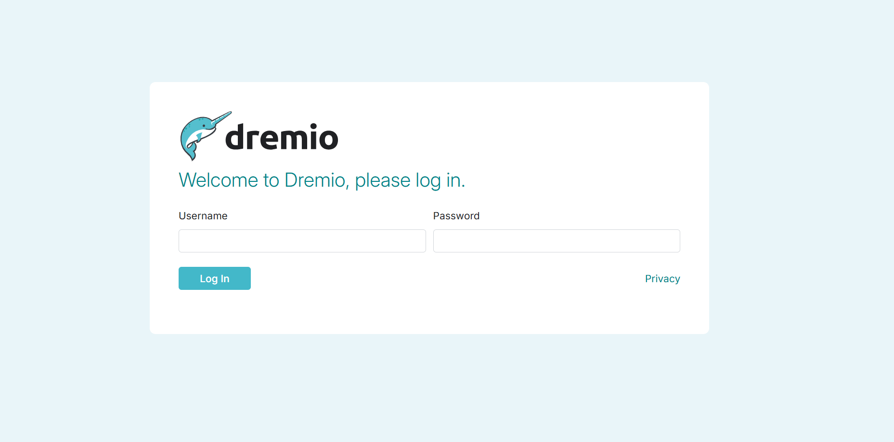
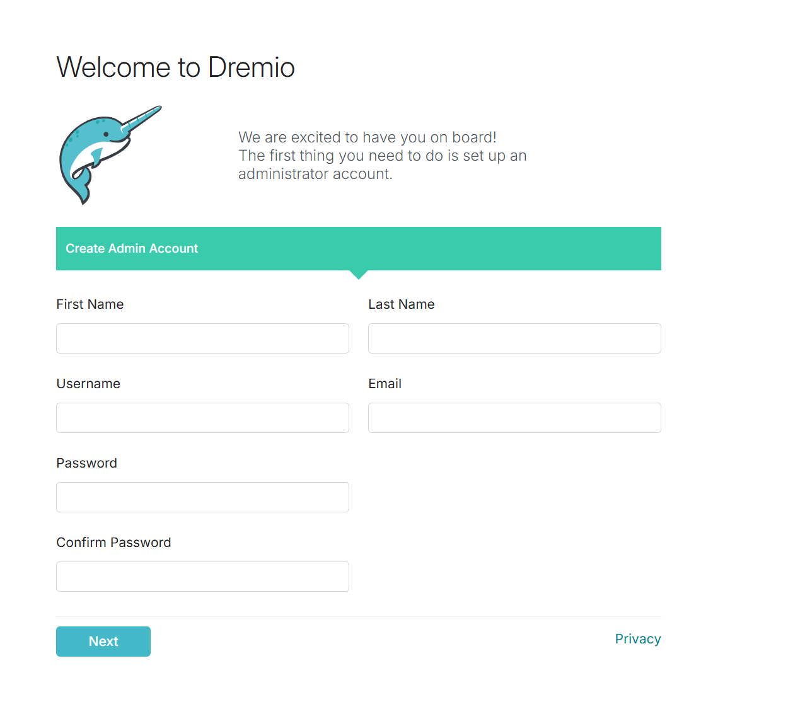
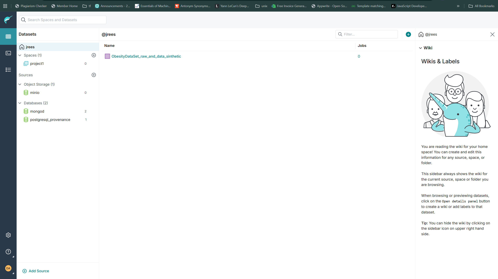

# Introduction to Dremio
## What is Dremio?
Dremio is like a **smart data browser** for all your data. Instead of copying data into one place, Dremio lets you **connect directly to where your data already lives** — in databases (like PostgreSQL), NoSQL stores (like MongoDB), or object storage (like MinIO or AWS S3).
 
Once connected, you can:
* Search and explore data with **SQL** (the same language used in databases).
* Combine data from different places (e.g., sales data in PostgreSQL + customer data in MongoDB).
* Share clean, ready-to-use datasets with your team.
* Use BI tools (Power BI, Tableau, Superset) to make reports directly on Dremio.
Think of Dremio as a **Google for your company’s data**, but with the power of SQL.
## Why do people use Dremio?
*  **Faster reporting** → No need for complex ETL pipelines.
*  **Works with many tools** → BI dashboards, Python notebooks, or apps can connect directly.
*  **One-stop data shop** → Query Postgres, Mongo, and MinIO together in a single place.
*  **Cost-saving** → No expensive data movement — Dremio queries “in-place.”
---
# Requirements & Prerequisites for Dremio community
## 1. System Requirements (Local Setup)
Before running Dremio Community Edition, make sure your system meets the following minimum specs:
* **Operating System**:
	* Linux (Ubuntu, CentOS, Debian, etc.), macOS, or Windows with Docker Desktop.
* **CPU**:
	* Minimum **4 cores** (8 cores recommended for smoother performance).
* **Memory (RAM)**:
	* Minimum **8 GB RAM** (16 GB recommended for handling larger datasets).
* **Disk**:
	* At least **20 GB free disk space** (SSD preferred for better query performance).
* **Network**:
	* Stable internet connection (for pulling Docker images and connecting to remote sources).
## 2. Software Requirements
* **Docker** (required to run Dremio CE):
	* Docker Engine **v20+** recommended
	
* Docker Compose (if you want to run other services like PostgreSQL, MongoDB, MinIO alongside Dremio)
## 3. Docker Resources to Expose
When starting Dremio CE with Docker, you should expose these ports:
|Port|Purpose|
|---|---|
|**9047**|Dremio Web UI ([http://redback.it.deakin.edu.au:9047](http://redback.it.deakin.edu.au:9047))|
|**31010**|JDBC/ODBC client connections|
|**32010**|Flight SQL (high-throughput queries)|
|**45678**|Internal support/debug port|
## 5. Accounts & Access
* **Dremio Admin Account** → created during first login at `http://redback.it.deakin.edu.au:9047`.
* **Source Accounts** → Ensure you have login credentials for Postgres, MongoDB, and MinIO.
* **API Access** → For REST or Flight SQL, create a **Personal Access Token (PAT)** or use your Dremio username/password.
# Setup Guide for Dremio (Community Edition on Docker)
This guide walks you through installing and running **Dremio CE** locally with Docker.
---
## 1. Install Prerequisites
Before starting, ensure you have the following installed on your system:
* **Docker Engine** → [Install Docker](https://docs.docker.com/engine/install/)
* **Docker Compose** (optional, if you want to run multiple services together) → [Install Compose](https://docs.docker.com/compose/install/)
* (Optional) **Git** for cloning setup repos
Verify installation:
```bash
docker --version
docker compose version
```
## 2. Pull the Dremio Docker Image
Dremio Community Edition is available on Docker Hub. Pull the latest image:
```bash
docker pull dremio/dremio-oss:latest
```
## 3. Run Dremio with Docker
Start Dremio as a container with the required ports exposed:
```bash
docker run -d \
  --name dremio \
  -p 9047:9047 \   # Web UI
  -p 31010:31010 \ # JDBC/ODBC
  -p 32010:32010 \ # Flight SQL
  -p 45678:45678 \ # Internal support/debug
  dremio/dremio-oss:latest
```
Check if the container is running:
```bash
docker ps
```
## 4. Access the Dremio UI
* Open your browser → [http://localhost:9047](http://localhost:9047)

* You’ll be asked to **create an admin account** (username, email, password).

* After setup, you’ll land on the **Dremio home page**.

## 5. Use Docker Compose for Multi-Service Setup
If you’re also running **PostgreSQL, MongoDB, and MinIO** alongside Dremio, create a `docker-compose.yml`:
```yaml
services:

  dremio:
    image: dremio/dremio-oss:latest
    container_name: dremio
    ports:
      - "9047:9047"  # UI
      - "31010:31010"  # JDBC
      - "45678:45678"  # internal
    networks:
      - capstone
    volumes:
      - dremio-data:/opt/dremio/data
    environment:
      - DREMIO_JAVA_SERVER_EXTRA_OPTS=-Xmx4g

  minio:
    image: minio/minio:latest
    container_name: minio
    ports:
      - "9000:9000"
      - "9001:9001"  # Console
    volumes:
      - minio-data:/data
    environment:
      - MINIO_ROOT_USER=minioadmin
      - MINIO_ROOT_PASSWORD=minioadmin123
    networks:
      - capstone
    command: server /data --console-address ":9001"

  postgres:
    image: postgres
    container_name: postgres
    ports:
      - "5432:5432"
    environment:
      - POSTGRES_USER=admin
      - POSTGRES_PASSWORD=admin123
      - POSTGRES_DB=dremiodb
    networks:
      - capstone
    volumes:
      - pgdata:/var/lib/postgresql/data

  mongodb:
    image: mongo
    container_name: mongodb
    ports:
      - "27017:27017"
    environment:
      - MONGO_INITDB_ROOT_USERNAME=admin
      - MONGO_INITDB_ROOT_PASSWORD=admin123
    networks:
      - capstone
    volumes:
      - mongo-data:/data/db

volumes:
  dremio-data:
  minio-data:
  pgdata:
  mongo-data:
networks:
  capstone:
    driver: bridge
```
Run everything with:
```bash
docker compose up -d
```
## 6. Verify Setup
* Go to **Dremio UI** → `http://localhost:9047`
* Log in with your admin account
* Navigate to **Sources** and check if you can see options to add PostgreSQL, MongoDB, and S3 (MinIO).

